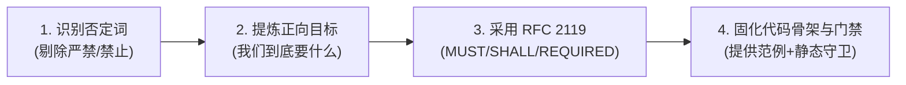

# PRESCRIPTIVE-ENGINEERING-CONTRACTS.md
# 正向建设性工程契约与反否定盲区最高法典 (Prescriptive Engineering Contracts & Positive Agency)

> **生效对象**：全平台系统提示词 (System Prompts)、Agent 规则 (Rules)、技能手册 (Skills)、工作流 (Workflows) 及全体数字员工  
> **制定背景**：老板 2026-10-10 核心洞察——「严禁这些词汇会对 AI 产生不好的作用，正向契约必须成为系统的总规则」  
> **科学原理**：克服 Transformer 自注意力机制的“粉色大象效应（Negation Blindness）”与“过度防御行动瘫痪”，用行业标准 RFC 2119 规范与正向可执行代码路径，替代口号式负向训诫。

---

## 一、 为什么正向契约是 AI 原生系统的最高总规则？

在基于 Transformer 架构的大模型（LLM / Agent）推理过程中，传统的“严禁 / 禁止 / 杜绝 / 严打”等负向禁令存在三大致命机理缺陷：

```
【传统负向禁令缺陷】                              【正向建设性契约价值】
1. 否定词注意力盲区 (粉色大象效应)          ───>   精准激活正确动词与期望目标实体
   “严禁生成假数据” -> 激活“假数据”                  “必须基于真实 PGlite 数据库查询执行”
2. 缺少路径导致行动瘫痪 (Paralysis)        ───>   指明唯一的正确实现与代码骨架
   只说“不要做什么”，AI 不知“该做什么”              提供“标准参数、函数名与调用姿态”
3. 人肉口号缺乏硬约束 (Prompt Nagging)     ───>   编译器与静态门禁硬拦截
   依赖文字乞求 AI 自律                          类型系统报错 (Exit Code 1) 倒逼精准自愈
```

---

## 二、 正向建设性契约三大核心基石

全平台在编写任何规则、提示词、工单描述与代码注释时，必须严格遵守以下三大基石：

### 1. 语法基石：全面对齐 IETF RFC 2119 标准契约动词
彻底停用情绪化、口语化的“严禁”、“万万不可”、“死罪”，统一采用国际标准工程动词：
- **MUST / SHALL / REQUIRED（必须 / 强制契约）**：系统绝对要求、必须无条件达成的正向标准；
- **MUST NOT / SHALL NOT（不可违反）**：仅在定义技术安全边界时作为辅佐，且**必须立即紧跟正面替代方案**；
- **SHOULD / RECOMMENDED（推荐遵循）**：最佳实践架构，存在极其充分的理由时方可偏离；
- **MAY / OPTIONAL（可选特性）**：可根据业务实际场景按需启用。

### 2. 行为基石：凡提约束，必给正向行动路径与标准代码骨架 (Prescriptive Action)
**铁律：严禁只堵不疏。当指出某一路径不可取时，必须在下一句完整给出“正向推荐做法与调用范例”。**

#### 经典对照表：
| 传统负向表达（易诱发否定盲区与困惑） | 正向建设性契约（AI 极易理解且精准执行） |
| :--- | :--- |
| ❌ 严禁在代码中写假 Mock！ | ✅ **所有业务规则测试必须基于本地嵌入式 PGlite 数据库，使用真实 SQL 读写完成行为断言。** |
| ❌ 严禁出现死表没有业务动词！ | ✅ **每个业务实体 (Object Type) 必须配套实现至少一个业务动词 (Action Type) 及其 TypeScript 执行 Handler。** |
| ❌ 严禁跨公司/租户数据穿透！ | ✅ **所有数据库查询与 API 路由必须在输入层强制注入 `companyId` 组织边界过滤。** |
| ❌ 严禁生成死报表伪大盘！ | ✅ **所有指标大盘必须具备穿透能力，点击图表必须直达底层的 Object 明细与 Action 流水。** |
| ❌ 严禁随意就地乱改数据！ | ✅ **工坊会话中的需求意图统一转译为结构化 Proposal 卡片，经掌柜两字按钮确认后原子落盘。** |
| ❌ 严禁缺少交付物就结项！ | ✅ **结项更新为 `done` 时必须在工件总线登记实质物理资产 (`No Artifact, No Done`)。** |

### 3. 守卫基石：编译器与代码门禁优先（Shift-Left to Machine Gates）
- **不要试图用文字劝服 AI，要用编译器和单测阻断 AI**；
- 凡是业务不可逾越的底线，必须下沉到 TypeScript 类型守卫、AST 依赖扫描器、或者 CI 校验脚本（如 `check-governance-audit.mjs`）；
- 出现违规时，系统通过清晰的错误堆栈（Error Stack）与退出码（Exit Code 1）明确告知 AI 偏离了哪个 RFC 2119 契约，让 AI 依据正向规则自愈修复。

---

## 三、 平台编写规则与提示词的“四步正向重构法”

全体数字员工在起草或演进任何 `.agents/rules/`、`SKILL.md`、`AGENTS.md` 时，必须执行四步重构：



1. **Step 1 (识别并剔除)**：扫描文本，剔除“严禁”、“绝对不允许”、“不可”、“禁止”等负面警示词；
2. **Step 2 (提炼正向目标)**：思考业务的终极期望是什么？希望数据怎样流转？希望文件落在何处？
3. **Step 3 (正向契约表述)**：使用 `【...契约】: 系统要求/开发者必须...` 结构明确权利与义务；
4. **Step 4 (给出脚手架)**：紧随其后附上正向代码示例（Code Snippet）与机器门禁检验命令。

---

## 四、 全生命周期正向契约守卫清单 (The Master Prescriptive Roster)

全平台所有技术实践统一遵从以下 8 大正向契约：

1. **【实体动词成双契约 (Object-Action Parity Contract)】**：
   - 规范：每个 Object Type 必须拥有对应的 Action Type，以动词为生命线驱动业务流转；
   - 验证：`node scripts/check-governance-audit.mjs`。
2. **【事务真实执行契约 (Transactional Execution Contract)】**：
   - 规范：业务动词必须提供完备的 TypeScript/SQL 事务 Handler，返回真实执行结果；
   - 验证：单元测试断言数据库真实变更行数 > 0。
3. **【不可变存证契约 (Immutable Evidence Contract)】**：
   - 规范：动词执行完毕后必须向履约账本沉淀机器证据（Commit SHA / 报告哈希 / 快照 URI）；
   - 验证：缺少 `evidence` 字段时门禁自动拦截。
4. **【企业物理隔离契约 (Company Scoping Contract)】**：
   - 规范：全盘数据库查询与路由层必须强制携带 `companyId` 组织边界；
   - 验证：TypeScript 类型系统检查是否缺失 `companyId`。
5. **【大盘活体穿透契约 (Penetrative Living Metrics Contract)】**：
   - 规范：所有态势指标必须支持下钻穿透至底层的真实 Object 记录与 Action 履约流；
   - 验证：前端组件必须绑定对应的详情路由与调用栈。
6. **【真实沙箱验证契约 (Real-DB Sandbox Contract)】**：
   - 规范：测试用例必须跑在 PGlite 嵌入式引擎或物理数据库上，验证真实状态迁移动作；
   - 验证：变异测试杀灭率检测。
7. **【成熟资产复用契约 (Asset Cohesion & Reuse Contract)】**：
   - 规范：优先继承全盘 263 张成熟物理表与模型管网，保持架构的高内聚与低熵演进；
   - 验证：AST 模块引用方向与依赖边界检查。
8. **【版本受控迁移契约 (Controlled Migration Contract)】**：
   - 规范：数据库表与本体元数据演进必须通过 Drizzle migration 脚本进行声明式版本管理；
   - 验证：`pnpm db:generate` 与 migration 迁移完整性扫描。

---

## 五、 实施准则与全员宣贯

- 本法典为全平台最高通用准则，优先级高于任何模块级实现细节；
- 全体数字员工在进行代码生成、文档编写与指令分发时，自觉遵守正向建设性契约原则；
- 系统门禁守卫 `scripts/check-governance-audit.mjs` 对本法典实施持久防漂移保护。
