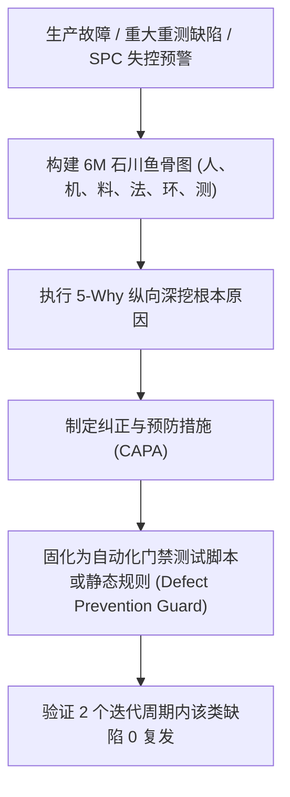

# CMMI 5 统计过程控制 (SPC) 与因果分析缺陷预防 (CAR) 标准方法论规约

> **权威标准参考**: CMMI V2.0 量化项目管理 (QPM) / 因果分析与解决 (CAR) / 组织级绩效管理 (OPM) 与休哈特 (Shewhart) 统计质量控制理论 (ISO 7870-2)。

---

## 1. CMMI 5 统计过程控制 (SPC) 量化分析方法

CMMI 5 高成熟度的精髓在于：**利用统计学方法（Statistical Process Control）取代拍脑袋与事后诸葛亮**，实时捕捉研发与交付过程中的“异常波动”：

### 1.1 关键过程性能度量指标 (QPPO: Quality and Process Performance Objectives)
1. **任务交付吞吐周期 (Cycle Time)**: 从 Issue 分配到完成合并所耗分钟数。
2. **构建与门禁耗时 (Build & Gate Duration)**: G1 ~ G5 完整校验耗时。
3. **门禁一次通过率 (First-Pass Yield, FPY)**: 首次执行即 100% 通过的比例。
4. **缺陷泄漏率 (Defect Escape Rate)**: 进入生产环境或后续阶段的缺陷密度。

### 1.2 SPC 控制界限计算公式 (Shewhart I-MR Individuals Chart)
对于单值监控指标序列 $X_1, X_2, \dots, X_n$：
1. **过程中心线 (Center Line, CL)**:
   $$\mu = \bar{X} = \frac{1}{n} \sum_{i=1}^n X_i$$
2. **移动极差均值 (Average Moving Range, $\overline{MR}$)**:
   $$\overline{MR} = \frac{1}{n-1} \sum_{i=2}^n |X_i - X_{i-1}|$$
3. **标准差估计量 ($\hat{\sigma}$)**:
   $$\hat{\sigma} = \frac{\overline{MR}}{d_2} \quad (n=2 \text{ 时 } d_2 \approx 1.128)$$
4. **控制上限 (Upper Control Limit, UCL)** 与 **控制下限 (Lower Control Limit, LCL)**:
   $$\text{UCL} = \bar{X} + 3\hat{\sigma}$$
   $$\text{LCL} = \max\left(0, \, \bar{X} - 3\hat{\sigma}\right)$$

### 1.3 过程失控判异 4 大黄金法则 (Western Electric Rules)
当数据序列出现以下任意情况时，自动判定为“过程失控”，必须触发 CAR 介入：
- **法则 1 (单点超界)**: 任意 1 个数据点超出 UCL 或低于 LCL（超过 $3\sigma$ 边界）。
- **法则 2 (连续偏侧)**: 连续 7 个点落在中心线 $\mu$ 的同一侧。
- **法则 3 (趋势漂移)**: 连续 6 个点持续上升或持续下降。
- **法则 4 (异常聚集)**: 连续 14 个点交替上下震荡（锯齿波动）。

---

## 2. CMMI 5 因果分析与缺陷预防 (CAR) 执行框架

CAR 严禁只做“点对点打补丁”，必须追溯到**流程、工具、规范与制度**层面的根本原因：

### 2.1 6M 鱼骨图排查维度 (Ishikawa Fishbone)
- **人 (Man)**: 工匠是否缺乏该业务领域上下文？是否未遵守编码规范？
- **机 (Machine/Tool)**: 编译器配置是否过宽？本地静态分析工具是否漏检？
- **料 (Material)**: 上游输入的需求文档（SRS）或 API 契约是否存在逻辑漏洞？
- **法 (Method)**: 研发流转门禁是否缺少对空数据态/防抖的卡点检查？
- **环 (Environment)**: 预发环境与正式生产环境依赖版本是否存在漂移？
- **测 (Measurement)**: 测试用例是否仅测试了 Happy Path 而未覆盖异常值？

### 2.2 5-Why 因果推演标准范式
- **1-Why (表面现象)**: 为什么服务抛出 500 异常？ -> 取对象属性发生空指针异常。
- **2-Why (直接原因)**: 为什么该属性会是 undefined？ -> 上游接口在没有记录时返回了空字符串而不是空数组。
- **3-Why (设计原因)**: 为什么前后端对空数据结构理解不一致？ -> API 契约协议文档未定义数据为空时的 Schema 包裹。
- **4-Why (测试原因)**: 为什么 G4 集成测试没测出来？ -> 自动化测试只用了全量数据 Mock，未跑空数据状态机用例。
- **5-Why (根本原因/Root Cause)**: 门禁脚本中未强制执行统一 DTO 结构断言与页面四态状态机审查。

---

## 3. 防退化断言固化标准 (Defect Prevention to Code Guard)

每个完成 CAR 闭环的缺陷，必须产出以下两种可落地的固化产物：
1. **用例级固化**: 在 `tests/` 中编写针对该 Bug 触发条件的逆向断言测试用例，永久运行于 CI 流程。
2. **门禁脚本级固化**: 在项目的 `scripts/`（如 `check-contracts.mjs`）中注入静态结构校验规则，拦截未来任何类似代码提交。
