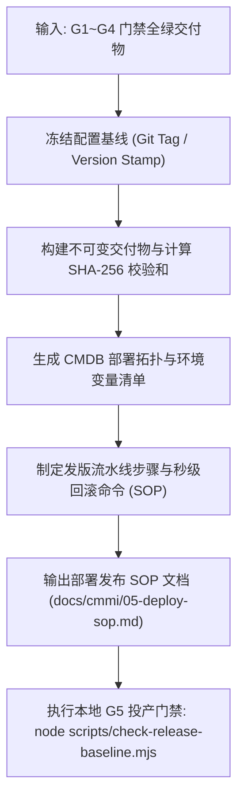

# CMMI 配置管理与不可变投产规范 (CM / RSKM / PMC)

> **CMMI 过程域**: Configuration Management (CM), Risk Management (RSKM), Project Monitoring and Control (PMC)  
> **门禁对应**: G5 不可变投产与发布门禁 (`gate_g5_release`)  
> **主责工匠角色**: PRE-SRE 产品可靠性工程师 (`emp_sre`)  
> **核心产出**: 《CMDB 部署架构拓扑手册》、《不可变配置基线清单》、《生产发版与秒级回滚 SOP》、《双人会签发布单》

---

## 1. 技能定位与核心原则

在 CMMI 3 配置管理与生产可靠性治理中，发布不是简单的执行一条推送命令，而是对配置项 (Configuration Item, CI) 状态的不可变固化：
1. **制品不可变 (Immutable Artifact)**: “测过的东西就是上的东西”。编译产物、Docker 镜像、OTA Bundle 必须生成唯一的 SHA-256 指纹，投产后严禁就地修改代码或热补丁逃逸。
2. **秒级回滚预案 (Instant Rollback)**: 任何生产变更必须具备明确的灰度策略与 1 分钟内的快速回滚命令。
3. **发布守卫与双人复核**: 严格遵守发布纪律，严禁私自绕过门禁执行推送，关键发版必须有 SRE 与业务负责人双人签署。

---

## 2. 自动化执行步骤 (Workflow)



1. **配置基线冻结**: 打打标版本号（遵守语义化版本 SemVer `vX.Y.Z`），生成不可变 Release Tag。
2. **计算防篡改指纹**: 对构建出的二进制包（APK/Zip/Docker Image/Manifest）生成 SHA-256 校验和。
3. **部署环境核查**: 检查生产环境依赖配置、存储挂载及端口所有权，杜绝端口冲突。
4. **生成应急预案**: 详尽写明回滚命令、数据降级方案与健康拨测 URL（如 `/api/health`）。
5. **归档文档**: 写入 `docs/cmmi/05-deploy-sop.md`。

---

## 3. 产物模板基线 (`docs/cmmi/05-deploy-sop.md`)

```markdown
# [系统名称] 生产发版与不可变配置管理手册 (CM & Release SOP)

- **系统代码**: {{SYSTEM_CODE}}
- **发布版本**: v{{RELEASE_VERSION}}
- **责任 SRE**: {{AUTHOR_ROLE}}
- **生效门禁**: G5 生产不可变门禁 (PASSED)

## 1. 不可变配置基线与制品校验和
- **Git Commit Hash**: `{{COMMIT_SHA}}`
- **构建制品名称**: `{{ARTIFACT_NAME}}`
- **SHA-256 校验和**: `{{SHA256_CHECKSUM}}`
- **存储后端**: Git 归档 / OSS Bucket (`oss://releases/...`)

## 2. 部署拓扑与依赖资源 (CMDB)
- **部署节点**: 生产主节点集群
- **网络与端口**: 端口分配无冲突，证书有效期充足
- **拨测接口**: `GET https://{{DOMAIN}}/api/health` -> HTTP 200 OK

## 3. 生产发布与秒级回滚流程 (SOP)
### 3.1 步骤 1: 预发探活
`curl -sSf https://{{DOMAIN}}/api/health | jq .`
### 3.2 步骤 2: 流量切换 / 服务重启
`systemctl restart {{SERVICE_NAME}}`
### 3.3 步骤 3: 异常快速回滚 (执行时限: 60秒内)
`ln -sfn /opt/releases/previous /opt/current && systemctl restart {{SERVICE_NAME}}`
```

---

## 4. G5 门禁通过准则 (Definition of Done)
- [ ] G1 ~ G4 阶段门禁全部为 PASSED 状态。
- [ ] 发布制品生成唯一的不可变校验指纹，且已归档入安全存储。
- [ ] 秒级回滚 SOP 与脚本经过预发演练验证可行。
- [ ] G5 发布检查脚本（如 `check-release-baseline.mjs`）校验 100% 成功。

---

## 5. 权威开源标准与参考文献
- **IEEE 828-2012** 软件配置管理标准、不可变制品防篡改与 G5 投产自检清单：
  - 请参阅 [`references/ieee-828-configuration-management.md`](references/ieee-828-configuration-management.md)

