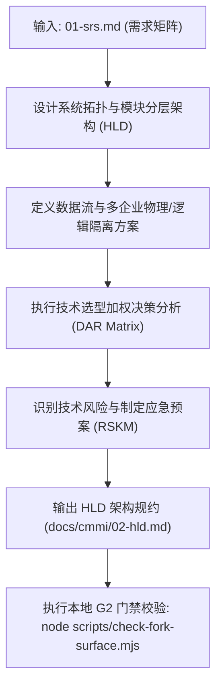
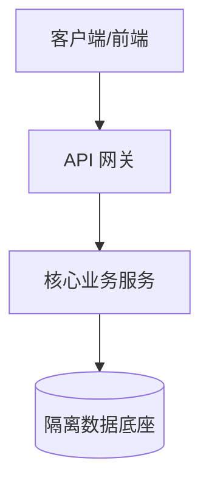

# CMMI 架构设计与技术决策分析 (TS / DAR / RSKM)

> **CMMI 过程域**: Technical Solution (TS), Decision Analysis and Resolution (DAR), Risk Management (RSKM)  
> **门禁对应**: G2 架构隔离与治理门禁 (`gate_g2_arch`)  
> **主责工匠角色**: FDA 前线架构师 (`emp_fda`)  
> **核心产出**: 《系统概要设计说明书 (HLD)》、《多企业数据隔离方案》、《技术选型决策分析表 (DAR)》

---

## 1. 技能定位与核心原则

在 CMMI 体系与高可靠架构工程中，任何代码实现之前必须确立不可逾越的边界约束：
1. **隔离边界必须强校验**: 企业隔离（Company Scoping）、租户与组织隔离、角色权限控制（RBAC）必须在架构与持久化层有强制防线，不允许靠自觉。
2. **决策必须有量化依据 (DAR)**: 关键技术选型（框架、存储选型、通信协议、模型选型）不得拍脑袋，必须采用 CMMI 5 推荐的多准则加权打分法（Weighted Decision Matrix）。
3. **架构不可擅自越界**: 任何涉及跨服务依赖、第三方集成、上游分支代码修改，必须在架构图与变更面中 100% 显式登记。

---

## 2. 自动化执行步骤 (Workflow)



1. **架构拓扑绘制**: 明确展现服务接入层、网关层、业务逻辑层、存储底座与外部系统依赖。
2. **多企业隔离规约**: 标明每个实体表 `company_id` 过滤逻辑、RPC 鉴权上下文传递链路、隔离越权拦截策略。
3. **技术选型 DAR 打分**:
   - 候选方案（方案 A、方案 B、方案 C）
   - 评价准则（性能、可维护性、成本、团队熟悉度、生态成熟度）及权重
   - 综合打分与选型裁定。
4. **输出标准文档**: 编写 `docs/cmmi/02-hld.md`。
5. **门禁命令执行**: 运行项目本地 `scripts/check-fork-surface.mjs` 或架构检查脚本，确认架构无越权、边界无漂移。

---

## 3. 产物模板基线 (`docs/cmmi/02-hld.md`)

```markdown
# [系统名称] 系统概要设计与架构决策说明书 (HLD & DAR)

- **系统代码**: {{SYSTEM_CODE}}
- **责任架构师**: {{AUTHOR_ROLE}}
- **生效门禁**: G2 架构隔离门禁 (PASSED)

## 1. 总体架构拓扑图


## 2. 企业与数据隔离方案
- **数据物理/逻辑分界**: 所有业务表以 `company_id` 为联合主键或分库依据。
- **内存防逃逸**: 每次请求必须注入 `TenantContext`，底层自动拦截无租户查询。

## 3. 关键技术选型决策分析表 (DAR)
| 评价准则 | 权重 (%) | 方案 A: 自研内存池 | 方案 B: Redis 集群 (选中) | 方案 C: 外部云缓存 |
| :--- | :--- | :--- | :--- | :--- |
| 高可用与容灾 | 30% | 6.0 | 9.0 | 8.5 |
| 运维复杂度 | 25% | 7.5 | 8.5 | 9.0 |
| 扩展性与生态 | 25% | 5.0 | 9.5 | 8.0 |
| 成本与开销 | 20% | 9.0 | 8.0 | 6.0 |
| **加权总分** | **100%** | **6.72** | **8.82 (中标)** | **8.02** |
```

---

## 4. G2 门禁通过准则 (Definition of Done)
- [ ] 架构分层清晰，对外暴露契约协议明确。
- [ ] 企业/租户数据隔离机制通过安全性推演与静态审查。
- [ ] 核心技术选型附带完整 DAR 加权评估表。
- [ ] G2 检查脚本（如 `check-fork-surface.mjs`）验证通过，无未登记漂移。

---

## 5. 权威开源标准与参考文献
- **IEEE 1016-2009 (SDD)** 软件设计描述标准、DAR 加权决策分析模型与 G2 评审清单：
  - 请参阅 [`references/ieee-1016-hld-dar-standard.md`](references/ieee-1016-hld-dar-standard.md)

