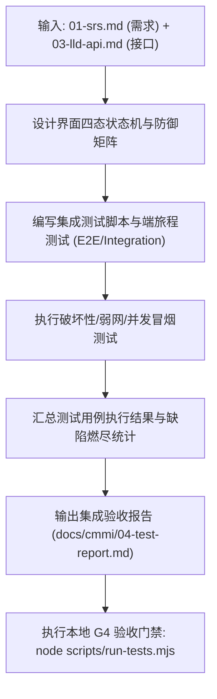

# CMMI 验证与确认工程规范 (VER / VAL)

> **CMMI 过程域**: Verification (VER) & Validation (VAL)  
> **门禁对应**: G4 全栈验收与端体验门禁 (`gate_g4_eval`)  
> **主责工匠角色**: FDSE 前线全栈工程师 (`emp_fdse`)  
> **核心产出**: 《页面四态状态机规格说明书》、《全栈交互防抖防御规范》、《系统集成测试与验收报告》

---

## 1. 技能定位与核心原则

验证（Verification：我们是否正确地构建了系统？）与确认（Validation：我们是否构建了正确的系统？）是软件工程质量的护城河：
1. **状态机全覆盖 (Four-State Complete)**: 任何带异步加载的交互界面，必须完整设计并实现 4 态：`Loading`（加载态）、`Empty`（空数据态）、`Error`（异常重试态）、`Success`（数据就绪态）。杜绝白屏与无响应假死。
2. **零死穴交互与异常防御**: 按钮必须自带提交防抖（Debounce/Throttle）、禁止重复提交，网络中断或 500 报错时必须给用户清晰的错误反馈和恢复入口。
3. **真实端集成验证**: 不仅仅依靠 mock 单测，必须进行前后端真实联调与全业务旅程（User Journey）闭环冒烟验证。

---

## 2. 自动化执行步骤 (Workflow)



1. **四态状态机审查**: 逐一检查新增/变更界面的四态渲染。
2. **防抖与容错测试**: 模拟快速连续点击、网络超时、Token 失效等极端分支。
3. **自动化端到端测试运行**: 启动真实服务，执行测试用例套件。
4. **生成测试度量与报告**: 汇总用例总数、通过数、失败数、跳过数及缺陷修复状态。
5. **归档文档**: 写入 `docs/cmmi/04-test-report.md`。

---

## 3. 产物模板基线 (`docs/cmmi/04-test-report.md`)

```markdown
# [系统名称] 系统集成测试与验收报告 (VER & VAL Report)

- **系统代码**: {{SYSTEM_CODE}}
- **责任工程师**: {{AUTHOR_ROLE}}
- **生效门禁**: G4 全栈验收门禁 (PASSED)

## 1. 界面四态与异常防御检查表
| 页面 / 组件 | Loading 态 | Empty 空态 | Error 容错态 | Success 就绪态 | 防抖测试 |
| :--- | :--- | :--- | :--- | :--- | :--- |
| EntityListTable | 骨架屏正常 | 引导创建空插画 | 显式重试按钮 | 渲染无闪烁 | ✅ 0 重复提交 |
| EditDetailForm | 禁用提交并 Spinner | N/A | Toast 准确错误码 | 返回列表刷新 | ✅ 防抖 500ms |

## 2. 集成测试执行结果
- **总用例数**: 48 个
- **通过用例数**: 48 个 (100%)
- **阻断性 Bug (P0)**: 0
- **严重 Bug (P1)**: 0
- **一般缺陷 (P2)**: 0 (均已修复闭环)

## 3. 真实业务旅程验证 (User Journey)
- 场景 1: 从创建到发布全流程 -> PASS
- 场景 2: 逆向分支（无权限、网络断开）-> 提示友好，可恢复 -> PASS
```

---

## 4. G4 门禁通过准则 (Definition of Done)
- [ ] 页面四态全部覆盖，0 白屏、0 假死按钮。
- [ ] 所有集成测试与自动化用例 100% 绿色通过。
- [ ] P0 / P1 / P2 级已知缺陷全部清零。
- [ ] G4 门禁检查脚本（如 `run-tests.mjs`）成功通过。
