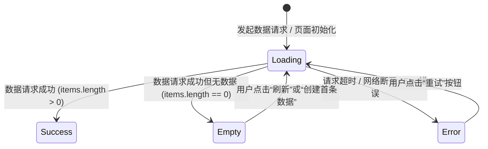

# ISO/IEC/IEEE 29119 & CMMI 验证与确认 (VER/VAL) 全栈验收标准规约

> **权威标准参考**: ISO/IEC/IEEE 29119:2022 (Software and systems engineering — Software testing，取代原 IEEE 829-2008) 与 CMMI V2.0 验证 (VER) / 确认 (VAL) 过程域。

---

## 1. 系统验收测试 (SAT) 与用户验收 (UAT) 文档大纲

依据 ISO/IEC/IEEE 29119 标准，一份完整的测试与验收文档必须包含以下章节：

```
1. 测试概述与验收范围 (Test Context & Scope)
   1.1 被测系统与版本标识
   1.2 准入测试条件 (Entry Criteria)
   1.3 测试环境拓扑与配置说明
2. 测试用例设计与覆盖矩阵 (Test Cases & Coverage)
   2.1 功能与端到端业务旅程用例 (E2E User Journeys)
   2.2 UI 页面四态状态机穷举检查 (Four-State Machine)
   2.3 异常防御与高并发防抖测试 (Debounce & Resilience)
3. 测试执行记录与缺陷统计 (Execution Summary & Defect Log)
   3.1 用例执行统计 (Total / Passed / Failed / Blocked)
   3.2 缺陷分布与严重程度分级 (P0 ~ P3)
4. 准出判定与验收结论 (Exit Criteria & Sign-off Certificate)
```

---

## 2. 界面四态状态机全覆盖规范 (Four-State Complete)

任何具备异步请求、网络依赖或状态切换的前端界面/组件，必须穷举并实现 4 种状态，严禁遗漏：



1. **`Loading` (加载态)**: 显示符合设计令牌的骨架屏（Skeleton）或居中 Spinner，禁止长时间白屏或界面假死。
2. **`Empty` (空数据态)**: 显示友好的引导插画、空态文案与主 CTA 操作按钮（如“立即新建第一个任务”）。
3. **`Error` (容错态)**: 明确提示网络或服务错误原因，提供一键“重试”按钮，杜绝无响应崩溃。
4. **`Success` (就绪态)**: 高保真渲染数据，支持下拉刷新与分页加载。

---

## 3. 缺陷严重程度分级与清零标准 (Defect Severity Matrix)

在 CMMI G4 门禁准出评审中，缺陷分级与准出准则如下：

| 等级 | 缺陷定义与影响 | 处理时效 | 门禁准出要求 |
| :--- | :--- | :--- | :--- |
| **P0 (Blocker)** | 核心业务主流程中断、系统崩溃白屏、数据篡改丢失、严重安全漏洞 | 立即挂起上线，2小时内解决 | **必须 100% 清零 (0 容忍)** |
| **P1 (Critical)** | 重要功能不可用但有绕过途径、性能严重低于 SLA、关键门禁脚本报错 | 8小时内修复 | **必须 100% 清零** |
| **P2 (Major)** | 次要功能缺陷、样式严重错乱、防抖失效偶发报错但可刷新恢复 | 24小时内修复 | **必须全部修复验证闭环** |
| **P3 (Minor)** | 文案微调、轻微视觉间距偏差、不影响功能的建议项 | 纳入下一个 Sprint 迭代 | 经评审允许遗留，登记入缺陷库 |

---

## 4. G4 全栈验收门禁评审清单 (Peer Review Checklist)

- [ ] **用例覆盖率**: RTM 中 100% 的验收需求是否均有执行记录？
- [ ] **四态覆盖**: 所有异步交互界面是否完整实现了 Loading/Empty/Error/Success 四态？
- [ ] **防抖防御**: 核心提交按钮是否具备点击防抖（Debounce）与防止重复提交逻辑？
- [ ] **缺陷状态**: P0 / P1 / P2 级缺陷是否全部修复并完成回归验证？
- [ ] **自动化绿灯**: 自动化测试套件执行通过率是否达到 100%？
