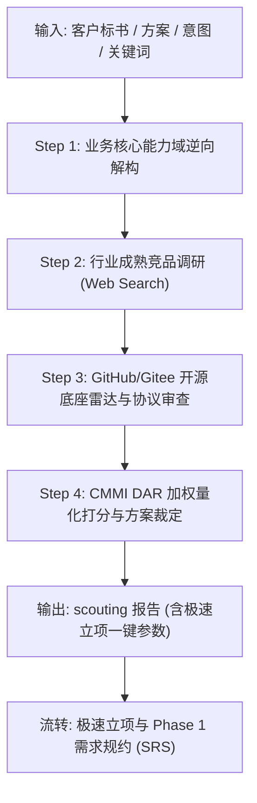

# Solution Scouting & DAR（方案研判、竞品调研与开源选型）

## 1. 核心定位与原则

在 CMMI 5 高成熟度与现代化智能体交付工程中，**严禁在没有行业竞品对标与开源生态研判的情况下直接手搓代码**：
1. **避免重复造轮子**：优先站在全球与国内顶级开源底座（如 RuoYi-All-Next, Spring Cloud Alibaba, JeecgBoot 等）的肩膀上，集成优于自研，裁剪优于重构。
2. **避免行业盲区**：通过竞品调研挖掘客户标书/方案中未明确写出、但在行业中属于“标配”的隐性需求与体验标准。
3. **决策量化可追溯（CMMI DAR）**：关键技术选型绝不凭主观臆断，必须执行加权决策分析（Decision Analysis and Resolution, DAR）。
4. **开源协议合规防线**：商业交付前强制审查 License，杜绝 GPL/AGPL 强传染性协议污染企业核心商业源码。

---

## 2. 角色分工与 G0 门禁

本技能为项目启动的 **Phase 0（前置研判阶段）**，由 **DS（业务）** 与 **FDA（技术）** 双核协同：

| 角色 | 视角与职责 | 产出物 | 关注失败模式 |
|---|---|---|---|
| **DS** (业务方案专家) | 商业视角、客户旅程、竞品功能对标、行业标准交互梳理 | 《行业竞品功能矩阵对照表》 | “功能技术全对，但行业里没人这么用” / 缺少行业核心标配 |
| **FDA** (前线架构师) | 技术生态雷达、开源协议审查、脚手架架构评估、DAR量化打分 | 《开源底座技术雷达与 DAR 选型报告》 | “重复造低质轮子” / 选中小众死项目 / 开源协议商业风险 |

**G0 门禁准则（Scouting DoD）**：
- [ ] 至少梳理 2~3 个行业同类成熟商业/标杆产品的标准功能拓扑；
- [ ] 至少扫描 2~3 个 GitHub/Gitee 候选开源项目底座，且完成 License 安全排查；
- [ ] 产出完整的 CMMI DAR 加权决策打分表，中标方案理由充分；
- [ ] 输出清晰的极速立项推荐配置（包含 Git 仓库 URL、分支或本地工作区模式）。

---

## 3. 标准操作规程（Workflow 4 步走）



### Step 1: 需求/标书/方案逆向解构
- 提取客户文档中的 3~5 个核心业务能力域（如：`多租户组织权限`、`ChatBI 问数底座`、`审批流引擎`、`微服务脚手架`）。
- 梳理客户硬性技术约束（如：指定 Java / TypeScript / Python、必须私有化部署、信创要求、沙箱预览可行性）。

### Step 2: 行业成熟竞品调研（DS 主导）
- **工具调用**：调用 `search_web` 与 `read_url_content`，检索市面上同赛道的成熟商业系统与 SaaS 产品。
- **梳理要素**：
  1. 竞品的标准功能清单（标配 vs 亮点 vs 体验细节）；
  2. 典型用户旅程与商业交互闭环；
  3. 识别出客户未提及但在竞品中必不可少的“行业隐性需求”。

### Step 3: 开源底座与技术生态雷达（FDA 主导）
- **开源扫描**：在 GitHub / Gitee 检索近 1~2 年持续维护、高 Star 的优质开源方案。
- **健康度与协议审查**：
  - **Star & Release**：优先选 Star > 3K、最近 3 个月有 Commit 的活跃项目；
  - **License 审查**：
    - ✅ **商用友好（通过）**：MIT, Apache-2.0, BSD-2/3-Clause;
    - ⚠️ **有限弱传染（需隔离）**：LGPL, MPL;
    - ❌ **强传染阻断（一票否决）**：GPL-2.0/3.0, AGPL-3.0（除非纯独立进程/微服务RPC调用且客户认可）。

### Step 4: CMMI DAR 加权量化决策与立项输出
建立 5 维加权决策矩阵：
- **功能完备度与契合度 (30%)**：与客户业务需求的匹配比例；
- **架构扩展性与解耦 (25%)**：代码规范度、多企业/多租户隔离支持能力；
- **生态成熟度与维护活跃度 (20%)**：社区规模、文档丰富度、更新频次；
- **开源许可证安全合规 (15%)**：商业友好度；
- **沙箱预览与集成成本 (10%)**：本地容器/沙箱快速跑通的难度。

---

## 4. 产物规范模板 (`docs-coolie/scouting/YYYY-MM-DD-<slug>.md`)

报告统一归档至 `docs-coolie/scouting/` 目录下，文件格式如下：

```markdown
# [项目名称] 方案研判、竞品调研与开源选型报告 (DAR)

- **项目标识**: {{PROJECT_SLUG}}
- **主责专家**: DS ({{DS_NAME}}), FDA ({{FDA_NAME}})
- **生效门禁**: G0 调研与选型门禁 (PASSED)
- **基线输入**: {{CUSTOMER_DOC_OR_PROMPT}}

---

## 一、 客户核心诉求与业务能力域解构
- **核心业务域 1**: ...
- **核心业务域 2**: ...
- **客户技术与部署约束**: (如信创/纯内网/指定技术栈)

---

## 二、 行业标杆竞品功能对照矩阵 (DS 视角)

| 业务能力模块 | 竞品 A (标杆产品) | 竞品 B (成熟商业SaaS) | 本项目规划策略 (集成/定制/放弃) | 行业隐性标配提醒 |
| :--- | :--- | :--- | :--- | :--- |
| 用户与多租户 | 企业级 RBAC+部门级数据权限 | 组织树+多维度角色 | 采用标配底座能力 | 需支持兼职与多部门穿透 |
| 核心业务流程 | 可视化审批流+驳回撤回 | 顺序流+抄送 | 采用开源流程引擎集成 | 必须支持手机端审批与撤回 |
| ... | ... | ... | ... | ... |

---

## 三、 开源底座技术雷达与协议合规 (FDA 视角)

| 开源候选项目 | 官方地址 / Repo | Star / 活跃度 | 核心技术栈 | 开源协议 (License) | 合规性裁定 |
| :--- | :--- | :--- | :--- | :--- | :--- |
| **方案 1 (推荐)** | https://github.com/xaicd/ruoyi-all-next.git | 1.8k / 持续活跃 | Next.js + Prisma + SQLite | MIT | ✅ 安全商用 |
| **方案 2** | https://github.com/alibaba/spring-cloud-alibaba.git | 28k / 阿里维护 | Spring Cloud + Java | Apache-2.0 | ✅ 安全商用 |
| **方案 3** | https://... | ... | ... | GPL-3.0 | ❌ 强传染风险驳回 |

---

## 四、 CMMI DAR 技术选型加权决策打分表

| 评价准则 | 权重 (%) | 方案 1: RuoYi-All-Next (中标) | 方案 2: Spring Cloud Alibaba | 方案 3: 自研从零手搓 |
| :--- | :--- | :--- | :--- | :--- |
| 功能完备与业务契合 | 30% | 9.0 | 8.5 | 4.0 |
| 架构扩展与隔离规范 | 25% | 8.5 | 9.5 | 6.0 |
| 生态活跃与社区支持 | 20% | 8.0 | 9.5 | 3.0 |
| 许可证合规与商用安全 | 15% | 10.0 (MIT) | 10.0 (Apache) | 10.0 |
| 沙箱快速启动与部署成本 | 10% | 9.5 (内置3200端口) | 6.0 (依赖较重) | 3.0 |
| **加权总分** | **100%** | **8.85 (中标)** | **8.75** | **4.75** |

**最终选型决议**：
裁定采纳 **方案 1 (RuoYi-All-Next)** 作为系统交付底座，理由：开箱即用支持移动端原型沙箱实时预览，MIT 协议无污染风险，前端技术栈敏捷贴合现代交付。

---

## 五、 极速立项推荐配置（供一键填入 App / Web 立项抽屉）

- **建议项目名称**: `[推荐名称]`
- **代码库源模式**: `git_url` (或 `local_path`)
- **Git 仓库地址**: `https://github.com/xaicd/ruoyi-all-next.git`
- **默认主分支**: `main`
- **建设目标建议**: 复制上述业务核心域摘要，直接用于项目初始化。
```

---

## 5. 与现有流程与技能的协同

| 阶段 | 触发条件 | 调用技能 | 承接下游 |
|---|---|---|---|
| **Phase 0 (调研选型)** | 拿到标书/方案/客户一句话 | **`solution-scouting-and-dar` (本技能)** | 产出竞品矩阵与推荐底座配置 |
| **Phase 1 (极速立项)** | 选型完成 | App/Web **极速立项抽屉** | 创建项目并挂载工作区 |
| **Phase 2 (需求规约)** | 立项就绪 | **`requirements-capture` / `cmmi-req-spec`** | 基于竞品标配深化 EARS SRS/RTM |
| **Phase 3 (系统架构)** | 需求就绪 | **`system-design-spec` / `cmmi-tech-solution`** | 基于中标底座细化 HLD/LLD 与契约 |
