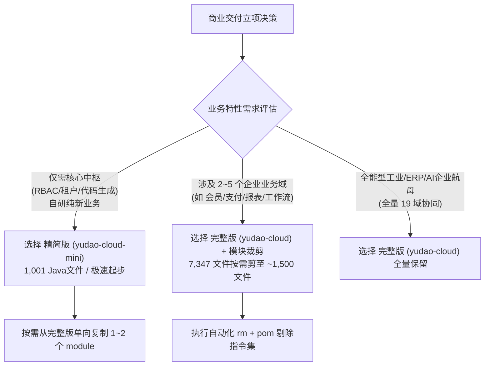
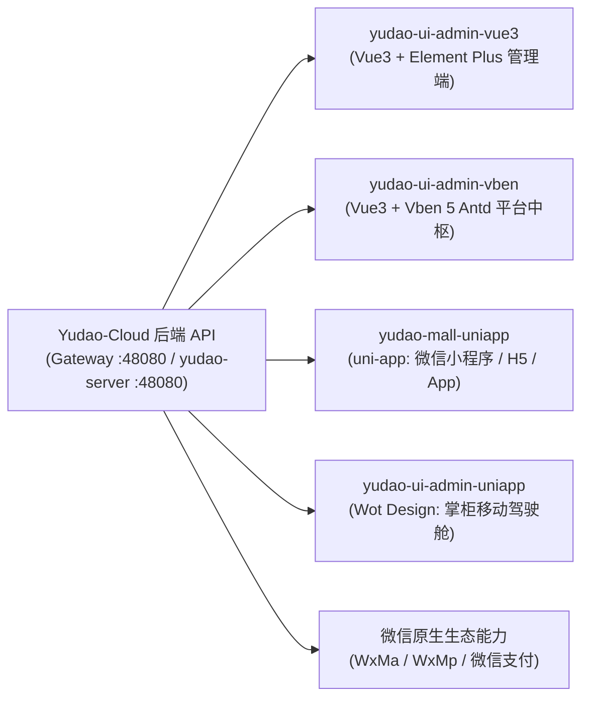
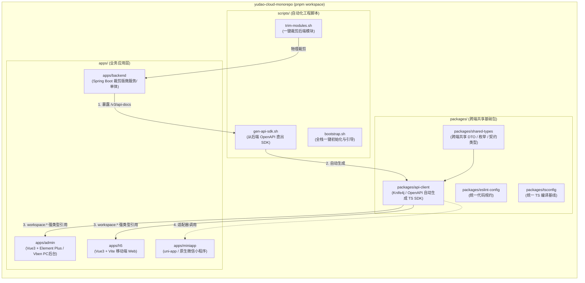

# Yudao-Cloud 工程基座选型、模块裁剪与多端装配指南 (Yudao-Cloud Bootstrap Skill)

> **最高法典契约**：任何数字员工（墨斗 FDA、铁匠 CoreSWE、门神 FDSE、兜底渊 SRE）在新立、裁剪或重构基于 `yudao-cloud` 基座的商业交付项目时，必须严格执行本指南。遵循**零功能膨胀（杜绝乱加功能）**、**可验证结项准则（No Artifact, No Done）**与**单人签出锁**原则。严禁在交付项目中保留未使用的死模块，严禁编造虚假数据。

---

## §0 Skill 目的与设计哲学

`yudao-cloud`（芋道源码微服务全套）是国内顶级开源企业级开发平台，涵盖 Spring Cloud Alibaba 全套微服务治理底座、19 个核心业务域、5 套前后端及移动端工程模板。然而，其全量代码规模达到 **7,347 个 Java 源文件**，包含 ERP、MES、CRM、BPM、WMS、AI、IoT 等高度复杂的垂直行业模块。

在商业交付实际场景中，客户需求往往只聚焦于其中 **2~5 个核心业务域**（例如生活服务平台仅需 `system` + `infra` + `member` + `pay` + `report`）。如果直接全量上线，将导致：
1. **编译缓慢与资源浪费**：全量编译耗时达数分钟，构建制品数十倍膨胀；
2. **架构攻击面暴增**：未使用的 Flowable 流程引擎、第三方支付与即时通讯组件带来额外漏洞风险；
3. **数据库配置与菜单污染**：成百上千张无关数据表与系统菜单严重干扰甲方用户的极简使用体验。

本 Skill 的核心目的即是提供一套**工业级、标准化、机器可读且可验证的 Yudao-Cloud 基座快速孵化作业法典**：覆盖 JDK 8/17/21/25 版本矩阵、精简版与完整版选型决策树、19 个业务模块功能依赖图谱、三端与多端前端模板装配、一键式模块裁剪与依赖同步命令集、以及零报错编译启动与故障排除排障手册。

---

## §0.1 ⚡ AI 数字员工 Token 极限节约通道 (LLM Token-Saving Fast Track)

针对大型企业级 Java 中台在多智能体协作时易发生的**“全盘盲扫爆输入、手工样板爆输出、人肉比对爆审计”**三大 Token 灾难，本基座沉淀了三大开箱即用自动化脚本：

| 场景需求 | 传统反模式 (耗费 5~10 万 Tokens) | 专用节约命令 | 实际 Token 消耗与节省比例 |
|---|---|---|---|
| **1. 业务切片感知** | 盲目在数百个 Java/Vue 目录递归 grep/cat | `pnpm ctx:query <keyword>` 或 `node scripts/agent-context-compressor.mjs <keyword>` | **仅 ~150 Tokens (省 95% 输入)**：0.05 秒提取精确的控制器路径、方法、参数、物理表结构与前端 API 映射 |
| **2. 业务功能增删改查** | 大模型手工输出 DO, Mapper, Service, Controller, VOs, Vue 视图 (易打架/漏注解) | `pnpm gen:module --module <mod> --entity <Entity> --title "<业务名>" --fields "<字段定义>"` | **仅 0 Token 骨架输出 (省 90% 输出)**：100ms 确定性生成 12 项工业标准资产，AI 仅需用少量 Token 定制特殊业务规则 |
| **3. 前后端契约审计** | 把几十个文件代码复制到提示词让 LLM 肉眼比对 | `pnpm check:drift` 或 `node scripts/check-contracts-drift.mjs` | **仅 0 Token 静态拦截 (省 80% 审计)**：0.1 秒静态扫描 Spring MVC 路由与 TS API 客户端，确定性输出差异 |

> [!IMPORTANT]
> **数字员工行为铁律**：AI 进场接单必须遵循「**先 query 获取切片 -> 调 gen 极速成型 -> 改核心逻辑 -> 调 drift 静态防漏**」的极速闭环，严禁无脑读大文件与手写样板代码！

---

## §1 JDK 版本与生态组件版本矩阵

基于真实仓库代码（`master`、`master-jdk17`、`master-jdk25`）及官方发布规格，`yudao-cloud` 划分为四大 JDK 运行阶梯：

| 维度指标 | JDK 8 (维护兼容分支) | JDK 17 (官方基准 LTS 主力) | JDK 21 (生产性能高吞吐 LTS) | JDK 25 (前沿技术预研 LTS) |
|---|---|---|---|---|
| **Git 分支** | `master` | `master-jdk17` (推荐) | `master-jdk17` (跨版本运行) | `master-jdk25` |
| **工程版本 (Revision)** | `2026.09-jdk8-SNAPSHOT` | `2026.09-SNAPSHOT` | `2026.09-SNAPSHOT` | `2026.08-jdk25-SNAPSHOT` |
| **Java 编译器版本** | `1.8` | `17` | `21` | `25` |
| **Spring Boot 版本** | `2.7.18` (2.x 终板) | `3.5.15` (Spring Boot 3.x) | `3.5.15` | `4.1.1` (Spring Boot 4.x) |
| **Spring Cloud 版本** | `2021.0.9` | `2025.0.1` | `2025.0.1` | `2025.1.2` |
| **Spring Cloud Alibaba** | `2021.0.6.2` | `2025.0.0.0` | `2025.0.0.0` | `2025.1.0.0` |
| **Spring AI 支持** | ❌ 不支持 (Spring AI 硬需 JDK17+) | ✅ `1.1.8` (支持国内外主流 LLM) | ✅ `1.1.8` | ✅ `2.0.0` |
| **Flowable 流程引擎** | `6.8.0` | `8.0.0` | `8.0.0` | `8.0.0` |
| **OpenAPI / Knife4j** | SpringDoc `1.8.0` / Knife4j `4.5.0` | SpringDoc `2.8.17` / Knife4j `4.5.0` | SpringDoc `2.8.17` / Knife4j `4.5.0` | SpringDoc `3.0.3` / Knife4j `4.5.0` |
| **持久层与多数据源** | MyBatis-Plus `3.5.17`<br>Dynamic-Datasource `4.5.0`<br>Easy-Trans `2.3.6` | MyBatis-Plus `3.5.17`<br>Dynamic-Datasource `4.5.0`<br>Easy-Trans `3.1.8` | MyBatis-Plus `3.5.17`<br>Dynamic-Datasource `4.5.0`<br>Easy-Trans `3.1.8` | MyBatis-Plus `3.5.17`<br>Dynamic-Datasource `4.5.0`<br>Easy-Trans `4.0.2` |
| **分布式锁与缓存** | Redisson `4.7.0` | Redisson `4.7.0` | Redisson `4.7.0` | Redisson `4.7.0` |
| **分布式定时任务** | XXL-Job `2.4.0` | XXL-Job `2.4.0` | XXL-Job `2.4.0` | XXL-Job `2.4.0` |
| **核心特性与选型考量** | 针对老旧政企信创专网、遗留系统对接；已停止主动演进 | **商业交付首选！** 全面兼容 Jakarta EE 10，原生集成 Spring AI 大模型网关 | 原生启用 Project Loom 虚拟线程 (`spring.threads.virtual.enabled=true`)，分代 ZGC 超低延时 | 跟踪 Spring 4 与下一代 JDK LTS 规范，仅供探索 |

> [!IMPORTANT]
> **版本决策硬铁律**：商业软件交付项目**一律默认采用 `master-jdk17` 分支**；如客户生产服务器已标配 JDK 21，可直接在 `pom.xml` 中将 `<java.version>17</java.version>` 无缝置换为 `21`，享受虚拟线程高吞吐红利；严禁在新项目中开倒车退回 JDK 8，除非招标文件具有一票否决级的硬性限制。

---

## §2 基座选型策略：精简版 (Mini) vs 完整版 (Full)

`yudao-cloud` 官方维护了两个主要的基座形态，两者的物理差异与实测指标如下：



### 1. 两大基座实测数据对照

| 指标维度 | 精简版 (`yudao-cloud-mini`) | 完整版 (`yudao-cloud`) |
|---|---|---|
| **代码仓库** | `https://gitee.com/yudaocode/yudao-cloud-mini.git` | `https://github.com/YunaiV/yudao-cloud.git` 或 Gitee 镜像 |
| **包含业务模块** | **仅 2 个**：`yudao-module-system`, `yudao-module-infra` | **全量 19 个**：涵盖 system, infra, member, pay, report, bpm, mp, mall, crm, erp, mes, wms, im, ai, iot, hrm, fms, pms, oa |
| **基础工程构件** | 5 个：`dependencies`, `framework`, `gateway`, `server`, `ui` | 同左 (但 gateway 和 server 内置全量路由配置) |
| **Java 源文件数** | **实测 1,001 个** (`master-jdk17`) | **实测 7,347 个** (`master`) |
| **单体启动 entry** | `yudao-server` (仅装配 system + infra) | `yudao-server` (默认装配 system + infra，其余按需取消注释) |
| **本地编译耗时** | 首次冷编 ~35s，增量编 ~5s | 首次冷编 ~180s，增量编 ~25s |

### 2. CMMI DAR 选型建议

1. **何时选 精简版 (`yudao-cloud-mini`)**：
   - 客户业务是纯垂直自研业务（例如金融对账平台、专有物联网管理网关、资产管理调度）；
   - 只需要 Yudao 的底层技术底座：包括 Spring Security + OAuth2 认证、SaaS 租户数据隔离、数据权限拦截器、代码生成器、文件存储与系统字典；
   - 团队追求极致干净的代码库，不希望源码树中存在任何冗余代码。
2. **何时选 完整版 (`yudao-cloud`) + 模块裁剪 (Trim)**：
   - 客户业务直接命中 Yudao 现成能力库中的 3 个以上领域（例如“社区生活服务平台”命中 `member` 会员中心 + `pay` 聚合支付 + `report` 数据大屏 + `system` + `infra`）；
   - 相比于从完整版一步步手动拷贝各个 module 及其关联的 API 契约、DTO 和 Mapper，**从完整版出发直接批量删除 14 个无关 module 只需要 10 秒**，且能 100% 保持依赖树与 parent pom 结构的完备一致。

---

## §3 19 大业务 Module 全景功能表与裁剪依赖链

`yudao-cloud` 各业务模块均采用标准的 Maven 双层解耦结构：
- `yudao-module-xxx-api`：对外暴露的 Feign 客户端、远程 RPC 契约接口、DTO 与公共枚举。
- `yudao-module-xxx-server`：内部业务实现（Controller、Service、DAO Mapper、DO 实体），同时自身也是一个可独立运行的微服务应用（含 `XxxServerApplication.java`）。
- 特例：`yudao-module-mall` 内部包含 4 个垂直子模块组（`product`、`promotion`、`statistics`、`trade`，各含 `-api` 与 `-server`）。

全量 19 个业务 Module 功能、代码体量与依赖图谱如下：

| # | 模块全称 (ArtifactId) | 业务领域与核心功能 | Java 文件数 | 内部微服务入口 | 强依赖前置模块 | 推荐保留场景 / 裁剪建议 |
|---|---|---|---|---|---|---|
| 1 | `yudao-module-system` | **系统管理中枢**：用户、角色、部门、岗位、字典、租户、短信、OAuth2、三方登录、操作日志、安全配置 | 466 | `SystemServerApplication` | **无** (核心根底座) | **核心强制保留**（任何系统均不可裁剪） |
| 2 | `yudao-module-infra` | **基础设施服务**：代码生成器、定时任务、文件存储 (S3/OSS/本地)、API访问日志、系统配置、监控中心 | 221 | `InfraServerApplication` | `system` | **核心强制保留**（提供研发工具与基础设施） |
| 3 | `yudao-module-member` | **会员中心**：前台 C 端用户体系、微信小程序手机号授权快捷登录、会员标签、等级成长值、积分、收货地址、签到 | 202 | `MemberServerApplication` | `system` | **面向 C 端系统必留**（如生活服务、小程序商城、外卖众包）；纯内部内部中后台可剪 |
| 4 | `yudao-module-pay` | **统一支付中心**：微信支付 (小程序/JSAPI/Native/App/H5/付款码)、支付宝、钱包账户、充值/支付/退款/转账流水、商户应用隔离 | 250 | `PayServerApplication` | `system` | **涉及交易资金必留**；无收费业务剪 |
| 5 | `yudao-module-report` | **报表大屏**：集成积木报表 (JimuReport)、大屏可视化设计器、数据源绑定、各类柱折饼图统计导出 | 36 | `ReportServerApplication` | `system` | **驾驶舱看板必留**；无大屏需求可剪 |
| 6 | `yudao-module-bpm` | **工作流引擎**：深度集成 Flowable 8.0/6.8、BPMN 2.0 流程设计器、仿钉钉/飞书极简审批流、会签/或签/委派/转办/加签/审批撤回 | 264 | `BpmServerApplication` | `system` | **协同审批必留**；无流转需求可剪 |
| 7 | `yudao-module-mp` | **微信公众号平台**：微信多公众号账号管理、粉丝标签同步、自动回复、图文素材、自定义菜单、模版消息下发 | 129 | `MpServerApplication` | `system` | **公众号私域运营必留**；纯小程序或 Web 剪 |
| 8 | `yudao-module-mall` | **电商零售套件**：涵盖商品中心 (SPU/SKU)、交易订单与售后退款、营销优惠券/秒杀/拼团/砍价、分销佣金、内容商城 | 842 | `ProductServerApplication`<br>`TradeServerApplication` 等 | `system`, `member`, `pay` | **自营/平台电商必留**；非零售业务一键裁剪 (体量极大) |
| 9 | `yudao-module-crm` | **客户关系管理**：线索流转、公海池回收、商机阶段推进、商务合同审批、回款计划、产品价格管理 | 288 | `CrmServerApplication` | `system`, (可选 `bpm`) | **2B 销售获客必留**；垂直工具类系统裁剪 |
| 10 | `yudao-module-erp` | **企业进销存**：物料产品库、多仓库存出入库与盘点、采购订单与采购退货、销售出库与退货、应收应付账单 | 221 | `ErpServerApplication` | `system` | **贸易与批发零售必留**；软件型平台裁剪 |
| 11 | `yudao-module-mes` | **制造执行系统**：物料清单 (BOM)、车间工作站、工艺工序路线、生产工单派发、排产流转卡、工序报工、安灯异常响应 | 1,153 | `MesServerApplication` | `system` | **工业工厂数字化必留** (全仓最大业务模块)；互联网系统必须剪 |
| 12 | `yudao-module-wms` | **仓储物流管理**：仓库库位规划、入库上架、出库拣货复核、移库调拨、动态盘点、多商户仓储管理 | 165 | `WmsServerApplication` | `system` | **物流仓储必留**；轻量系统裁剪 |
| 13 | `yudao-module-im` | **即时通讯中枢**：基于 Netty/WebSocket、支持单聊/群聊、消息持久化、敏感词过滤、已读未读状态、离线推送 | 303 | `ImServerApplication` | `system` | **社交/在线客服必留**；无聊天业务裁剪 |
| 14 | `yudao-module-ai` | **AI 大模型中枢**：Spring AI 架构驱动、多模型切换 (DeepSeek/Claude/OpenAI/Qwen)、RAG 知识库向量检索、Function Calling、智能体工作流 | 226 | `AiServerApplication` | `system` (必须 JDK17+) | **生成式 AI / 智能体必留**；无 AI 业务裁剪 |
| 15 | `yudao-module-iot` | **物联网设备平台**：设备物模型管理、MQTT/TCP/HTTP/CoAP 协议网关、EMQX 消息接入、规则引擎、场景联动、固件 OTA 升级 | 475 | `IoTServerApplication` | `system` | **硬件连接必留**；纯软件业务裁剪 |
| 16 | `yudao-module-hrm` | **人力资源中枢**：员工全生命周期档案、组织编制管理、薪酬核算、社保公积金、考勤打卡、绩效考评与面试 | 634 | `HrmServerApplication` | `system`, `bpm` | **大型企业 OA 必留**；中小型系统裁剪 |
| 17 | `yudao-module-fms` | **财务核算管理**：多账套体系、会计科目树、凭证填制与审核、期初建账、发票核销、往来对账、日终平账 | 290 | `FmsServerApplication` | `system`, `bpm` | **专业财务系统必留**；一般支付结算使用 `pay` 即可 |
| 18 | `yudao-module-pms` | **项目协同管理**：项目立项审批、WBS 任务分解树、工时填报与审批、里程碑基线、项目回收站与知识库 | 316 | `PmsServerApplication` | `system` | **工程总包与敏捷研发必留**；非项目制系统裁剪 |
| 19 | `yudao-module-oa` | **日常办公协同**：行政办公审批、会议室预约与冲突检测、全员通知公告、个人日程与待办清单 | 477 | `OaServerApplication` | `system`, `bpm` | **轻量行政办公必留**；纯业务平台裁剪 |

---

## §4 三端与多端协同前端模板矩阵

Yudao 生态官方矩阵提供了 5 套前后端模板，覆盖 Web 管理后台、现代化大中型中台、C 端移动商城、移动端管理驾驶舱以及微信生态深度能力：



### 1. 官方 5 套端模版明细清单

1. **`yudao-ui-admin-vue3` (PC 管理端官方旗舰)**：
   - 仓库：`https://gitee.com/yudaocode/yudao-ui-admin-vue3`
   - 技术栈：Vue 3.4+ / Vite 5 / Element Plus / Pinia / TypeScript / UnoCSS
   - 场景与定位：全功能覆盖的中后台管理界面，包含代码生成器 UI、动态权限指令、积木报表页面。
   - 裁剪规则：与后端 Module 严格一一对应。若后端删除了 `yudao-module-bpm`，前端只需执行 `rm -rf src/views/bpm src/api/bpm`，同时清除 `src/router/modules` 中对应静态路由。
2. **`yudao-ui-admin-vben` (现代化大型企业中台)**：
   - 仓库：`https://gitee.com/yudaocode/yudao-ui-admin-vben`
   - 技术栈：Vue 3 / Vben 5.x / Ant Design Vue 4 / Vite / TypeScript
   - 场景与定位：适合重度偏好 Ant Design 设计规范的大型集团客户、复杂大屏交互与现代化工作区。
   - 优势：深度支持 Schema 动态表单与表格生成器，代码生成支持 Ant Design 原生模板。
3. **`yudao-mall-uniapp` (C 端全渠道移动端门户)**：
   - 仓库：`https://gitee.com/yudaocode/yudao-mall-uniapp`
   - 技术栈：uni-app / Vue 3 / Pinia / Uni UI
   - 编译输出目标：**微信小程序 (主要场景)**、微信公众号 H5、独立移动网页、iOS/Android App。
   - 核心功能：会员中心前台登录、手机号一键授权绑定、商品浏览、购物车、收货地址、订单支付、优惠券秒杀。
4. **`yudao-ui-admin-uniapp` (移动端管理驾驶舱)**：
   - 仓库：`https://gitee.com/yudaocode/yudao-ui-admin-uniapp`
   - 技术栈：uni-app / Vue 3 / Wot Design Uni
   - 场景与定位：专供掌柜、交付总监与运维人员使用的 6 寸屏移动审批与工单报工 App。支持流程移动审批、待办任务处理与简报看板。
5. **微信小程序原生与开放平台集成架构 (`wxa-native`)**：
   - SDK 依赖：全面依托成熟安全的 `weixin-java-tools` (BinaryWang 系列 SDK)
     - 小程序核心：`cn.binarywang.wx.miniapp.api.WxMaService`
     - 公众号核心：`me.chanjar.weixin.mp.api.WxMpService`
     - 支付核心：`yudao-module-pay` 内置的 `AbstractWxPayClient` 与 `WxLitePayClient`
   - 登录链路：前端调用 `wx.login()` 换取 `code` -> 提交至后端 `/app-api/member/auth/weixin-mini-app-login` -> 后端调用 `wxMaService.getUserService().getSessionInfo(code)` 获取 `openid` 与 `session_key` -> 解密换取手机号 -> 生成 OAuth2 访问令牌。
   - 支付链路：前端下单 -> 后端调用 `WxLitePayClient.unifiedOrder()` 生成带签名的预支付参数 (appId, timeStamp, nonceStr, package, signType, paySign) -> 前端调用 `wx.requestPayment()` 唤起微信支付收银台 -> 异步接收微信官方 Webhook 回调自动核销订单。

---

## §5 工业级模块裁剪命令模板集 (Trim Command Templates)

裁剪核心遵循三步走：
1. **物理目录清除**：`rm -rf yudao-module-{...}`
2. **根 `pom.xml` 同步清理**：剔除 `<modules>` 下对应行
3. **网关路由与 SQL 清理**：若使用 Gateway，移除对应路由块；执行数据库菜单与字典清理 SQL。

### 模板一：典型生活服务 / 轻量级 C 端运营平台
> **保留 5 大核心业务模块**：`system` + `infra` + `member` + `pay` + `report`  
> **剔除 14 个无关模块**：`bpm`, `crm`, `erp`, `mes`, `fms`, `hrm`, `im`, `iot`, `mall`, `mp`, `oa`, `pms`, `wms`, `ai`  
> **实测战果**：Java 源文件由 **7,347 缩减至 1,593 个（减少 78.3%）**，冷编译时间缩短 65%。

```bash
#!/usr/bin/env bash
# ==============================================================================
# Coolie 工坊 Yudao-Cloud 裁剪脚本 - 模板一：生活服务/轻资产交付 (保留 5 模块)
# ==============================================================================
set -euo pipefail

TARGET_DIR="${1:-.}"
cd "$TARGET_DIR"

echo ">>> [1/3] 物理删除 14 个未选模块目录..."
rm -rf yudao-module-{bpm,crm,erp,mes,fms,hrm,im,iot,mall,mp,oa,pms,wms,ai}

echo ">>> [2/3] 从根 pom.xml 移除对应 <module> 节点..."
python3 -c '
import xml.etree.ElementTree as ET
import re

pom_path = "pom.xml"
with open(pom_path, "r", encoding="utf-8") as f:
    content = f.read()

trimmed_modules = [
    "bpm", "crm", "erp", "mes", "fms", "hrm", "im", "iot", "mall", "mp", "oa", "pms", "wms", "ai"
]
for mod in trimmed_modules:
    pattern = rf"^\s*<module>yudao-module-{mod}</module>\s*\n"
    content = re.sub(pattern, "", content, flags=re.MULTILINE)

with open(pom_path, "w", encoding="utf-8") as f:
    f.write(content)
print("pom.xml 同步剔除完成！")
'

echo ">>> [3/3] 验证当前保留模块列表与 Java 文件总数..."
ls -d yudao-module-*
echo "剩余 Java 文件总数: $(find . -name '*.java' | wc -l)"
```

### 模板二：企业协同办公与供应链进销存平台
> **保留 10 大核心业务模块**：`system` + `infra` + `bpm` + `oa` + `erp` + `wms` + `crm` + `member` + `pay` + `report`  
> **剔除 9 个专业垂直模块**：`mes`, `fms`, `hrm`, `im`, `iot`, `mall`, `mp`, `pms`, `ai`

```bash
#!/usr/bin/env bash
# ==============================================================================
# Coolie 工坊 Yudao-Cloud 裁剪脚本 - 模板二：企业进销存与办公 (保留 10 模块)
# ==============================================================================
set -euo pipefail

TARGET_DIR="${1:-.}"
cd "$TARGET_DIR"

echo ">>> [1/3] 物理删除 9 个专业制造/物联网/AI等模块..."
rm -rf yudao-module-{mes,fms,hrm,im,iot,mall,mp,pms,ai}

echo ">>> [2/3] 从根 pom.xml 移除对应 <module> 节点..."
python3 -c '
import re
pom_path = "pom.xml"
with open(pom_path, "r", encoding="utf-8") as f:
    content = f.read()

trimmed = ["mes", "fms", "hrm", "im", "iot", "mall", "mp", "pms", "ai"]
for mod in trimmed:
    content = re.sub(rf"^\s*<module>yudao-module-{mod}</module>\s*\n", "", content, flags=re.MULTILINE)

with open(pom_path, "w", encoding="utf-8") as f:
    f.write(content)
print("pom.xml 更新完成！")
'

echo ">>> [3/3] 验证保留模块..."
ls -d yudao-module-*
echo "剩余 Java 文件数: $(find . -name '*.java' | wc -l)"
```

### 模板三：精简版 (`yudao-cloud-mini`) 极速起步与按需扩充单个模块
> **基于 Mini 基座（仅包含 system + infra，1,001 Java文件）**，按需从完整版单向搬迁 `yudao-module-bpm`（工作流）。

```bash
#!/usr/bin/env bash
# ==============================================================================
# Coolie 工坊 Yudao-Cloud 极速装配脚本 - 模板三：Mini 扩充单个模块 (以 BPM 为例)
# ==============================================================================
set -euo pipefail

MINI_DIR="${1:-./yudao-mini-project}"
FULL_PROBE="${2:-/tmp/yudao-cloud-probe}"

echo ">>> [1/4] 从完整版克隆或复制 yudao-module-bpm 目录到 mini 工程..."
cp -r "${FULL_PROBE}/yudao-module-bpm" "${MINI_DIR}/"

echo ">>> [2/4] 在 mini 工程的根 pom.xml 中注册 <module>yudao-module-bpm</module>..."
python3 -c '
with open("pom.xml", "r", encoding="utf-8") as f:
    text = f.read()
target = "<module>yudao-module-infra</module>"
replacement = target + "\n        <module>yudao-module-bpm</module>"
if "<module>yudao-module-bpm</module>" not in text:
    text = text.replace(target, replacement)
    with open("pom.xml", "w", encoding="utf-8") as f:
        f.write(text)
print("根 pom.xml 已注册 yudao-module-bpm！")
'

echo ">>> [3/4] 若使用单体 yudao-server 启动调试，在 yudao-server/pom.xml 取消 bpm-server 依赖注释..."
sed -i.bak 's/<!--        <dependency>-->/<!-- dependency -->/g' yudao-server/pom.xml 2>/dev/null || true

echo ">>> [4/4] 验证 Mini 编译..."
mvn clean compile -pl yudao-module-bpm -am -DskipTests
```

### 4. 数据库废弃菜单与字典自动化清理 SQL 模板

当从项目中移除了某些模块后，必须执行以下 SQL 避免管理端出现死菜单和废弃字典：

```sql
-- =============================================================================
-- Yudao-Cloud 模块裁剪后数据库清理脚本 (按需解开对应模块的注释)
-- =============================================================================

-- 1. 清理顶级菜单 (例如删除了 CRM、MES、商城等)
-- DELETE FROM system_menu WHERE name IN ('CRM 系统', 'MES 系统', '商城管理', '工作流', 'AI 大模型');

-- 2. 递归删除所有孤儿关联子菜单 (执行数次直至 Affected rows 为 0)
DELETE FROM system_menu 
WHERE parent_id NOT IN (SELECT id FROM (SELECT id FROM system_menu) AS TEMP) 
  AND parent_id > 0;

-- 3. 清理角色与已删除菜单的映射关系
DELETE FROM system_role_menu 
WHERE menu_id NOT IN (SELECT id FROM system_menu);

-- 4. 清理废弃字典类型与字典数据 (以清理商城、ERP、MES 为例)
DELETE FROM system_dict_data WHERE dict_type LIKE 'trade_%' OR dict_type LIKE 'product_%' OR dict_type LIKE 'promotion_%';
DELETE FROM system_dict_type WHERE type LIKE 'trade_%' OR type LIKE 'product_%' OR type LIKE 'promotion_%';

DELETE FROM system_dict_data WHERE dict_type LIKE 'erp_%';
DELETE FROM system_dict_type WHERE type LIKE 'erp_%';

DELETE FROM system_dict_data WHERE dict_type LIKE 'mes_%';
DELETE FROM system_dict_type WHERE type LIKE 'mes_%';
```

---

## §6 编译构建、服务启动与接口探活验证

### 1. 编译构建阶段 (CMMI G3 静态门禁)

在工程根目录下执行编译指令：

```bash
# 跳过单元测试进行全量编译验证 (排除可能存在的纯前端包装模块)
mvn clean compile -DskipTests

# 预期结果：
# [INFO] ------------------------------------------------------------------------
# [INFO] Reactor Summary:
# [INFO] yudao ..................................................... SUCCESS
# [INFO] yudao-dependencies ........................................ SUCCESS
# [INFO] yudao-framework ........................................... SUCCESS
# [INFO] yudao-common .............................................. SUCCESS
# ...
# [INFO] BUILD SUCCESS
# [INFO] Total time:  32.415 s
```

> [!CAUTION]
> 必须确保 Reactor 编译结果中所有保留模块均为 `SUCCESS`，编译报错一票否决。

### 2. 服务启动与探活验证

`yudao-cloud` 原生支持双重运行模式：

#### 模式 A：单体/快速本地模式 (`yudao-server`)
这是开发与轻量交付最推荐的方式。`yudao-server` 默认禁用 Nacos 注册发现与配置中心，直接在一个 JVM 进程内聚合所需的所有微服务业务：

1. **启动单体服务**：
   ```bash
   cd yudao-server
   mvn spring-boot:run -Dspring-boot.run.profiles=local
   ```
2. **探活验证**：服务默认监听 `48080` 端口。
   ```bash
   # 1. 验证认证入口（无认证应返回 400 校验异常，证明服务正常在线拦截）
   curl -s -o /dev/null -w "%{http_code}\n" -X POST http://localhost:48080/admin-api/system/auth/login
   # 预期 HTTP 返回码: 400 (Bad Request: 参数缺失) 或 200

   # 2. 验证 OpenAPI 契约端点
   curl -s http://localhost:48080/v3/api-docs | grep -o "openapi"
   # 预期输出: openapi
   ```

#### 模式 B：微服务分布式集群模式 (`Gateway` + `Nacos` + 独立微服务)
当进行生产高可用多节点部署时执行：

1. **环境准备**：启动 Nacos（`127.0.0.1:8848`）、Redis（`6379`）与 MySQL（`3306`）。
2. **启动顺序**：
   - 第一步：`cd yudao-gateway && mvn spring-boot:run`（启动网关，统一外网入口 `48080`）
   - 第二步：`cd yudao-module-system/yudao-module-system-server && mvn spring-boot:run`（系统管理基础服务）
   - 第三步：`cd yudao-module-infra/yudao-module-infra-server && mvn spring-boot:run`（基础设施服务）
   - 第四步：启动各垂直业务微服务（如 `member-server`, `pay-server` 等）
3. **网关探活**：
   ```bash
   curl -s -i http://localhost:48080/actuator/health
   # 预期 HTTP 返回码: 200 OK, {"status":"UP"}
   ```

---

## §7 核心技术机制与实战排障避坑指南 (Gotchas)

### 1. Spring Cloud Alibaba 5 大组件配置守卫

1. **Nacos (注册中心与配置中心)**：
   - 坑点：本地调试单体 `yudao-server` 时若未将 `spring.cloud.nacos.discovery.enabled` 设为 `false`，应用会因为连接不上 `127.0.0.1:8848` 导致循环重试、启动挂起数分钟。
   - 铁律：单体调试务必激活 `local` profile，保持单体 Nacos 禁用。
2. **Sentinel (流量防卫兵与熔断降级)**：
   - 坑点：微服务互相 Feign 调用时，若未定义 Fallback 降级工厂，下游微服务抖动直接导致上游线程池耗尽。
   - 守卫：`yudao-spring-boot-starter-protection` 内置了 `@Idempotent`（幂等）与 `@RateLimiter`（限流），在关键接口方法上强制注解，无需裸写 Sentinel 代码。
3. **Seata (分布式事务)**：
   - 坑点：分布式微服务事务回滚依赖各微服务业务库中的 `undo_log` 表。如果某个微服务库遗漏了 `undo_log.sql`，Seata 报 `BranchRollbackFailed` 且产生全局脏事务悬挂。
   - 守卫：初始化各个业务数据库时，必须执行 `sql/mysql/seata_undo_log.sql`。
4. **XXL-Job (分布式定时任务)**：
   - 坑点：各模块定时任务通过 `@XxlJob("handlerName")` 注册。微服务启动时若未连接调度中心，控制台刷报警日志。
   - 守卫：在 `application-local.yaml` 中配置 `xxl.job.enabled: false` 即可在本地调试时彻底静默任务组件。

### 2. 多租户、RBAC 与数据权限核心机制

1. **SaaS 多租户数据隔离机制**：
   - 实现机制：MyBatis-Plus 的 `TenantLineInnerInterceptor` 拦截器自动在 `INSERT` 时写入当前用户的 `tenant_id`，在 `SELECT / UPDATE / DELETE` 时自动追加 `WHERE tenant_id = ?` 条件。
   - **高危陷阱：异步跨线程丢失租户上下文**！在 `@Async`、线程池或消息队列消费端中，`TenantContextHolder` 为空，导致 SQL 过滤失效或报错。
   - 规范解法：必须使用 `TenantUtils.execute(tenantId, () -> { ... })` 显式包裹跨线程业务逻辑。
   - 忽略租户：系统超级管理员查询全量数据时，在 Mapper 方法或 Service 类上标注 `@TenantIgnore` 注解。
2. **数据权限规则拦截 (Data Permission)**：
   - 实现机制：基于 JSqlParser 在 AST 语法树层级改写 SQL，按部门层级（全部、本部门及以下、本部门、仅本人、自定义部门）动态拼接 `WHERE dept_id IN (...)`。
   - 坑点：手写复杂原生 SQL（如含复杂子查询的 union all）可能无法被 JSqlParser 解析报错。手写报表 SQL 建议使用明确的部门参数传入，或标注 `@DataPermission(enable = false)`。

### 3. 代码生成器 (Codegen) 的 3 种典型模式

代码生成器位于 `yudao-module-infra`，可通过 Web 界面或数据表反向生成完整三层架构代码：
1. **单表模式 (`ONE`)**：适用于绝大多数基础档案、配置类实体，一键产出 Controller、Service、Mapper、VO、前端 Vue 页面。
2. **树表模式 (`TREE`)**：适用于组织机构、品类层级、目录树结构。必须包含 `id`、`parent_id`、`name` 字段，前端自动生成折叠树表格与选择器。
3. **主子表模式 (`MASTER`)**：
   - `MASTER_NORMAL`（标准模式）：子表展示在下方独立选项卡中。
   - `MASTER_ERP`（ERP 明细模式）：子表以行内可编辑表格形式内嵌于主表表单下方，适合采购订单明细、出入库物料清单。
   - `MASTER_INNER`（内嵌抽屉模式）：适合复杂多字段子项在侧边弹窗中编辑。

### 4. 常见编译与运行时故障速查表

| 故障现象 | 根本原因 | 官方标准解决方案 |
|---|---|---|
| `ClassNotFoundException: jakarta.servlet.*` | 依赖中混入了旧版 `javax.servlet` 依赖，与 Spring Boot 3 / JDK 17 发生命名空间冲突 | 检查 `pom.xml`，所有外部依赖必须在 `yudao-dependencies` 统一受控管理，严禁使用非 jakarta 的旧版库 |
| `BeanDefinitionOverrideException: Invalid bean definition with name ...` | Feign 客户端在单体 `yudao-server` 模式下重复定义 Spring Bean | 检查 `yudao-server/pom.xml` 中引入 `yudao-spring-boot-starter-rpc` 时是否排除了 `spring-cloud-starter-openfeign` |
| 前端启动报错 `remaining.ts` 找不到模块路由 | 后端裁剪了模块，前端未同步清理对应模块的动态路由引用 | 打开 `src/router/modules` 检查是否有未清理的模块路由配置，删除失效的路由文件 |
| MyBatis 报错 `Table 'xxx.undo_log' doesn't exist` | 启用了 Seata 分布式事务，但未在业务库初始化 Seata 专用日志表 | 在业务数据库中执行 `sql/mysql/seata_undo_log.sql` 创建 `undo_log` 表 |
| Maven 提示下载依赖极慢或连接超时 | 使用了官方默认 Maven Central，部分大 jar 下载超时 | 在 `~/.m2/settings.xml` 中配置阿里云与华为云 Maven 镜像加速器 |

---

## §8 pnpm Monorepo Workspace 强制架构 (前后端一体化交付管网)

> **老板最高指示**：「前后端都要，pnpm monorepo，workspace 方案」。
> 商业交付项目不仅包含 Java 微服务后端，更涵盖多端应用（PC 管理后台、移动端 H5、微信小程序）。为彻底消灭“前后端割裂、多端代码碎片化、接口契约漂移、联调成本高企”的传统外包积弊，平台强制采用 **pnpm monorepo workspace** 拓扑架构，将裁剪后的 `yudao-cloud` Java 后端、PC 后台、移动端及微信小程序纳入统一的代码仓库与工程管网。



---

### §8.1 Monorepo 顶层布局规范 (老板硬规则)

在新建或孵化 `yudao-cloud` 项目时，代码仓库顶层必须严格按照如下目录拓扑进行组织。严禁将前端、移动端或小程序创建在外部孤立仓库中，严禁随意建立未被 workspace 纳管的 standalone 工程：

```
yudao-cloud-monorepo/
├── apps/
│   ├── backend/                     # yudao-cloud 裁剪后的 Spring Boot 核心服务
│   │   ├── yudao-module-system/     # 系统管理微服务 (用户/RBAC/部门/菜单/租户)
│   │   ├── yudao-module-infra/      # 基础设施服务 (代码生成器/配置/API日志/文件存储)
│   │   ├── yudao-module-member/     # 会员与用户域服务 (C端会员体系/收货地址/标签)
│   │   ├── yudao-module-pay/        # 统一支付网关 (微信支付/支付宝/钱包账户/退款)
│   │   ├── yudao-module-report/     # 报表引擎与大屏服务 (JimuReport / 动态大屏)
│   │   ├── yudao-gateway/           # Spring Cloud Gateway 微服务网关 (统一外网入口 48080)
│   │   ├── yudao-framework/         # 15 个通用 Spring Boot Starter 底座
│   │   ├── yudao-server/            # 本地极速单体启动聚合模块 (开发首选)
│   │   └── pom.xml                  # 后端 Java Maven 唯一根入口
│   ├── admin/                       # PC 运营中台后台 (admin-vue3 或 admin-vben)
│   │   ├── src/                     # Vue 3 源码目录 (views/, router/, store/, api/)
│   │   ├── package.json             # name: "@yudao-monorepo/admin"
│   │   ├── vite.config.ts           # Vite 构建配置
│   │   └── tsconfig.json            # 继承 packages/tsconfig/web.json
│   ├── h5/                          # 移动端 H5 响应式 Web 应用
│   │   ├── src/                     # Vue 3 移动端源码 (Vant 4 / Tailwind CSS)
│   │   ├── package.json             # name: "@yudao-monorepo/h5"
│   │   ├── vite.config.ts           # Vite 移动端配置 (postcss-px-to-viewport)
│   │   └── tsconfig.json            # 继承 packages/tsconfig/web.json
│   └── miniapp/                     # 微信小程序应用 (uni-app Vue3 或 原生 wxa)
│       ├── src/                     # 页面、组件与状态管理 (pages/, components/, store/)
│       ├── package.json             # name: "@yudao-monorepo/miniapp"
│       ├── manifest.json            # uni-app 跨端 App/小程序配置文件
│       └── vite.config.ts           # uni-app Vite 构建插件
├── packages/
│   ├── api-client/                  # 自动生成的 TS API SDK (从后端 OpenAPI/Knife4j 生成)
│   │   ├── src/
│   │   │   ├── generated/           # 机器全自动生成的 OpenAPI 类型与客户端
│   │   │   │   ├── index.ts         # openapi-typescript 产出的严格类型树
│   │   │   │   └── client.ts        # Axios 实例、统一拦截器与错误处理
│   │   │   └── index.ts             # 统一向外导出 SDK 实例与领域 API
│   │   ├── package.json             # name: "@yudao-monorepo/api-client"
│   │   └── tsconfig.json
│   ├── shared-types/                # 跨端共享 TS 类型定义 (通用 DTO、状态机枚举、返回包装)
│   │   ├── src/
│   │   │   ├── result.ts            # CommonResult<T> 统一返回契约
│   │   │   ├── enums.ts             # 订单状态、支付状态、用户类型等业务枚举
│   │   │   └── index.ts
│   │   ├── package.json             # name: "@yudao-monorepo/shared-types"
│   │   └── tsconfig.json
│   ├── eslint-config/               # 共享 ESLint 规约包
│   │   ├── index.js
│   │   └── package.json             # name: "@yudao-monorepo/eslint-config"
│   └── tsconfig/                    # 共享 TypeScript 基线配置
│       ├── base.json                # 通用基础配置 (ESNext, strict, skipLibCheck)
│       ├── node.json                # Node / 工具脚本环境配置
│       ├── web.json                 # Web / Vue 3 DOM 环境配置
│       └── package.json             # name: "@yudao-monorepo/tsconfig"
├── scripts/
│   ├── trim-modules.sh              # 一键裁剪 yudao-cloud 后端模块及 pom.xml
│   ├── gen-api-sdk.sh               # 从 Knife4j / OpenAPI 端点自动化生成 api-client
│   └── bootstrap.sh                 # 新环境一键初始化引导脚本
├── pnpm-workspace.yaml              # pnpm workspace 定义文件 (apps/*, packages/*)
├── package.json                     # Monorepo 根 package.json，统管 dev/build/test/lint
├── pnpm-lock.yaml                   # 严格固化的 npm 依赖版本锁文件
├── .npmrc                           # pnpm 依赖防冲撞与原生二进制隔离配置
└── README.md                        # 工程总览与开发运行指南
```

---

### §8.2 pnpm-workspace.yaml 配置规范

在 monorepo 根目录下创建 `pnpm-workspace.yaml`，声明 workspace 所纳管的目录空间。

```yaml
# ==============================================================================
# Coolie Integrated Foundry - Yudao Cloud PNPM Monorepo Workspace Specification
# 官方标准配置：纳管应用层 apps/* 与公共包 packages/*
# ==============================================================================
packages:
  # 业务应用层：PC 运营管理后台、移动端 H5 页面、微信小程序
  - "apps/*"
  # 跨端共享包：自动生成的 API 客户端、共享业务类型、工程 Lint/TS 规约
  - "packages/*"
```

> [!NOTE]
> **后端 Maven 与 pnpm Workspace 的共生边界**：
> `apps/backend` 是纯 Java Maven 多模块工程，其根目录下**不放置** `package.json`。pnpm 在扫描 `apps/*` 时会自动跳过不含 `package.json` 的子目录，因此 Java 后端不会对前端依赖树产生任何污染，两套构建生态完全解耦、职责清晰。

---

### §8.3 根 package.json 关键 Scripts 与生态依赖基线

根目录 `package.json` 作为整个 Monorepo 的指挥中枢，统一编排前端多端并发调试、全栈构建、全量类型检查与后端 Maven 联动任务：

```json
{
  "name": "yudao-monorepo",
  "version": "1.0.0",
  "private": true,
  "description": "Yudao Cloud Enterprise Monorepo - Spring Boot Microservices + Vue3 PC/H5/MiniApp",
  "scripts": {
    "dev": "pnpm --parallel --filter './apps/*' run dev",
    "dev:admin": "pnpm --filter @yudao-monorepo/admin run dev",
    "dev:h5": "pnpm --filter @yudao-monorepo/h5 run dev",
    "dev:miniapp": "pnpm --filter @yudao-monorepo/miniapp run dev",
    "build": "pnpm -r --filter './apps/*' --filter './packages/*' run build",
    "build:admin": "pnpm --filter @yudao-monorepo/admin run build",
    "build:h5": "pnpm --filter @yudao-monorepo/h5 run build",
    "build:packages": "pnpm -r --filter './packages/*' run build",
    "lint": "eslint . --ext .ts,.vue,.js,.jsx --max-warnings 0",
    "lint:fix": "eslint . --ext .ts,.vue,.js,.jsx --fix",
    "typecheck": "pnpm -r run typecheck",
    "test": "pnpm -r run test",
    "trim:modules": "bash scripts/trim-modules.sh",
    "gen:api-sdk": "bash scripts/gen-api-sdk.sh",
    "bootstrap": "bash scripts/bootstrap.sh",
    "backend:run": "cd apps/backend && mvn spring-boot:run -Dspring-boot.run.profiles=local",
    "backend:build": "cd apps/backend && mvn clean package -DskipTests",
    "clean": "pnpm -r exec rimraf dist dist-preview node_modules && rimraf node_modules"
  },
  "devDependencies": {
    "@types/node": "^20.17.0",
    "@vueuse/core": "^10.9.0",
    "eslint": "^8.57.0",
    "openapi-typescript": "^7.6.1",
    "pinia": "^2.1.7",
    "prettier": "^3.2.5",
    "rimraf": "^5.0.7",
    "typescript": "^5.4.5",
    "vite": "^5.4.14",
    "vue": "^3.4.38"
  },
  "packageManager": "pnpm@9.15.4",
  "engines": {
    "node": ">=20.0.0",
    "pnpm": ">=9.0.0"
  }
}
```

> [!IMPORTANT]
> **真实依赖版本说明（杜绝虚构版本）**：
> - `pnpm@9.15.4`：官方当前推荐的 9.x 稳定 LTS 版本，提供原子硬链接存储与高性能安装。
> - `typescript@^5.4.5`：全面支持 const 类型参数、装饰器元数据与最新的 DOM 声明。
> - `vite@^5.4.14`：Vite 5.x 终极稳定维护分支，兼容 Rollup 4 原生二进制驱动。
> - `vue@^3.4.38`：Vue 3.4 响应式系统重构版（内存占用下降 56%，计算属性性能提升 2 倍）。
> - `pinia@^2.1.7`：Vue 3 官方推荐全局状态机，完美契合 TypeScript 类型推导。
> - `openapi-typescript@^7.6.1`：当前主流的 OpenAPI 3 模式转 TS 工具，直接根据 JSON 输出强类型映射。

---

### §8.4 .npmrc 配置守卫 (避免 React Native / 原生二进制 / yudao 后端冲突)

在 monorepo 根目录下维护标准 `.npmrc`，严格封堵幽灵依赖，确保跨平台（macOS 本机与 Linux 容器）原生编译构建稳定性：

```ini
# ==============================================================================
# Coolie Integrated Foundry - PNPM Enterprise Security & Linking Rules
# ==============================================================================

# 1. 严格隔离模式：禁止将依赖向根目录无序扁平提升 (防幽灵依赖 Phantom Dependencies)
shamefully-hoist=false

# 2. 规避全局类型与 Lint 工具命名空间冲突
public-hoist-pattern[]=!types/*
public-hoist-pattern[]=!*eslint*
public-hoist-pattern[]=!*prettier*

# 3. 跨平台原生模块二进制链接模式
# 确保 rollup, esbuild, @swc 等平台特定 native bindings 能在 Mac 宿主机与 Docker 容器间正确被解析
node-linker=hoisted

# 4. Workspace 内部包强一致性解析
auto-install-peers=true
strict-peer-dependencies=false

# 5. 国内镜像加速源与构建并发控制 (可选)
registry=https://registry.npmmirror.com/
network-concurrency=16
child-concurrency=8
```

---

### §8.5 trim-modules.sh 一键裁剪脚本实现

将以下生产级脚本落盘于 `scripts/trim-modules.sh`，用于在工程立项时对 `apps/backend` 目录中的 `yudao-cloud` 源码进行全自动物理裁剪与 POM 契约同步：

```bash
#!/usr/bin/env bash
# ==============================================================================
# trim-modules.sh - Yudao-Cloud 后端业务模块一键物理裁剪与 POM 同步工具
# 规范出处: Coolie Integrated Foundry §8.5
# 默认动作: 保留 system, infra, member, pay, report，彻底剔除其余 13 个冗余垂直业务域
# ==============================================================================
set -euo pipefail

# 1. 配置参数解析 (支持环境变量或命令行覆盖)
JDK_VERSION="${JDK_VERSION:-17}"
TARGET_DIR="${1:-apps/backend}"

# 默认保留的核心模块清单
DEFAULT_KEEP=("system" "infra" "member" "pay" "report")
# 默认剔除的冗余业务模块清单 (全量 18 模块中的非必需垂直模块)
DEFAULT_REMOVE=("bpm" "crm" "erp" "mes" "fms" "hrm" "im" "iot" "mall" "mp" "oa" "pms" "wms" "ai")

KEEP_MODULES=("${KEEP_MODULES:-${DEFAULT_KEEP[@]}}")
REMOVE_MODULES=("${REMOVE_MODULES:-${DEFAULT_REMOVE[@]}}")

echo "======================================================================"
echo "🚀 开始执行 Yudao-Cloud 后端模块物理裁剪"
echo "工作路径: ${TARGET_DIR}"
echo "目标 JDK: ${JDK_VERSION}"
echo "保留模块: ${KEEP_MODULES[*]}"
echo "剔除模块: ${REMOVE_MODULES[*]}"
echo "======================================================================"

if [ ! -d "${TARGET_DIR}" ]; then
  echo "❌ 错误: 目标路径 ${TARGET_DIR} 不存在，请确认当前处于 Monorepo 根目录！"
  exit 1
fi

cd "${TARGET_DIR}"

# 2. 遍历物理目录执行删除
DELETED_COUNT=0
for mod in "${REMOVE_MODULES[@]}"; do
  DIR_NAME="yudao-module-${mod}"
  if [ -d "${DIR_NAME}" ]; then
    echo "🗑️ 正在删除物理目录: ${DIR_NAME} ..."
    rm -rf "${DIR_NAME}"
    DELETED_COUNT=$((DELETED_COUNT + 1))
  fi
done

# 3. 根 pom.xml 契约同步：删除 <module>yudao-module-xxx</module>
if [ -f "pom.xml" ]; then
  echo "📝 正在同步根 pom.xml 模块清单 ..."
  cp pom.xml pom.xml.bak
  for mod in "${REMOVE_MODULES[@]}"; do
    # 兼容 Linux GNU sed 与 macOS BSD sed
    sed -i.tmp "\#<module>yudao-module-${mod}</module>#d" pom.xml && rm -f pom.xml.tmp
  done
  echo "✅ 根 pom.xml 模块声明同步完毕！"
fi

# 4. 同步清理 yudao-server 本地调试聚合模块中的依赖声明
SERVER_POM="yudao-server/pom.xml"
if [ -f "${SERVER_POM}" ]; then
  echo "📝 正在清理 ${SERVER_POM} 中的被裁剪模块依赖 ..."
  cp "${SERVER_POM}" "${SERVER_POM}.bak"
  for mod in "${REMOVE_MODULES[@]}"; do
    # 匹配并删除整段包含 yudao-module-xxx-biz 的 dependency 声明
    sed -i.tmp "\#<artifactId>yudao-module-${mod}-biz</artifactId>#d" "${SERVER_POM}" && rm -f "${SERVER_POM}.tmp"
  done
  echo "✅ yudao-server 依赖同步清理完毕！"
fi

# 5. 执行 Maven 增量编译验证 (跳过单元测试，验证契约闭环)
echo "🔍 正在执行后端 Maven 语法与依赖树完整性校验 ..."
if mvn clean compile -DskipTests -pl '!yudao-ui-admin-vue3' -am; then
  echo "======================================================================"
  echo "🎉 裁剪成功！物理删除模块数: ${DELETED_COUNT}"
  echo "剩余模块: $(ls -d yudao-module-* 2>/dev/null | tr '\n' ' ')"
  echo "剩余 Java 文件总数: $(find . -name '*.java' | wc -l | tr -d ' ')"
  echo "======================================================================"
else
  echo "❌ 编译失败！已自动保留备份文件 pom.xml.bak，请排查是否有遗留的跨模块强引用！"
  exit 1
fi
```

---

### §8.6 gen-api-sdk.sh 自动化契约转译 SDK 脚本实现

将以下生产级脚本落盘于 `scripts/gen-api-sdk.sh`，实现从 Spring Boot 后端 Knife4j/OpenAPI 契约直出前端强类型 SDK：

```bash
#!/usr/bin/env bash
# ==============================================================================
# gen-api-sdk.sh - 从 Yudao-Cloud OpenAPI 契约自动生成 packages/api-client TS SDK
# 规范出处: Coolie Integrated Foundry §8.6
# 核心技术: openapi-typescript + Axios 统一拦截器包装
# ==============================================================================
set -euo pipefail

API_URL="${API_URL:-http://localhost:48080/v3/api-docs}"
OUTPUT_DIR="packages/api-client/src/generated"
TEMP_JSON="/tmp/yudao-openapi.json"

echo "======================================================================"
echo "📡 开始同步 Yudao-Cloud 后端 OpenAPI 契约并生成 TS SDK"
echo "后端契约源端点: ${API_URL}"
echo "SDK 输出目录: ${OUTPUT_DIR}"
echo "======================================================================"

# 1. 检查后端服务在线状态
if ! curl -s -f -o "${TEMP_JSON}" --connect-timeout 5 "${API_URL}"; then
  echo "⚠️ 警告: 无法连接至 ${API_URL}！"
  echo "💡 提示: 请确认后端服务 (yudao-server 或 yudao-gateway) 已在本地或测试环境启动。"
  echo "如需离线模拟，请先提供有效的 /tmp/yudao-openapi.json 文件。"
  if [ ! -f "${TEMP_JSON}" ]; then
    exit 1
  fi
fi

mkdir -p "${OUTPUT_DIR}"

# 2. 调用 openapi-typescript 生成全量强类型 AST 契约
echo "⚙️ 正在执行 openapi-typescript 类型转译 ..."
npx --yes openapi-typescript "${TEMP_JSON}" --output "${OUTPUT_DIR}/index.ts"

# 3. 自动生成统一的 Axios HTTP 客户端封装 (client.ts)
cat > "${OUTPUT_DIR}/client.ts" << 'EOF'
import axios, { AxiosInstance, AxiosRequestConfig, AxiosResponse } from 'axios';

/**
 * 芋道后端统一返回体契约 CommonResult<T>
 */
export interface CommonResult<T = any> {
  code: number;
  data: T;
  msg: string;
}

/**
 * 工业级统一 HttpClient 封装
 */
export const httpClient: AxiosInstance = axios.create({
  baseURL: (typeof import.meta !== 'undefined' && import.meta.env?.VITE_API_BASE_URL) || '/admin-api',
  timeout: 30000,
  headers: {
    'Content-Type': 'application/json;charset=utf-8',
  },
});

// 请求拦截器：自动注入 Bearer Token 与多租户 ID
httpClient.interceptors.request.use(
  (config) => {
    const token = typeof localStorage !== 'undefined' ? localStorage.getItem('ACCESS_TOKEN') : '';
    const tenantId = typeof localStorage !== 'undefined' ? localStorage.getItem('TENANT_ID') : '1';
    if (token && config.headers) {
      config.headers['Authorization'] = `Bearer ${token}`;
    }
    if (tenantId && config.headers) {
      config.headers['tenant-id'] = tenantId;
    }
    return config;
  },
  (error) => Promise.reject(error)
);

// 响应拦截器：统一解包与错误兜底
httpClient.interceptors.response.use(
  (response: AxiosResponse<CommonResult>) => {
    const res = response.data;
    // 芋道规范：code === 0 为操作成功
    if (res.code === 0) {
      return res.data;
    }
    // 401: Token 过期或未登录
    if (res.code === 401) {
      if (typeof window !== 'undefined') {
        window.dispatchEvent(new CustomEvent('auth:expired'));
      }
    }
    const err = new Error(res.msg || 'System Error');
    (err as any).code = res.code;
    return Promise.reject(err);
  },
  (error) => {
    return Promise.reject(error);
  }
);
EOF

# 4. 重新导出入口
cat > "packages/api-client/src/index.ts" << 'EOF'
export * from './generated/index';
export * from './generated/client';
EOF

TOTAL_LINES=$(wc -l < "${OUTPUT_DIR}/index.ts" | tr -d ' ')
echo "======================================================================"
echo "🎉 API SDK 生成完毕！"
echo "类型定义文件: ${OUTPUT_DIR}/index.ts (${TOTAL_LINES} 行 TS 类型)"
echo "客户端实例: ${OUTPUT_DIR}/client.ts"
echo "======================================================================"
```

---

### §8.7 应用端 (apps/admin, h5, miniapp) 与 api-client 互引约定

Monorepo 内的所有前端与移动端应用，一律通过 pnpm 的 `workspace:*` 机制引用 `@yudao-monorepo/api-client` 与 `@yudao-monorepo/shared-types`，杜绝接口路径散落与手写类型错误：

#### 1. PC 运营后台 (`apps/admin`) 引用范式

在 `apps/admin/package.json` 中配置依赖：
```json
{
  "name": "@yudao-monorepo/admin",
  "dependencies": {
    "@yudao-monorepo/api-client": "workspace:*",
    "@yudao-monorepo/shared-types": "workspace:*",
    "vue": "^3.4.38",
    "element-plus": "^2.8.5"
  }
}
```

在业务视图中直接享用全类型自动推导：
```vue
<script setup lang="ts">
import { ref, onMounted } from 'vue';
import { httpClient } from '@yudao-monorepo/api-client';
import type { paths } from '@yudao-monorepo/api-client';

// 从自动生成的 OpenAPI paths 中精准提取参数与返回值类型
type UserPageResponse = paths['/admin-api/system/user/page']['get']['responses']['200']['content']['application/json']['schema'];

const userList = ref<any[]>([]);
const loading = ref(false);

async function fetchUserList() {
  loading.value = true;
  try {
    const data = await httpClient.get<UserPageResponse>('/admin-api/system/user/page', {
      params: { pageNo: 1, pageSize: 10 }
    });
    userList.value = (data as any)?.list || [];
  } finally {
    loading.value = false;
  }
}

onMounted(() => {
  fetchUserList();
});
</script>
```

#### 2. 移动端 H5 (`apps/h5`) 引用范式

与 PC 端相同，`apps/h5` 直接通过 `workspace:*` 引入 `@yudao-monorepo/api-client`，并利用 Vite 的代理机制解决本地跨域：
```ts
// vite.config.ts
export default defineConfig({
  server: {
    proxy: {
      '/admin-api': {
        target: 'http://localhost:48080',
        changeOrigin: true
      }
    }
  }
});
```

#### 3. 微信小程序 (`apps/miniapp` - uni-app) 适配范式

uni-app 运行在微信小程序原生沙箱时，原生 `XMLHttpRequest` 不可用，需通过适配层将 `httpClient` 转接给 `uni.request`：

```ts
// apps/miniapp/src/utils/http.ts
import type { CommonResult } from '@yudao-monorepo/api-client';

export function request<T = any>(options: UniApp.RequestOptions): Promise<T> {
  return new Promise((resolve, reject) => {
    uni.request({
      ...options,
      url: `${import.meta.env.VITE_API_BASE_URL || 'https://api.yourdomain.com'}${options.url}`,
      header: {
        'tenant-id': '1',
        'Authorization': `Bearer ${uni.getStorageSync('ACCESS_TOKEN') || ''}`,
        ...options.header,
      },
      success: (res) => {
        const result = res.data as CommonResult<T>;
        if (result.code === 0) {
          resolve(result.data);
        } else {
          uni.showToast({ title: result.msg || '请求失败', icon: 'none' });
          reject(new Error(result.msg));
        }
      },
      fail: (err) => {
        uni.showToast({ title: '网络异常', icon: 'none' });
        reject(err);
      }
    });
  });
}
```

#### 4. 原生双端 APP (`apps/app` - Expo SDK 52 + React Native 0.76) 适配范式

针对需要 60/120fps 原生手势、生物识别免密、硬件加密存储与自建 OTA 热更新的高端交付场景，配置 `apps/app` 原生应用：

##### (1) Metro Bundler Monorepo 跨包解析 (`apps/app/metro.config.js`)
```javascript
const path = require('path');
const { getDefaultConfig } = require('expo/metro-config');

const projectRoot = __dirname;
const workspaceRoot = path.resolve(projectRoot, '../..');

const config = getDefaultConfig(projectRoot);

// 核心：让 Metro 监听 Monorepo 根目录与 packages 共享包
config.watchFolders = [workspaceRoot];
config.resolver.nodeModulesPaths = [
  path.resolve(projectRoot, 'node_modules'),
  path.resolve(workspaceRoot, 'node_modules'),
];

module.exports = config;
```

##### (2) 硬件级加密鉴权适配器 (`apps/app/src/utils/http.ts`)
```typescript
import * as SecureStore from 'expo-secure-store';
import type { CommonResult } from '@yudao-monorepo/api-client';

const BASE_URL = process.env.EXPO_PUBLIC_API_URL || 'https://api.yourdomain.com';

export async function appRequest<T = any>(endpoint: string, options: RequestInit = {}): Promise<T> {
  const token = await SecureStore.getItemAsync('ACCESS_TOKEN');
  const tenantId = (await SecureStore.getItemAsync('TENANT_ID')) || '1';

  const headers: Record<string, string> = {
    'Content-Type': 'application/json',
    'tenant-id': tenantId,
    'Terminal': '20', // Yudao 规范：20 代表原生移动 APP
    ...(options.headers as Record<string, string>),
  };

  if (token) {
    headers['Authorization'] = `Bearer ${token}`;
  }

  const response = await fetch(`${BASE_URL}${endpoint}`, {
    ...options,
    headers,
  });

  const res: CommonResult<T> = await response.json();
  if (res.code === 0) {
    return res.data;
  }
  throw new Error(res.msg || 'Network Request Failed');
}
```

##### (3) 原生清单与自建 OTA 热更配置 (`apps/app/app.json`)
```json
{
  "expo": {
    "name": "yudao-native-app",
    "slug": "yudao-native-app",
    "version": "1.0.0",
    "orientation": "portrait",
    "runtimeVersion": {
      "policy": "appVersion"
    },
    "updates": {
      "url": "https://api.yourdomain.com/ota/manifest",
      "enabled": true,
      "checkAutomatically": "ON_LOAD",
      "fallbackToCacheTimeout": 0
    }
  }
}
```

---


### §8.8 与原 Coolie Monorepo 的 3 大架构借鉴与演化

本指南所规定的 Monorepo Workspace 架构，并非脱离业务实际的闭门造车，而是深度汲取了 Coolie 平台本体仓库（基于 Paperclip 核心控制面）在数千次交付与实战演进中的成熟经验：

1. **Monorepo 拓扑借鉴与严禁 Standalone 孤岛**：
   - *Coolie 本体经验*：Coolie 采用 `packages/*`（`db`, `shared`, `adapters`, `plugins`）+ `server` + `ui` + `cli` 的经典 Monorepo 体系，仅对 `clients/expo` 因原生移动 SDK 编译链特异性保留了独立配置。
   - *演进与落地*：在 `yudao-cloud` 交付项目中，**强制将所有应用端（`apps/admin`, `apps/h5`, `apps/miniapp`）100% 纳入 Workspace 统一纳管**，严禁在项目根目录之外建立游离的 standalone 前端。这确保了根目录下运行 `pnpm build` 与 `pnpm typecheck` 时，能一次性捕获全栈所有的编译与类型错误，消灭漏测死角。
2. **契约 SDK 集中化与自动化流转机制**：
   - *Coolie 本体经验*：Coolie 通过 `packages/shared` 作为全平台的单一真理源（Single Source of Truth），统一分发 DTO、API 路由常量与实体校验器。
   - *演进与落地*：`yudao-cloud` 拥有极其丰富的 Java Swagger / Knife4j 注解。本方案构建了自动化脚本 `gen-api-sdk.sh`，直接将后端的 Controller 接口定义动态转译为前端 `@yudao-monorepo/api-client`。前后端工程师不再需要手动对齐接口文档，后端修改实体字段后前端编译器秒级红线报错，真正实现“契约即代码”。
3. **CMMI 5 不可变工程资产与可验证结项闭环 (No Artifact, No Done)**：
   - *Coolie 本体经验*：遵循平台法典公理四，交付物不仅是代码提交，必须产出四态验证快照、机器证据库与不可变制品指纹。
   - *演进与落地*：在执行模块裁剪、API SDK 转译与多端编译构建时，每个关键阶段均产生可落盘的凭证（如 `trim-modules.sh` 编译日志、`openapi.json` 快照、`pnpm build` 制品校验报告）。这些资产必须挂载至工件总线（`issue_work_products`），作为项目结项与商业核销的法定审计凭证。

---

## §9 结项证据链与全栈验证审查清单 (Completion Checklist)

在基于本 Skill 完成 `yudao-cloud` 项目基座搭建、后端模块裁剪或 pnpm monorepo workspace 初始化后，必须向工坊提交以下全栈可验证、不可篡改的资产凭证：

- [ ] **1. 后端根 pom.xml 契约验证**：确认 `apps/backend/pom.xml` 中 `<modules>` 清单仅保留项目所需业务模块，无残留死模块引用。
- [ ] **2. 物理目录结构审计**：确认无遗留的被删除模块文件夹，`apps/` 与 `packages/` 结构清晰完整，Git 仓库保持高内聚。
- [ ] **3. Java 编译 0 报错凭证**：执行 `cd apps/backend && mvn clean compile -DskipTests` 输出包含 `BUILD SUCCESS`。
- [ ] **4. pnpm Monorepo 全栈编译与类型检查凭证**：在根目录下执行 `pnpm -r typecheck` 与 `pnpm build` 输出包含 `0 errors`，所有子包构建产物位于各自 `dist/`。
- [ ] **5. OpenAPI TS SDK 生成与类型契约一致性凭证**：执行 `pnpm gen:api-sdk`，确认 `packages/api-client/src/generated/index.ts` 成功生成且与后端接口 100% 对齐。
- [ ] **6. 单体或网关探活日志**：提供本地启动控制台日志末 20 行，以及 `curl http://localhost:48080/admin-api/system/auth/login` 返回 400 或 200 的 HTTP 响应凭证。
- [ ] **7. CMMI 工件总线登记**：将本基座选型、裁剪脚本与 Monorepo 配置文件通过工单附件或工件总线登记为 `workspace_file`，实现交付闭环（`No Artifact, No Done`）。
