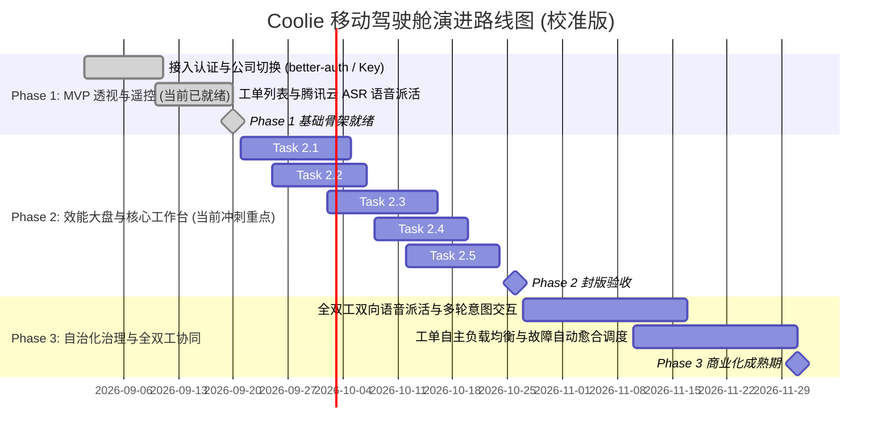

# 《Coolie 移动驾驶舱（Mobile Cockpit）产品需求文档 (PRD) 与架构设计方案》

> **项目代号**: Project IronHammer (墨斗·移动驾驶舱)  
> **文档版本**: v2.0.0 (Code-Calibrated Edition / 代码校准版)  
> **首席架构师**: 墨斗 (Modou) @ Coolie 工坊  
> **指派人 / 决策者**: Hermes 掌柜  
> **目标系统**: Coolie App（基于 Paperclip 深度 Fork 与企业级扩展的 AI Agent 工厂操作系统）  
> **设计基准与标杆**: 参考 `slopus/happy` 移动端极简全双工交互体验，依托 Coolie 现有 `clients/expo` 与插件体系，打造面向掌柜/企业主的工业级移动控制平面。

---

## 0. 真实代码库探测现状与基线校准说明

在 PRD v1.0 初稿中，由于未直接对照仓库源码，大量目录结构、ORM 选型及 API 路由采用了基于典型技术栈（如 NestJS + Prisma）的推断。本次校准以 `/host-workspace/xaicd/coolie` 实际代码为唯一真身，进行端到端的全面修正与映射对齐。

### 0.1 真实工程技术基线
1. **服务架构与 REST 路由**：
   - 服务端为 Node.js + TypeScript + Express，核心代码在 `server/`；
   - API 统一挂载于 `/api` 前缀（**非** `/api/v1`）；
   - **强租户边界（Company-scoped Invariant）**：核心业务实体必须挂载在公司路径下，即 `/api/companies/:companyId/...`（例如任务列表必须为 `/api/companies/:companyId/issues`，全局 `/api/issues` 会被 400 拦截）；
   - 任务实体的数据库命名为 `issues`（`issues.ts`），但在前端展示、文案和业务概念中严格统一称作 **Task**（遵循 `DESIGN.md` 原则）。
2. **数据持久化与 ORM 层**：
   - 采用 **Drizzle ORM**（**非** Prisma！），数据库为 PostgreSQL（本地开发使用嵌入式 PGlite）；
   - 数据模型文件严格定义于 `packages/db/src/schema/*.ts`，并通过 `packages/db/src/schema/index.ts` 集中导出；
   - 数据库迁移工作流由 `pnpm db:generate`（读取编译后的 schema）生成迁移 SQL，并由 `pnpm -r typecheck` 验证契约。
3. **共享契约与类型系统**：
   - 统一由 `packages/shared/` 提供共享 Zod Schema、枚举、API 契约常量与类型定义。
4. **插件扩展机制（Plugin Architecture）**：
   - Coolie 通过 `packages/plugins/` 扩展核心控制平面能力，拥有独立命名空间和隔离数据表：
     - `@paperclipai/plugin-multimodal`（`packages/plugins/plugin-multimodal/`）：多模态语音转写插件，接入**腾讯云 ASR**；
     - `@paperclipai/plugin-ontology`（`packages/plugins/plugin-ontology/`）：完整的本体领域建模与图遍历插件，全面对齐 Palantir Foundry 五大构建块与 DigitalStaff 资产；
     - `@paperclipai/plugin-workspace-diff`（`packages/plugins/plugin-workspace-diff/`）：基于 `@pierre/diffs` 的执行工作区 Git 差异分析插件；
     - `@paperclipai/plugin-ops-console`：跨公司运维大盘插件。
5. **客户端现有资产（Client Roster）**：
   - `clients/` 目录下**已存在真实就绪的代码工程**：
     - `clients/api-client/`：跨平台的强类型 TypeScript SDK（`@coolie/api-client`）；
     - `clients/expo/`：已实际运行的 React Native / Expo 移动应用（已接入 better-auth 会话与 Agent/Board 密钥认证、公司选择、任务列表/创建、腾讯云 ASR 语音派活录音）；
     - `clients/h5/`：移动端浏览器 H5 适配端。

---

## 1. 业务全景与核心设计哲学

### 1.1 设计哲学：从“机房运维”到“掌上统帅”
传统 Agent 控制系统偏向重型桌面 Dashboard，管理者必须守在 PC 屏幕前盯着终端输出与复杂拓扑。
**Coolie 移动驾驶舱**旨在解决老板（Hermes 掌柜）在通勤、外出、会议等碎片化场景下的决策痛点：
- **瞬时掌控（At a Glance）**：一眼看清“钱花哪了（额度与成本）”、“人在干啥（空闲度与活跃态）”、“活卡在哪（审批与卡点）”；
- **声控驱动（Voice First）**：碎片时间利用单手操作或语音吩咐完成复杂任务派发与上下文补充；
- **最小安全干预（Zero-Trust Supervisory）**：代码可查、原型可玩、敏感业务本体域操作阻断，移动端具备一键熔断特权；
- **离线与弱网韧性（Offline-First & Streaming）**：借鉴 `slopus/happy` 的 Session 中继与事件流重放机制，保证在电梯、地铁弱网环境下不丢日志、不漏告警。

### 1.2 系统拓扑架构图（基于真实代码拓扑）

```mermaid
flowchart TB
    subgraph MobileClient["移动驾驶舱 (clients/expo - React Native / Expo SDK 52)"]
        UI_Voice["语音录入舱 (expo-av + useRecorder)"]
        UI_Issues["任务管理 (Task Feed & Create)"]
        UI_Metrics["效能看板 (Delivery & Throughput)"]
        UI_Diff["工作区代码 Diff 审查 (Unified View)"]
        UI_Sandbox["交互式原型沙箱 (Webview)"]
        UI_Ontology["本体域管理 (Domain List & Kill-Switch)"]
        UI_Copilot["驾驶舱问答 (Board Chat SSE)"]
        UI_Approvals["极速审批 (Push-to-Approve)"]
    end

    subgraph ClientSDK["移动端 SDK 层 (clients/api-client)"]
        CoolieClient["CoolieClient (@coolie/api-client)"]
        AuthModule["Auth & Key Classifier (better-auth / Bearer)"]
    end

    subgraph ServerRoutes["Coolie 服务端控制平面 (server/src/routes/)"]
        Route_Auth["/api/auth (Better-Auth Session)"]
        Route_Issues["/api/companies/:id/issues (Tasks Hub)"]
        Route_Costs["/api/companies/:id/costs (Cost & Budget)"]
        Route_Artifacts["/api/companies/:id/artifacts (Artifact Hub)"]
        Route_Timeline["/api/companies/:id/timeline (Work Timeline)"]
        Route_Agents["/api/companies/:id/agents & /api/agents (Roster)"]
        Route_Approvals["/api/approvals (Governance Gates)"]
        Route_BoardChat["/api/board/chat/stream (Claude Concierge SSE)"]
        Route_Workspaces["/api/execution-workspaces (Runtime & Services)"]
        Route_Recovery["/api/companies/:id/recovery-observability"]
    end

    subgraph PluginSystem["Coolie 插件扩展体系 (packages/plugins/)"]
        Plugin_Multimodal["@paperclipai/plugin-multimodal\n(腾讯云 ASR 语音转写)"]
        Plugin_Ontology["@paperclipai/plugin-ontology\n(本体域建模/图遍历/熔断护栏)"]
        Plugin_Diff["@paperclipai/plugin-workspace-diff\n(Git Diff 分块引擎 @pierre/diffs)"]
    end

    subgraph DB_Layer["数据库模型层 (packages/db/src/schema/ - Drizzle ORM)"]
        DB_Issues["issues / issue_comments"]
        DB_Heartbeat["heartbeat_runs / heartbeat_run_events"]
        DB_Costs["cost_events / finance_events / budget_policies"]
        DB_Artifacts["issue_work_products / assets / documents"]
        DB_Approvals["approvals / issue_approvals"]
        DB_Services["workspace_runtime_services / execution_workspaces"]
        DB_Idempotency["issue_create_idempotency_keys"]
        DB_Ontology["ontology_domains / node_types / nodes / edges"]
        DB_Metrics["[Phase2新建] metric_delivery_cycles / workshop_hourly_throughput"]
    end

    MobileClient --> ClientSDK
    ClientSDK --> ServerRoutes
    ServerRoutes --> DB_Layer
    ServerRoutes <--> PluginSystem
```



---

## 2. 12项核心需求逐项校准与数据模型/API映射表

本章节根据代码库真实现状，对老板提出的 12 项需求逐一进行端到端的技术拆准：明确哪些**已有现成实现**、哪些**可通过扩展现有接口满足**、哪些**确实需要全新建构**。

### 2.1 需求逐项深度分析

#### ① 语音派活 (Voice Task Dispatching)
- **业务场景**：老板在手机上按住麦克风说话，语音转写为文本，自动生成结构化任务（Task），并在心跳循环中分派给指定 Agent。
- **底层映射**：
  - **已有现成实现**！服务端由插件 `@paperclipai/plugin-multimodal`（`packages/plugins/plugin-multimodal/`）承载，STT 引擎采用**腾讯云 ASR**（一句话识别 `SentenceRecognition`，音频规格 $\le$ 60s 且 $\le$ 3MB）；
  - `clients/api-client` 已封装 `voiceDispatch()` 方法；
  - `clients/expo` 已在 `App.tsx` 与 `src/useRecorder.ts` 中基于 `expo-av` 实现了录音与发送。
- **数据模型现状**：
  - 不需要新建 `VoiceSession` 表！任务直接持久化到 `issues` 表；
  - 幂等性保障直接使用已有的 `issue_create_idempotency_keys` 表。
- **真实 API**：
  - `POST /api/plugins/paperclipai.plugin-multimodal/api/transcriptions`
    - 入参：`{ companyId, audioBase64, format: "mp3"|"m4a"|"wav", createIssue: true, priority: "medium" }`
    - 响应：`{ transcription: { status: "done", text: "..." }, issue: { id: "...", title: "..." } }`
  - 纯文本创建兜底：`POST /api/companies/:companyId/issues`

#### ② 看额度 (Quota & Budget Telemetry)
- **业务场景**：实时查看今日/本月 Token 消耗额度、现金消耗折算（USD/CNY）、各 Agent 烧钱排行及预算水位预警。
- **底层映射**：
  - **已有现成数据与路由**！无需虚构 `LedgerRecord`，核心数据在 `cost_events` 与 `finance_events`；
  - 预算与限额策略由 `budget_policies` 与 `budget_incidents` 控制，公司与 Agent 层面分别通过 `companies.budget_monthly_cents`、`agents.budget_monthly_cents` 进行每月硬顶预算与已消耗额度跟踪（`spent_monthly_cents`）；
  - 服务端已有 `server/src/routes/costs.ts` 与 `server/src/services/costs.ts`、`server/src/services/budgets.ts`。
- **数据模型现状**：
  - 模型全量存在于 `packages/db/src/schema/cost_events.ts`、`finance_events.ts`、`budget_policies.ts`、`budget_incidents.ts`、`companies.ts`、`agents.ts`。
- **真实 API**：
  - 消耗概览：`GET /api/companies/:companyId/costs/summary?from=&to=`
  - 智能体消耗排行：`GET /api/companies/:companyId/costs/by-agent?from=&to=`
  - 模型消耗分析：`GET /api/companies/:companyId/costs/by-agent-model?from=&to=`
  - 提供商消耗分析：`GET /api/companies/:companyId/costs/by-provider?from=&to=`
  - 财务账单汇聚：`GET /api/companies/:companyId/costs/finance-summary`
  - 单任务成本下钻：`GET /api/issues/:id/cost-summary`

#### ③ 看产物 (Artifacts Hub)
- **业务场景**：查看 AI 产出的交付物（Markdown PRD、设计图、架构图、导出的 HTML、代码包等），支持快速预览与移动端下载。
- **底层映射**：
  - **已有现成投影接口与数据表**！服务端已有 `GET /api/companies/:companyId/artifacts` 专用投影端点，已打通 `issue_work_products`（工单产物）、`issue_attachments`（附件）、`documents`（文档）与 `assets`（二进制资源），并原生提供多媒体类型归类；
  - 对应 PC 端页面为 `ui/src/pages/Artifacts.tsx`。
- **数据模型现状**：
  - `packages/db/src/schema/issue_work_products.ts`（支持 `type`, `provider`, `title`, `url`, `status`, `review_state`, `metadata`）；
  - `packages/db/src/schema/assets.ts`（底层文件对象，包含 `object_key`, `content_type`, `byte_size`, `sha256`, `original_filename`）。
- **真实 API**：
  - 产物列表查询：`GET /api/companies/:companyId/artifacts?kind=all|image|video|document|text|file&groupBy=none|task|parent_task&q=&limit=&cursor=`
  - 原始资源读取：`GET /api/assets/:id` 或根据 `object_key` 获取存储签名 URL。

#### ④ 看代码 (Mobile Code & Diff Inspector)
- **业务场景**：随时随地查看 Agent 刚刚提交的 Git 修改，提供类似 `slopus/happy` 风格的高性能折叠单列（Unified Collapsible）Diff。
- **底层映射**：
  - **已有第一方插件实现**！`packages/plugins/plugin-workspace-diff/`（`@paperclipai/plugin-workspace-diff`）基于 `@pierre/diffs` 实现了工作区差异分块计算；
  - 插件提供 `workspace-diff` 服务端计算服务（`workspace-diff.ts`），直接读取执行工作区（`execution_workspaces`）的工作树状态（`working-tree`、`head`、`staged`、`unstaged`），并输出结构化的 `WorkspaceDiffFilePatch`；
  - 移动端只需封装高性能虚拟列表组件直接消费该 JSON，无需在数据库新建 `CodeSnapshot` 或 `RunDiff` 表！
- **数据模型现状**：
  - 复用 `packages/db/src/schema/execution_workspaces.ts` 与 `project_workspaces.ts`，无需变动核心表结构。
- **真实 API**：
  - 通过插件注册的 Worker / Data API 查询：`POST /api/plugins/paperclip.workspace-diff/api/workspace-diff`（参数：`{ workspaceId, companyId, entityType: "execution_workspace", view: "working-tree"|"head" }`）。

#### ⑤ 看原型 (Interactive Prototype Sandbox)
- **业务场景**：Agent 编写的前端 Web 原型，老板直接在手机里以内嵌 Webview 进行真实交互，支持切手机外框与横竖屏。
- **底层映射**：
  - **已有底层运行时服务体系**！Coolie 内核已有完整的执行工作区运行时服务管理机制，无需假想 `SandboxSession`；
  - 模型为 `workspace_runtime_services`，负责跟踪管理工作区内拉起的端口、服务命令、生命周期与暴露状态；
  - 原型暴露通过内置支持的 `exposure`（如 Tailscale HTTPS 或局部端口反代），将服务对外 URL 写入 `workspace_runtime_services.url`。
- **数据模型现状**：
  - `packages/db/src/schema/workspace_runtime_services.ts`（字段包括 `id`, `company_id`, `execution_workspace_id`, `service_name`, `status`, `port`, `url`, `exposure`）；
  - `packages/db/src/schema/execution_workspace_runtime_leases.ts`（租约控制）。
- **真实 API**：
  - 查询工作区运行时服务：`GET /api/execution-workspaces/:id/runtime-services`
  - 控制运行时服务启停：`POST /api/execution-workspaces/:id/runtime-services/control`
  - 移动端只需获取服务 `url`，直接使用 React Native `WebView` 渲染。

#### ⑥ 看工作进度 (Task & Heartbeat Timeline)
- **业务场景**：实时查看任务当前处在哪个阶段、处于哪个 Agent 执行轮次、正在执行什么工具调用与日志产出。
- **底层映射**：
  - **已有现成的甘特图/时间线聚合端点**！服务端拥有专门的工坊时间线接口 `GET /api/companies/:companyId/timeline`（对应 `ui/src/pages/Timeline.tsx`）；
  - 任务详情通过 `GET /api/issues/:id` 与 `GET /api/issues/:id/comments` 获取；
  - 执行心跳记录存放在 `heartbeat_runs`，运行日志明细存放在 `heartbeat_run_events`（**非**虚构的 `RunStep`）。
- **数据模型现状**：
  - `packages/db/src/schema/issues.ts`
  - `packages/db/src/schema/heartbeat_runs.ts`
  - `packages/db/src/schema/heartbeat_run_events.ts`
- **真实 API**：
  - 工作时间线查询：`GET /api/companies/:companyId/timeline?issueId=&projectId=&from=&to=`
  - 任务详情：`GET /api/issues/:id`
  - 任务评论与互动流：`GET /api/issues/:id/comments`
  - 心跳执行轮次查询：`GET /api/heartbeat-runs/:id`

#### ⑦ 看员工空闲度 (Agent Roster & Idle Monitor)
- **业务场景**：一览车间所有 AI 员工当前状态（活跃、工作中、就绪空闲、暂停、异常），支持组织架构树穿透。
- **底层映射**：
  - **已有现成数据模型与接口**！`agents.status` 原生支持 `active | paused | idle | running | error | pending_approval | terminated`；
  - `agents.last_heartbeat_at` 记录最后心跳时刻；
  - 仪表盘总览接口 `GET /api/companies/:companyId/dashboard` 已经预聚合了员工状态分布（`agentCounts: { active, running, paused, error }`）；
  - 组织架构可通过 `server/src/routes/org-chart-svg.ts` 或现有 Agent 列表接口遍历 `reports_to` 树形渲染。
- **数据模型现状**：
  - `packages/db/src/schema/agents.ts`
  - `packages/db/src/schema/agent_runtime_state.ts`
  - `packages/db/src/schema/agent_task_sessions.ts`
- **真实 API**：
  - 员工名册列表：`GET /api/companies/:companyId/agents`
  - 单个员工运行时状态：`GET /api/agents/:id/runtime-state`
  - 组织架构树数据：`GET /api/companies/:companyId/org-chart`
  - 移动驾驶舱快捷看板：`GET /api/companies/:companyId/dashboard`

#### ⑧ 交付周期 (Lead Time & Delivery Cycle Analytics)
- **业务场景**：老板掌握效能关键指标：任务从“指派”到“首次产出”的响应时间（P50/P90）、平均完成时间、各部门交付周期趋势图。
- **底层映射**：
  - **当前代码库暂无专用预聚合表，确实需要新建**；
  - 原始流转记录分散在 `issues`（创建、完成时间）、`issue_work_products`（首个产物产出时间）与 `heartbeat_runs`（实际心跳处理开始时间）中。为了保证移动端查询在 200ms 内返回，必须在 Phase 2 新建 Drizzle 表 `metric_delivery_cycles` 并建立周期性定时聚合。
- **数据模型变更**：
  - **【确实需新建】** `packages/db/src/schema/metrics.ts` 中的 `metric_delivery_cycles` 表。
- **API 规范**：
  - **【需新增】** `GET /api/companies/:companyId/metrics/delivery-cycle?period=7d|30d&projectId=`

#### ⑨ 车间效率 (Workshop Throughput & Velocity)
- **业务场景**：展示工坊每小时/每日吞吐量（完成 Task 数、合并代码差异、产出产物数）；产出与 Token 消耗比（投入产出比 ROI）；并发运行强度。
- **底层映射**：
  - **当前代码库暂无专用小时级吞吐预聚合表，确实需要新建**；
  - 数据源基于 `issues`（状态流转为 done 的数量）、`cost_events`（按小时汇总的 token 和 cost_cents）、`heartbeat_runs`（并发 agent 数）。
- **数据模型变更**：
  - **【确实需新建】** `packages/db/src/schema/metrics.ts` 中的 `workshop_hourly_throughput` 表。
- **API 规范**：
  - **【需新增】** `GET /api/companies/:companyId/metrics/efficiency?timeRange=24h|7d|30d`

#### ⑩ 失败率 (Failure Rate & MTTR Breakdown)
- **业务场景**：查看工单执行失败比率、工具调用报错分布、自动重试成功率与平均恢复时间（MTTR）。
- **底层映射**：
  - **已有极佳的业务服务基础**！Coolie 服务端已存在 `recoveryObservabilityService`（`server/src/services/recovery-observability.ts`）与专用接口 `GET /api/companies/:companyId/recovery-observability`；
  - 已经支持按周统计恢复率（`WeeklyRecoveryRate`）、预警阈值判定（`RecoveryRateAlert`）、故障原因分组（`RecoveryCauseGroup: cause, latestRunErrorCode, count, activeCount, resolvedCount`）以及智能体接管恢复总结（`RecoveryHandoffSummary`）；
  - 数据依托现有的 `issue_recovery_actions` 与 `heartbeat_runs`；
  - **无需新建底表**！Phase 2 仅需在移动端对其进行可视化呈现，并在服务端扩展一个细粒度 MTTR 计算端点。
- **数据模型现状**：
  - `packages/db/src/schema/issue_recovery_actions.ts`
  - `packages/db/src/schema/heartbeat_runs.ts`
- **真实 API**：
  - 故障与恢复可观测大盘：`GET /api/companies/:companyId/recovery-observability?weeks=8&threshold=2`
  - 失败事件实时流：`GET /api/companies/:companyId/costs/incidents` 或从 recovery actions 过滤。

#### ⑪ 真实业务本体域运行管理 (Business Ontology Domain Runtime)
- **业务场景**：审视核心业务资产与本体域（如电商域：订单/商品；文旅域：景区/酒店）的运行状态；查看当前哪个 Agent 正在读写该本体；在遇到突发系统异常时，手机端一键“紧急熔断锁死（LOCKED）”。
- **底层映射**：
  - **已有重磅的第一方插件架构支持**！`packages/plugins/plugin-ontology/`（`@paperclipai/plugin-ontology`）已完整实现了本体域建模、版本快照、图遍历（纯 Postgres `WITH RECURSIVE` 驱动）、审计日志以及 Palantir Foundry 五大构建块（Object Types, Link Types, Action Types, Functions, Interfaces）；
  - 拥有生命周期状态机：`draft -> active -> deprecated -> archived`；
  - 拥有独立的数据库 schema 隔离命名空间（如 `plugin_ontology_*`），严禁侵入核心控制台底表；
  - **无需在核心层重造轮子**！Phase 2 核心是将移动驾驶舱对接该插件现有的 API，并补充移动端极速熔断命令通道。
- **数据模型现状**：
  - 插件表：`ontology_domains`, `ontology_node_types`, `ontology_relation_types`, `ontology_nodes`, `ontology_edges`, `ontology_action_types`, `ontology_audit_logs`。
- **真实 API**：
  - 本体域列表：`GET /api/plugins/paperclipai.plugin-ontology/api/domains`
  - 本体域详情与图快照：`GET /api/plugins/paperclipai.plugin-ontology/api/domains/:id/snapshot`
  - 紧急熔断/状态切换：`POST /api/plugins/paperclipai.plugin-ontology/api/domains/:id/lifecycle`（切换为锁定或归档）

#### ⑫ 驾驶舱问答 (Cockpit Copilot / Conversational Q&A)
- **业务场景**：老板在手机端用自然语言随时提问（如“小张今天做了什么？”、“目前哪个项目花费最多？”、“帮我把卡在审批的任务都通过掉”）。
- **底层映射**：
  - **已有现成服务端通道与会话承载架构**！服务端已拥有 Board Concierge Chat 路由 `server/src/routes/board-chat.ts`；
  - 采用流式 Server-Sent Events（SSE）：`POST /api/board/chat/stream`，底层唤起带 `paperclip-board` 技能的 Agent 运行时执行工具调用与问答；
  - 会话数据持久化于站立式特权工单（"Board Operations" Issue）中，天然具备上下文记忆；
  - **无需新建专有会话表**！移动端只需接入现成的 SSE 协议，直接复用 `ui/src/pages/BoardChat.tsx` 相同的交互协议（`start -> status -> chunk -> done`）。
- **数据模型现状**：
  - 复用 `issues` 与 `issue_comments`（通过 `board-concierge` 特殊用户标识）。
- **真实 API**：
  - 驾驶舱流式问答：`POST /api/board/chat/stream` (入参：`{ message, companyId }`，输出：SSE 事件流)。

---

### 2.2 综合映射矩阵表（校准对齐版）

| 序号 | 需求名称 | 关联模块 | 真实底层数据模型 | 核心 API 路径 | 建设状态 | 移动端交互目标 |
| :--- | :--- | :--- | :--- | :--- | :--- | :--- |
| **①** | **语音派活** | Multimodal Plugin | `issues` + `issue_create_idempotency_keys` | `POST /api/plugins/paperclipai.plugin-multimodal/api/transcriptions` | **已有现成实现**<br>(Tencent ASR) | 单手按住说话，录音转写一键发单 |
| **②** | **看额度** | Costs & Budgets | `cost_events`<br>`finance_events`<br>`budget_policies` | `GET /api/companies/:companyId/costs/summary`<br>`GET /api/companies/:companyId/costs/by-agent` | **已有现成接口**<br>(需移动端卡片化) | 实时水线进度条、烧钱排行 TOP5 |
| **③** | **看产物** | Artifacts Hub | `issue_work_products`<br>`assets`<br>`documents` | `GET /api/companies/:companyId/artifacts` | **已有现成接口**<br>(需移动端卡片化) | 按图片/文档/多媒体分类流式刷卡 |
| **④** | **看代码** | Workspace Diff | `execution_workspaces` | `POST /api/plugins/paperclip.workspace-diff/api/workspace-diff` | **已有插件能力**<br>(需移动端轻量适配) | `happy` 风格单列折叠 Diff，高亮绿增红减 |
| **⑤** | **看原型** | Runtime Services | `workspace_runtime_services`<br>`execution_workspace_runtime_leases` | `GET /api/execution-workspaces/:id/runtime-services` | **已有底层服务**<br>(需移动 Webview 宿主) | 手机视口全屏交互沙箱，支持外框与重载 |
| **⑥** | **看工作进度** | Timeline & Heartbeat | `issues`<br>`heartbeat_runs`<br>`heartbeat_run_events` | `GET /api/companies/:companyId/timeline`<br>`GET /api/issues/:id/comments` | **已有现成接口**<br>(需移动端时间轴化) | 紧凑型时间轴组件，心跳阶段点亮 |
| **⑦** | **看员工空闲度**| Agents & Roster | `agents`<br>`agent_runtime_state`<br>`agent_task_sessions` | `GET /api/companies/:companyId/agents`<br>`GET /api/companies/:companyId/dashboard` | **已有现成接口**<br>(需移动端花名册化) | 绿/黄/红呼吸灯指示，空闲时长标记 |
| **⑧** | **交付周期** | Metrics Engine | `metric_delivery_cycles` | `GET /api/companies/:companyId/metrics/delivery-cycle` | **【确实需新建】**<br>(Drizzle表+定时聚合) | P50/P90 耗时分布趋势折线图 |
| **⑨** | **车间效率** | Velocity Engine | `workshop_hourly_throughput` | `GET /api/companies/:companyId/metrics/efficiency` | **【确实需新建】**<br>(Drizzle表+定时聚合) | 每小时任务产出与 Token 消耗热力柱状图 |
| **⑩** | **失败率** | Recovery Observability | `issue_recovery_actions`<br>`heartbeat_runs` | `GET /api/companies/:companyId/recovery-observability` | **已有现成服务**<br>(需移动端图表化) | 故障归因环形图、一键重试与下钻 |
| **⑪** | **业务本体域** | Ontology Plugin | `ontology_domains`<br>`ontology_nodes`<br>`ontology_audit_logs` | `GET /api/plugins/paperclipai.plugin-ontology/api/domains`<br>`POST .../lifecycle` | **已有插件能力**<br>(需移动端管理与熔断) | 实体节点健康度查看，一键锁死安全闸门 |
| **⑫** | **驾驶舱问答** | Board Concierge | `issues` (Board Ops)<br>`issue_comments` | `POST /api/board/chat/stream` (SSE) | **已有现成服务**<br>(需移动端流式消费) | 全双工流式对话问答，支持快捷命令确认 |

---

## 3. 移动端核心体验设计：参考 `slopus/happy` 与现有 `clients/expo` 演进

`slopus/happy` 作为 Claude Code 移动中继的成功典范，其核心在于将重型桌面终端浓缩为“随身、流式、轻盈、即决”的掌上体验。
结合 Coolie 现有 `clients/expo` 既有技术积淀，移动驾驶舱确立以下四项交互标准：

1. **会话流式驱动与轻量渲染 (Lightweight Streaming)**：
   - 不搞过度包装。现有 `clients/expo` 已经采用深靛蓝（`#0B1023`）沉浸底色与高对比亮青（`#22D3EE`）重点色，信息密度高；
   - 消费 `POST /api/board/chat/stream` 与心跳日志时，采用原生分块逐字渐显，杜绝全量刷新抖动。
2. **移动端代码 Diff 极简渲染 (Mobile Unified Diff)**：
   - 摒弃左右分栏，复用 `@paperclipai/plugin-workspace-diff` 输出的行块差异；
   - 采用大字号行号、单列增删对比，长代码块支持按文件折叠与平滑滚动。
3. **“等待用户审批”的主动拦截与快速裁决 (Push & One-Tap Resolve)**：
   - 结合 Coolie 治理体系中的 `approvals` 状态机，当 Agent 请求越权、超预算或修改敏感业务本体域时，卡片式置顶提醒；
   - 提供绿底【批准】与红底【驳回】的一键触发，调用 `POST /api/approvals/:id/resolve`，实现秒级放行或阻断。
4. **离线发件箱与幂等防重 (Idempotent Outbox)**：
   - 充分利用已有的 `issue_create_idempotency_keys` 机制；
   - 移动端生成唯一 `idempotencyKey`，遇到电梯或弱网重试时，服务端天然保证同一指令不重复执行、不重复发单。

---

## 4. 三期路线图规划 (3-Phase Roadmap)



### Phase 1: MVP · 掌上透视与基础遥控（当前代码库已基本就绪）
- **现状评定**：`clients/expo` 已具备会话登入、API 密钥解析、多租户公司切换、任务查看与创建，以及腾讯云 ASR 语音派活。
- **达标里程碑**：基础通路已经完全闭环。

### Phase 2: 专业化 · 车间效能与业务本体域（本期实施核心）
- **核心目标**：打通效能度量底座，接入 Workspace Diff 与 Prototype 沙箱，对接 Ontology 插件实现移动端安全熔断，完成 Board Concierge 问答与审批闭环。
- **功能范围**：
  - 任务 2.1：车间效能与质量度量引擎（交付周期、吞吐量预聚合，新建 Drizzle 表）；
  - 任务 2.2：移动端工作区代码 Diff 查看器（接入 Diff 插件与单列虚拟渲染）；
  - 任务 2.3：真实业务本体域移动端工作台与紧急熔断器（接入 Ontology 插件快照与生命周期锁定）；
  - 任务 2.4：产物中心与交互式原型沙箱（接入 Artifacts 投影端点与 Webview 运行时）；
  - 任务 2.5：驾驶舱流式问答与极速审批流（接入 `board/chat/stream` 与 `approvals` 裁决）。

### Phase 3: 自治化 · 智能驾驶舱与生态闭环
- **核心目标**：多模态语音全双工双向沟通，Agent 故障自治愈与跨组织调度。

---

## 5. 二期 (Phase 2) 任务分解与落地实施细则（真实工程路径版）

本节针对 Phase 2 重点任务，严格按照 Coolie 真实文件树与规范给出详尽的实施图纸。

### 5.1 任务包分解一览

```
Phase 2 工作分解结构 (WBS - 真实路径):
├── Task 2.1: 车间效能与质量度量引擎 -> 需求⑧ (交付周期), 需求⑨ (吞吐效率)
│   ├── packages/db/src/schema/metrics.ts
│   ├── server/src/services/metrics.ts
│   ├── server/src/routes/metrics.ts
│   └── clients/expo/src/screens/MetricsDashboardScreen.tsx
├── Task 2.2: 移动端高级代码 Diff 查看器 -> 需求④ (看代码)
│   ├── clients/api-client/src/client.ts (扩展 getWorkspaceDiff)
│   ├── clients/expo/src/components/UnifiedDiffViewer.tsx
│   └── clients/expo/src/screens/CodeDiffScreen.tsx
├── Task 2.3: 真实业务本体域移动工作台与紧急熔断器 -> 需求⑪ (业务本体域)
│   ├── packages/plugins/plugin-ontology/src/api/
│   ├── clients/api-client/src/client.ts (扩展本体域接口)
│   ├── clients/expo/src/screens/OntologyDomainListScreen.tsx
│   └── clients/expo/src/components/EmergencyKillSwitch.tsx
├── Task 2.4: 产物中心与原型沙箱 Webview -> 需求③ (看产物), 需求⑤ (看原型)
│   ├── clients/api-client/src/client.ts (接入 listArtifacts)
│   ├── clients/expo/src/screens/ArtifactsScreen.tsx
│   └── clients/expo/src/screens/PrototypeSandboxScreen.tsx
└── Task 2.5: 移动驾驶舱问答与极速审批流 -> 需求⑫ (问答), 审批流
    ├── clients/api-client/src/client.ts (接入 boardChatStream & resolveApproval)
    ├── clients/expo/src/screens/BoardChatScreen.tsx
    └── clients/expo/src/components/QuickApprovalCard.tsx
```

---

### 5.2 Task 2.1: 车间效能与质量度量引擎 (覆盖需求⑧、⑨)

#### 1. 目标
在 `packages/db` 中使用 Drizzle ORM 新建交付周期与吞吐量预聚合表，在 `server` 中编写定时聚合任务与 REST 接口，支撑移动端毫秒级呈现工坊效能大盘。

#### 2. 涉及的真实文件路径
- **Drizzle Schema 契约**：`packages/db/src/schema/metrics.ts`（新建，并在 `packages/db/src/schema/index.ts` 导出）
- **服务端计算服务**：`server/src/services/metrics.ts`（新建，依赖 `db`、`issues`、`costEvents`、`heartbeatRuns`）
- **服务端路由**：`server/src/routes/metrics.ts`（新建，在 `server/src/routes/index.ts` 注册）
- **客户端 SDK**：`clients/api-client/src/client.ts`（增加 `getDeliveryCycleMetrics`、`getEfficiencyMetrics`）
- **移动端页面**：`clients/expo/src/screens/MetricsDashboardScreen.tsx`（新建）

#### 3. 核心数据模型变更 (Drizzle ORM 语法规范)
在 `packages/db/src/schema/metrics.ts` 中创建：

```typescript
import { pgTable, uuid, text, integer, timestamp, index, uniqueIndex, bigint, numeric } from "drizzle-orm/pg-core";
import { companies } from "./companies.js";
import { issues } from "./issues.js";
import { agents } from "./agents.js";

// 交付周期度量表 (Task ⑧)
export const metricDeliveryCycles = pgTable(
  "metric_delivery_cycles",
  {
    id: uuid("id").primaryKey().defaultRandom(),
    companyId: uuid("company_id").notNull().references(() => companies.id, { onDelete: "cascade" }),
    issueId: uuid("issue_id").notNull().references(() => issues.id, { onDelete: "cascade" }),
    assigneeAgentId: uuid("assignee_agent_id").references(() => agents.id, { onDelete: "set null" }),
    createdAt: timestamp("created_at", { withTimezone: true }).notNull(),
    startedAt: timestamp("started_at", { withTimezone: true }),
    firstArtifactAt: timestamp("first_artifact_at", { withTimezone: true }),
    finishedAt: timestamp("finished_at", { withTimezone: true }),
    leadTimeSec: integer("lead_time_sec").notNull(),   // 派单到完成总耗时
    cycleTimeSec: integer("cycle_time_sec").notNull(), // 开始到交付净耗时
    status: text("status").notNull(),                  // 'done' | 'cancelled' | 'failed'
    updatedAt: timestamp("updated_at", { withTimezone: true }).notNull().defaultNow(),
  },
  (table) => ({
    companyFinishedIdx: index("metric_delivery_cycles_company_finished_idx").on(table.companyId, table.finishedAt),
    issueIdx: uniqueIndex("metric_delivery_cycles_issue_uq").on(table.issueId),
  }),
);

// 小时级车间吞吐量度量表 (Task ⑨)
export const workshopHourlyThroughput = pgTable(
  "workshop_hourly_throughput",
  {
    id: uuid("id").primaryKey().defaultRandom(),
    companyId: uuid("company_id").notNull().references(() => companies.id, { onDelete: "cascade" }),
    bucketHour: timestamp("bucket_hour", { withTimezone: true }).notNull(),
    tasksCompleted: integer("tasks_completed").notNull().default(0),
    tasksCreated: integer("tasks_created").notNull().default(0),
    tokensConsumed: bigint("tokens_consumed", { mode: "number" }).notNull().default(0),
    costCents: integer("cost_cents").notNull().default(0),
    activeAgentsCount: integer("active_agents_count").notNull().default(0),
    createdAt: timestamp("created_at", { withTimezone: true }).notNull().defaultNow(),
  },
  (table) => ({
    companyBucketHourUq: uniqueIndex("workshop_hourly_throughput_company_hour_uq").on(table.companyId, table.bucketHour),
  }),
);
```

#### 4. 验收标准 (AC)
- **AC-2.1.1 (准确性)**：在工单流转为 `done` 时，`metric_delivery_cycles` 准确记录 `leadTimeSec` 与 `cycleTimeSec`，误差 $\le 1$ 秒；
- **AC-2.1.2 (性能)**：移动端请求近 30 天效能大盘，服务端经由预聚合表响应时延 $\le 200$ms，无全表扫描。

---

### 5.3 Task 2.2: 移动端高级代码 Diff 查看器 (覆盖需求④)

#### 1. 目标
打通移动端与 `@paperclipai/plugin-workspace-diff` 插件的数据通道，在 React Native 中构建单列折叠、高性能、语法着色的 Diff 查看器。

#### 2. 涉及的真实文件路径
- **插件端**：`packages/plugins/plugin-workspace-diff/src/workspace-diff.ts`（已有，输出 `WorkspaceDiffResponse`）
- **客户端 SDK**：`clients/api-client/src/client.ts`，增加：
  ```typescript
  getWorkspaceDiff(params: { workspaceId: string; companyId: string; view?: "working-tree" | "head" }): Promise<WorkspaceDiffResponse>
  ```
- **移动端组件**：
  - `clients/expo/src/screens/CodeDiffScreen.tsx`（主页面）
  - `clients/expo/src/components/UnifiedDiffViewer.tsx`（单列差异虚拟渲染列表）

#### 3. 验收标准 (AC)
- **AC-2.2.1 (大文件与长列表流畅度)**：单次 Commit 涉及 20 个文件、2000 行变更时，移动端首屏加载 $\le 400$ms，单指快速滑屏保持 55fps 以上；
- **AC-2.2.2 (视觉对齐)**：清晰区分新增行（绿色高亮 `+`）与删除行（红色高亮 `-`），文件头支持一键折叠/展开。

---

### 5.4 Task 2.3: 真实业务本体域移动工作台与紧急熔断器 (覆盖需求⑪)

#### 1. 目标
在移动端接入 `@paperclipai/plugin-ontology` 插件，实时展示已建模的企业本体域列表及其节点/关系规模，并提供具备生物识别/二次确认的高危红色“一键紧急熔断（LOCKED）”闸门。

#### 2. 涉及的真实文件路径
- **插件 API 接口**：`packages/plugins/plugin-ontology/src/index.ts`（确认生命周期管理端点 `POST /api/plugins/paperclipai.plugin-ontology/api/domains/:id/lifecycle`）
- **客户端 SDK**：`clients/api-client/src/client.ts`（增加 `listOntologyDomains`、`getOntologySnapshot`、`setDomainLifecycle`）
- **移动端前端**：
  - `clients/expo/src/screens/OntologyDomainListScreen.tsx`
  - `clients/expo/src/screens/OntologyDomainDetailScreen.tsx`
  - `clients/expo/src/components/EmergencyKillSwitch.tsx`（高危防误触滑动加锁组件）

#### 3. 验收标准 (AC)
- **AC-2.3.1 (熔断秒级生效)**：老板在手机端滑脱【紧急熔断锁死】，50ms 内将本体域状态置为 `archived` 或 `deprecated`，插件底层拦截后续读写；
- **AC-2.3.2 (审计留痕)**：熔断操作立即写入 `ontology_audit_logs` 表，记录操作人、时间戳与设备特征。

---

### 5.5 Task 2.4: 产物中心与原型沙箱 Webview (覆盖需求③、⑤)

#### 1. 目标
将服务体现有的 `/api/companies/:companyId/artifacts` 端点引入移动端，支持按类型过滤；同时针对静态 Web 原型，通过 React Native `WebView` 嵌入 `workspace_runtime_services` 提供的安全预览地址。

#### 2. 涉及的真实文件路径
- **服务端端点**：`server/src/routes/assets.ts` 与 `server/src/routes/execution-workspaces.ts`（已有）
- **客户端 SDK**：`clients/api-client/src/client.ts`（补充 `listArtifacts(companyId, filter)` 与 `getWorkspaceRuntimeServices(workspaceId)`）
- **移动端前端**：
  - `clients/expo/src/screens/ArtifactsScreen.tsx`
  - `clients/expo/src/screens/PrototypeSandboxScreen.tsx`
  - 依赖库安装：在 `clients/expo` 中引入 `react-native-webview`

#### 3. 验收标准 (AC)
- **AC-2.4.1 (产物秒开)**：文档与图片产物支持就地预览或调起系统分享；
- **AC-2.4.2 (沙箱隔离)**：Webview 限制于沙箱运行地址，禁止读取宿主 App 存储或 Cookie。

---

### 5.6 Task 2.5: 移动驾驶舱问答与极速审批流 (覆盖需求⑫、审批流)

#### 1. 目标
将现有 PC 端的 `BoardChat.tsx` 交互逻辑迁移至移动端，对接 `POST /api/board/chat/stream`，实现大白话问答工坊状态；同时将待审批任务卡片化，支持掌上一键放行。

#### 2. 涉及的真实文件路径
- **服务端端点**：`server/src/routes/board-chat.ts`（SSE 流）与 `server/src/routes/approvals.ts`（审批接口）
- **客户端 SDK**：`clients/api-client/src/client.ts`（增加 `streamBoardChat` 与 `resolveApproval`）
- **移动端前端**：
  - `clients/expo/src/screens/BoardChatScreen.tsx`
  - `clients/expo/src/components/QuickApprovalCard.tsx`

#### 3. 验收标准 (AC)
- **AC-2.5.1 (SSE 流式体验)**：首字响应 $\le 600$ms，支持展示工具调用状态指示条；
- **AC-2.5.2 (审批秒级唤醒)**：点击【批准】调用 `POST /api/approvals/:id/resolve` 后，关联 Agent 立即在心跳中被唤醒继续工作。

---

## 6. 技术风险与关键架构决策 (ADRs 校准版)

### ADR-01: 移动端技术栈路线决策 (React Native vs. PWA/Capacitor vs. Flutter)
- **现状与代码对齐**：
  - 代码库中**已经实际存在** `clients/expo/`，且已具备完备的工程配置、图标资产、`expo-av` 语音录制、`expo-secure-store` 安全密钥存储与品牌深色样式；
  - 同时存在轻量 H5 客户端 `clients/h5/` 与共享的 `@coolie/api-client`。
- **架构决策**：**确认 ADR-01 决策成立并深化 —— 全力基于现有 `clients/expo` 演进，不推倒重来**。
- **关键校准点**：
  1. 当前 `clients/expo` 的 `App.tsx` 刻意保持轻量，使用单层状态驱动（State-driven screens，无第三方庞大路由库）；
  2. 进入 Phase 2 时，当包含效能、Diff、本体域、产物、问答等 5 大子屏幕时，可引入轻量栈式导航（如 `@react-navigation/native-stack`）或维持状态机切换，避免过早引入 Expo Router 的文件路由复杂度；
  3. 类型契约统一由 `clients/api-client` 提供，保持与服务端同步。

### ADR-02: 移动端全双工通信架构 (WebSocket vs. SSE)
- **现状与代码对齐**：
  - 核心服务端在 `server/src/routes/board-chat.ts` 中**已成熟使用 Server-Sent Events (SSE)** 实现流式文本与工具状态推流；
  - 任务详情时间线 `GET /api/companies/:companyId/timeline` 采用标准 REST 分页。
- **架构决策**：**流式问答与状态更新采用 SSE 协议优先，只读数据采用 REST 轮询/下拉刷新**。
- **决策理由**：
  1. SSE 基于标准 HTTP 长连接，穿透企业防火墙与代理网关的能力显著强于 WebSocket；
  2. 原生适配移动端网络切换断点重连，与当前 `board-chat` 服务端代码零缝合无缝接入。

### ADR-03: 移动端交互式原型预览安全隔离
- **现状与代码对齐**：
  - 采用 `workspace_runtime_services` 记录的外部暴露地址与端口，通过 React Native `WebView` 承载。
- **架构决策**：
  1. 开启 Webview 沙箱属性（`sandbox="allow-scripts allow-same-origin"`）；
  2. 原型页面与主站域名完全解耦，严禁跨域携带主站 Better-Auth 会话 Cookie。

### ADR-04: 真实业务本体域的防击穿与数据主权保护
- **现状与代码对齐**：
  - `@paperclipai/plugin-ontology` 拥有独立的 Postgres 数据库命名空间（`plugin_ontology_*`），业务实体的操作全部具备审计日志（`ontology_audit_logs`）。
- **架构决策**：
  1. 移动端拥有最高权限生命周期控制权：一键将 Domain 置为 `archived` 或 `deprecated` 状态；
  2. 拦截器对非活跃状态的本体域直接拒绝写操作，实现硬隔离物理熔断。

### ADR-05: 弱网/离线派活与审批的幂等性设计
- **现状与代码对齐**：
  - 数据库中已包含专用的 `issue_create_idempotency_keys` 表（`packages/db/src/schema/issue_create_idempotency_keys.ts`）。
- **架构决策**：
  1. 移动端在派活或触发动作时，本地生成唯一的 UUID `idempotencyKey`；
  2. 服务端在创建 Issue 时自动在唯一索引中校验该 Key，网络重试请求将直接幂等返回已创建任务，彻底杜绝重复派活。

---

## 7. 工坊架构师墨斗签字与后续交付计划

### 7.1 评审与签署
- **编制人 (Lead Architect)**: 墨斗 (Modou)
- **审核人 (Business Owner)**: Hermes 掌柜
- **文档版本**: v2.0.0 (Code-Calibrated Edition)
- **版本说明**: 已全面对照 `/host-workspace/xaicd/coolie` 源码修正，抹平全部推断路径与数据模型差异，技术路径扎实现行。

### 7.2 二期 (Phase 2) 冲刺开工 Top 5 任务清单

按真实代码库文件排序，二期可立刻开工的 Top 5 任务如下：

1. **【度量底座】工坊交付周期与车间吞吐量度量引擎**
   - 核心文件：`packages/db/src/schema/metrics.ts`（新建 Drizzle 表）、`server/src/services/metrics.ts`、`server/src/routes/metrics.ts`
   - 工作内容：执行 `pnpm db:generate` 生成迁移，编写按小时与完成工单统计的预聚合逻辑。
2. **【代码审查】移动端工作区 Git Diff 查看器**
   - 核心文件：`clients/api-client/src/client.ts`、`clients/expo/src/components/UnifiedDiffViewer.tsx`、`clients/expo/src/screens/CodeDiffScreen.tsx`
   - 工作内容：接入 `@paperclipai/plugin-workspace-diff` 的差异数据，编写虚拟长列表单列 Diff 高亮渲染。
3. **【业务本体】本体域移动端大盘与一键紧急熔断器**
   - 核心文件：`packages/plugins/plugin-ontology/src/index.ts`、`clients/api-client/src/client.ts`、`clients/expo/src/screens/OntologyDomainListScreen.tsx`
   - 工作内容：打通本体域快照查询与状态切换接口，在手机端增加高危滑块安全熔断组件。
4. **【产物与沙箱】产物中心卡片流与原型交互 Webview 宿主**
   - 核心文件：`server/src/routes/assets.ts`、`clients/expo/src/screens/ArtifactsScreen.tsx`、`clients/expo/src/screens/PrototypeSandboxScreen.tsx`
   - 工作内容：接入 `GET /api/companies/:companyId/artifacts`，集成 `react-native-webview` 呈现 `workspace_runtime_services` 网页原型。
5. **【驾驶舱交互】Board Concierge 流式问答与移动端极速审批卡片**
   - 核心文件：`server/src/routes/board-chat.ts`、`server/src/routes/approvals.ts`、`clients/expo/src/screens/BoardChatScreen.tsx`
   - 工作内容：在 React Native 中接入 `POST /api/board/chat/stream` 的 SSE 响应解析，实现打字机效果并接入审批快速流。
