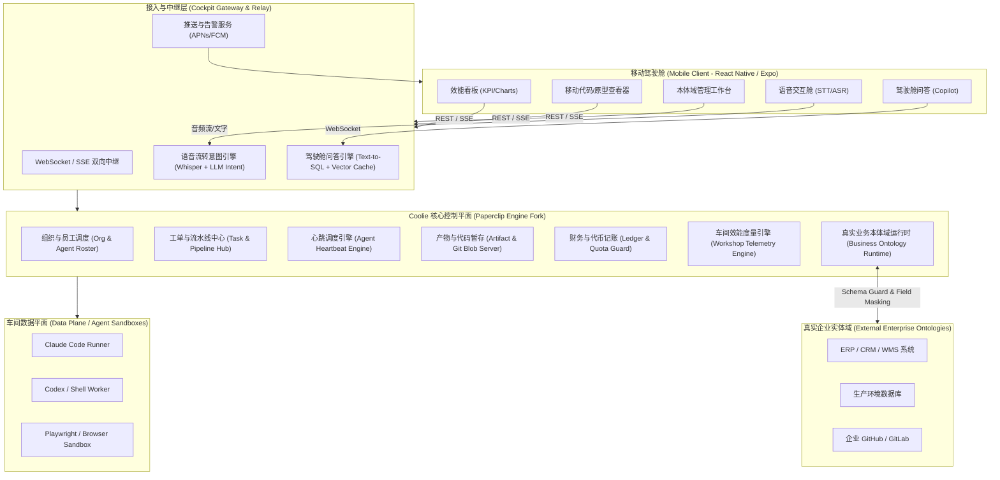
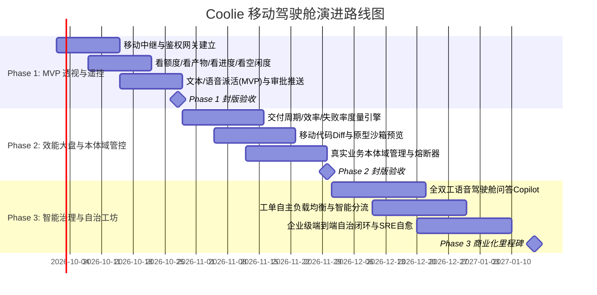

# 《Coolie 移动驾驶舱（Mobile Cockpit）产品需求文档 (PRD) 与架构设计方案》

> **项目代号**: Project IronHammer (墨斗·移动驾驶舱)  
> **文档版本**: v1.0.0 (Release Candidate)  
> **首席架构师**: 墨斗 (Modou) @ Coolie 工坊  
> **指派人 / 决策者**: Hermes 掌柜  
> **目标系统**: Coolie App（基于 Paperclip 控制平面内核的 AI Agent 工厂操作系统）  
> **设计基准与标杆**: 参考 `slopus/happy` 移动端极简全双工交互体验，打造面向掌柜/企业主的工业级 AI Agent 移动控制平面。

---

## 0. 架构探测现状与推演基线说明

1. **环境与代码挂载探测**：
   - 经探测当前执行容器环境：`/root/workspace` 为空共享目录，未挂载 Coolie 源码工作树；
   - 探测发现 `/tmp/coolie-test.js` 中存在通过 Headless Browser 对 `http://host.docker.internal:3100` 进行集成验收测试的痕迹；
   - 判定 Coolie 服务运行于宿主容器网络层。
2. **架构推演基线**：
   - 本方案基于 **Paperclip** 开源 AI Agent 公司控制平面通用架构（Node.js/TypeScript 服务端、Fastify/Express 核心、PostgreSQL+Prisma/Drizzle ORM、React 控制台、Agent 适配器与 Heartbeat 循环模型）；
   - 深度融合 Coolie 工坊的企业级扩展能力（车间生产线流水线、真实业务本体域管理 Runtime）；
   - 对标 **`slopus/happy`**（Claude Code 移动中继客户端）的双向长链接、移动端 Diff 渲染、端到端轻量安全代理与离线通知唤醒机制。

---

## 1. 业务全景与核心设计哲学

### 1.1 设计哲学：从“机房运维”到“掌上统帅”
传统 Paperclip 等 Agent 控制系统偏向重型桌面 Dashboard，管理者必须守在 PC 屏幕前盯着复杂的终端输出与拓扑图。
**Coolie 移动驾驶舱**旨在解决老板（Hermes 掌柜）在通勤、外出、会议等碎片化场景下的决策痛点：
- **瞬时掌控（At a Glance）**：一眼看清“钱花哪了（额度）”、“人在干啥（空闲度）”、“活卡在哪（审批与进度）”；
- **声控驱动（Voice First）**：碎片时间利用单手操作或语音吩咐完成复杂任务派发与上下文补充；
- **最小安全干预（Zero-Trust Supervisory）**：代码可查、原型可玩、敏感本体域操作阻断，移动端具备一键熔断特权；
- **离线与弱网韧性（Offline-First & Streaming）**：借鉴 `slopus/happy` 的 Session 中继与事件流重放机制，保证在电梯、地铁弱网环境下不丢日志、不漏告警。

### 1.2 系统拓扑架构图



---

## 2. 12项核心需求与数据模型/API映射表

本章节对老板提出的 12 项需求逐一进行端到端的技术拆解，明确标出**已有能力（Paperclip自带）**、**需扩展能力（Coolie增量）**与**需全新建构能力（Cockpit移动驾驶舱独有）**。

### 2.1 需求逐项深度分析

#### ① 语音派活 (Voice Task Dispatching)
- **业务场景**：老板按住麦克风输入：“墨斗，让前端小张在2小时内把移动端登录页的SSO接入，关联文旅大客户本体域，预算限制5美元”。
- **处理流**：移动端麦克风采集成 AAC/Opus 音频流 -> 极速 STT（Whisper API / 本地 FastASR）-> 意图提取模型（提取：目标Agent、目标Goal/Project、任务描述、截止时间、预算上限、绑定本体域）-> 移动端弹出半屏结构化工单确认卡 -> 老板点确认 -> 生成 Task 并在 Heartbeat 唤醒对应 Agent。
- **数据模型变更**：
  - 新建 `VoiceSession`（记录语音录音 URL、STT 原始文本、解析出来的 Intent JSON）；
  - 扩展 `Task` 表（增加 `origin_voice_id`、`dispatch_mode: 'manual'|'voice'|'copilot'`）。
- **API 规范**：
  - `POST /api/v1/cockpit/voice/parse` (Multipart Audio -> JSON Intent)
  - `POST /api/v1/cockpit/tasks/dispatch` (创建任务并分配)

#### ② 看额度 (Quota & Budget Telemetry)
- **业务场景**：实时查看今日/本月 Token 消耗额度、现金消耗折算（USD/CNY）、各部门/各 Agent 烧钱排行、预算告警阈值水位线。
- **底层映射**：Paperclip 自带基础 `CostLog` / `Agent.monthly_budget`，但缺少按部门（Department/Domain）汇聚聚合与移动端瞬时燃尽率（Burn Rate）计算。
- **数据模型变更**：
  - 扩展 `LedgerRecord`（模型调用成本、Token 细分：Input/Output/Cache-Hit，关联 `department_id`, `domain_id`）；
  - 新建 `BudgetThreshold`（部门/Agent 额度预警水位线设置）。
- **API 规范**：
  - `GET /api/v1/cockpit/budget/overview` (今日消耗、剩余额度、燃尽速度预测)
  - `GET /api/v1/cockpit/budget/ranking?dimension=agent|department&time_range=today|week|month`

#### ③ 看产物 (Artifacts Hub)
- **业务场景**：查看 AI 产出的交付物，包括 Markdown PRD 文档、编译后的 APK/ipa、导出的静态 HTML 压缩包、设计图、架构图、SQL 变更脚本等。
- **底层映射**：Paperclip 有 `Artifact` 实体，但缺乏移动端友好的文件类型分类、移动端快速下载链接、签名安全鉴权及图片/PDF 移动端内联渲染。
- **数据模型变更**：
  - 扩展 `Artifact`（增加 `preview_type: 'image'|'markdown'|'html'|'code'|'binary'`, `cdn_url`, `checksum`, `meta_info: JSON`）。
- **API 规范**：
  - `GET /api/v1/cockpit/artifacts?task_id=&page=&type=`
  - `GET /api/v1/cockpit/artifacts/:id/download-ticket` (生成 15 分钟时效的移动端快载凭证)

#### ④ 看代码 (Mobile Code & Diff Inspector)
- **业务场景**：随时随地查看 Agent 刚刚提交的 Git Commit、修改的文件列表，以及类似 `slopus/happy` 风格的左右/单列流式 Diff，支持高亮与文件折叠。
- **底层映射**：Paperclip 底层依赖 Git 工作区但未对移动端暴露轻量 Diff 流；需要由服务端的 Git Adapter 生成标准 Unified Diff JSON。
- **数据模型变更**：
  - 新建 `CodeSnapshot` / `RunDiff`（记录特定 Run/Task 生成的 `commit_hash`, `base_commit`, `files_changed_count`, `additions`, `deletions`）。
- **API 规范**：
  - `GET /api/v1/cockpit/tasks/:id/diff` (获取当前任务产生的分块差异)
  - `GET /api/v1/cockpit/code/tree?task_id=&ref=` (轻量级文件树浏览)
  - `GET /api/v1/cockpit/code/blob?path=&ref=` (高亮代码分片读取)

#### ⑤ 看原型 (Interactive Prototype Sandbox)
- **业务场景**：Agent 编写了一个 Web 前端页面，老板在手机端直接以“手机视口（iPhone/Android外框或全屏）”交互操作该网页原型，支持热更新与控制台报错查看。
- **技术实现**：Coolie 启动轻量静态容器或内存 WebServer，生成专属临时沙箱域名（如 `https://sandbox-{run_id}.coolie.internal`），移动端通过安全沙箱 Webview 嵌入。
- **数据模型变更**：
  - 扩展 `Artifact` 或新建 `SandboxSession`（`sandbox_url`, `status: 'building'|'ready'|'destroyed'`, `port`, `expires_at`）。
- **API 规范**：
  - `POST /api/v1/cockpit/sandboxes/spawn` (从产物构建临时预览环境)
  - `GET /api/v1/cockpit/sandboxes/:id/status` (查询存活状态与保活)

#### ⑥ 看工作进度 (Task & Heartbeat Timeline)
- **业务场景**：实时查看任务当前处在哪个环节（需求分析中、编写测试中、编码中、代码审查中），以及 Agent 正在执行哪一步 Tool Call，有无卡死。
- **底层映射**：Paperclip 的 `Task` + `HeartbeatRun` + `RunStep`，需转换为移动端专属的甘特/时间线流，支持 SSE 增量推送。
- **数据模型变更**：
  - 扩展 `RunStep`（增补 `stage_name`, `ui_icon`, `duration_ms`）。
- **API 规范**：
  - `GET /api/v1/cockpit/tasks/:id/timeline` (全量时间线)
  - `GET /api/v1/cockpit/tasks/:id/stream` (SSE: 实时进度与日志增量推送)

#### ⑦ 看员工空闲度 (Agent Roster & Idle Monitor)
- **业务场景**：一张车间员工花名册，展示所有 AI 员工当前状态：🟢工作中 (Busy)、🟡就绪/空闲 (Idle)、🟠等待老板审批 (Waiting Approval)、🔴报错挂起 (Error/Blocked)；并按组织架构树分层查看。
- **底层映射**：Paperclip 已有 `Agent` 状态字段（`status`），但缺少持续空闲时长统计、实时排队任务数（Queue Depth）与当前上下文活跃摘要。
- **数据模型变更**：
  - 扩展 `Agent`（增加 `last_active_at`, `current_task_id`, `idle_duration_sec`, `workload_score`）。
- **API 规范**：
  - `GET /api/v1/cockpit/agents/roster` (组织架构树与员工实时状态)
  - `GET /api/v1/cockpit/agents/:id/live-status` (单个员工实时上下文与最近一次心跳)

#### ⑧ 交付周期 (Lead Time & Delivery Cycle Analytics)
- **业务场景**：老板掌握效能关键指标：任务从“指派”到“首次产出”的响应时间（P50/P90）、平均完成时间、各部门交付周期趋势图（环比上周缩短/变慢）。
- **底层映射**：现有日志散落在任务历史，缺乏预聚合的效能度量（Metrics）表。
- **数据模型变更**：
  - 新建 `MetricDeliveryCycle`（`task_id`, `created_at`, `started_at`, `first_artifact_at`, `finished_at`, `lead_time_seconds`, `cycle_time_seconds`, `department_id`）。
- **API 规范**：
  - `GET /api/v1/cockpit/analytics/delivery-cycle?period=7d|30d&dept_id=`

#### ⑨ 车间效率 (Workshop Throughput & Velocity)
- **业务场景**：展示工坊每小时/每日吞吐量（完成 Task 数、合并代码行数、产出文档数）；产出与 Token 消耗比（投入产出比 ROI）；并发运行强度。
- **底层映射**：全新研发度量统计聚合。
- **数据模型变更**：
  - 新建 `WorkshopHourlyThroughput`（`timestamp_hour`, `tasks_completed`, `tasks_created`, `tokens_consumed`, `cost_usd`, `active_agents_count`）。
- **API 规范**：
  - `GET /api/v1/cockpit/analytics/efficiency?time_range=24h|7d`

#### ⑩ 失败率 (Failure Rate & MTTR Breakdown)
- **业务场景**：查看工单执行失败比率、工具调用报错分布（如 Git 冲突、API 429 频控、编译报错）、自动重试成功率、平均修复时间（MTTR）。
- **底层映射**：从 `HeartbeatRun.status === 'failed'` 与 `RunStep.error` 提取。
- **数据模型变更**：
  - 新建 `FailureIncident`（`run_id`, `agent_id`, `task_id`, `error_type: 'tool_failure'|'syntax_error'|'rate_limit'|'timeout'`, `error_message`, `retry_count`, `is_recovered`）。
- **API 规范**：
  - `GET /api/v1/cockpit/analytics/failures?period=7d`
  - `GET /api/v1/cockpit/analytics/failures/incidents?unresolved=true`

#### ⑪ 真实业务本体域运行管理 (Business Ontology Domain Runtime)
- **业务场景**：企业核心资产与业务实体（如电商域：订单/商品/售后；文旅域：景区/酒店/门票；金融域：账户/流水）。
  - 老板在手机上能：1) 查看各业务本体域定义与健康度；2) 查看哪个 Agent 正在读写该本体；3) 启停/加锁业务域（紧急停产）；4) 配置本体安全边界（禁止 Agent 越权修改非授权字段）。
- **底层映射**：Paperclip 原生无业务本体（Ontology）概念。Coolie 工坊重磅核心创新。
- **数据模型变更**：
  - 新建 `BusinessOntologyDomain`（`domain_id`, `name`, `code`, `description`, `security_level: 1|2|3`, `status: 'ACTIVE'|'LOCKED'|'READ_ONLY'`, `schema_definition: JSON`）；
  - 新建 `OntologyAgentBinding`（`domain_id`, `agent_id`, `permissions: ['READ','WRITE','EXECUTE']`, `field_mask: JSON`）；
  - 新建 `OntologyAuditLog`（`id`, `domain_id`, `agent_id`, `operation`, `payload_digest`, `timestamp`）。
- **API 规范**：
  - `GET /api/v1/cockpit/ontology/domains` (获取所有本体域列表与实时挂载状态)
  - `GET /api/v1/cockpit/ontology/domains/:id/runtime` (当前正在对该域操作的 Agent 与事务)
  - `POST /api/v1/cockpit/ontology/domains/:id/status` (锁定/解锁本体域，支持紧急熔断)
  - `PUT /api/v1/cockpit/ontology/domains/:id/permissions` (更新 Agent 字段级访问控制)

#### ⑫ 驾驶舱问答 (Cockpit Copilot / Conversational Q&A)
- **业务场景**：老板用大白话随时在手机上提问：
  - “小张今天做了什么？”
  - “过去3天哪个项目的失败率最高？”
  - “目前有没有额度快超标的部门？”
  - “帮我把所有卡在审批的任务都通过掉。”
- **底层映射**：基于 Coolie 管理数据仓库与 Agent 运行时状态的 Text-to-SQL / Agent Tool Calling 引擎，结合流式输出。
- **数据模型变更**：
  - 新建 `CockpitChatSession`（`id`, `user_id`, `title`, `created_at`）；
  - 新建 `CockpitChatMessage`（`session_id`, `role: 'user'|'assistant'|'tool'`, `content`, `structured_payload: JSON`, `latency_ms`）。
- **API 规范**：
  - `POST /api/v1/cockpit/copilot/chat` (WebSocket 或 SSE 双向问答)
  - `POST /api/v1/cockpit/copilot/actions/execute` (问答建议生成的快捷指令确认执行)

---

### 2.2 综合映射矩阵表

| 序号 | 需求名称 | 关联功能模块 | 数据模型属性 | 核心接口 (API Route) | 通信协议 | 响应时延目标 |
| :--- | :--- | :--- | :--- | :--- | :--- | :--- |
| **①** | **语音派活** | Voice Dispatcher | **新建** `VoiceSession`<br>**扩展** `Task` | `POST /api/v1/cockpit/voice/parse`<br>`POST /api/v1/cockpit/tasks/dispatch` | HTTP REST / Multipart | STT < 800ms<br>解析 < 1.5s |
| **②** | **看额度** | Quota & Ledger | **扩展** `LedgerRecord`<br>**新建** `BudgetThreshold` | `GET /api/v1/cockpit/budget/overview`<br>`GET /api/v1/cockpit/budget/ranking` | HTTP REST | < 200ms |
| **③** | **看产物** | Artifacts Hub | **已有/扩展** `Artifact` | `GET /api/v1/cockpit/artifacts`<br>`GET /api/v1/cockpit/artifacts/:id/ticket` | HTTP REST / CDN | < 300ms |
| **④** | **看代码** | Code & Diff Viewer | **新建** `CodeSnapshot`<br>**扩展** `RunStep` | `GET /api/v1/cockpit/tasks/:id/diff`<br>`GET /api/v1/cockpit/code/tree` | HTTP REST / Chunked | 首屏 < 400ms |
| **⑤** | **看原型** | Prototype Sandbox | **新建** `SandboxSession` | `POST /api/v1/cockpit/sandboxes/spawn`<br>`GET /api/v1/cockpit/sandboxes/:id/status` | REST + Webview URL | 容器启动 < 5s<br>页面交互 60fps |
| **⑥** | **看工作进度** | Pipeline & Timeline | **已有/扩展** `RunStep` | `GET /api/v1/cockpit/tasks/:id/timeline`<br>`GET /api/v1/cockpit/tasks/:id/stream` | HTTP REST + **SSE** | SSE 首包 < 100ms |
| **⑦** | **看员工空闲度**| Org & Agent Roster | **已有/扩展** `Agent` | `GET /api/v1/cockpit/agents/roster`<br>`GET /api/v1/cockpit/agents/:id/live-status` | HTTP REST / WS | < 200ms |
| **⑧** | **交付周期** | Analytics Engine | **新建** `MetricDeliveryCycle` | `GET /api/v1/cockpit/analytics/delivery-cycle` | HTTP REST | < 300ms (预聚合) |
| **⑨** | **车间效率** | Analytics Engine | **新建** `WorkshopThroughput` | `GET /api/v1/cockpit/analytics/efficiency` | HTTP REST | < 300ms (预聚合) |
| **⑩** | **失败率** | Quality & SRE | **新建** `FailureIncident` | `GET /api/v1/cockpit/analytics/failures` | HTTP REST | < 250ms |
| **⑪** | **业务本体域** | Ontology Runtime | **新建** `BusinessOntologyDomain`<br>`OntologyAgentBinding`<br>`OntologyAuditLog` | `GET /api/v1/cockpit/ontology/domains`<br>`POST /api/v1/cockpit/ontology/domains/:id/status`<br>`PUT /api/v1/cockpit/ontology/domains/:id/permissions` | HTTP REST + WS 告警 | 熔断生效 < 100ms |
| **⑫** | **驾驶舱问答** | Cockpit Copilot | **新建** `CockpitChatSession`<br>`CockpitChatMessage` | `POST /api/v1/cockpit/copilot/chat`<br>`POST /api/v1/cockpit/copilot/actions/execute` | **WebSocket** / SSE | 首字 < 600ms (流式) |

---

## 3. 移动端核心体验设计：参考 `slopus/happy`

`slopus/happy` 之所以受到开发者狂热追捧，核心在于把桌面端笨重的终端命令行和 AI 交互，精简为随时可以揣在兜里的轻快交互体验。移动驾驶舱深度借鉴其精髓并升级为企业级形态：

1. **会话流式中继与轻量级代理 (Session Relay & Multiplexing)**：
   - 参考 `happy` 的桥接架构，手机不直连沉重的后端内网，而是连接轻量中继网关。网关负责对 Agent 的详细心跳日志进行过滤压缩，只将高价值的“决策点”、“工具调用”、“错误栈”推到手机，保护手机电池与流量。
2. **移动端代码 Diff 极简渲染 (Mobile-First Unified Diff)**：
   - 传统 PC 端并排（Split）Diff 在手机屏幕上体验极差。移动驾驶舱采用 `happy` 式的**折叠单列（Unified Collapsible）**模式，大行号、差异颜色高对比、支持语法高亮，单指左滑切换文件，右滑点赞或标记修改意见。
3. **“等待用户输入/审批”的主动推屏 (Push-to-Approve)**：
   - 当 Agent 执行遇到高危操作（如：扣费超过 $10、修改生产数据库本体、发布线上环境）时，手机立即收到 APNs/FCM 高优先级静默或强提醒推送。老板点开通知即在锁屏卡片上“滑动确认（Slide to Approve）”或“打回并语音回复”。
4. **离线派发与确定性同步 (Offline Outbox Queue)**：
   - 老板在飞机或电梯里录完音派完活，App 本地暂存（SQLite/WatermelonDB）；一旦检测到网络恢复，自动按时间戳原子提交，绝不丢任务。

---

## 4. 三期路线图规划 (3-Phase Roadmap)



### Phase 1 (4周): MVP · 掌上透视与基础遥控
- **核心目标**：实现对 Coolie Agent 车间的“基本监视 + 紧急审批 + 基础派活”。
- **功能范围**：
  - 需求②（看额度）、需求③（看产物基础列表）、需求⑥（看进度基础日志）、需求⑦（看员工空闲列表）；
  - 需求①（文本派活 + 基础语音 STT 派活）；
  - `happy` 式审批推送（移动端一键同意/拒绝）。
- **指标要求**：
  - 核心页面首屏加载 < 1 秒，移动端消息推送到达率 > 99.5%。

### Phase 2 (6周): 专业化 · 车间效能与业务本体域（重点拆解期）
- **核心目标**：建设工坊数字化度量底座，打通真实业务本体域的准入与熔断管理，实现移动端极致代码/原型审查。
- **功能范围**：
  - 需求④（移动代码 Diff 完整查看器）、需求⑤（交互式原型沙箱）；
  - 需求⑧（交付周期统计）、需求⑨（车间效率吞吐大盘）、需求⑩（失败率与 MTTR 归因）；
  - 需求⑪（真实业务本体域运行管理、权限绑定与紧急一键熔断）。
- **指标要求**：
  - 度量数据查询延迟 < 300ms（预聚合缓存命中率 > 95%）；
  - 本体域紧急锁死延迟 < 100ms（全车间 Agent 秒级响应停工）。

### Phase 3 (8周): 自治化 · 智能驾驶舱与生态闭环
- **核心目标**：从“人管 Agent”进阶为“驾驶舱 Copilot 协助人治理工坊”，形成自适应自治闭环。
- **功能范围**：
  - 需求⑫（基于全域数据仓的流式智能问答与自然语言命令调度）；
  - 语音双向实时对话派活（支持自然语言多轮驳回、补充需求）；
  - Agent 异常自治熔断、自动重试与动态算力削峰填谷。
- **指标要求**：
  - 驾驶舱问答复杂指标统计准确率 > 98%，自然语言调度指令执行零误判。

---

## 5. 二期 (Phase 2) 任务分解与落地实施细则

本方案重点针对老板关心的**车间效能指标大盘**、**移动端代码/原型深层体验**与**真实业务本体域管理**，给出二期的详尽施工图纸。

### 5.1 任务包拆解一览

```
Phase 2 工作分解结构 (WBS):
├── Task 2.1: 车间效能与质量度量引擎 (Metrics & Quality Engine) -> 需求⑧, ⑨, ⑩
├── Task 2.2: 真实业务本体域运行管理器 (Business Ontology Runtime) -> 需求⑪
├── Task 2.3: 移动端高级代码Diff与原型沙箱 (Mobile Diff & Sandbox) -> 需求④, ⑤
└── Task 2.4: 移动端极速审批与主动风控流 (Mobile Approvals & Push Flow)
```

---

### 5.2 Task 2.1: 车间效能与质量度量引擎 (涵盖需求⑧、⑨、⑩)

#### 1. 目标 (Objective)
建立轻量、近实时的效能与质量计算管道。自动将 Heartbeat 执行历史、Task 流转记录预聚合为按小时/按天的时间序列数据，支撑手机端以毫秒级速度加载交付周期、车间吞吐量及失败率分析。

#### 2. 涉及模块与工程文件
- **数据契约层**：
  - `packages/schema/src/metrics.ts`（新增 MetricDeliveryCycle, WorkshopThroughput, FailureIncident 模型）
  - `apps/server/prisma/schema.prisma` 或 `apps/server/src/db/migrations/20261101_add_metrics.sql`
- **服务端分析模块**：
  - `apps/server/src/modules/analytics/analytics.service.ts`（度量核心计算服务）
  - `apps/server/src/modules/analytics/analytics.cron.ts`（每5分钟近实时聚合计算任务）
  - `apps/server/src/modules/analytics/analytics.controller.ts`（对外 REST 接口）
- **移动端前端展示**：
  - `apps/mobile/src/screens/metrics/MetricsDashboardScreen.tsx`
  - `apps/mobile/src/components/charts/DeliveryCycleChart.tsx`
  - `apps/mobile/src/components/charts/ThroughputHeatmap.tsx`
  - `apps/mobile/src/components/charts/FailureRateDonut.tsx`

#### 3. 数据结构核心变更 (Prisma 语法示意)
```prisma
model MetricDeliveryCycle {
  id              String   @id @default(uuid())
  taskId          String   @unique
  departmentId    String?
  agentId         String
  createdAt       DateTime
  startedAt       DateTime?
  firstArtifactAt DateTime?
  finishedAt      DateTime?
  leadTimeSec     Int      // 从派活到完成的总耗时
  cycleTimeSec    Int      // 从Agent开始接单到交付的净耗时
  status          String   // 'DONE' | 'FAILED' | 'CANCELLED'

  @@index([departmentId, finishedAt])
  @@index([finishedAt])
}

model WorkshopHourlyThroughput {
  id                String   @id @default(uuid())
  bucketHour        DateTime // 整点时间戳
  tasksCompleted    Int      @default(0)
  tasksCreated      Int      @default(0)
  tokensConsumed    BigInt   @default(0)
  costUsd           Decimal  @db.Decimal(10, 4)
  activeAgentsCount Int      @default(0)
  failureCount      Int      @default(0)

  @@unique([bucketHour])
}

model FailureIncident {
  id            String   @id @default(uuid())
  runId         String
  agentId       String
  taskId        String
  errorType     String   // 'TOOL_EXEC_ERROR', 'GIT_CONFLICT', 'RATE_LIMIT', 'TIMEOUT'
  errorMessage  String   @db.Text
  stackSummary  String?  @db.Text
  retryCount    Int      @default(0)
  recovered     Boolean  @default(false)
  occurredAt    DateTime @default(now())

  @@index([errorType, occurredAt])
  @@index([agentId])
}
```

#### 4. 详细验收标准 (Acceptance Criteria)
- **AC-2.1.1 (交付周期计算准确性)**：
  - *Given* 一个任务在 10:00:00 创建，Agent 于 10:02:00 开始心跳处理，在 10:05:00 产出首个 PRD 文档，最终于 10:20:00 完工；
  - *When* 调度程序运行，
  - *Then* `MetricDeliveryCycle` 正确写入 `leadTimeSec = 1200`，`cycleTimeSec = 1080`，移动端“交付周期”折线图中 P50/P90 百分位数据准确显示且误差为 0。
- **AC-2.1.2 (车间效率预聚合性能)**：
  - *Given* 数据库中有超过 100,000 条历史 Task 与 Run 记录；
  - *When* 移动端拉取最近 7 天或 30 天的效率趋势图，
  - *Then* 服务端在 200ms 内返回数据（必须命中预聚合表，禁止发生全表扫描），手机端渲染流畅无白屏。
- **AC-2.1.3 (失败率下钻与分类)**：
  - *Given* Agent 在执行过程中发生 3 次重试失败并最终抛出异常；
  - *When* 老板在手机端点击“失败率”环形图中的“工具调用异常”扇区；
  - *Then* 立即下钻展示失败事件列表，且列表包含失败发生的 Agent、具体报错原因摘要和一键指派修复（Retry/Reassign）按钮。

---

### 5.3 Task 2.2: 真实业务本体域运行管理器 (涵盖需求⑪)

#### 1. 目标 (Objective)
在 Coolie 控制平面中构建业务本体域（Business Ontology Domain）抽象，为真实企业数据系统（ERP/CRM/生产库）设立一道数字安全护栏。允许老板在手机端实时审视各本体域健康状态、授权 Agent 访问边界，并在遇到异常突发时实现“一键熔断上锁”。

#### 2. 涉及模块与工程文件
- **数据契约层**：
  - `packages/schema/src/ontology.ts`（本体模型、ACL 规则定义）
  - `apps/server/src/db/migrations/20261110_ontology_runtime.sql`
- **服务端本体运行管理模块**：
  - `apps/server/src/modules/ontology/ontology.service.ts`（本体元数据与挂载管理）
  - `apps/server/src/modules/ontology/ontology-guard.middleware.ts`（Agent 读写拦截器与审计记录器）
  - `apps/server/src/modules/ontology/ontology.controller.ts`
- **移动端前端工作台**：
  - `apps/mobile/src/screens/ontology/OntologyDomainListScreen.tsx`
  - `apps/mobile/src/screens/ontology/OntologyDetailScreen.tsx`
  - `apps/mobile/src/components/ontology/EmergencyKillSwitch.tsx` (高危红色带安全锁的一键熔断按钮)
  - `apps/mobile/src/components/ontology/AgentAccessMatrix.tsx`

#### 3. 核心接口与数据模型
```typescript
export interface BusinessOntologyDomain {
  id: string;
  code: string;            // 例如: 'ORDER_FULFILLMENT', 'HOTEL_INVENTORY'
  name: string;            // 例如: '电商履约中心', '酒店现房库存'
  status: 'ACTIVE' | 'LOCKED' | 'READ_ONLY';
  securityLevel: 1 | 2 | 3; // 1:内部普通, 2:涉密商业, 3:生产强控
  entities: Array<{
    name: string;          // 实体名, 如 'Order'
    primaryKey: string;
    fields: Array<{
      name: string;
      type: string;
      isSensitive: boolean; // 是否脱敏字段 (如身份证、银行卡)
    }>;
  }>;
  activeAgentsCount: number; // 当前活跃读写此域的Agent数量
  updatedAt: string;
}
```

#### 4. 详细验收标准 (Acceptance Criteria)
- **AC-2.2.1 (本体域瞬时熔断生效验证)**：
  - *Given* 某个 Agent 正在执行批量修改真实订单状态的脚本；
  - *When* 老板在手机驾驶舱点击该业务域的【紧急加锁 (LOCKED)】并完成生物识别/密码确认；
  - *Then* `OntologyGuard` 拦截器在 50ms 内将状态置为 `LOCKED`，后续所有 Agent 发起的数据写入请求均被拦截并抛出 `403 DomainLockedException`，同时记录高危审计日志；
  - *And* 移动端实时变为红色告警状态，正在被中断的 Agent 任务挂起并转为等待人工介入。
- **AC-2.2.2 (字段级权限与敏感数据脱敏)**：
  - *Given* Agent A 绑定了“客户关系本体域”，其权限配置为只读且 `mobile_phone` 字段为敏感字段；
  - *When* Agent A 通过工具调用检索客户资料；
  - *Then* 返回给 Agent 的结果中手机号自动格式化为 `138****0000`，且 Agent 尝试执行 Update 语句时被直接拒绝。

---

### 5.4 Task 2.3: 移动端高级代码审查与原型沙箱增强 (涵盖需求④、⑤)

#### 1. 目标 (Objective)
对齐 `slopus/happy` 的移动端审查体验。将 Agent 在工作区内产生的修改转化为高性能的移动端流式 Diff；同时为 Web 类前端产物提供安全轻量的即开即用交互沙箱，让老板能一边看 Diff 一边在手机里操作刚刚生成的网页。

#### 2. 涉及模块与工程文件
- **服务端工作区与沙箱模块**：
  - `apps/server/src/modules/git/diff-generator.service.ts`（生成分块 JSON 格式 Diff）
  - `apps/server/src/modules/sandbox/sandbox-manager.service.ts`（通过轻量 Docker 或静态托管服务快速拉起页面）
  - `apps/server/src/modules/sandbox/sandbox.controller.ts`
- **移动端前端组件**：
  - `apps/mobile/src/screens/code/CodeDiffViewerScreen.tsx`
  - `apps/mobile/src/components/diff/UnifiedDiffChunk.tsx`（虚拟长列表高性能渲染）
  - `apps/mobile/src/screens/preview/PrototypeSandboxScreen.tsx`（内嵌隔离安全沙箱 Webview）
  - `apps/mobile/src/components/preview/DeviceFrameSelector.tsx`（iPhone/Android/响应式视口切换）

#### 3. 详细验收标准 (Acceptance Criteria)
- **AC-2.3.1 (单文件与大工程 Diff 滚动性能)**：
  - *Given* 一个任务产生了修改 20 个文件、超过 2,500 行差异的 Commit；
  - *When* 老板在手机上进入该任务的“代码审查”页面；
  - *Then* 采用虚拟滚动技术（Virtual List），页面首屏加载时间 < 400ms，在 60Hz/120Hz 手机屏幕上单指滑屏帧率保持在 55fps 以上，无内存溢出（OOM）崩溃；
  - *And* 支持以高对比度着色显示单列添加（绿色+）与删除（红色-）代码。
- **AC-2.3.2 (原型沙箱即时预览与安全隔离)**：
  - *Given* 任务产出了一套基于 Vite 构建的单页静态原型；
  - *When* 老板点击“看原型”按钮；
  - *Then* 服务端在 3 秒内完成打包与安全沙箱启动，移动端无缝载入 Webview；
  - *And* 沙箱域名与 Coolie 控制平面主域名通过 CSP（Content Security Policy）严格隔离，禁止访问手机端 Cookie 与本地存储，保证绝对安全。

---

### 5.5 Task 2.4: 移动端人机协同与主动风控流 (移动审批/推送)

#### 1. 目标 (Objective)
建立高优先级的移动端人机协同拦截网。在 Agent 执行高风险行为（超额度、部署上线、调用外部支付）时，秒级推送移动端卡片，支持一键审批、驳回附带语音留言。

#### 2. 详细验收标准 (Acceptance Criteria)
- **AC-2.4.1 (离线/锁屏推送直达)**：
  - *Given* 手机处于锁屏或后台挂起状态；
  - *When* Agent 发起 `ApprovalRequest`（例如请求增加 $20 算力）；
  - *Then* 手机在 2 秒内收到 Push 提示，锁屏卡片直接显示申请人、金额与申请缘由；
  - *And* 老板点击锁屏操作“批准”，请求通过客户端签名直接兑现，无需解锁进入繁琐菜单。

---

## 6. 技术风险与关键架构决策 (ADRs)

为确保工程落地不走弯路，墨斗团队针对 5 大核心争议点进行了深度架构评估，明确决策如下：

### ADR-01: 移动端技术栈路线决策 (React Native vs. PWA/Capacitor vs. Flutter)
- **现状与问题**：需要极快的交付速度、极顺畅的代码/时间线长列表滚动、强大的系统级推送与麦克风录音控制能力。
- **备选项**：
  - 选项 A：纯 PWA（基于现有 React 控制台改造移动自适应）
  - 选项 B：React Native + Expo Router（与 Paperclip 的 React/TS 技术栈 100% 同构）
  - 选项 C：Flutter（性能极佳但语言与现有生态割裂）
- **架构决策**：**采纳选项 B (React Native + Expo Router)**。
- **决策理由**：
  1. Paperclip 前端本身为 TypeScript/React，核心类型定义（`packages/schema`）与 API SDK 可以 100% 共享，无需双份维护；
  2. Expo 拥有极成熟的系统底层封装（`expo-av` 语音采录、`expo-notifications` 离线推送、`react-native-reanimated` 60fps 手势与动画）；
  3. 支持 OTA 热更新，在工坊紧急修复补丁时无需反复提交应用商店审核。

### ADR-02: 移动端全双工通信架构 (WebSocket Relay vs. SSE vs. gRPC-Web)
- **现状与问题**：移动网络（4G/5G/电梯弱网）极其不稳定，Agent 心跳日志与问答对话需要低延迟流式推送，同时避免耗电与频繁断连重试。
- **架构决策**：**采用“双轨并行”方案 —— WebSocket 主通道 + SSE 降级与事件回放 (Event Replay)**。
- **实现机制**：
  1. 默认建立轻量 WebSocket 连接，承载双向交互（语音派活进度、问答对话、主动审批回传）；
  2. 针对单纯的只读时间线日志流，提供 SSE（Server-Sent Events）接口，天然携带 `Last-Event-ID` 机制。一旦手机信号中断重连，网关自动从缓存池回放断网期间漏掉的事件帧，彻底解决弱网漏日志问题。

### ADR-03: 移动端交互式原型预览安全沙箱隔离 (Sandbox Security)
- **现状与问题**：AI 生成的前端代码不可盲信，可能含有恶意的跨站脚本（XSS）、抓取或探测局域网内部接口的非法代码。
- **架构决策**：**采用三层沙箱隔离模型 (Three-tier Sandbox Shield)**。
  1. **网络域隔离**：所有原型只在独立的通配符子域名（如 `https://*.preview.coolie-sandbox.dev`）运行，禁止共享任何主站 Cookie 和 Session；
  2. **容器与端口限流**：原型运行在只读只写临时挂载卷的微型轻量容器内，生命周期默认为 30 分钟无操作自动销毁；
  3. **Webview CSP 策略**：移动端 Webview 强制注入 `Content-Security-Policy: default-src 'self' 'unsafe-inline'; connect-src 'self'`，禁止原型页面发起非自身域名的出站请求。

### ADR-04: 真实业务本体域的防击穿与数据主权保护 (Ontology Guard & Shadow Mode)
- **现状与问题**：一旦把 AI Agent 接入企业真实的 ERP/CRM 或核心数据库，若 Prompt 注入或 Agent 产生幻觉，可能导致业务本体数据被误删或批量篡改。
- **架构决策**：**影子执行 (Shadow Execution) + 乐观并发锁 (Optimistic Lock) + 阈值阻断**。
  1. **影子执行/沙箱试跑**：高危级别（Level 2/3）的本体写操作，默认先在内存分支或影子库中执行并计算影响行数；
  2. **影响面拦截器**：若一次修改操作影响行数超过 10 条，或涉及金额字段，系统强制中断并升格为“移动驾驶舱待办审批”，老板手机弹窗确认后方可落盘；
  3. **字段级访问白名单（Field Masking）**：Agent 读取本体数据经过网关时，敏感字段（如薪酬、身份隐私）在模型层自动置换为加盐哈希，杜绝泄漏。

### ADR-05: 弱网/离线派活与审批的幂等性设计 (Client Outbox & Idempotency)
- **现状与问题**：老板在网络不稳定时多次点击“审批通过”或重复发送语音指令，可能导致工单重复创建或扣款翻倍。
- **架构决策**：**采用客户端发件箱模式 (Outbox Pattern) + 全局雪花 ID 幂等令牌 (Idempotency Key)**。
  1. 移动端本地 SQLite 维护一个 `PendingActionQueue`；
  2. 派活或审批产生时，移动端本地生成唯一的 `Idempotency-Key: {device_id}_{client_timestamp}_{uuid}`；
  3. 服务端在 Redis 中设置 10 分钟原子防重锁。同一指令若因弱网重试多次到达，服务端直接幂等返回首次执行结果。

---

## 7. 工坊架构师墨斗签字与后续交付计划

### 7.1 评审与签署
- **编制人 (Lead Architect)**: 墨斗 (Modou)
- **审核人 (Business Owner)**: Hermes 掌柜
- **版本状态**: 方案就绪，等待 Hermes 掌柜指令开启 Phase 2 冲刺。

### 7.2 后续实施检查清单 (Next Steps Checklist)
1. **基础设施准备**：
   - 确认宿主机 `host.docker.internal:3100` 的 Coolie Server 开放 `/api/v1/cockpit/*` 网关路由；
   - 确认 STT 服务（Whisper API 或私有化 FastASR 实例）接入凭证就绪。
2. **Phase 2 启动会**：
   - 召集工坊核心研发，按照本文档第 5 节的 Task 2.1 ~ 2.4 进行代码目录脚手架初始化；
   - 先行落地数据库迁移脚本（`metrics.sql` 与 `ontology_runtime.sql`）。
3. **安全与发布演练**：
   - 实施 ADR-03 沙箱隔离与 ADR-04 真实业务本体域一键熔断断网演练，确保安全红线万无一失。
