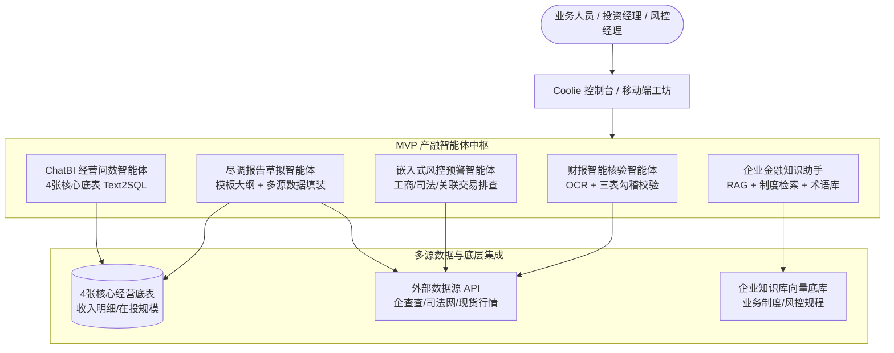

# 《国信产融智能体应用系统集成服务项目》MVP 建设与交付规划报告

> **项目来源**：`~/workspace/download/design-project.docx`  
> **项目全称**：某公司产融智能体应用系统集成服务项目（中国联通青岛分公司 / 国信产融）  
> **建设定位**：面向产融业务的 AI 智能体应用中枢（风险防控 + 经营分析 + 报告撰写 + 知识支撑）  
> **系统落位**：已在移动端 APP / 系统控制台完成实机建档与核心任务联动（任务编号：`57cd576e-86d2-4b37-a1fa-b944b3cdb183`）

---

## 一、 技术规范书核心需求解构

根据技术规范书（全量 1,311 行，656 段），本项目是典型的**“大模型 + 知识库 + 业务系统集成 + 外部数据源协同”**的企业级产融智能体工程：

### 1. 业务场景三大件
1. **风险防控类**：
   - **财报资料核验**：集成商用财报 OCR 工具，对资产负债表、利润表、现金流量表进行结构化提取；建立“三表勾稽关系”32 项平衡校验算法，自动生成核验报告并标记异常。
   - **嵌入式风控**：贷前主体工商/司法核查；贷中合规/关联交易/担保比例穿透拦截；贷后多维动态排查。
   - **风险预警系统**：规则模型与动态阈值配置，分级推送至统一待办与短信通知。
2. **经营管理类**：
   - **尽调/研报撰写**：内外部多源数据抓取清洗、可视化模板配置、AI 大纲与正文撰写、段落微调、导出 Word/PDF；对接 Alpha 派研报智能体。
   - **经营数据分析 (ChatBI)**：针对 4 张核心底表（业务收入明细、业务情况统计、在投规模明细、业务收入统计），支持自然语言智能问数、图表生成与收入波动归因分析。
3. **知识与基础平台支撑类**：
   - **企业级知识库**：金融/信贷制度库、多格式 RAG 解析、企业金融术语库、Prompt 敏感词守卫、Agent 工作流智能编排与多模型调度分发。
   - **系统级集成**：竹云统一身份认证 (SSO)、爱信统一待办、核心业务系统底库对接。

---

## 二、 完整 MVP 建设落地范围 (MVP Scope)

遵循“保核心闭环、快速可用、风险可控”原则，MVP 聚焦交付 5 大关键服务能力：

### 1. MVP-1: 企业金融知识助手 (Knowledge Copilot)
- **目标**：解决员工对繁琐的信贷、保理、担保业务制度和风控指引检索慢、口径不一致问题。
- **能力**：支持 PDF/DOCX 多格式规程解析，Milvus/PGVector 向量检索，金融专有名词消歧，Prompt 安全守卫。

### 2. MVP-2: 财报智能核验模块 (Financial Report Verifier)
- **目标**：替代人工耗费 2~4 小时的三表手工核算与勾稽校验。
- **能力**：
  - 标准财报 OCR 工具链（识别率 $\ge 98\%$）；
  - 三表勾稽规则引擎（如：资产负债表 `资产总计 = 负债合计 + 所有者权益合计`，利润表与现金流量表净利润调节等 32 项强校验）；
  - 自动生成《财报智能校验差异表》。

### 3. MVP-3: 嵌入式主体风控与预警 (Risk Screening)
- **目标**：一键完成对借款人/担保人的多维背景风控审查。
- **能力**：
  - 对接企查查/天眼查 API，拉取股权穿透、实际控制人、失信被执行人、司法涉诉信息；
  - 关联交易比例核查与超限预警卡片输出。

### 4. MVP-4: 尽调报告自动草拟器 (DD Report Generator)
- **目标**：尽调报告编写耗时从 3 天缩短到 30 分钟。
- **能力**：
  - 标准模板装配（企业概况、股权结构、经营现状、财务分析、风控审查）；
  - 自动聚合 MVP-1~MVP-3 产物，一键导出规范 Word/PDF 初稿。

### 5. MVP-5: 4 张核心底表 ChatBI 经营问数 (FinBI Query)
- **目标**：实现经营管理层即问即答的移动端/PC 端问数。
- **能力**：
  - 覆盖《业务收入明细表》、《业务情况统计表》、《在投规模明细表》、《业务收入统计表》；
  - 自然语言转化为安全只读 SQL，生成指标卡片与柱状/折线趋势图。

---

## 三、 交付时间估计 (Delivery Schedule)

严格按照技术规范书合同工期约束与 CMMI 过程规范编排：
- **规范书总期**：实施开发期约 **9~10 周**；试运行 30 天 $\to$ 初验 $\to$ 稳定运行 60 天 $\to$ 终验。
- **MVP 交付节奏**（重点收敛在前 6 周形成端到端试用）：

| 阶段 | 周期 | 核心交付成果 | CMMI 质量门禁 |
| :--- | :--- | :--- | :--- |
| **W1~W2：需求细化与架构设计** | 2 周 | - 软件需求规格说明书 (SRS) - 4 张底表数据字典与 API 契约协议 - 外部数据源授权申请与接口打通 | **G1 需求门禁** (EARS 验收标准) **G2 技术方案门禁** |
| **W3~W4：一阶段核心交付 (MVP-1 & MVP-2)** | 2 周 | - 企业知识库助手上线 (规程 RAG 检索) - 财报 OCR + 三表勾稽核验模块闭环 - SSO 竹云统一认证单点登录对接 | **G3 编译与静态契约门禁** 财报勾稽平账测试集 100% 通过 |
| **W5~W6：二阶段场景交付 (MVP-3, 4, 5)** | 2 周 | - 嵌入式风控预警（工商/司法多源核验） - 4 张核心底表 ChatBI 自然语言问数 - 尽调报告一键草拟与 Word 导出 | **G4 业务全栈验收门禁** 全流程端到端冒烟测试 |
| **W7~W8：系统联调与集成加固** | 2 周 | - 爱信统一待办对接、权限管控打通 - 敏感词过滤与大模型安全护栏加固 - 性能调优与压测 (并发问答响应 $\le 3s$) | **G5 投产预备门禁** 安全性测试与审计合规 |
| **W9~W10：部署上线与初验交付** | 2 周 | - 生产不可变镜像投产部署 - 编制交付物文档与用户操作手册 - 组织初验评审，正式进入 **30 天试运行** | 初验签收单会签 |

**总计实施周期**：**10 周（约 2.5 个月）实现初验交付**，后续按合同执行 30 天试运行与 60 天终验服务。

---

## 四、 核心交付风险与应对防线 (Risk Matrix)

| 风险类别 | 风险描述 | 影响等级 | 规避应对防线 |
| :--- | :--- | :---: | :--- |
| **1. 外部数据源依赖风险** | 企查查/天眼查/司法网/行情接口调用频次超限、授权延期或接口规范变更 | **高** | ① 建立 API Mock 沙箱与本地缓存队列机制； ② 第一周推动商务完成正式商用 Token 与公网白名单开通； ③ 异常时退化为手工上传 JSON/Excel 解析兜底。 |
| **2. 财报 OCR 与三表勾稽平账风险** | 扫描件模糊、非标准附注披露、科目不一致导致勾稽关系校验误报 | **高** | ① 选用成熟商用金融级 OCR 引擎（如百度/腾讯金融财报专用识别）； ② 勾稽引擎内置容差阈值（如千元级尾差自动归因并提示）； ③ 提供前端差异高亮比对编辑器，支持人工一键复核确认。 |
| **3. 大模型幻觉与尽调合规风险** | AI 撰写尽调报告时捏造企业经营事实、生成不合规风控结论 | **高** | ① 采用“事实检索 + 模板填装”双轨制（数据项只引用事实，禁止自由发挥）； ② 增加 CMMI 风险防御护栏：关键数据溯源标注（引用来源脚标）； ③ 报告草稿强制保留“人工终审”审批流。 |
| **4. 4 张底库权限与网络联通风险** | 生产经营底表涉及敏感资金数据，网络隔离严格、直接查询受阻 | **中** | ① 严禁大模型直连生产核心库； ② 搭建只读分析副本库（Read Replica），脱敏展示客户隐私信息； ③ Text2SQL 仅限 `SELECT` 白名单视图，杜绝越权风险。 |
| **5. 进度滞后与多方协同风险** | 业主方各部门（风控、财务、信息技术、集团数科）评审流程长 | **中** | ① 采用敏捷周迭代，每周五固化可演示的原型 Demo； ② 关键阶段节点（W4 / W6）举行成果展示会，提前锁定阶段验收成果。 |
