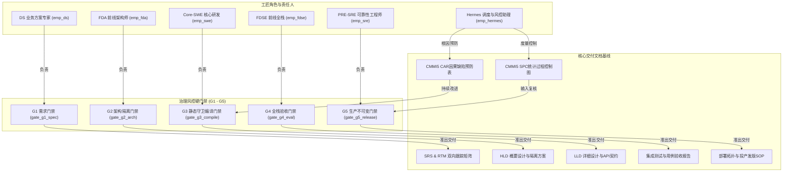

# CMMI 3 / CMMI 5 角色员工工程规范与文档基线体系

> **版本**: 1.0.0  
> **更新时间**: 2026-09-25  
> **归属**: 企业核心运营与IT基座 (`enterprise-core`)  
> **适用范围**: 全工坊人类团队成员、AI 数字工匠（Palantir 五大角色体系 + Hermes 调度助理）及全量核心业务系统

---

## 1. 体系目标与指导原则

在 Coolie 工坊的控制面与研发体系中，引入 **CMMI 3（已定义级）** 与 **CMMI 5（持续优化/高成熟度级）** 并非为了形式主义的“应付检查补文档”，而是为了**规范角色员工与智能体的协同行为**，建立**可量化、可追溯、防退化、可闭环**的工程交付流水线：

1. **过程融入系统，避免事后补录**：每个业务系统在立项、架构、实现、测试到投产各阶段，对应的标准工程文档即为该阶段的唯一合法交付物。
2. **门禁（Gates）即为评审卡点**：CMMI 3 的同行评审与基线发布、CMMI 5 的统计过程控制与因果分析，直接固化为 G1-G5 自动化与人工卡点，未通过门禁不得流转。
3. **单一人格职责清晰（RACI 明确）**：由专门的角色工匠作为文档的第一撰写与维护责任人（`authored_by`），实行首问责任制。

---

## 2. 六大工匠角色的 CMMI 职责矩阵 (RACI Matrix)

### 角色详细权责表

| 工匠角色 | 对应 CMMI 关键过程域 (PA) | 主责阶段 | 必须交付的文档基线 | 硬门禁卡点与准出命令 |
| :--- | :--- | :--- | :--- | :--- |
| **DS (业务方案专家)** | **RD** (需求开发) **REQM** (需求管理) **VAL** (用户确认) | `stage_g1_req` | 1. 《用户需求说明书 (URD)》 2. 《软件需求规格说明书 (SRS)》 3. 《需求双向跟踪矩阵 (RTM)》 | **G1 需求与业务旅程门禁** `node scripts/verify-requirements.mjs` *标准：EARS 格式 0 歧义、跨端业务旅程 100% 闭环* |
| **FDA (前线架构师)** | **TS** (技术方案架构) **DAR** (决策分析) **RSKM** (技术风险) | `stage_g2_arch` | 1. 《系统概要设计说明书 (HLD)》 2. 《多企业/租户数据隔离方案》 3. 《关键技术选型决策分析表 (DAR)》 | **G2 架构隔离与治理门禁** `node scripts/check-fork-surface.mjs` *标准：上游改动登记率 100%、数据隔离无逃逸* |
| **Core-SWE (核心研发)** | **TS** (详细实现) **VER** (代码与单元验证) | `stage_g3_build` | 1. 《系统详细设计说明书 (LLD)》 2. 《统一 API 契约协议规范 (API Spec)》 3. 《单测计划与覆盖率扫描报告》 | **G3 静态守卫与编译契约门禁** `node scripts/check-module-boundaries.mjs` *标准：0 TypeScript 报错、0 逆向依赖、单测覆盖达标* |
| **FDSE (前线全栈交付)** | **VER** (端验证) **VAL** (端体验确认) | `stage_g4_eval` | 1. 《页面四态状态机规格说明书》 2. 《全栈交互防抖防御规范》 3. 《系统集成测试与缺陷总结报告》 | **G4 全栈防御与端体验门禁** `node scripts/check-token-gates.mjs` *标准：Loading/Empty/Error/Success 穷举、防抖防御* |
| **PRE-SRE (产品可靠性)** | **CM** (配置管理) **RSKM** (投产风控) **PMC** (环境监控) | `stage_g5_deploy` | 1. 《CMDB 部署架构拓扑手册》 2. 《生产发版与秒级回滚 SOP》 3. 《不可变配置基线与双人会签单》 | **G5 不可变投产与发布门禁** `node scripts/check-no-git-push.mjs` *标准：不可变指纹、拨测 200 OK、严禁擅自 remote push* |
| **Hermes (调度与风控)** | **QPM** (量化管理) **CAR** (因果预防) **OPM** (组织创新) | 全流程闭环 | 1. 《量化质量目标定义书 (QPPO)》 2. 《统计过程控制分析表 (SPC 控制图)》 3. 《5-Why/鱼骨图 CAR 根因分析表》 | **算力硬熔断与过程监控** `flow_budget` *标准：90% 预警、100% 硬熔断、缺陷根本原因消除* |

---

## 3. 核心业务系统“5+2 黄金文档基线”

在工坊的本体库中，每个核心业务系统（CMDB 业务系统）和本体域均已永久固化对应的文档节点：

### 3.1 控制台主系统 (Paperclip Control Plane - `sys_control_plane`)
- **SRS & RTM**: `doc_cp_srs`（[`doc/SPEC-implementation.md`](file:///host-workspace/xaicd/coolie/doc/SPEC-implementation.md)）—— 责任人：`emp_ds`
- **HLD 概要设计**: `doc_cp_hld`（[`docs-coolie/Coolie-FORK-BOUNDARY.md`](file:///host-workspace/xaicd/coolie/docs-coolie/Coolie-FORK-BOUNDARY.md)）—— 责任人：`emp_fda`
- **LLD 详细设计**: `doc_cp_lld`（[`doc/DATABASE.md`](file:///host-workspace/xaicd/coolie/doc/DATABASE.md)）—— 责任人：`emp_swe`
- **测试验收报告**: `doc_cp_test`（[`docs-coolie/LOCAL-E2E.md`](file:///host-workspace/xaicd/coolie/docs-coolie/LOCAL-E2E.md)）—— 责任人：`emp_swe`
- **部署运维 SOP**: `doc_release_sop`（[`docs-coolie/release-flow.md`](file:///host-workspace/xaicd/coolie/docs-coolie/release-flow.md)）—— 责任人：`emp_sre`

### 3.2 业务后台中台系统 (RuoYi Backend - `sys_backend`)
- **SRS 需求规格**: `doc_backend_srs`（[`docs-coolie/specs/backend-srs.md`](file:///host-workspace/xaicd/coolie/docs-coolie/specs/backend-srs.md)）—— 责任人：`emp_ds`
- **HLD 微服务架构**: `doc_backend_hld`（[`docs-coolie/specs/backend-architecture-hld.md`](file:///host-workspace/xaicd/coolie/docs-coolie/specs/backend-architecture-hld.md)）—— 责任人：`emp_fda`
- **API 契约说明**: `doc_backend_api`（[`docs-coolie/specs/backend-api-contract.md`](file:///host-workspace/xaicd/coolie/docs-coolie/specs/backend-api-contract.md)）—— 责任人：`emp_swe`
- **集成测试报告**: `doc_backend_test`（[`docs-coolie/specs/backend-test-report.md`](file:///host-workspace/xaicd/coolie/docs-coolie/specs/backend-test-report.md)）—— 责任人：`emp_fdse`
- **部署与应急手册**: `doc_backend_deploy`（[`docs-coolie/specs/backend-deployment-sop.md`](file:///host-workspace/xaicd/coolie/docs-coolie/specs/backend-deployment-sop.md)）—— 责任人：`emp_sre`

### 3.3 移动端工匠驾驶舱 (Expo Mobile - `sys_mobile`)
- **PRD 交互原型**: `doc_mobile_prd`（[`docs-coolie/APP-PAGES-AUDIT.md`](file:///host-workspace/xaicd/coolie/docs-coolie/APP-PAGES-AUDIT.md)）—— 责任人：`emp_ds`
- **HLD 移动端架构**: `doc_mobile_arch`（[`docs-coolie/P2-NATIVE-ENGINE-AND-WORKFLOW-PLAN.md`](file:///host-workspace/xaicd/coolie/docs-coolie/P2-NATIVE-ENGINE-AND-WORKFLOW-PLAN.md)）—— 责任人：`emp_fda`
- **LLD 状态机与防抖**: `doc_mobile_state_machine`（[`docs-coolie/TASKDETAIL-AUDIT.md`](file:///host-workspace/xaicd/coolie/docs-coolie/TASKDETAIL-AUDIT.md)）—— 责任人：`emp_fdse`
- **多端真机测试**: `doc_mobile_test`（[`docs-coolie/RTK-L1-VALIDATION.md`](file:///host-workspace/xaicd/coolie/docs-coolie/RTK-L1-VALIDATION.md)）—— 责任人：`emp_fdse`
- **双轨热更 SOP**: `doc_mobile_ota_sop`（[`docs-coolie/OTA-TRIGGERED.md`](file:///host-workspace/xaicd/coolie/docs-coolie/OTA-TRIGGERED.md)）—— 责任人：`emp_sre`

### 3.4 CMMI 5 高成熟度全组织度量与预防资料
- **量化与 SPC 控制**: `doc_cmmi_qpm_spc`（[`docs-coolie/metrics/spc-control-charts.md`](file:///host-workspace/xaicd/coolie/docs-coolie/metrics/spc-control-charts.md)）—— 责任人：`emp_hermes`
- **因果分析与缺陷预防**: `doc_cmmi_car_prevention`（[`docs-coolie/metrics/car-defect-prevention.md`](file:///host-workspace/xaicd/coolie/docs-coolie/metrics/car-defect-prevention.md)）—— 责任人：`emp_hermes`
- **组织级上下文基座**: `doc_company_context`（[`docs-coolie/ENTERPRISE-CONTEXT.md`](file:///host-workspace/xaicd/coolie/docs-coolie/ENTERPRISE-CONTEXT.md)）—— 责任人：`emp_fda`

---

## 4. CMMI 5 统计过程控制与缺陷预防执行机制

### 4.1 统计过程控制 (SPC) 规则
由 Hermes 调度助理对全工坊执行的各任务生命周期指标进行数据采样：
- **监控指标**:
  1. 需求缺陷密度（Defects / Function Point）；
  2. 代码 Review 评审检出率（目标区间 $65\% \sim 85\%$）；
  3. 自动化门禁拦截率（G1-G4 卡点初次通过率）；
  4. Token 算力消耗偏离度。
- **失控判定准则 (Nelson Rules)**:
  - 任一数据点超出 3 倍标准差（超过 UCL 上控制限或 LCL 下控制限）；
  - 连续 7 个点位于中心线（CL）同侧；
  - 触发失控告警后，Hermes 立即挂起相关流转，启动 CAR 根因核查。

### 4.2 因果分析与缺陷预防 (CAR) 流水线
当遇到高频或严重级别（P0/P1）问题时，禁止“就事论事只改 Bug”：
1. **5-Why 深度推导**：顺藤摸瓜定位制度、规范、编译器或自动化工具层面的漏洞；
2. **防石化预防措施**：将解决对策编写为静态检查规则（如新增针对性的 `.mjs` 守卫脚本），纳入 CI 与门禁中；
3. **经验回流知识库**：更新本规范手册与本体域实例，防止同类问题在其他业务系统中重复发生。
