# 企业本体上下文规范 (Enterprise Core Context & Multi-Dimensional Work Tasks)

> **版本**: 1.0.0  
> **更新时间**: 2026-09-25  
> **本体标识**: `enterprise-core` (`企业核心运营与IT基座`)  
> **归属**: 工坊全流程企业上下文与治理底座

---

## 1. 目标与定位

在 Coolie 工坊架构中，`enterprise-core` 本体域是**全工坊的唯一法定企业上下文源（Single Source of Enterprise Context）**。  
本工坊内的所有角色——包括人类主理人、AI 智能体（Palantir 五大工匠体系：FDA、Core-SWE、PRE-SRE、FDSE、DS）以及总控调度助理（Hermes）——在接受派工、调用 MCP 工具、检查组织归属、发起审批、执行门禁校验与投产运维时，均以该本体域作为基准上下文。

同时，本规范落地了 **6 个多维度工作任务样例（Task G1 至 G6）**，全面覆盖了从需求定案、架构边界、核心编译、双端交付、安全投产到算力风控的企业研发与治理全生命周期。

---

## 2. 企业组织与治理拓扑结构

```mermaid
graph TD
    company["公司主体: 智数灵动创想工坊 (company_root)"]
    dept_rd["研发工程部 (dept_rd)"]
    dept_prod["产品与业务方案部 (dept_prod)"]
    dept_sre["质量与基础设施部 (dept_sre)"]

    company -->|has_department| dept_rd
    company -->|has_department| dept_prod
    company -->|has_department| dept_sre

    %% 员工/工匠
    emp_fda["FDA 前线架构师 (emp_fda)"]
    emp_swe["Core-SWE 核心研发 (emp_swe)"]
    emp_fdse["FDSE 前线全栈 (emp_fdse)"]
    emp_hermes["Hermes 调度助理 (emp_hermes)"]
    emp_ds["DS 业务方案专家 (emp_ds)"]
    emp_sre["PRE-SRE 可靠性工程师 (emp_sre)"]

    emp_fda -->|belongs_to_department| dept_rd
    emp_swe -->|belongs_to_department| dept_rd
    emp_fdse -->|belongs_to_department| dept_rd
    emp_hermes -->|belongs_to_department| dept_rd
    emp_ds -->|belongs_to_department| dept_prod
    emp_sre -->|belongs_to_department| dept_sre

    %% 审批流与门禁
    flow_release["正式发版投产审批流 (flow_release)"]
    flow_budget["预算硬熔断管控流 (flow_budget)"]

    gate_g1["G1 需求门禁 (gate_g1_spec)"]
    gate_g2["G2 架构隔离门禁 (gate_g2_arch)"]
    gate_g3["G3 静态守卫编译门禁 (gate_g3_compile)"]
    gate_g4["G4 全栈验收门禁 (gate_g4_eval)"]
    gate_g5["G5 生产不可变门禁 (gate_g5_release)"]

    flow_release -->|enforces_gate| gate_g1
    flow_release -->|enforces_gate| gate_g2
    flow_release -->|enforces_gate| gate_g3
    flow_release -->|enforces_gate| gate_g4
    flow_release -->|enforces_gate| gate_g5

    %% 6大工作任务样例
    task_g1["任务一: 客户业务旅程定案 (task_g1_requirements)"]
    task_g2["任务二: 控制台架构与隔离审查 (task_g2_arch_isolation)"]
    task_g3["任务三: 核心契约与静态守卫 (task_g3_core_swe_gates)"]
    task_g4["任务四: 移动端状态机验收 (task_g4_fdse_state_machine)"]
    task_g5["任务五: 生产不可变发版 (task_g5_sre_prod_release)"]
    task_g6["任务六: 算力预算熔断管控 (task_g6_budget_override)"]

    task_g1 -->|assigned_to| emp_ds
    task_g1 -->|verified_by_gate| gate_g1
    task_g2 -->|assigned_to| emp_fda
    task_g2 -->|verified_by_gate| gate_g2
    task_g3 -->|assigned_to| emp_swe
    task_g3 -->|verified_by_gate| gate_g3
    task_g4 -->|assigned_to| emp_fdse
    task_g4 -->|verified_by_gate| gate_g4
    task_g5 -->|assigned_to| emp_sre
    task_g5 -->|verified_by_gate| gate_g5
    task_g6 -->|assigned_to| emp_hermes
    task_g6 -->|verified_by_gate| gate_g5
```



---

## 3. 六维度工作任务测试样例详解

在 `enterprise-core` 本体域中，通过新增的 `work_task` 节点类型以及关系 `assigned_to`、`executes_stage`、`targets_system`、`verified_by_gate`，完整建模了 6 维核心研发任务：

| 任务标识 | 维度代号与名称 | 负责工匠 | 所属阶段 | 目标系统 | 强制门禁与准入核查命令 | 交付证据与验收标准 |
| :--- | :--- | :--- | :--- | :--- | :--- | :--- |
| `task_g1_requirements` | **维度 1: 业务需求与旅程闭环** | `emp_ds` (DS) | `stage_g1_req` | `sys_control_plane` | `gate_g1_spec` (`verify-requirements.mjs`) | EARS 格式需求定案、0 处死交互假按钮、跨端关键路径闭环 |
| `task_g2_arch_isolation` | **维度 2: 架构隔离与治理风控** | `emp_fda` (FDA) | `stage_g2_arch` | `sys_control_plane` | `gate_g2_arch` (`check-fork-surface.mjs`) | 上游改动严格登记在 `fork-surface.json`、多企业数据隔离 100% |
| `task_g3_core_swe_gates` | **维度 3: 核心契约与静态守卫** | `emp_swe` (Core-SWE) | `stage_g3_build` | `sys_control_plane` | `gate_g3_compile` (`check-module-boundaries.mjs`) | 0 TypeScript 类型报错、0 模块越权反向依赖、0 未捕获异常 |
| `task_g4_fdse_state_machine` | **维度 4: 全栈防御与端体验** | `emp_fdse` (FDSE) | `stage_g4_eval` | `sys_mobile` | `gate_g4_eval` (`check-token-gates.mjs`) | 状态机穷举（Loading/Empty/Error/Success）、所有按钮防抖、设计Token门禁0违规 |
| `task_g5_sre_prod_release` | **维度 5: 可靠性与不可变投产** | `emp_sre` (PRE-SRE) | `stage_g5_deploy` | `sys_control_plane` | `gate_g5_release` (`check-no-git-push.mjs`) | 版本指纹一致、不可变制品生成、健康拨测 (`/api/health`) 200 OK、双人会签归档 |
| `task_g6_budget_override` | **维度 6: 算力调度与风控熔断** | `emp_hermes` (Hermes) | `stage_g5_deploy` | `sys_control_plane` | `flow_budget` (自动硬熔断) | 算力消耗达 90% 预警、100% Hard-Stop 自动挂起、风控总监授权特批追加额度 |

---

## 4. 智能体消费企业上下文规范 (Agent Usage Guidelines)

各数字工匠与智能体在接单与执行时，必须遵守以下上下文消费路径：

### 4.1 获取组织归属与汇报关系
- 智能体通过调用 `@paperclipai/ontology-mcp` 的 `get_node_neighbors` 工具：
  - 传入自身员工标识（如 `emp_swe`），关系 `belongs_to_department` 获取所在部门与可用预算配额；
  - 传入关系 `reports_to` 获取技术上级（如 `emp_fda`），以便遇到架构边界争议时寻求审批。

### 4.2 查阅系统拓扑与CMDB资源
- 查询目标业务系统（如 `sys_control_plane`、`sys_mobile`）：
  - 通过 `deployed_on_environment` 确定当前部署环境（`env_dev` / `env_staging` / `env_prod`）；
  - 通过 `hosted_on_resource` 和 `depends_on_resource` 确定数据库（`res_pg_cluster`）、缓存（`res_redis`）以及网关接入点（`res_caddy`）；
  - 避免硬编码 IP 或绕过 Caddy 访问后台。

### 4.3 查阅标准作业手册 (SOP)
- 通过 `documents_system` 关系从业务系统查阅关联规范文档：
  - 术语规范：`docs-coolie/TERMINOLOGY.md` (`doc_terminology`)
  - 发版回滚手册：`docs-coolie/release-flow.md` (`doc_release_sop`)
  - 企业上下文规范：`docs-coolie/ENTERPRISE-CONTEXT.md` (`doc_company_context`)

### 4.4 门禁自查准则 (G1-G5 Hard Stops)
在提交任何 PR、生成发版包或请求合并前，工匠必须在本地执行对应门禁卡点的校验命令：
```bash
# 维度 2 & G2 门禁: 检查分支无非授权的上游代码篡改
node scripts/check-fork-surface.mjs --cumulative

# 维度 3 & G3 门禁: 检查设计系统 Token 违规 (禁止裸 px/hex)
node scripts/check-token-gates.mjs

# 维度 5 & G5 门禁: 检查绝不擅自 git push 到远端
node scripts/check-no-git-push.mjs
```

---

## 5. 版本与演进准则

1. **企业本体独立版本**: `enterprise-core` 遵循语义化版本（当前为 `1.0.0`），任何新增部门、调整门禁或引入新角色，均需通过本体变更评审并保留历史版本快照。
2. **零数据破坏**: 新建公司时自动初始植入（`system-seed`），已存在时采用增量对齐（Reconciliation）模式，绝不覆盖用户已调整的企业个性化数据。
