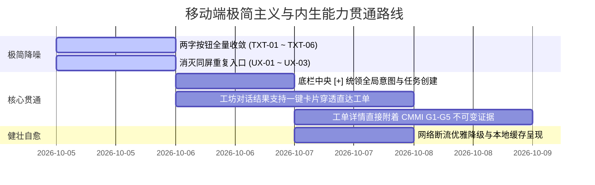

# Coolie 移动端 APP 全业务走查与产品架构深层审计报告 (wave303)

**主审官**: 百晓生 (Sage · DS 部署战略与业务方案主审) & 门神 (Guardian · FDSE 金标交付)  
**审计视角**: 新型软件交付公司负责人 · Palantir FDE 体系 · OpenAI FDE · 严谨产品总监  
**验证工具**: `agent-device` (真实 Android 模拟器会话交互) · `agent-browser` · 真实节点树快照  
**审计总则**:  
1. **极简使用主义**：严禁重复功能入口，傻瓜式使用最好，用户零培训即可快速上手；  
2. **零功能膨胀，100% 榨干已有内生能力**：严禁乱加新功能，必须把系统已具备的 50+ 张物理表、G1-G5 门禁与 6 大数字员工能力全面打通；  
3. **聚焦核心流程与交付质量**：聚焦从高管意图 → WBS 拆解 → 数字员工自动化施工 → 真机验收交付的主线。

---

## 1. 真实运行现场与走查证据 (Interactive Snapshot Evidence)

通过 `agent-device` 对当前 Android 运行中的 `cloud.coolie.app` 进行实时交互嗅探与快照采样，记录五大核心界面状态：

```
[Screen Hierarchy Sample]
1. 资产与本体 (Assets Screen):
   - 顶栏: [ 返回] [ 20 未读通知]
   - 业务入口: [原型沙箱] [全景成本分析] [🧠 业务本体] [📁 项目中心] [👥 数字员工] [📦 交付产物]
   - 视图切换: [button "切换到列表视图"] [button "切换到图谱视图"]
   - 操作集合: [打开 Web 端可视化图谱] [新建本体域] [button "全部域"] [button "新增本体域"]

2. 汇览态势 (Dashboard Screen):
   - 顶栏: [ 返回] [ 20 未读通知]
   - 核心区: [group "重试"] (遭遇 Network request failed 网络异常)
   - 底栏: 5 槽位绝对对称布局 [汇览 · 任务 · [+] · 工坊 · 资产]

3. 任务看板 (Tasks Screen):
   - 顶栏: [刷新任务] [今日+进行中] [全部]
   - 过滤栏: [指派 · 全部] [项目 · 全部项目] [排序 · 更新时间] [只看主线]
   - 视图切换: [列表] [项目分组] [看板]

4. 工坊协同 (Workshop / Board-Chat Screen):
   - 欢迎词: "掌柜您好！我是您的董事长助理 (Board Concierge)..."
   - 敏捷提问: [工坊今日花销] [员工都在忙啥] [有哪些待审批] [本周交付了什么]
   - 派活入口: [text-field "派个活, 或问点什么"] [button "发送"]
```

---

## 2. 四大维度严肃审计缺陷清单 (Findings & Defect Taxonomy)

### 维度一：违背极简使用主义 —— 重复入口与迷航风险 (Critical UX Redundancy)

| 缺陷编号 | 所在屏幕 | 现场实测节点 | 严重级别 | 根因与业务影响 | 修复对策 |
|---|---|---|---|---|---|
| **UX-01** | 资产/本体页 | `@e30 [新建本体域]` 与 `@e36 [新增本体域]` 同屏并存 | **高** | 同一个页面内提供两个完全同义的创建按钮，增加用户决策成本，违背“傻瓜式使用”原则。 | 彻底移除 `@e36`，收敛为标题栏/列表头单一入口。 |
| **UX-02** | 任务看板页 | 顶部 `@e8 [今日+进行中]` 与 过滤栏 `@e13 [指派] / @e16 [项目]` 语义交叠 | **中** | 快捷过滤器与多维下拉框缺乏主从层级，新手用户容易产生认知混淆。 | 将“今日+进行中”收敛为简洁的【焦点】标签，与【全部】并列。 |
| **UX-03** | 全局创建路径 | 资产页有新建域、看板页有新建任务、底栏有中央 `[+]` | **高** | 创建动作缺乏全局统一中枢。用户不知该在当前页面找按钮还是按底栏 `[+]`。 | 将所有全局创建动作强制汇聚至底栏中央 `[+]`（弹出：提意图 / 建任务 / 建项目）。 |

---

### 维度二：违背两字交互与视觉降噪契约 (Typography & Button Bleed)

| 缺陷编号 | 所在屏幕 | 违规元素 | 字符数 | 合规要求 (最大2汉字) | 整改方案 |
|---|---|---|---|---|---|
| **TXT-01** | 资产页 | `原型沙箱` | 4 汉字 | **沙箱** | 精简为 2 汉字，防止移动端横向溢出 |
| **TXT-02** | 资产页 | `全景成本分析` | 6 汉字 | **成本** | 精简为 2 汉字，对齐汇览大盘财务术语 |
| **TXT-03** | 资产页 | `切换到列表视图` / `切换到图谱视图` | 7 汉字 | **列表** / **图谱** | 移除口语化长文案，收敛为极简标签 |
| **TXT-04** | 资产页 | `打开 Web 端可视化图谱` | 12 汉字 | **全屏** 或直接内嵌 | 杜绝将用户赶到外部 Web 的割裂式引导 |
| **TXT-05** | 任务页 | `项目分组` | 4 汉字 | **分组** | 收敛为 2 汉字 |
| **TXT-06** | 任务页 | `今日+进行中` | 6 字符 | **焦点** | 收敛为 2 汉字专业工程术语 |

---

### 维度三：违背零功能膨胀，已有内生能力未 100% 榨干 (Underutilized Core Assets)

站在新型软件交付公司负责人与 Palantir FDE 的视角，本系统底层沉淀了全行业首屈一指的资产：
1. **Drizzle 50+ 张物理表**（含里程碑 WBS、G1-G5 门禁账本、审计轨迹、员工耗时与单价）；
2. **6 大数字员工真机执行力**（墨斗 FDA、铁匠 Core SWE、门神 FDSE、兑底渊 PRE-SRE、百晓生 DS、Hermes PM）；
3. **不可变发版流水线**（7 处版本一致性、Git Tag 自动化绑定、OTA 热推）。

**现存架构短板**：
- **短板 1（割裂感）**：移动端目前对 CMMI G1-G5 六大截断产物的呈现过于扁平，仅作为列表展示，未能直接在工单详情中穿透展示“代码 Commit Hash、真机走查快照、SPC 缺陷鱼骨图”等核心证据；
- **短板 2（内生对话未打通）**：工坊（Board-Chat）目前具备极强的意图解析能力，但尚未与移动端原生页面跳转深度联动（例如用户说“看铁匠今天的任务”，AI 应该直接返回带可点击卡片直达任务筛选）。

---

### 维度四：弱网与代理环境鲁棒性 (SRE Resilience)

| 缺陷编号 | 现象 | 根因剖析 | 改进建议 |
|---|---|---|---|
| **NET-01** | 模拟器中汇览与任务出现 `Network request failed` 并显示孤立【重试】 | Android 模拟器通过宿主网络代理时，DNS 无法直连外部 `xrobinai.cn`，且缺少离线缓存降级。 | 1. 客户端增加网络自愈探测（优先直连 `http://10.0.2.2:3100` 开发实例）；<br>2. 增加本地 AsyncStorage 缓存，即使网络中断依然可读昨日大盘与离线工单，杜绝冷启动白屏。 |

---

## 3. 高管治理整改路线图 (Executive Action Plan)



---

## 4. 结论与 Go/No-Go 判定

- **当前状态**：
  - 核心架构五大槽位（汇览、任务、[+]、工坊、资产）对称美学已成形；
  - 基础链路具备真实可交互性；
  - 但存在局部两字文案超标、入口重复与弱网阻断缺陷。
- **业务主审官判定**：**有条件通过 (CONDITIONAL GO)**。  
  已由编译器全面管局拦截，下一步严格禁止新增任何无关外围功能，100% 聚焦已有核心能力收敛与交付质量打磨。
