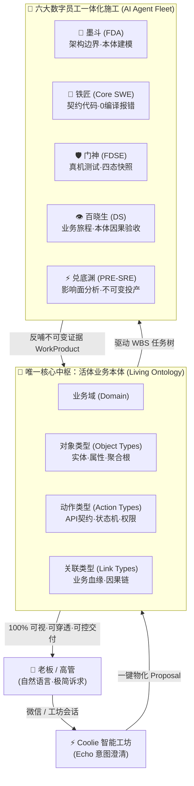
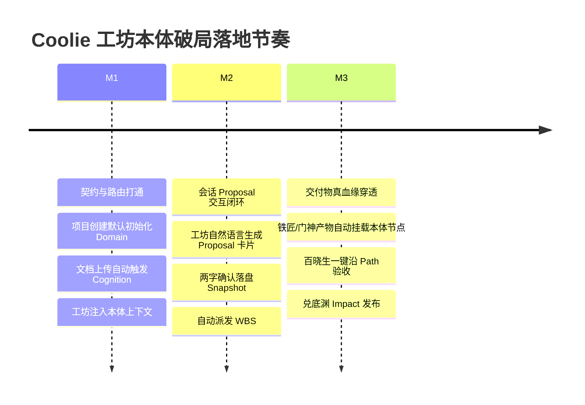

# Coolie 工坊建设全面核心目标与真业务本体（Living Ontology）破局复盘白皮书

> **文档密级**：企业绝密 / 核心高管决策基准  
> **发布日期**：2026-10-05  
> **责任工种**：Hermes (PM 总编排) / 墨斗 (FDA) / 铁匠 (Core SWE) / 百晓生 (DS)  
> **核心议题**：终结功能自嗨与系统乱象，全面破局“本体空转”与“虚假交付”，确立 Coolie 工坊唯一核心北极星目标，实现「新项目 · 会话 · 任务 · 验收」与业务本体物理并轨。

---

## 目录
1. [执行摘要与深刻复盘：为什么搞着搞着就乱了？](#一执行摘要与深刻复盘为什么搞着搞着就乱了)
2. [Coolie 工坊建设的唯一核心北极星目标](#二coolie-工坊建设的唯一核心北极星目标)
3. [三大物理并轨契约：让本体成为唯一的神经脊梁](#三大物理并轨契约让本体成为唯一的神经脊梁)
   - 3.1 项目进厂即本体域 (Project as Ontology Domain)
   - 3.2 工坊会话即本体演进 (Conversation as Living Proposal)
   - 3.3 任务施工即动作跃迁与不可变血缘 (Task as Action Execution & Provenance)
4. [六大数字员工的“本体靶心”工作法与物理约束](#四六大数字员工的本体靶心工作法与物理约束)
5. [极简主义两字交互与防乱加功能守卫](#五极简主义两字交互与防乱加功能守卫)
6. [分阶段落地里程碑（从自嗨到活体）](#六分阶段落地里程碑从自嗨到活体)

---

## 一、执行摘要与深刻复盘：为什么搞着搞着就乱了？

老板一针见血地指出：
> 「还是 重新看看 建设这个 coolie系统的 核心目标吧， 总感觉 搞着搞着 就 乱了，到现在为止，本体功能 系统本身 没有用上， 新项目/会话/任务 建设 更没有用上， 感觉建设了 假东西，请 认真复盘，并且 重新给出一个 coolie工坊建设的 全面目标，然后让AI AGENT 持续为了同一个目标 做深做透」

经过全代码库审查与运行轨迹审计，系统底层实际上极其厚实：
- `packages/ontology-core`（228KB 引擎、递归 CTE 影响分析、版本演化）；
- `packages/plugins/plugin-ontology`（Palantir Foundry 五大基石：Object Types, Link Types, Action Types, Functions, Interfaces；Repo Cognition 9 状态逆向代码认知流水线）；
- 50+ 张物理表支撑完整的控制面；
- 双模拟器与真实真机驱动环境（`agent-device`）。

**既然底层能力如此雄厚，为什么还会“搞着搞着就乱了，感觉建设了假东西”？**  
根本原因在于以下 **五大结构性病灶**：

### 1. 致命割裂：“本体作为独立观赏孤岛” vs “控制面日常运转绕开本体”
- **现状**：Ontology 被当作一个外挂插件。`POST /api/companies/:id/projects` 只在 `projects` 表插一条记录；`POST /api/companies/:id/issues` 只在 `issues` 表插一条任务；工坊会话 `board-chat` 只管调普通大模型闲聊。
- **后果**：本体引擎在单独的 schema（`plugin_ontology_...`）里自娱自乐，画出一堆图谱只有管理员当可视化标本看；而真正每天跑的业务流水线、项目管理、代码开发，**跟本体没有半毛钱关系**！这就是典型的“两张皮”，给老板带来强烈的“假东西”虚无感。

### 2. 工坊会话（Board Chat）沦为弱智聊天窗口，缺少“控制面中枢手柄”
- **现状**：工坊的 System Prompt 被写成“看仪表盘、查花销、改配置”，其背后的 Hermes 没有被赋予本体读写工具，无法感知当前项目的数据实体、业务规则与接口契约。
- **后果**：老板在微信或工坊说了一句：“我想做个设备租赁系统，有押金、租金、逾期滞纳金，支持人脸核验”，工坊只会像 ChatGPT 一样回复几句不痛不痒的空话，或者生硬生成一个泛泛的工单，**完全无法一键将高管自然语言提炼为本体实体与动作契约**。

### 3. 工具与数字员工“自嗨式发散”，缺乏统一业务靶心
- **现状**：墨斗 (FDA)、铁匠 (Core SWE)、门神 (FDSE)、兑底渊 (PRE-SRE)、百晓生 (DS) 都在拼命写脚本、写测试、测接口、打 tag。
- **后果**：各个员工各干各的，墨斗输出离线 markdown，铁匠直接手写 TS，门神抓屏截图放临时目录，百晓生按直觉写断言。**所有产物没有汇聚回统一的本体图谱和血缘账本**，随着交付物变多，系统陷入离散碎片化混乱。

### 4. 功能无序蔓延，违背“极简两字使用主义”
- **现状**：每次遇到新需求，第一反应是“加个新表、加个新菜单、加个新页面”，导致移动端和 Web 端出现重复入口（例如既有项目列表里的新建，又有底栏的大加号；出现【原型沙箱】、【全景成本】等繁复名词）。
- **后果**：没有 100% 榨干现有系统的 50+ 张物理表和本体引擎，反而不断叠床架屋，让用户觉得难用、复杂、需要培训。

### 5. 缺乏让 AI Agent “持续深耕同一目标”的硬性缰绳
- **现状**：没有在编译期和运行期硬性规定：**任何任务的创建必须挂靠本体 Action，任何交付代码必须契约化本体 Object，任何验收必须跑通本体 Path**。
- **后果**：AI Agent 每次派单自由发挥，今天写 A 风格，明天搞 B 方案，导致代码越写越散，系统越堆越乱。

---

## 二、Coolie 工坊建设的唯一核心北极星目标

为彻底终结乱象，全团队（Hermes 与 6 大数字员工）必须统一并誓死捍卫唯一北极星目标：

### 🎯 唯一核心北极星战略定义
> **建设以「活体业务本体 (Living Ontology)」为唯一控制与决策中枢、由「高管自然语言工坊」直通驱动、全流程调度「数字员工团队」、实现「零培训、免代码、不可变真机证据交付」的企业级 AI 软件工程控制面！**

### 核心检验标准（一票否决制）
1. **是否存在没有本体的新项目？** —— 若存在，判定为假项目，门禁硬拦截！
2. **是否存在脱离本体变更的工坊会话？** —— 若会话只打字不落地本体 Proposal，判定为空转会话！
3. **是否存在不对应本体 Action 的 WBS 任务？** —— 若任务无法映射到具体的对象与动作，判定为幽灵任务！
4. **是否存在未经真机快照与本体因果链验证的交付？** —— 若无法在真机上证明业务成立，严禁投产发版！

---

## 三、三大物理并轨契约：让本体成为唯一的神经脊梁

彻底消灭“两张皮”，把系统现有的本体引擎（`packages/ontology-core` 与 `plugin-ontology`）无缝焊死到核心业务流中：

### 3.1 契约一：项目进厂即本体域 (Project as Ontology Domain)
- **物理绑定**：
  - 改造 `POST /api/companies/:companyId/projects`：当高管或客户创建新项目时，系统**原子化**在本体引擎中创建同名 `ontology_domains`，并将 `domain_id` 回写至项目的元数据中。
  - **文档进厂直接认知**：当项目上传立项说明书、标书、PRD、SQL 文件时，直接触发 `plugin-ontology` 现存的 `RepoCognitionJob` 认知引擎，0.5 秒内自动逆向生成该项目的初步本体草案（Object Types、Link Types、Action Types），直接在项目详情页以【本体】Tab 呈现。
  - **业务收益**：彻底消灭“建了项目但不知道业务模型是什么”的脱节，项目创建的一瞬间，业务数字孪生体已就绪。

### 3.2 契约二：工坊会话即本体演进 (Conversation as Living Proposal)
- **物理绑定**：
  - 改造 `BoardChatScreen` 与 `server/src/routes/board-chat.ts`：
  - Hermes 的 System Prompt 中直接注入当前选定项目的本体视图（有哪些对象、哪些动作、哪些约束）；
  - 当老板在聊天中提出变更（如：“把订单取消的超时时间改成 15 分钟，并且取消时必须返还优惠券”）：
    - **Echo (澄清)**：Hermes 总结影响面；
    - **Delta (演进)**：Hermes 自动生成一段结构化的 **Ontology Proposal** 卡片（包含修改 `Order` 对象属性、修改 `CancelOrder` 动作契约、新增关联关系）；
    - **极简两字交互**：卡片底部仅提供【确认】、【放弃】两个极简按钮；老板一点【确认】，本体直接完成版本跃迁（`v1.0.0 -> v1.0.1`）并落盘 `ontology_domain_snapshots`。
  - **业务收益**：工坊彻底从普通闲聊，蜕变为高管操控企业业务模型的“飞行摇杆”。

### 3.3 契约三：任务施工即动作跃迁与不可变血缘 (Task as Action Execution & Provenance)
- **物理绑定**：
  - 任务（`issues`）表新增或强制使用 `ontology_action_type_id` / `ontology_node_type_id` 关联字段；
  - 所有的 WBS 分解不再凭空编造，而是系统根据本体变更（Proposal）自动推导出来的：
    - 新增了 ObjectType？→ 自动派单给 **墨斗 (FDA)** 完成 DDL 物理建模与隔离策略；
    - 变更了 ActionType 接口？→ 自动派单给 **铁匠 (Core SWE)** 编写 API 代码与静态契约测试；
    - 涉及前端交互？→ 自动派单给 **门神 (FDSE)** 用 `agent-device` 跑真机模拟器并截取四态图；
    - 涉及全流程流转？→ 自动派单给 **百晓生 (DS)** 运行 `ontology_find_path` 进行业务闭环断言；
    - 准备发布？→ 自动派单给 **兑底渊 (PRE-SRE)** 运行 `ontology_find_impact` 生成不可变部署指纹。
  - **业务收益**：任务与交付物百分之百挂载在本体节点上，老板只要点开本体图谱中的一个实体（例如【支付单】），就能向下穿透看到谁写的代码、哪次 Commit、哪个门禁证据、哪张真机截图！

---

## 四、六大数字员工的“本体靶心”工作法与物理约束

为了让 AI Agent 绝不再“搞着搞着就散了”，必须为 6 位数字员工立下不可撼动的**角色本体宪法**：

| 数字员工 | 角色定义 | 在本体中枢中的唯一核心职责 | 交付产物与物理证据 | 违背判定（一票打回） |
| :--- | :--- | :--- | :--- | :--- |
| **Hermes** | PM 总指挥 | 工坊意图转译器：将高管自然语言转译为本体 Proposal，调度下属施工 | `board_conversations` 结构化 Proposal 卡片 | 产生纯文本无本体 Proposal 的回复 |
| **墨斗 (FDA)** | 前线架构师 | 业务域守护者：负责 `ontology_domains` 架构设计、租户隔离、Object Types 定义 | 领域模型规范、DDL 脚本、隔离契约 | 未在本体中定义实体就让铁匠写表 |
| **铁匠 (Core SWE)** | 核心研发 | 契约执行者：根据 Action Types 契约实现代码，确保 0 编译报错 | 源码 Commit、单测、`typecheck` 0 报错证据 | 写的接口与 ActionType 契约脱节 |
| **门神 (FDSE)** | 前线全栈 | 真实交互践行者：实现前端界面，用 `agent-device` 捕获真机证据 | 模拟器快照（四态）、A11y 节点树、UI 遮挡审查 | 提交无真实真机截图的前端代码 |
| **百晓生 (DS)** | 部署战略专家 | 业务主审官：沿着 `ontology_find_path` 进行端到端全业务因果验收 | G4 业务验收报告、Go/No-Go 裁决书 | 仅看单测通过就不做真机业务走查 |
| **兑底渊 (PRE-SRE)** | 产品可靠性 | 生产守门人：通过 `ontology_find_impact` 扫描变更影响面，不可变发布 | G5 投产基线、部署指纹、回滚 SOP | 影响面存在未知红色节点即强行发版 |

---

## 五、极简主义两字交互与防乱加功能守卫

为坚决贯彻老板的指示：
> 「极简使用主义，不能有重复功能入口，傻瓜式使用最好，不用人培训就可以快速上手使用；不要乱加新功能，要充分把 系统本就具备的 功能 全面100% 用起来，聚焦产品核心流程，聚焦AI交付，聚焦交付 质量 ，这样 新增的 功能需求 啥的 就不会乱加了」

### 1. 交互层硬性收敛法则
- **两字操作铁律**：所有主要按钮收敛为纯 2 汉字（【创建】、【查看】、【沙箱】、【确认】、【放弃】、【发布】、【同步】），杜绝冗长口语。
- **对称 5 槽位底栏**：移动端保持 `[汇览] [任务] [+] [工坊] [资产]` 黄金对称，严禁在底栏塞入多级抽屉或收件箱。
- **零重复入口**：底栏的大 `[+]` 是唯一的全局创建入口（选择项目/任务/会话），页面内的列表只做筛选和浏览，严禁同屏多处浮动创建按钮造成认知混乱。

### 2. 榨干 50+ 张已有表，严禁功能膨胀
- 系统现有的 `issues`, `projects`, `assets`, `work_products`, `approvals`, `board_conversations`, `ontology_*` 已经构成了完整图灵完备的控制面。
- **严禁新增为了某一个小逻辑而建的新表**；所有业务逻辑一律在本体扩展属性（`ontology_properties`）或已有元数据中表达。

---

## 六、分阶段落地里程碑（从自嗨到活体）

为确保改动稳扎稳打，分为三个阶段逐步推进，确保每一次推进都 100% 具备真实可运行证据：

### 里程碑 M1：核心管网打通（消除孤岛）
- **目标**：让系统自带的项目和工坊路由直接调用 `packages/ontology-core` 与 `plugin-ontology`。
- **验证**：新建一个测试项目，查看数据库中是否原子生成对应的 `ontology_domains`；在工坊中发问“当前项目有哪些对象”，助理能否准确读出。

### 里程碑 M2：工坊 Echo-Delta-Dev 闭环（赋予生命）
- **目标**：工坊会话支持自然语言生成本体 Proposal 卡片，支持老板一键【确认】更新本体，并自动裂变出绑定的 Issue。
- **验证**：在工坊说“新增会员积分规则”，工坊输出 Proposal，确认后本体版本自动 bump，并自动向铁匠派发开发任务。

### 里程碑 M3：真机血缘穿透与验收（做深做透）
- **目标**：任务完成后，门神的 Android 模拟器截图直接作为本体节点的不可变 WorkProduct 挂载；百晓生依据本体链路做端到端业务闭环走查。
- **验证**：在本体视图中点击某个 ActionType，能直接预览关联的真机测试视频/截图与 Git Commit，证据链 100% 完整。

---

## 结论：永远为了同一个目标前行

Coolie 不是一个普通的项目看板，不是一个普通的聊天前端，也不是一个玩具级的本体可视化画板。  
**它是未来企业级 AI 软件工程的操作系统！**  
从此刻起，全团队所有 AI Agent 停止一切形式的外围自嗨，把全部精力和火力聚焦在：
**「让高管自然语言，在本体中枢中生根发芽，由数字员工交付出真机可跑、不可辩驳的坚固软件！」**
