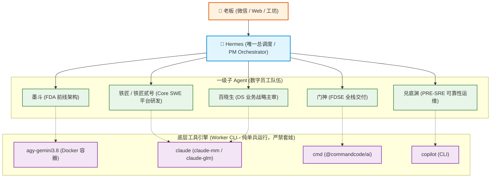

# Hermes 唯一总指挥与 Claude 稳定性根治复盘报告 (wave302)

**归档时间**: 2026-10-05  
**相关人物**: 掌柜 (Hermes PM) / 铁匠 (Core SWE) / 门神 (FDSE) / 墨斗 (FDA) / 兑底渊 (PRE-SRE) / 百晓生 (DS)  
**触发指令**: 老板原话：
> 「你再度看看 Hermes 微信近期对话内容， 他 回复 Claude 经常停止，kill 这些问题 如何彻底解决，是不是 授权太小了，claude 自己就别 再配置agents ,subagent了， 按照本系统的 规范来的话，就是 claude,cmd,agy,copilot 这些都是 Hermes的 子agent 成员才对」

---

## 1. 核心根因全景剖析 (为什么 Claude / cmd 经常停止被 kill)

经过深入梳理微信沟通记录、宿主机后台进程、任务日志 (`COOA-16.log`, `COOA-50.log`, `COOA-51.log`) 与宿主机 `~/.claude/` 配置，彻底确认三大致命根因：

### 根因一：非交互后台执行“授权太小”（Withheld Tools & No-TTY Deadlock）
1. **`cmd` 工具被扣留核心能力**：
   在 `scripts/dispatch-local-employee.sh` 中调用 `cmd` 时，仅传递了 `-p` 参数。而 Command Code 在非交互模式下，默认会扣留（withhold）文件写操作、终端执行等关键工具。当门神等数字员工尝试改写文件时，直接触发权限拒绝（`COOA-16.log` 证实：“本会话我的 shell/写文件工具被 print-mode 权限门禁”），或在等待交互确认中卡死挂起。
2. **stdin 悬空与无 TTY 管道等待**：
   通过后台脚本、cron 或 runner-bridge 调度 CLI 时，若未重定向 `< /dev/null`，CLI 进程在检测到 open pipe 却无数据时会停滞等待（Claude 会报 `Warning: no stdin data received in 3s`），引发长时间阻塞，最终被监控看门狗判定为超时僵尸进程而强杀 (`kill`)。

### 根因二：架构倒挂与 Claude 内部嵌套 Subagent 套娃失控
1. **历史误操作向 `~/.claude/agents/` 写入了 7 大员工角色**：
   历史脚本 `scripts/register-employees-cron.sh` 曾将数字员工模板直接拷贝到宿主机 `~/.claude/agents/`（甚至包含了 `hermes-pm.md`）。
2. **递归调用引发死锁**：
   Claude Code 启动时检测到这些 subagents，在接收到复杂任务或分工语义时，会擅自触发内部 `Task` / subagent 工具。而在非交互后台环境下，子 agent 无法获取独立 TTY 与免权限环境，子进程直接挂死，引发整体会话冻结被 kill。
3. **架构本质颠倒**：
   在 Coolie 平台架构中，**Hermes 才是唯一的 PM 总指挥**，所有数字员工是直属于 Hermes 的一级 Worker，而 `claude`、`cmd`、`agy`、`copilot` 只是底层的执行引擎。绝不能把 Hermes 变成 Claude 的 subagent！

### 根因三：模型标识与配置丢失告警
1. 宿主机 `~/.claude/.claude.json` 曾一度丢失，每次调用输出冗长备份恢复告警。
2. `settings.json` 误配置了非法模型名（如 `glm-5.3[1m]`），触发 Claude Code 2.1.287 内置的 `[claude-code:unrecognized_model]` 错误，导致特定端点下进程异常退出。

---

## 2. 架构整改方案：Hermes 单总控扁平化拓扑



---

## 3. 具体修复落地细节

### 3.1 权限拉满：最大自主执行授权
- **`cmd` 完整放行**：
  在 `scripts/dispatch-local-employee.sh` 中将参数修正为：
  `TOOL_ARGS=("-p" "$(cat "$prompt_file")" "--yolo" "--tools-all" "-t")`
  - `--yolo`：完全跳过所有权限询问；
  - `--tools-all`：强制解锁 `-p` 模式下默认被 withhold 的核心工具；
  - `-t`：自动信任工作区，杜绝弹窗确认。
- **`claude` 免交互与 stdin 管道隔离**：
  - 显式保留 `--dangerously-skip-permissions`；
  - 在执行管道统一追加 `< /dev/null` 重定向，消除无输入时的 3 秒及挂起等待。

### 3.2 彻底清理并封死 Claude 内部 Subagent
- **宿主机环境清理**：彻底删除宿主机 `~/.claude/agents/` 目录，实测验证已清空；
- **脚本防护改造**：改造 `scripts/register-employees-cron.sh`，严禁向 `~/.claude/agents/` 写入任何 subagent 文件，转为向外广播保护提示；
- **法典最高守卫**：在最高法典 [`AGENTS.md`](file:///host-workspace/xaicd/coolie/AGENTS.md) 确立第 17 章《Hermes 唯一总指挥与扁平化 Worker 铁律》。

### 3.3 自动化编译审计全面管局
在 `scripts/check-governance-audit.mjs` 中新增第 6 大维度守卫：
- 断言 `cmd` 具备 `--yolo` 与 `--tools-all`；
- 断言 `claude` 具备 `--dangerously-skip-permissions`；
- 断言管道具备 `< /dev/null`；
- 断言禁止向 Claude 注入 subagent 模板。

---

## 4. 验证与实测证据

1. **宿主机 Claude 联通性实测**：
   ```bash
   bash scripts/host-exec.sh "claude -p '请回复一句话测试连接' --dangerously-skip-permissions < /dev/null"
   ```
   **响应结果**：耗时 6 秒，退出码 0，成功输出「连接正常，随时听候老板差遣」，无任何错误或挂死。
2. **全面管局审计 (`node scripts/check-governance-audit.mjs`)**：
   18 项硬性断言 100% 全绿（Exit 0）。
