# 活体业务本体模型 (Living Ontology) 演进与升级架构白皮书

**归档时间**: 2026-10-05  
**权威视角**: Palantir Foundry 核心架构哲理 · 新型软件交付公司认知控制面 · 顶级系统架构师  
**核心命题**:  
> 「本体模型的进化升级可不只是 git 操作就行的啊」

---

## 一、平庸程序员思维 vs 顶级本体系统工程

普通工程思维（代码民工思维）：
- 以为在 TypeScript 里加个 interface、在 Drizzle 里加一张表、跑个 `git commit` 就叫“模型升级”；
- 以为数据只要落入数据库就叫“沉淀”；
- 以为静态代码库等于运行时的业务真相。

**真正的企业级活体本体（Living Ontology）体系（Palantir Foundry 标准）**：
> **Git 操作只管住了静态代码制品的版本快照（Code Snapshot），而本体模型承载的是整个企业在物理现实中不断流动、呼吸、演进的动态认知网络（Cognitive Network & Digital Twin）！**

一次真正的本体升级，牵一发而动全身，涉及元模型向下兼容、存量实体自愈迁移、活体状态机双向跃迁、闭环反向自学习四大核心工程支柱。

---

## 二、本体模型活体进化的四大工程支柱

```mermaid
graph TD
    subgraph "支柱一: 元模型演进与存量自愈 (Schema Evolution)"
        Diff["diffPropertySchemas (模式差异)"] --> Plan["planPropertyRenames (重命名计划)"]
        Plan --> Backfill["Non-destructive Backfill (非破坏性存量数据回灌)"]
        Backfill --> NoOrphan["零孤立字段保障 (Zero Orphaned Data)"]
    end

    subgraph "支柱二: 活体数字孪生与实时动作 (Digital Twin)"
        Action["高管 Ontology Action"] --> EventBus["实时事件总线"]
        EventBus --> Graph["entity_relations 活体图谱拓扑"]
        WorkerExec["数字员工执行态势"] --> Graph
    end

    subgraph "支柱三: 闭环反向自学习 (Dev Learning Loop)"
        Defect["生产与真机缺陷 (Delta Findings)"] --> Policy["治理守卫策略实体 (Governance Policy)"]
        Policy --> HardGate["自动化编译器门禁硬固化"]
        HardGate --> OntologyEvolve["本体模型规则自演化"]
    end

    subgraph "支柱四: 全链路血缘与可溯因果 (Provenance & Lineage)"
        Req["需求 (Spec)"] --> Task["工单 (Issue)"]
        Task --> Code["提交 (Commit)"]
        Code --> Snap["真机事实 (Delta Proof)"]
        Snap --> Causal["双向拓扑因果溯源 (BFS Traversal)"]
    end

    classDef pillar fill:#e1f5fe,stroke:#0288d1,stroke-width:2px;
    class Diff,Action,Defect,Req pillar;
```

---

### 支柱一：元模型演进与存量实例自愈迁移 (Schema Evolution & Data Backfill)

在系统底层 [`packages/ontology-core/src/schemaEvolution.ts`](../../packages/ontology-core/src/schemaEvolution.ts) 中，早已沉淀了核心演进逻辑：
1. **模式差异探测 (`diffPropertySchemas`)**：
   - 比较演进前后的 `properties_schema`，精准切分出 `removed`（弃用）与 `added`（新增）键集合；
2. **重命名与映射调度 (`planPropertyRenames`)**：
   - 杜绝野蛮字段删除！自动计算 `applied`（平滑映射）、`orphaned`（孤立预警）与 `ignored`；
3. **存量实例无感迁移 (`Non-destructive Backfill`)**：
   - 当模型升级时，数据库中已有的成千上万条历史工单、会话、附件实例，必须通过批处理流平滑升级为新语义，确保历史数据在新模型下依然能被无损遍历，**严禁产生数据孤岛与幽灵死数据**。

---

### 支柱二：活体数字孪生与动作双向绑定 (Digital Twin & Actions)

本体不是画给别人看的静态 UML，而是物理业务现实的**活体数字镜像**：
1. **对象不是静态行，而是状态机**：
   - 一个数字员工（Agent）不仅是 `agents` 表里的一行，它承载着即时心跳、额度消耗速率、当前正持有的互斥锁、最近一次报错堆栈；
   - 一个研发工单（Issue）承载着阻塞它的前置里程碑、正在审查它的门神 FDSE、关联的工坊会话；
2. **高管意图即本体动作 (Ontology Action)**：
   - 高管在工坊点击【批准预算】或【熔断停工】，下达的是带有 RBAC 签名与审计哈希的本体动作；
   - 动作触发后，系统事件总线瞬间向整个图谱广播，实时刷新依赖它的所有下游实体，实现全网拓扑动态跃迁。

---

### 支柱三：闭环反向自学习与防御机制演进 (Dev Closed-Loop Learning)

这正是 **Echo - Delta - Dev 中最核心的【Dev 反向传播】在本体上的终极升华**：
1. **缺陷不仅是修代码，更是进化本体规则**：
   - 每次真机走查抓出的架构缺陷（如“同屏两个新建按钮”、“无 TTY 管道等待”、“两字文案超标”），平庸团队只在业务层打补丁；
   - 顶级本体系统会将该缺陷提炼为企业的 **【不可变治理策略实体 (Governance Policy Object)】**；
2. **策略反哺编译器与调度器**：
   - 新策略实体直接长入 `scripts/check-governance-audit.mjs` 和意图分发器；
   - 下一次任何新需求进厂、任何员工尝试提交代码时，演进后的本体模型自动在前置阶段实施硬拦截，**使系统具备“免疫记忆”，绝不犯历史同样的错误**！

---

### 支柱四：数据血缘与全生命周期因果溯源 (Provenance & Lineage)

依据 [`packages/ontology-core/src/provenance.ts`](../../packages/ontology-core/src/provenance.ts) 的设计：
1. **一切对象皆有出处 (Provenance Binding)**：
   - 每个实体均绑有 `origin: { namespace, module, service, table }` 与 `sourceFiles`；
2. **全流程因果回放 (Causal Playback)**：
   - 任意点开一个已上线的 APP 页面组件，本体图谱可顺藤摸瓜逆向推导出：
     - 它源于哪天老板在工坊说的哪句话（`Conversation`）；
     - 经历了哪次 Echo 意图澄清单选卡的拍板（`Spec`）；
     - 由哪位员工使用哪台工具在几分几秒提交（`Agent` + `Commit`）；
     - 附着着哪张 Android 模拟器真机快照作为放行凭据（`WorkProduct`）；
     - 满足了 CMMI G1-G5 的哪项验收标准（`EvidenceLedger`）。

---

## 三、落盘与践行准则

老板的这句点拨，直接为 Coolie 平台拉升了核心护城河。  
未来本系统的所有迭代，坚决杜绝“单纯 git commit 糊弄事”：
- **每次模型调整，必过元模型演化计划 (`planPropertyRenames`)**；
- **每次缺陷收口，必反向形成治理策略实体 (`GovernancePolicy`)**；
- **每次工单交付，必在本体图谱 (`entity_relations`) 中挂接完整的真机证据与因果链路**。
