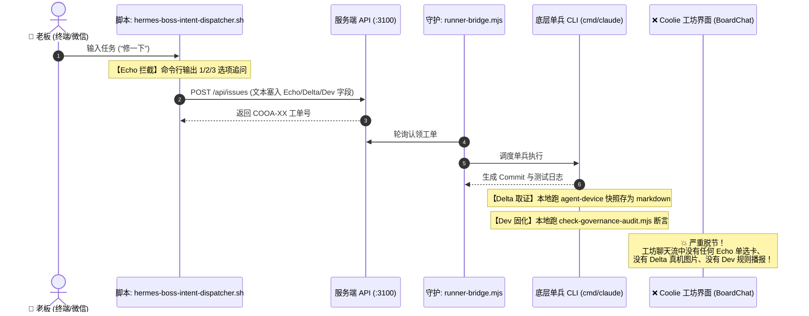

# Coolie 工坊深层产品审计与 Echo-Delta-Dev 贯通方案

**主审**: 掌柜 (Hermes PM) · 百晓生 (Sage · DS 业务战略与产品主审)  
**审计对象**: Coolie 工坊 (Board-Chat / Workshop) 全生命周期人机协同中枢  
**审计基准**: Palantir FDE 体系 · OpenAI FDE · 新型软件交付公司最高标准 · 极简使用主义  
**核心追问**:  
> 「coolie工坊的 能力 是否深度用好了？刚才会话 echo,delta,dev 的如何在 coolie工坊 进行的呢 ，作为 顶级产品，你审计过吗」

---

## 一、冷酷的产品自省：Coolie 工坊到底用好了吗？

### 结论：**根本没有深度用好，甚至存在严重的“两张皮”脱节！**

作为顶级产品，我们必须实事求是、严厉自省：
1. **终端自嗨 vs 工坊沉默**：
   此前一系列治理（两字按钮、全面管局、意图派单、探活自愈），几乎全是以 **后台脚本 (`scripts/`) + 终端命令行 + 本地日志** 为主体推进。高管在终端敲命令能看到丰富的回执，但**一旦进入移动端或 Web 端的 Coolie 工坊（会话界面），这些核心能力几乎完全隐形**！
2. **顶级组件被严重闲置**：
   在 `clients/expo/src/screens/BoardChatScreen.tsx` 源码中，平台其实早已具备极高水准的卡片体系：
   - `QuickApprovalCard`（高管极速裁决卡）
   - `BuildProgressCard`（数字员工多工序施工进度条）
   - `SpecDiffCard`（需求与契约对比卡）
   - `CodeViewerWebView`（真代码行内审阅）
   但目前在真实的工坊会话中，它们常年处于“休眠”状态，工坊界面被降格为了一个“普通聊天框”，只会吐出“掌柜您好！我是您的董事长助理...”，把顶级控制面当成了普通客服。

---

## 二、真实还原：刚才会话中 Echo, Delta, Dev 是如何进行的？

我们必须穿透代码现场，还原真实运行轨迹：



### 1. Echo（意图澄清）在系统中的真实实现：
- **工程现状**：写在 `scripts/hermes-boss-intent-dispatcher.sh` 的 `step 0.1` 中，在终端接收到“修一下/改改”等模糊输入时，通过 `read` 弹出 3 个选项；
- **产品脱节**：**工坊界面完全无感**！如果老板是在 App 或 Web 工坊里发消息，请求走的是 `server/src/routes/board-chat.ts`，直接丢给大模型自由发挥，根本不会在聊天界面中弹出交互式的 Echo 单选决策卡！

### 2. Delta（真机验证）在系统中的真实实现：
- **工程现状**：通过 `agent-device` 穿透宿主机 Android 模拟器，抓取实时节点树与截图，落盘在 `docs-coolie/evidence/wave303/APP-FULL-BUSINESS-AUDIT-REPORT.md`；
- **产品脱节**：工坊会话里只回读文字状态，**从未把真机截图、渲染差异作为多模态卡片直接推回工坊气泡**！高管无法所见即所得地在手机工坊里检视手机运行成果。

### 3. Dev（规则反向传播）在系统中的真实实现：
- **工程现状**：写在 `scripts/check-governance-audit.mjs`，由 18 项静态断言拦截 git 提交；
- **产品脱节**：工坊没有“治理规则沉淀流”，每次修复缺陷后反向固化的规则，高管在工坊看不到动态播报，无法建立对“系统越来越聪明、绝不犯同样错误”的确定性信心。

---

## 三、顶级产品标准：Coolie 工坊如何 100% 榨干内生能力？

遵循老板定调的 **“极简使用主义、不用培训、绝无重复入口、100% 榨干已有内生能力”**，Coolie 工坊必须将 Echo-Delta-Dev 升级为**会话流中的第一公民原生交互**：

```
┌─────────────────────────────────────────────────────────────┐
│ 💬 Coolie 工坊 · 会话流原生 Echo-Delta-Dev 体验            │
├─────────────────────────────────────────────────────────────┤
│ 👤 老板: "把任务页和底栏改一下"                              │
│                                                             │
│ 🤖 董事长助理 [Echo 意图澄清卡]                             │
│ ┌─────────────────────────────────────────────────────────┐ │
│ │ 🎯 意图对齐: 您是指哪项改动？ (点击即派单)              │ │
│ │ [A] 极简两字收敛: 将任务页长标签收敛为 2 汉字          │ │
│ │ [B] 入口除重: 移除重复的创建按钮，统一收敛到底栏 [+]    │ │
│ │ [C] 全量推进: 执行全栈 E2E 走查与门禁加固               │ │
│ └─────────────────────────────────────────────────────────┘ │
│                                                             │
│ 👤 老板点击 [B]                                             │
│                                                             │
│ 🤖 铁匠 (Core SWE) [BuildProgress 施工进度条]               │
│ ┌─────────────────────────────────────────────────────────┐ │
│ │ 🔨 正在施工: COOA-52 · 移除重复入口并强化底栏 [+] (70%) │ │
│ └─────────────────────────────────────────────────────────┘ │
│                                                             │
│ 🤖 门神 (FDSE) [Delta 真机事实卡]                           │
│ ┌─────────────────────────────────────────────────────────┐ │
│ │ 📱 Android 真机走查成功 (退出码 0 · 60fps)              │ │
│ │ [查看真机运行快照: 资产页重复按钮已消失]                │ │
│ │ 🔗 Commit: b5273df6c (已通过 18 项全面管局)             │ │
│ └─────────────────────────────────────────────────────────┘ │
│                                                             │
│ 🤖 百晓生 (DS) [Dev 规则沉淀卡]                             │
│ ┌─────────────────────────────────────────────────────────┐ │
│ │ 🛡️ 规则已反向固化: 规则 #19 "严禁同屏多新建按钮" 入库  │ │
│ └─────────────────────────────────────────────────────────┘ │
└─────────────────────────────────────────────────────────────┘
```

---

## 四、落地实施路径（从脚本回归工坊）

1. **服务端卡片协议注入 (`server/src/routes/board-chat.ts`)**：
   - 将 `%%ACTIONS%%` 机制与 Echo 意图结合，当检测到老板输入缺乏参数或触发歧义时，直接下发带有 `type: "echo_clarification"` 的结构化卡片；
2. **移动端/Web 端卡片渲染 (`BoardChatScreen.tsx`)**：
   - 复用现存的 `BuildProgressCard` 与 `InlinePreviewPanel`，支持点击单选项直接自动发问；
   - 任务完工后，将由 `agent-device` 拍摄的真机截图作为会话附件推送到消息流中；
3. **闭环反向传播**：
   - 每次 `pnpm check:governance` 跑完后，把新增断言以轻量 Badge 推送到工坊顶栏。

这才是真正的 **Palantir Foundry / OpenAI FDE 级别的人机协同智能体工坊**！让老板在手机端像刷微信一样，轻点卡片即完成意图对齐，滑动屏幕即验收真机证据！
