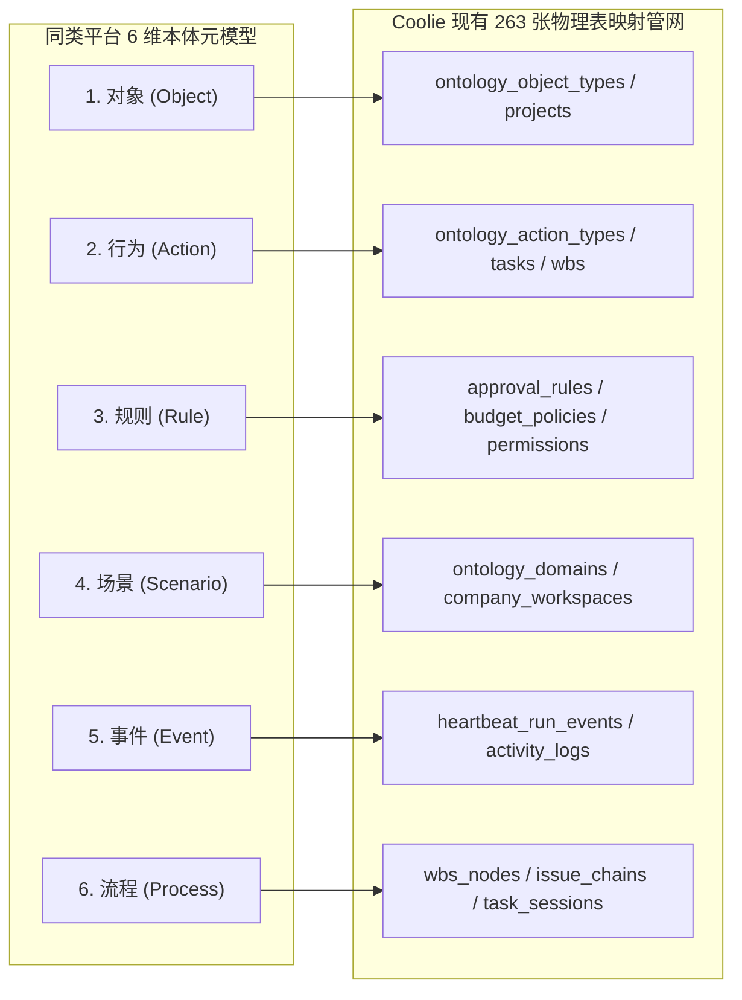

# 2026-10-06 同类本体一体化平台深度对标与 Coolie 活体演进白皮书 (Benchmark & Evolution Master Plan)

> **对标来源**：微信公众号「人月聊IT」（何明璐）核心长文《本体论和AI大模型05-从本体建模和运行一体化平台到本体论咨询实施》（全文 2.3 万字实操复盘）  
> **核心使命**：老板原话拍板——*“还是要沉淀同类的本体平台功能，咱们不能落后”*。  
> **架构定位**：本文将同类基于 Harness 底座的本体建模与运行一体化平台思想，与 Coolie 平台的**公理一（活体本体即中枢）、公理二（极简两字人机工程）、公理三（不可变证据与 G1-G5）及全盘 263 表物理硬约束**深度熔炼，输出 Coolie 平台的反超对标架构与落地规范。

---

## 一、 同类本体平台核心本质深度剖析

根据《本体论和AI大模型05》长文，同类成熟本体平台的架构本质可提炼为**三位一体核心模型**：

```
                    ┌──────────────────────────────────────────────┐
                    │       本体平台 = 三位一体 (Trinity Architecture)       │
                    └──────────────────────┬───────────────────────┘
                                           │
         ┌─────────────────────────────────┼─────────────────────────────────┐
         ▼                                 ▼                                 ▼
┌──────────────────┐             ┌──────────────────┐             ┌──────────────────┐
│  Harness 技术底座 │             │   本体建模规范   │             │  显性化指导书体系 │
│ (Universal Harness)│             │ (6-Dim Ontology) │             │ (Domain Guides)  │
├──────────────────┤             ├──────────────────┤             ├──────────────────┤
│• 长上下文管理与压缩 │             │• 业务对象 (Object)│             │• 行业工作经验沉淀 │
│• 长期记忆与检索   │             │• 业务行为 (Action)│             │• Markdown 结构提示│
│• 多 Agent 并行调度│             │• 约束规则 (Rule)  │             │• 可复用 Skills 包 │
│• 确定性沙箱隔离   │             │• 业务场景 (Scene) │             │• 场景到模型的映射 │
│• 不可变 Trace 审计│             │• 触发事件 (Event) │             │• 消除空中楼阁空转 │
│• 拒绝单纯聊天套壳 │             │• 编排流程 (Process│             │• 赋能 FDE 一线实施│
└──────────────────┘             └──────────────────┘             └──────────────────┘
```

### 1.1 为什么单纯做“Agent 聊天套壳”毫无意义？
文章明确指出，很多人将本体平台误认为类似 WorkBuddy 的通用多 Agent 聊天或工作台应用，但**脱离 Harness 技术底座与本体规范的 Agent 聊天系统在企业交付中是完全空转的**：
1. **长上下文暴涨压力**：一个 20 页的企业原始需求，转译生成的软件需求纯文本往往超过 10MB，生成的本体模型也是同等量级。没有强大的 Harness 进行分层上下文压缩、记忆管理与交叉一致性校验，大模型必然迷航甚至发生严重幻觉；
2. **两张皮的根本根因**：过去 10 年企业架构（EA）和数据中台失败的根因，就是“模型画得很漂亮，代码另外手写”，系统与文档割裂运行。本体模型的作用绝非空泛抽象，而是**衔接业务与数据、打通 OLTP 与 OLAP 的活体中枢**。

### 1.2 技术平台 vs 业务平台（内容平台）的双层分野
- **技术平台**：提供通用底座（Harness 调度引擎、模型适配、工具池、存储/向量记忆）。技术平台是通用的；
- **业务平台（内容平台）**：考验的是业务抽象能力、行业理解与方法论显性化。**差的不是技术能力，而是将业务目标转化为本体模型、以及应用本体模型进行分析推理的能力**。

### 1.3 黄金工程原则：代码自动化优先
- **代码自动化优先原则**：需求经过业务建模后，**凡是能够通过代码自动化解决的，100% 优先代码自动化**；
- **AI 能力边界铁律**：**只有存在复杂分析推理、允许不确定性与置信度波动的场景，才采用本体模型 + AI 大模型去解决**！绝不把大模型当低级外包码农去人肉敲 CRUD 样板代码。

---

## 二、 全维度对标矩阵：同类一体化平台 vs Coolie 平台

| 核心维度 | 同类本体一体化平台（人月聊IT / 行业公版） | Coolie 平台（公理体系与最高工程法典） | Coolie 优势与反超落地策略 |
| :--- | :--- | :--- | :--- |
| **底层技术基座** | 基于 DeepSeek Harness (dsh) / 自研通用 Harness | 扁平 Worker 拓扑 + 本地 7 工具池 + 异步 Runner Bridge | **更轻量自治**：消灭单点脆弱的重型网桥，直达原生 CLI，带 `--yolo` 与防挂死重定向 |
| **本体模型结构** | 十类子模型（对象/行为/规则/事件/场景/流程/主体/报表/UI等） | **活体双核驱动 (Object + Action)**，场景与流程收敛于 WBS 任务与状态机 | **杜绝模型膨胀**：以业务对象为态势感知中心，以动作契约为闭环灵魂，严禁过度抽象 |
| **数据持久化底座** | 独立图数据库 / YAML 文件库 / 外挂向量库（与业务库脱节） | **全盘资产 263 张物理表硬约束**，业务实体与动作直接物理映射落库 | **彻底消灭两张皮**：不随意扩表，100% 榨干现有管网，实体状态机即物理数据库真值 |
| **交付人员与角色** | 强调从传统 ERP 咨询顾问向 FDE (前线部署工程师) 转型 | 打造 6 大数字员工本地施工队（墨斗 FDA、铁匠 Core SWE、门神 FDSE、兑底渊 PRE-SRE、百晓生 DS、Hermes PM） | **数字员工本体靶心**：将 FDE 职能固化为 6 大专业数字员工，专岗专责并绑定真实工具池 |
| **人机工程与交互** | 侧重 PC Web 端大屏拓扑网络图谱（手机端无法操作） | **极简主义人机工程学**：6 寸屏去拓扑化、局部 1-Hop 因果流、纯 2 字按钮、5 槽位底栏 | **极致移动现场体验**：客户与高管单手盲操，拒绝华而不实的网状连线图 |
| **实施与证据闭环** | 依赖咨询实施顾问线下交付验收 | **CMMI 5+2 门禁自动化拦截**：G1-G5 物理门禁、真机四态快照、7 处版本一致性守卫 | **编译器与静态守卫硬拦截**：制度严禁口头化，交付前自动化脚本 100% 拦截破损 |
| **重型业务模板** | 多为轻量 Demo 或空白框架 | **`ruoyi-all-next` AI-Driven 重型业务开发模板**，挂载高阶反向思维规则 | **重型工业级底座**：开箱即用 15 大业务域 + 多租户隔离 + 8 大审计底座字段 + 静态 Harness 守护 |

---

## 三、 Coolie 平台吸收同类精髓的四大核心落盘方案

### 3.1 方案一：默认 6 大数字员工 Adapter 及工具配置全面契合（彻底消灭失真）
针对过去默认偏向 `claude_code`（或已退役的 `acpx_local`）的严重漂移，全面完成现场真配校准：
1. **Hermes (PM)**：
   - 适配器：`hermes_local` (Hermes 自己作为唯一 PM 总指挥)；
   - 工具池：`["hermes"]`；
   - 职责：意图识别、结构化 Proposal 卡片转译、WBS 派单与验收汇总。
2. **墨斗 (FDA 前线架构师)**：
   - 适配器：`gemini_local` / `process` (配套 Docker 容器内 Antigravity CLI v1.3.0 + Gemini 3.8)；
   - 工具池：`["agy-gemini3.8", "cmd"]`；
   - 职责：画原型、方案选型、数据隔离设计、本体域规划。
3. **铁匠 / 铁匠贰号 (Core SWE 核心研发)**：
   - 适配器：`claude_local` (通过 `settings.jsonglm` 软链接切换至智谱 GLM-5.3 1M 上下文主力)；
   - 兜底工具：`claude-mm` (MiniMax-M3 长期充裕配额)；
   - 工具池：`["claude-glm", "claude-mm"]`；
   - 职责：核心业务代码、契约守护、复杂逻辑集成。
4. **门神 (FDSE 前线全栈部署工程师)**：
   - 适配器：`process` (配套 CommandCode CLI `cmd` 带 `--yolo --tools-all -t`)；
   - 工具池：`["cmd", "claude-mm"]`；
   - 职责：自动化脚本、全栈单测、E2E 浏览器旅程回归。
5. **兑底渊 (PRE-SRE 产品可靠性专家)**：
   - 适配器：`process` (配套 GitHub Copilot CLI `copilot` 带 `--yolo`)；
   - 工具池：`["copilot", "claude-mm"]`；
   - 职责：发版打包、OTA 巡检、容器健康、生产环境指纹。
6. **百晓生 (DS 部署战略与方案专家)**：
   - 适配器：`claude_local`；
   - 工具池：`["claude-glm", "claude-mm", "agy-gemini3.8"]`；
   - 职责：用户视角端到端业务闭环走查、一票否决权验收。
7. **UI 创建智能推荐**：
   - 在 `AgentBasicsDialog` 中引入 `recommendAdapterForName` 角色感知引擎，根据员工名称自动推荐最优匹配适配器并打上「推荐」标签，杜绝盲目 defaulting。

### 3.2 方案二：`ruoyi-all-next` 重型业务模板挂载高阶反向思维与 Harness 守卫
1. **规则首帧注入**：
   - 固化 `.agents/rules/HIGH-ORDER-INVERSE-THINKING.md` 到 `ruoyi-all-next` 仓库；
   - 在 `.agents/context/ASSEMBLY.md` 中按 `-50` 优先级装配；
   - 在 `packages/shared/contract/agent-profile.json` 与 `AGENTS.md` Universal Directives 中显式注册。
2. **三大全程监督铁律落实**：
   - **敲代码时**：业务对象为王，实体必挂状态机；大模型严禁人肉手写 CRUD 样板代码，强制复用 `BaseMapper` / `BaseService` 并由通用引擎展开；
   - **写单测时**：反假 Mock 铁律，严禁 `expect(true).toBe(true)` 或只断言 `toBeDefined`；必须基于真实 SQLite/PostgreSQL 测试库断言数据真实入库与 4 态状态机迁移；
   - **改接口时**：接口必接 Zod/DTO 强类型校验；零破坏性向下兼容；所有写操作必接不可变操作审计（Audit Log）。
3. **自动化守卫脚本闭环**：
   - 创建 `scripts/guard-high-order-invariants.cjs`，自动扫描规则装配、反空壳单测断言与跨域调用边界；
   - 集成到 `npm run harness:check` 与 `npm run check`，违反门禁一票阻断。

### 3.3 方案三：本体六维元模型与 Coolie 263 物理表映射闭环
将同类平台提出的 6 维本体元模型，无缝映射到 Coolie 现有的物理数据库管网中，杜绝重复建表：



1. **对象 (Object) 映射**：直接对应 `ontology_object_types`，其业务实例由业务库表承载，实现态势感知与字段 Diff；
2. **行为 (Action) 映射**：直接对应 `ontology_action_types` 与 WBS 施工任务，每一个任务施工必挂合法 Action 契约与血缘；
3. **规则 (Rule) 映射**：直接对应 `approval_rules`、`budget_policies` 与系统门禁，硬阻断违规操作；
4. **场景 (Scenario) 映射**：直接对应 `ontology_domains` 与 Project 进厂边界，一项目一本体域；
5. **事件 (Event) 映射**：直接对应 `heartbeat_run_events`（本地物理 run log）与 `activity_logs`（审计追踪）；
6. **流程 (Process) 映射**：直接对应 WBS 里程碑任务链（`wbs_nodes`）与状态机流转。

### 3.4 方案四：方法论指导书（Domain Guides）显性化体系建设
学习同类平台“场景到模型关键映射靠指导书”的思想：
1. **项目域指导书规范**：在项目进厂初始化本体域时，自动生成 `guides/` 目录：
   - `MODELING-GUIDE.md`：业务对象与状态机建模指导书；
   - `SCENARIO-PLAYBOOK.md`：高频业务场景（下单、支付、审批、对账、发布）操作手册；
2. **派单 Brief 自动挂载**：Hermes 7 要素派单简报中，自动抽取当前任务相关的 Guide 片段注入给数字员工，杜绝模型在无业务先验的情况下脱缰盲跑。

---

## 四、 总结：保持绝对领先的 Coolie 意志

「人月聊IT」的文章深刻指出了当前国内本体论落地的浮夸之风，验证了 Coolie 平台三大公理的远见卓识：
1. **我们不盲目追求“全企业大而全虚浮本体”，而是坚持“项目进厂即独立本体域”；**
2. **我们不在手机屏幕上画无法操作的全景网状图，而是坚持“6 寸屏局部一跳因果流与极简两字按钮”；**
3. **我们不靠人肉口头监督，而是通过编译器、静态守卫、不可变证据与 CMMI G1-G5 硬拦截；**
4. **我们不把 AI 当作廉价外包码农，而是全程挂载高阶反向思维，代码自动化优先，AI 专注高价值业务闭环！**

Coolie 平台不仅不会落后，更在**工程落地可行性、人机极简体验与不可变交付治理**上建立了属于自己的坚固护城河！
