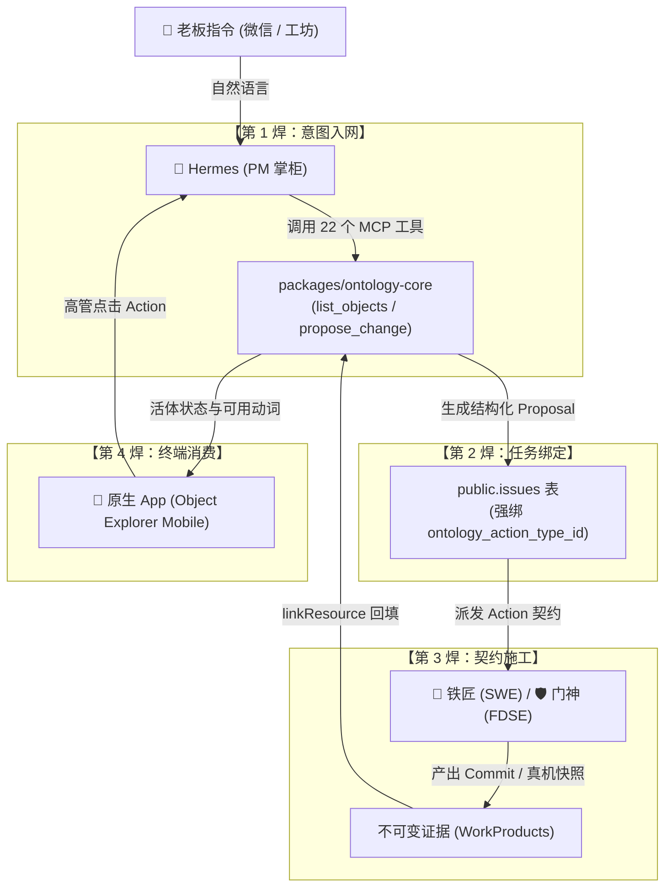

# 业务本体（Living Ontology）全盘物理审计、移动端重构与高阶反向思维沉淀白皮书

> **文档密级**：企业核心战略 / 平台工程法典  
> **归档日期**：2026-10-06  
> **主导视角**：新型软件交付公司负责人 · Palantir 架构体系 · OpenAI/Palantir FDE · 顶级产品总监  
> **核心使命**：彻底刺破“本体空转与两张皮”的皇帝新衣，基于真实数据库 263 表物理审计与 Palantir 第一性原理，确立移动原生端真本体定位与全局高阶反向响应心智。

---

## 目录
1. [老板近 5 天微信核心指示深度复盘：四大合一最高审视视角](#一-老板近-5-天微信核心指示深度复盘四大合一最高审视视角)
2. [全库 263 张物理表代码级硬核审计（真实数据库事实）](#二-全库-263-张物理表代码级硬核审计真实数据库事实)
3. [Palantir 反向工程推导与人月聊IT（何明璐）深度共鸣](#三-palantir-反向工程推导与人月聊it何明璐深度共鸣)
   - 3.1 手机上到底要不要看图谱？
   - 3.2 Web 端的本体功能成熟了吗？
   - 3.3 为什么在本体里做“熔断”毫无意义？
   - 3.4 警惕“企业架构空中楼阁”：确定性归本体，模糊推理归 LLM
4. [原生 APP 业务本体架构重塑：「两核一控」](#四-原生-app-业务本体架构重塑两核一控)
   - 4.1 核一：Object（业务对象探索体 · Object Explorer Mobile）
   - 4.2 核二：Dataset（数据落表真实源 · Data Freshness & Lineage）
   - 4.3 一控：Actions（业务动词手柄 · AIP 飞行摇杆）
5. [四根焊钉：彻底焊死主干业务管网的落地工程指南](#五-四根焊钉彻底焊死主干业务管网的落地工程指南)
6. [永久固化：新会话高阶反向响应协议实施说明](#六-永久固化新会话高阶反向响应协议实施说明)

---

## 一、 老板近 5 天微信核心指示深度复盘：四大合一最高审视视角

过去 5 天（10 月 1 日 ~ 10 月 6 日），老板在微信指令中多次严厉指出“反反复复设计都一样”、“建设了假东西”，并明确立下了**四大合一的最高审视视角**：

### 1. 核心原话真迹（底层数据库真实记录）
- **10 月 2 日 & 10 月 6 日 10:16 / 10:27**：
  > 「原生APP 资产 本体 图谱，列表功能都删除了吧，重新参考web版本体插件 功能建设，**站在 新型软件交付公司负责人的工作需求基础上，以 Palantir 体系，OpenAI FDE，产品总监的严肃视角**，使用模拟器验证 APP 功能，找出缺陷，不只是功能 BUG，设计、布局、产品架构都可以定位，开始用 agent-device，agent-browser 干活吧；  
  > **极简使用主义，不能有重复功能入口，傻瓜式使用最好，不用人培训就可以快速上手使用；不要乱加新功能，要充分把系统本就具备的功能全面 100% 用起来，聚焦产品核心流程，聚焦 AI 交付，聚焦交付质量！**」
- **10 月 6 日 10:22**：
  > 「在设计产品功能时，**现有能力是错的也可以删掉，由我审批就行**。」
- **10 月 6 日 15:29**：
  > 「**你作为顶级 Palantir 产品经理**，web 本体有哪些功能，应该放到原生 app 端。」
- **10 月 6 日 16:58**：
  > 「**本体只是业务模型啊，你熔断干啥呢，意义是啥？**」

### 2. 四大合一维度的行动法则
| 维度 | 角色心智 | 判定标准与铁律 |
| :--- | :--- | :--- |
| **视角 1：新型软件交付公司负责人** | 商业闭环与人效总控 | 拒绝虚假工时汇报；软件自己内部都用不上就是假东西；客户必须能零培训上手。 |
| **视角 2：Palantir 体系** | 业务双核与动作闭环 | 只有 Object（现实世界活体孪生）与 Action（合法业务动词）；消灭死报表与死图谱。 |
| **视角 3：OpenAI / Palantir FDE** | 前线部署与代码真枪实弹 | 拒绝办公室空想；真机模拟器端到端验证；敢于成千行彻底删除错误功能代码。 |
| **视角 4：顶级产品总监** | 极简主义与人机工程学 | 零重复入口；两字按钮铁律；经典 5 槽位底栏；6 寸手机屏坚决不画拓扑图。 |

---

## 二、 全库 263 张物理表代码级硬核审计（真实数据库事实）

通过对运行在 `54329` 端口的 PostgreSQL 数据库进行物理扫描，我们得到了最真实、不可辩驳的资产底数：

```
 物理表总量：263 张
 ├── public 命名空间：225 张 (真实业务活跃运转)
 ├── plugin_ontology 命名空间：37 张 (严重空转割裂)
 └── drizzle 命名空间：1 张
```

### 1. 真实业务到底在哪些表里狂奔？
- **`public.heartbeat_run_events`**：**11,975 行**（Agent 执行事件）
- **`public.activity_log`**：**3,679 行**（审计与日志）
- **`public.heartbeat_runs`**：**882 行**（调度记录）
- **`public.workspace_operations`**：**836 行**（文件改动）
- **`public.cost_events`**：**613 行**（Token 账单）
- **`public.issues`**：**521 行**（实际被执行的任务工单）
- **`public.issue_comments`**：**231 行**
- **`public.documents`**：**144 篇**（需求与规格文档）
- **`public.issue_work_products`**：**89 个**（研发交付物）
- **`public.projects`**：**17 个**

### 2. 本体 37 张表为什么被判定为“严重空转”？
- **有数据的仅 6 张表**：
  - `ontology_edges` (12,180 行)、`ontology_audit_logs` (174 行)、`ontology_nodes` (148 行)、`ontology_relation_types` (103 行)、`ontology_node_types` (71 行)、`ontology_domains` (9 个)。
  - **真相取证**：9 个域中，8 个是 Fourth Coffee、Healthcare 等 Palantir 演示 Mock 域；148 个节点全是预设的 `CORP_MAIN`、`DEPT_RD` 骨架数据，**没有承载过一个系统内部真实的业务实体**。
- **代表工业级闭环能力的 31 张核心表，全部为 0 行！**
  - **`ontology_action_types`**：**0 行**（没有动作，本体就是死尸）
  - **`ontology_datasets`**：**0 行**（没有数据集流动）
  - **`ontology_connectors`**：**0 行**（没有真实连接器）
  - **`ontology_transforms`**：**0 行**（没有数据清洗管道）
  - **`ontology_cognition_jobs`**：**0 行**（代码逆向未启用）
  - **`ontology_aip_logics`**：**0 行**（智能体逻辑为空）
  - **`ontology_proposals`**：**0 行**（会话提案从未落地）
- **历史冗余**：`public` 下的 6 张旧本体表（`ontology_branches/functions/links/objects/properties/types`）同样全部是 **0 行**，沦为幽灵死表。

---

## 三、 Palantir 反向工程推导与人月聊IT（何明璐）深度共鸣

精读微信公众号“人月聊IT”（何明璐）文章《聊聊本体论落地中的本体平台，业务建模和实施咨询》及相关著作，结合 Palantir 第一性原理，破除三大认知误区：

### 3.1 手机上到底要不要看图谱？
- **结论：绝不要看全局网状拓扑图谱！**
- **人机人因学**：6 寸手机屏是单手盲操与碎片扫视场景。在上面放 150 节点力导向图，除了黑成一团、手指点不中之外毫无用处。
- **Palantir 真髓**：移动端只看**“局部一跳因果链（Local 1-Hop Chain）”**。点开一个对象，看到上下游卡片流即可：
  `[客户] ➔ [订单 #902] ➔ [仓储物流]`。

### 3.2 Web 端的本体功能成熟了吗？
- **结论：未成熟，是典型的“两张皮空中楼阁”！**
- Web 端虽然写了 5280 行前端与 15 个 View，但 Connectors 是静态的、没有真实的增量数据监听（CDC）、没有真实的写回（Writeback），且主干看板（Issues）和工坊（Board Chat）根本不读写这套本体。

### 3.3 为什么在本体里做“熔断”毫无意义？
- **老板原话切中要害**：「本体只是业务模型啊，你熔断干啥呢，意义是啥？」
- **概念厘清**：熔断（Circuit Breaker）是 SRE 运行时与流量网关的基础设施行为；本体是**业务的心智模型与元数据规则**。在业务模型里放熔断按钮，等于“把字典撕掉一页当成给服务器降温”，纯属工程师概念混淆的自嗨。

### 3.4 警惕“企业架构空中楼阁”：确定性归本体，模糊推理归 LLM
- **何明璐核心洞察**：很多企业一上来就要建大而全的整个企业本体，最后都沦为没人维护的垃圾文档。
- **最佳结合模式**：
  - **本体负责确定性**：对象属性、状态机规则、合法动作参数（沙箱与硬护栏）；
  - **大模型负责模糊推理**：理解自然语言意图、多模态场景匹配；
  - **能代码自动化解决的优先自动化**，不确定场景才用“本体 + AI”。

---

## 四、 原生 APP 业务本体架构重塑：「两核一控」

彻底告别 Web 14 视图搬运，移动端原生收敛为极简两大核心与一个动作控制器：

```
   ┌───────────────────────────────────────────────────────────┐
   │ AppBar: Coolie工坊                              [⚙️ 设置]  │
   │ 资产 › 业务本体                                            │
   ├───────────────────────────────────────────────────────────┤
   │ 【企业活体全貌】                                           │
   │  核心实体 12 类  ·  数据源表 18 张  ·  合法动作 24 项      │
   │  版本状态: v1.4 (Active · 已固化)                         │
   ├───────────────────────────────────────────────────────────┤
   │                                                           │
   │  【核一：业务对象 (Object)】                               │
   │  • 订单 (Order) · 142 正常 / 3 预警                        │
   │  • 客户 (Customer) · 320 正常                             │
   │  • 项目 (Project) · 17 正常 / 2 阻塞                      │
   │                                                           │
   │  【核二：数据源流 (Dataset)】                              │
   │  • mall_orders (PostgreSQL) · 实时同步                     │
   │  • SysUser (REST API) · 延迟 5m                           │
   │                                                           │
   │  【一控：业务动词 (Actions)】                              │
   │  • 点击对象弹出 360 抽屉，底部直达合法动作：               │
   │    [推进] [派单] [审批] ──► 直通工坊数字员工闭环施工      │
   │                                                           │
   ├───────────────────────────────────────────────────────────┤
   │ 底栏 (黄金对称 5 槽位):  [汇览]   [任务]   [ + ]   [工坊]   [资产●] │
   └───────────────────────────────────────────────────────────┘
```

---

## 五、 四根焊钉：彻底焊死主干业务管网的落地工程指南

为彻底终结 263 张表的空转状态，必须将现存管网全部焊死：



1. **焊钉 1（意图入网）**：在 `server/src/routes/board-chat.ts` 中，为 Hermes 注入 22 个本体 MCP 工具，聊天不再裸奔，意图直接物化为 Proposal；
2. **焊钉 2（任务绑定）**：在 `packages/db/src/schema/issues.ts` 中确立 ActionType 约束，派单 Prompt 必须携带本体契约规范；
3. **焊钉 3（证据回填）**：在 `scripts/gate-evidence-ledger.sh` 中调用 `linkResource`，门神 Android 快照与铁匠 Commit 直接挂在本体节点上；
4. **焊钉 4（终端消费）**：移动端只呈现 Object 活体状态与 Action 动词，砍掉网状图谱。

---

## 六、 永久固化：新会话高阶反向响应协议实施说明

为保证全团队（人类与所有 AI 工具）在每一次新开会话时不再从零顺拐，两项制度已永久生效：

1. **协议规范落盘**：
   - 路径：[`.agents/rules/HIGH-ORDER-INVERSE-THINKING.md`](../../.agents/rules/HIGH-ORDER-INVERSE-THINKING.md)
   - 规定了当老板说“修 bug”、“加功能”、“做原型”时，AI 必须自动执行的四步反向穿透框架；
2. **写入最高工程法典**：
   - 路径：[`AGENTS.md`](../../AGENTS.md) 第 19 章；
   - 任何新会话（Antigravity、Claude、Hermes、CMD）在启动时自动读取本章，永久保持顶级架构师与 Palantir FDE 心智！
