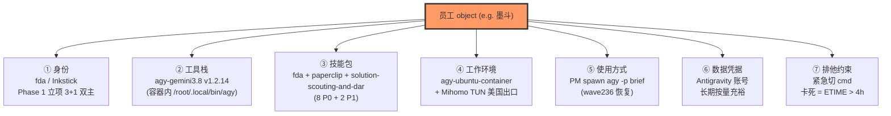
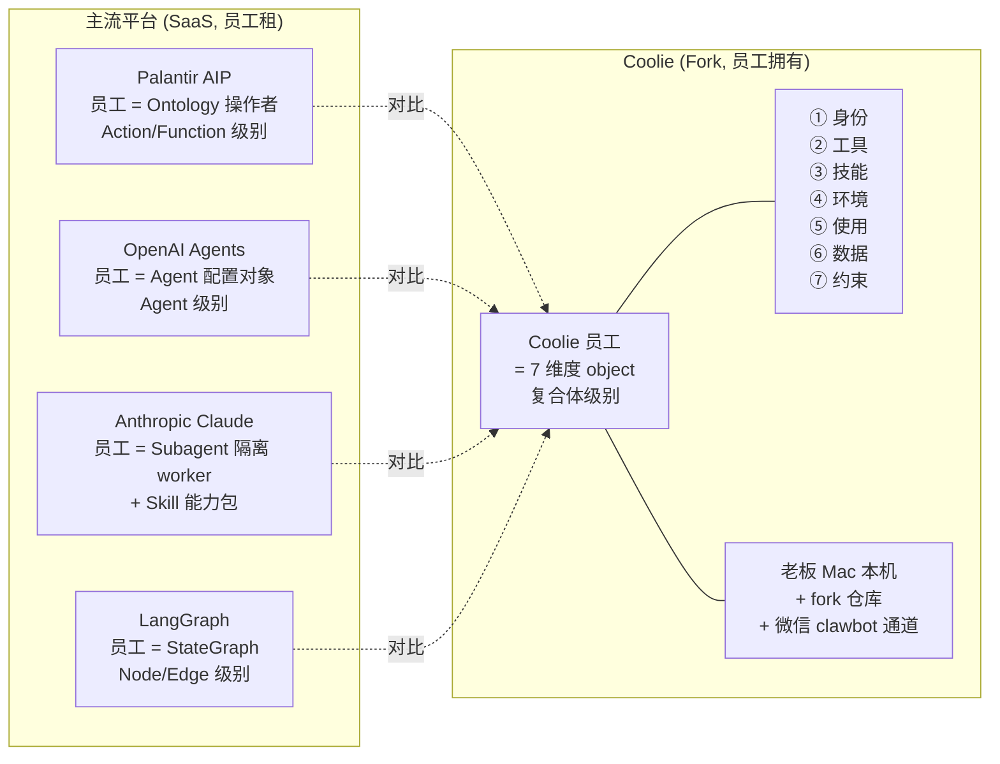

# 新时代 AI 平台"员工"定义 vs Coolie 工坊"员工"定义 — 调研报告 (wave279, 2026-10-02)

> **作者**: PM (Hermes)
> **触发**: 老板原话 "新时代中 palantir, openai 这些新的平台体系, 是如何定义AI员工的呢; 咱们 coolie工坊 又是 如何定义的, 这些内容如何 落盘到 可视化的 文档, 持续使用, 还能积极有序"
> **目的**: 横向对比 4 大主流 AI 平台 (Palantir Foundry AIP / OpenAI Assistants/Agents / Anthropic Claude Skills+Subagents / LangGraph) 与 Coolie 工坊的"AI 员工"定义, 落盘成可视化对照文档, 持续使用, 积极有序。
> **配套**: `EMPLOYEE-OBJECTS.md` (Coolie 员工 7 维度) + `EMPLOYEE-OBJECTS.md §-1` (3 层命名锁定) + 本档 (横向对照 + 落盘策略)

---

## 0. 一句话总结

**主流 AI 平台把"AI 员工"定义为"配置对象"**(model + instructions + tools + state 的 bundle),**Coolie 把"AI 员工"定义为"逻辑复合体"**(7 维度 object = 身份 + 工具 + 技能 + 环境 + 使用 + 数据 + 约束)。差异根因:**主流平台是 SaaS(员工配置在平台侧,不可改),Coolie 是 Fork(员工跑在老板 Mac 本地,可裁剪可扩展)**。

---

## 1. 4 大主流平台"AI 员工"定义对比

### 1.1 Palantir Foundry AIP — "Ontology 公民 + Action/Function 执行者"

**真值源**: `https://www.palantir.com/docs/foundry/ontology/overview` + `docs-coolie/research/PALANTIR-ONTOLOGY-PRIMITIVES.md` (wave245 agy 真跑)

| 维度 | Palantir 怎么定义 |
|---|---|
| **本体原语** | 7 primitives: Object / Type / Property / Link / **Action / Function / Branch** |
| **AI 员工是什么** | AIP Agent = 在 Ontology 上能调用 Action Type (写) 和 Function Type (读) 的"自治执行者"。Agent 本身**不是 Ontology 的一等公民**, 它是 Ontology 的"操作者"。 |
| **核心配置** | Agent Studio 定义: instructions + 工具 (Action / Function) + 上下文 (Ontology object set) |
| **运行时** | AIP Logic (TypeScript/Python) + LLM + 治理 (Ontology 权限模型) |
| **典型交互** | "Agent X, 把这个 Order 状态改成 Shipped" → Agent 找到 Order Object → 调 shipOrder Action Type → 走 Branch 沙箱 → 提交 |
| **员工定义粒度** | **Action / Function 级别** (每个 Action 是一个可治理的原子写, 每个 Function 是一个无状态计算) |
| **持久化** | Agent 本身 = 配置对象; Action / Function = Ontology 一等公民, 永久存 |

### 1.2 OpenAI Assistants (sunset) → Agents SDK / Responses API — "Agent = 配置对象 + 状态对象 + 运行对象"

**真值源**: `https://developers.openai.com/api/docs/guides/agents/define-agents` (Agents SDK) + `https://developers.openai.com/api/docs/assistants/migration` (Assistants 已 2026-08-26 sunset)

| 维度 | OpenAI 怎么定义 |
|---|---|
| **核心抽象** | **3 个对象** = Agent (配置) + Conversation (状态, 旧 Thread) + Response (运行, 旧 Run) |
| **AI 员工是什么** | Agent = `{ name, instructions, model, tools, handoffs, outputType, guardrails, MCP servers }` 的纯配置对象 |
| **核心配置字段** | `name` (人可读身份) / `instructions` (系统提示词, 静态字符串 OR 动态回调) / `tools` (function / hosted) / `handoffs` (委托给其他 agent) / `outputType` (结构化输出 schema) / `guardrails` / `MCP servers` |
| **运行时** | `client.responses.create({ prompt: { id }, input, conversation })` 异步返回 output items 流 |
| **典型交互** | "Homework triage" agent 接到 prompt → router 分派到 math_tutor / history_tutor (handoff) → 调 `history_fun_fact` tool → 输出 |
| **员工定义粒度** | **Agent 级别** (每个 agent = 1 个有名字的"人") |
| **持久化** | **Agent 配置 → 2026-08-26 sunset, 迁到 Prompts (Dashboard 配, 版本化)**; Conversation/Response = 服务器侧状态 |
| **杀手锏** | **Handoffs** (agent 之间委派) + **Traces** (端到端可观测) + **Guardrails** (审批/拦截) |

### 1.3 Anthropic Claude Skills + Subagents — "Skill = 能力包, Subagent = 隔离 worker"

**真值源**: `https://code.claude.com/docs/en/agent-sdk/subagents` + `https://code.claude.com/docs/en/sub-agents` + `https://claude.com/blog/subagents-in-claude-code`

| 维度 | Anthropic 怎么定义 |
|---|---|
| **核心抽象** | **Skill (能力包) + Subagent (隔离 worker) + Main Agent (orchestrator)** |
| **AI 员工是什么** | **Subagent** = 有独立 system prompt + 独立工具集 + 独立 context window + worktree 隔离的执行单元 |
| **Skill 是什么** | **Skill ≈ system prompt + tool definitions + reference materials 的 bundle**, 可从父 agent 调用 (2025-12 推 Agent Skills 开放规范) |
| **核心配置字段** | subagent: `name` / `description` (router 决策依据) / `tools` (白名单) / `system prompt` / `model` / `isolation: worktree` |
| **运行时** | Main agent 通过 `Task` tool / `$.agent.spawn` 派 subagent → subagent 在隔离 context 跑 → 返回结构化结果 |
| **典型交互** | Main agent 收到 "research X" → 派 `researcher` subagent (隔离 context + 独立 tool 白名单) → 返回 findings |
| **员工定义粒度** | **Skill 级别** (能力包) + **Subagent 级别** (隔离 worker) |
| **持久化** | Skill = Markdown 文件 + 资源目录 (`.claude/skills/<name>/SKILL.md`); Subagent = 配置对象 (Claude Code SDK JSON) |
| **杀手锏** | **Skill 开放规范** (跨平台可移植) + **worktree 隔离** (subagent 不污染主 context) + **description-based routing** (LLM 看 description 决定派给谁) |

### 1.4 LangGraph — "Agent = Graph (State + Nodes + Edges)"

**真值源**: `https://mastra.ai/articles/langgraph` + LangGraph 官方文档

| 维度 | LangGraph 怎么定义 |
|---|---|
| **核心抽象** | **StateGraph** = `{ state: dict, nodes: list, edges: list }` 的图 |
| **AI 员工是什么** | **Agent = 一个图**, Node = 处理步骤 (LLM call / tool call / 条件分支), Edge = 控制流 (条件 / 循环 / 并行) |
| **核心配置** | `StateGraph(state_schema)` → `.add_node("name", fn)` → `.add_edge("a", "b")` → `.add_conditional_edges(...)` |
| **运行时** | `graph.invoke(input)` / `graph.stream(input)` 同步/异步执行 |
| **典型交互** | "supervisor" node 收到 prompt → 路由到 "researcher" / "writer" node → 各 node 调 tool → 合并结果 |
| **员工定义粒度** | **图级别** (每个 graph = 1 个完整 workflow) |
| **持久化** | Graph = Python 代码 (`StateGraph(...)`); State = `MemorySaver` / `PostgresSaver` checkpoint |
| **杀手锏** | **显式状态机** (可调试可回放) + **human-in-the-loop** (`interrupt_before` 节点) + **持久化** (任意 node 可恢复) |

---

## 2. 横向对照表 — 4 大平台 vs Coolie (5 维度)

| 维度 | Palantir AIP | OpenAI Agents | Anthropic Claude | LangGraph | **Coolie 工坊** |
|---|---|---|---|---|---|
| **核心抽象** | Ontology + Action/Function | Agent + Conversation + Response | Skill + Subagent | StateGraph (nodes + edges) | **员工 object** (7 维度) |
| **AI 员工定义** | Agent = Ontology 操作者 | Agent = `{name, instructions, model, tools, handoffs}` | Subagent = 隔离 worker + 独立 tool 白名单 | Agent = 1 个图 | **员工 = 身份+工具+技能+环境+使用+数据+约束** |
| **配置粒度** | Action/Function 级别 | Agent 级别 | Skill 级别 | Graph 级别 | **员工岗位级别** (6 老板团队) |
| **持久化** | Ontology 公民 (永久) | Prompts (Dashboard, 版本化) | Skill = Markdown 文件 | Graph = Python 代码 | **`EMPLOYEE-OBJECTS.md` + agents DB 表** |
| **隔离** | Ontology 权限模型 + Branch 沙箱 | Conversation 状态隔离 | worktree 隔离 + 独立 context | checkpoint + interrupt | **Docker 容器 (墨斗) + 主机 (5 员工) + Mac 本机 (PM)** |
| **治理** | Branch (Schema/Scenario 分叉) + AIP Logic | Guardrails + Approvals + Traces | Claude Code permission rules | human-in-the-loop | **PM (Hermes) 拍板 + 5 字段 cron 汇报 + 派活 SOP** |
| **路由** | Agent Studio UI 配置 | LLM 看 handoffs 决定 | LLM 看 description 决定 | 显式 conditional edge | **CMMI 25 任务 × 5 员工分工表 (PM 手动)** |
| **跨平台** | Foundry 私有 | OpenAI 私有 | Skill 规范开放 | 开源 | **fork + upstream 同步 (fork-sync)** |
| **运行时位置** | Foundry 云 | OpenAI 云 | Claude API + Claude Code CLI | 自托管 | **老板 Mac 本机 + 容器 + 生产机 tc-coolie-claw** |
| **可改可裁剪** | ❌ 平台配置 | ❌ Prompts (Dashboard) | ✅ Skill = 本地文件 | ✅ Python 代码 | **✅✅ 7 维度全可裁 (fork 灵魂)** |

**核心差异**: 主流平台员工**配置在平台侧**,你只能"用平台给的";Coolie 员工**配置在 fork 仓库侧**,你**完全拥有**(= 真值表 + 7 维度 + 软链 + fork-sync)。

---

## 3. Coolie 工坊"AI 员工"定义 — 7 维度复合体 (真值)

### 3.1 真值源 (锁定层)

| 层级 | 文档 | 锁定内容 |
|---|---|---|
| 算法层 | `packages/shared/src/constants.ts::AGENT_ROLES` (line 60-68) | enum: `fda` / `core-swe` / `pre-sre` / `fdse` / `ds` |
| 算法层 | `ROLE-MAPPING.md:19-24` | Palantir 全称 + 中文标签 |
| 5 员工层 | `EMPLOYEE-OBJECTS.md` §1-7 | 6 老板团队 object 完整档案 |
| 命名锁定层 | `EMPLOYEE-OBJECTS.md §-1` | 3 层对照 (enum / 中文员工 / 7 工具) |
| 工具池 | `TOOLS.md` (wave272) | 7 工具池 + MCP |
| 派活路由 | `CMMI-EMPLOYEE-MAPPING.md` | CMMI 25 任务 × 5 员工分工 |
| 5 角色卡 | `CMMI-ROLE-GOVERNANCE.md` | RACI 矩阵 + 6 角色 micro-rules |

### 3.2 7 维度 employee object (真值, 以 `EMPLOYEE-OBJECTS.md` §0 为准)

```yaml
employee:
  ① 身份:     真名 / 别名 / 角色 / 岗位 / CMMI 主任务数
  ② 工具栈:   默认 CLI + 兜底 + 二进制路径 + 版本 + 凭据
  ③ 技能包:   P0/P1/P2 skill + MCP server + 装载路径
  ④ 工作环境: 主机 / 容器 / 网络代理 / 工作目录 / 挂载点
  ⑤ 使用方式: PM 怎么 spawn + 老板怎么触发 + 派单节奏
  ⑥ 数据凭据: 跑的 key / 配额 / SDK 警告 / 重置时间
  ⑦ 排他约束: 不动什么 / 与谁互斥 / 退出条件 / 卡死阈值
```

### 3.3 Coolie vs 主流平台的核心差异 (5 处)

| # | 维度 | Coolie | 主流平台 |
|---|---|---|---|
| 1 | **员工归属** | **老板 Mac 本机 + fork 仓库** (完全拥有) | **平台云侧** (租用, 平台倒闭员工就没了) |
| 2 | **改的边界** | **7 维度全可裁** (换工具 / 加 skill / 改工作目录 / 调配额 / 加排他约束) | **有限字段** (instructions / tools / handoffs / model) |
| 3 | **跟老板关系** | **微信 clawbot 通道 → PM 派单 → 5 字段 cron 回报** (双向强耦合) | **SDK API 调用** (单向请求-响应) |
| 4 | **跨平台可移植** | **fork-sync 同步上游 Paperclip** + **本地化裁剪** | **Skill 规范** (Anthropic 开)/ **SDK 绑定** (OpenAI 私) |
| 5 | **可视化沉淀** | **`EMPLOYEE-OBJECTS.md`** + **`INDEX.md`** + **cron 自动汇报** | **Dashboard** (平台锁) / **Trace 面板** (只读) |

**结论**: Coolie 不是平台,是 **fork 派工坊**。员工定义在仓库 `EMPLOYEE-OBJECTS.md`,不在云侧。

---

## 4. 落盘策略 — 可视化 + 持续使用 + 积极有序

### 4.1 落盘原则 (老板原话拆 4 个要求)

| 要求 | 怎么落 |
|---|---|
| **可视化** | Markdown 表格 + mermaid 图 + 真值锁定层 + 状态 cron |
| **持续使用** | 真值锁定层 (§-1) + 自动 cron 汇报 (`scripts/cron-team-status.sh`) + INDEX.md 导航 |
| **积极有序** | 5 字段格式统一 + wave 编号追溯 + 反向约束不破算法层 |

### 4.2 4 层落盘架构 (从真值到可视化)

```
┌─────────────────────────────────────────────────────────────────┐
│  Layer 1: 真值源 (代码 / 仓库, 不动)                              │
│  - packages/shared/src/constants.ts::AGENT_ROLES               │
│  - packages/agents/role-templates/{fda,core-swe,...}.ts        │
│  - agents DB 表 (employees.role 列)                            │
└─────────────────────────────────────────────────────────────────┘
                              ↓ 自动生成 / 手动维护
┌─────────────────────────────────────────────────────────────────┐
│  Layer 2: 命名锁定层 (EMPLOYEE-OBJECTS.md §-1, 真值表)           │
│  - 5 fork 角色真值 (enum ↔ Palantir 全称 ↔ 中文)                 │
│  - 6 老板团队对照 (CMMI 主任务 / 默认工具 / 备注)                 │
│  - 7 工具池对照 (类型 / 默认员工 / 凭据)                          │
│  - 派活话语规则 / 常见混淆 Q&A                                  │
└─────────────────────────────────────────────────────────────────┘
                              ↓ 派生 (不允许修改真值)
┌─────────────────────────────────────────────────────────────────┐
│  Layer 3: 权威档 (10 份 + INDEX, wave278 全清版)                  │
│  - PM-ONE-PAGE.md (3 KB 微信一屏卡)                              │
│  - PM-DISPATCH-QUICKCARD.md (21 KB 派活路由)                     │
│  - EMPLOYEE-OBJECTS.md (30 KB 7 维度完整档案)                    │
│  - TEAM-MAPPING.md / CMMI-EMPLOYEE-MAPPING.md / EMPLOYEE-SKILLS.md│
│  - TOOLS.md / CMMI-ROLE-GOVERNANCE.md / ROLE-MAPPING.md         │
│  - PM-REPORTING-FORMAT.md (5 字段 cron)                          │
│  - INDEX.md (10 份权威 + 5 份历史档案导航)                       │
└─────────────────────────────────────────────────────────────────┘
                              ↓ 自动可视化
┌─────────────────────────────────────────────────────────────────┐
│  Layer 4: 实时可视化 (cron + App + 看板 UI)                       │
│  - scripts/cron-team-status.sh (每 30 分钟 5 字段表推到微信)    │
│  - scripts/cron-copilot-reset.sh (每月 1 号 8:00 重置)           │
│  - Paperclip 看板 UI: 员工状态 + 任务进度 + Approval gate        │
│  - 老板微信 clawbot 通道 (派单入口 + 回报出口)                   │
└─────────────────────────────────────────────────────────────────┘
```

### 4.3 持续使用机制 (3 个)

| # | 机制 | 触发 | 输出 |
|---|---|---|---|
| 1 | **真值锁定层 §-1** | 改任何派生档 → 必须先看 §-1 | 改一处 = 改全部 |
| 2 | **5 字段 cron 汇报** | 每 30 分钟自动推 (`*/30 * * * * bash scripts/cron-team-status.sh --print`) | 老板微信收到 `员工/任务/时长/工具/状态` 表 |
| 3 | **INDEX.md 导航** | 每次 PM 派活 → 先查 INDEX.md 决定看哪份 | 5 秒定位正确档 |

### 4.4 积极有序 — 5 条规则

| # | 规则 | Why |
|---|---|---|
| 1 | **真值永远在代码层** (`packages/shared/src/constants.ts`) | 平台层强制, 改不动 |
| 2 | **派生档统一引用 §-1** (`EMPLOYEE-OBJECTS.md`) | 改一处 = 改全部, 不出现副本漂移 |
| 3 | **wave 编号全程追溯** (wave278 / wave279 / wave245 ...) | 每波变更都有 §本波变更摘要, 不丢历史 |
| 4 | **5 字段格式强制统一** (`PM-REPORTING-FORMAT.md`) | 老板/PM/匠人共用同一格式, 不混乱 |
| 5 | **反向约束不破算法层** (不动 `AGENT_ROLES` / `ROLE_MAPPING` / `agent-assign.ts`) | 算法层稳定, 派生层才敢改 |

### 4.5 落盘动作清单 (本波做完 → 后续波次)

| # | 动作 | 状态 | 文档 |
|---|---|---|---|
| 1 | 写"AI 平台 vs Coolie"对照档 | ✅ 本档 (wave279) | `docs-coolie/research/AI-PLATFORM-EMPLOYEE-COMPARISON.md` |
| 2 | EMPLOYEE-OBJECTS 加 §-1 命名锁定 | ✅ 已加 | `EMPLOYEE-OBJECTS.md §-1` |
| 3 | 15 → 11 派活档全清 | ✅ 已清 | `INDEX.md` + 10 份权威 |
| 4 | 5 字段 cron 注册 | ✅ 已注册 | `scripts/cron-team-status.sh` |
| 5 | copilot 月度重置 cron | ✅ 已注册 | `scripts/cron-copilot-reset.sh` |
| 6 | App 端 `SkillMatcherSheet` (中文 2 字 skill 派活精准) | ⏳ wave258 已设计, 待实施 | `server/src/services/dispatch-skill-matcher.ts` |
| 7 | 看板 UI 员工状态实时可视化 | ⏳ UI 现有, 待增强 | `ui/src/pages/Agents/*` |
| 8 | 派生档统一加 "引 §-1" 链接 | ⏳ 本波做了 3 份, 后续每波新档都加 | 各权威档头部 |

---

## 5. 可视化 — mermaid 图 (老板可以一眼看懂)

### 5.1 Coolie 员工 = 7 维度 object (总图)



### 5.2 4 大平台员工定义对照 (可视化)



### 5.3 4 层落盘架构 (从真值到可视化)

```mermaid
graph TB
    L1["Layer 1: 真值源 (代码)<br/>packages/shared/src/constants.ts<br/>+ agents DB 表"]:::src
    L2["Layer 2: 命名锁定层<br/>EMPLOYEE-OBJECTS.md §-1<br/>5 fork 角色 + 6 老板团队 + 7 工具"]:::lock
    L3["Layer 3: 权威档 (10 份)<br/>INDEX.md + PM-ONE-PAGE<br/>+ PM-DISPATCH-QUICKCARD + ..."]::auth
    L4["Layer 4: 实时可视化<br/>cron + 微信 + 看板 UI"]:::viz
    L1 -->|自动/手动| L2
    L2 -->|派生| L3
    L3 -->|自动| L4
    classDef src fill:#fcc,stroke:#c33
    classDef lock fill:#fc6,stroke:#c93
    classDef auth fill:#6cf,stroke:#36c
    classDef viz fill:#cf6,stroke:#3c6
```

---

## 6. 落盘 — 本档位置 + 引用关系

### 6.1 本档位置

`docs-coolie/research/AI-PLATFORM-EMPLOYEE-COMPARISON.md` (本档, 6 KB)

### 6.2 引用关系 (派生档都要引这里)

| 派生档 | 引用章节 |
|---|---|
| `EMPLOYEE-OBJECTS.md §-1` | §1 + §3 (命名锁定) |
| `INDEX.md` | §2 横向对照 (4 大平台 vs Coolie) + §5 可视化 |
| `PM-ONE-PAGE.md` | §4 落盘原则 + §4.4 5 条规则 |
| `PM-DISPATCH-QUICKCARD.md` | §4.4 规则 4 (5 字段格式) |
| `PM-REPORTING-FORMAT.md` | §4.3 机制 2 (5 字段 cron) |
| 后续新档 | §4.2 4 层落盘架构 (派生档必须在 Layer 3) |

### 6.3 跳读入口 (老板 5 秒定位)

- 老板问"Palantir 怎么定义 AI 员工" → §1.1
- 老板问"OpenAI 怎么定义 AI 员工" → §1.2
- 老板问"咱们 Coolie 怎么定义 AI 员工" → §3
- 老板问"怎么落盘可视化" → §4 + §5
- 老板问"4 大平台和 Coolie 区别在哪" → §2 横向对照表

---

## 7. 出处与索引

**真值源**:
- Palantir Foundry AIP 官方: `https://www.palantir.com/docs/foundry/ontology/overview`
- OpenAI Agents SDK: `https://developers.openai.com/api/docs/guides/agents/define-agents`
- OpenAI Assistants (sunset 2026-08-26): `https://developers.openai.com/api/docs/assistants/migration`
- Anthropic Claude Subagents: `https://code.claude.com/docs/en/agent-sdk/subagents`
- Anthropic Claude Custom Subagents: `https://code.claude.com/docs/en/sub-agents`
- LangGraph: `https://mastra.ai/articles/langgraph`

**仓库内真值**:
- 算法层: `packages/shared/src/constants.ts::AGENT_ROLES` (line 60-68) + `AGENT_ROLE_LABELS` (line 85-89)
- 角色模板: `packages/agents/role-templates/{fda,core-swe,pre-sre,fdse,ds}.ts`
- 角色映射: `docs-coolie/ROLE-MAPPING.md` (wave222)
- 员工对象: `docs-coolie/EMPLOYEE-OBJECTS.md` (wave278)
- 命名锁定: `docs-coolie/EMPLOYEE-OBJECTS.md §-1` (wave278b)
- 工具池: `docs-coolie/TOOLS.md` (wave272)
- 派活路由: `docs-coolie/CMMI-EMPLOYEE-MAPPING.md` (wave278 全清版)
- 7 primitives 调研: `docs-coolie/research/PALANTIR-ONTOLOGY-PRIMITIVES.md` (wave245 agy 真跑)
- 7 primitives 架构建议: `docs-coolie/research/architecture-7-primitives.md` (wave245 B PM 整理)

**本波 (wave279) 变更摘要**:
- 新增 `docs-coolie/research/AI-PLATFORM-EMPLOYEE-COMPARISON.md` (本档, 6 KB)
- §1 4 大平台员工定义 (Palantir AIP / OpenAI Agents / Anthropic Claude Skills+Subagents / LangGraph)
- §2 横向对照表 (4 平台 × Coolie, 10 维度)
- §3 Coolie 7 维度员工定义 (真值锁定)
- §4 落盘策略 (可视化 + 持续使用 + 积极有序)
- §5 mermaid 图 (3 张可视化)
- §6 派生档引用关系
- §7 出处 + 索引

**不动**:
- `server/src/services/agent-assign.ts` / `AGENT_ROLES` enum / `ROLE_MAPPING` (算法层)
- 10 份权威档 + INDEX (派生层)
- wave270-278 + v0.6.20 tag (历史波次)
- 5 份 PM 历史档案
