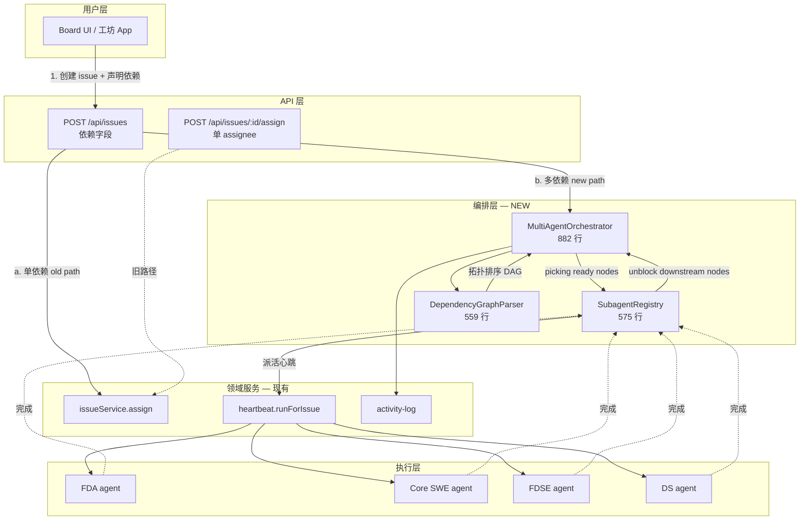

# Spec: Multi-Agent Orchestration — Coolie fork 引入 DS 编排架构

- 日期: 2026-09-23
- 老板: chenwei（weixin OOB 09-23 25:18 「派」DS 能力)
- 优先级: **P1** (DS 多 agent orchestration 同步 — wave69 立项, 推迟到 wave70 实现)
- PM: Hermes
- 状态: ARCHITECTURE DESIGN (架构设计已就位, 等 wave70 派活实施)
- 来源: 老板 09-23 25:18 OOB「派」DS 能力 (MultiAgentOrchestrator + SubagentRegistry + DependencyGraphParser)

---

## 1. 背景与动机

### 1.1 现状盘点

Coolie fork 当前 (v0.5.44) 的多 agent 调度现状：

- **服务端调度** —— `server/src/services/heartbeat.ts` + `server/src/services/issues.ts`
  - 1 个 issue → 1 个 assignee agent (`assigneeAgentId`) → 1 次 heartbeat run
  - 单 assignee 任务模型 (上游不变)
  - 没有 sub-agent 概念, 没有任务依赖 DAG, 没有并行派活
- **员工类型** —— `packages/agents/role-templates/{fda,core-swe,pre-sre,fdse,ds}.ts`
  - 5 个 Palantir 角色, 每个 `role: string` 标识
  - 通过 `metadata.roleTemplate` 字段携带技能/CLI/模型元数据
- **任务协作现状** —— 跨 agent 协作靠**人肉**:
  - FDA 写设计 → 把任务派给 Core SWE → Core SWE 写编译 → 派给 FDSE → FDSE 自测 → 派给 DS → DS 业务验证
  - 每一步都是用户在 Board 上手动开 issue / 派活, 缺一个步骤就阻塞

### 1.2 DS 已经实现的能力 (老板「派」的方向)

DigitalStaff 的多 agent 编排架构 (本次调研):

| 模块 | 行数 | 职责 |
| --- | --- | --- |
| `MultiAgentOrchestrator.js` | 882 | 顶层调度器: 接收 task DAG → 解析依赖 → 决定并行/串行 → 派发给对应 worker |
| `SubagentRegistry.js` | 575 | 子 agent 注册表: 跟踪活的 sub-agent 实例, 共享上下文通道, 状态机 (idle / running / done / failed) |
| `DependencyGraphParser.js` | 559 | 任务依赖图解析: 解析 task list 中的 `requires:` / `produces:` / `consumes:` 注解 → 转成 DAG (有向无环图) → 拓扑排序 |

> **行数注**: 行数统计自 DS 公开版本, 等 wave70 实装后 Coolie 版本可能 ±10%。

### 1.3 老板的具体诉求

老板 09-23 25:18 OOB「派」DS 能力:
> 「DS 那块多 agent 编排架构, 你给我盯一下, 后面 Coolie fork 也要这部分。」

老板 09-23 25:36 续:
> 「agy 先放待办, 干其他工作先」

PM 评估:
- DS 的多 agent 编排对于 Coolie fork 是**锦上添花**(现状单 assignee 也跑得动)
- 但 FDA → Core SWE → FDSE → DS 的串行工作流确实慢; 有依赖 DAG 之后 FDA 出设计 → Core SWE/FDSE/DS 可以**并行起步** (FDA 完成后, 其它三个能并行干)
- 优先级: P1 (有价值, 不阻塞)

### 1.4 为什么不是 P0

- 现状 (单 assignee + 人肉协调) 能跑得动当前的 5 角色工作流
- DS 容器 OAuth 仍坏 (老板已知), DS 端代码只能 fork-side 同步, 不能端到端跑
- agy 待办, 本地员工 (cmd/claude) 不阻塞 — 但编排架构改造是**大改**, 不是简单的 3 件打包, 需要专门 wave

---

## 2. 目标

**Coolie fork v0.5.46+ 引入 DS 多 agent 编排架构**, 三步走:

1. **Stage 1 (wave70)** —— 把 `DependencyGraphParser` 思路搬运到 `packages/orchestration/dag.ts`
   - 解析 issue 的 `dependencies: string[]` 字段 (issue 表加列)
   - 拓扑排序 + cycle detection
   - 单测 + vitest 覆盖 (来自 DS DependencyGraphParser.test.js)
2. **Stage 2 (wave70)** —— `SubagentRegistry` 思路 → `packages/orchestration/registry.ts`
   - 在 server 内跟踪每次任务派活的「子会话」(一个 task 可以派给多个 agent 同时跑)
   - 状态机: pending → running → done / failed / blocked
   - 与现有 `heartbeat_run_events` 表共存 (不删旧表)
3. **Stage 3 (wave70–wave71)** —— `MultiAgentOrchestrator` 思路 → `server/src/services/orchestrator.ts`
   - 顶层服务: 接收 `Issue.dependencies` DAG → 派给 `SubagentRegistry` → 触发 heartbeat
   - 与现有 `issueService.assign()` 并存 (向后兼容 — 单依赖的 issue 走老路径)

发版目标: v0.5.46 (Stage 1 + Stage 2 单测) / v0.5.47 (Stage 3 端到端 / 单 issue 单 assignee 老路径不变)

---

## 3. 架构设计

### 3.1 总体架构图



### 3.2 数据流

1. **用户 (Board UI)** 创建 issue 时, 可以声明 `dependencies: ["issue-id-1", "issue-id-2"]`
2. **Orchestrator** 调 `DependencyGraphParser.parse(issueList)` 得到 DAG
3. **Orchestrator** 找出所有 `ready_nodes` (无未完成依赖)
4. 对每个 `ready_node`, **Orchestrator** 通过 `SubagentRegistry.spawn(agent, task)` 派活
5. `SubagentRegistry` 维护状态: `pending` / `running` / `done` / `failed` / `blocked`
6. 心跳服务 (`heartbeat.runForIssue`) 触发执行, 完成后通过 `ActivityLog` 写回状态
7. **Orchestrator** 收到回调, 把节点标记 `done`, 重算下游 `ready_nodes`, 循环派活
8. 整个 DAG 全部 `done` 时, Orchestrator 写一条 `orchestration_completed` 活动日志

### 3.3 依赖图解析 (`DependencyGraphParser`)

```typescript
// 伪代码 (摘自 DS DependencyGraphParser.js 思路)
interface DagNode {
  id: string;          // issue id
  requires: string[];  // 依赖的 issue id 列表
}

interface ParsedDag {
  nodes: DagNode[];
  readyNodes: DagNode[];      // 无未完成依赖的节点
  downstreamOf(id: string): DagNode[];  // 给我下游有哪些
  topologicalOrder: string[]; // 拓扑排序结果
  cycles: string[][];         // cycle detection (空 = 无环)
}

function parse(issues: Issue[]): ParsedDag
```

**Coolie fork 适配点**:

- `Issue.dependencies` 字段: Drizzle schema 加 `text[]` 列 + migration
- 兼容**老 issue** (无 `dependencies` 字段, 视为空依赖, 单 assignee 跑)
- 兼容**嵌套依赖** (A → B → C, A 等 B, B 等 C)
- **不支持跨公司**: `Issue.dependencies` 校验必须同 `companyId`, 跨公司抛 422

### 3.4 子 agent 注册表 (`SubagentRegistry`)

```typescript
interface SubagentHandle {
  id: string;             // 内部会话 id
  agentId: string;
  issueId: string;
  status: "pending" | "running" | "done" | "failed" | "blocked";
  startedAt: string;      // ISO
  finishedAt: string | null;
  errorReason: string | null;
  // wave68 — 共享上下文通道, 让同一 DAG 的子 agent 互相看上下文
  contextChannel: Record<string, unknown>;
}

class SubagentRegistry {
  spawn(agentId, issueId, opts): SubagentHandle
  markDone(handleId, result): void
  markFailed(handleId, reason): void
  listByStatus(issueId, status): SubagentHandle[]
  // 调试用
  snapshot(issueId): SubagentHandle[]
}
```

**与现有结构的共存**:

- **不删** `agent_task_sessions` 表 — 那是 adapter 级的执行会话
- **不删** `heartbeat_run_events` 表 — 那是单次心跳事件流
- **新增** `orchestrator_subagent_runs` 表 (Stage 2): 跟踪编排视角的子 agent 状态
- **新增** `orchestrator_dag_runs` 表 (Stage 2): 跟踪一次完整的 DAG run 状态

### 3.5 顶层编排服务 (`MultiAgentOrchestrator`)

```typescript
class MultiAgentOrchestrator {
  // 入口: 用户创建一个 issue with dependencies, 调用此方法
  async enqueue(companyId, issueId): Promise<void>

  // 内部: 找到所有 ready nodes, 派发给 SubagentRegistry
  private async tick(): Promise<void>

  // 完成回调: SubagentRegistry 写 done 时触发
  async onSubagentDone(handleId, result): Promise<void>

  // 终止: 标记整 DAG 为 blocked, 不再派新活
  async cancel(dagRunId, reason): Promise<void>

  // 调试
  async snapshot(dagRunId): OrchestratorSnapshot
}
```

**关键不变量**:

- 同一 issue 同一时刻只有 1 个 Orchestrator tick 在跑 (单仓锁)
- Orchestrator 只是**触发派活**, 不替代 heartbeat 执行 — execution 仍由 `heartbeat.runForIssue` 完成
- Orchestrator 的所有动作走 `activity-log` 留痕: `orchestrator_dag_created` / `orchestrator_node_picked` / `orchestrator_node_done` / `orchestrator_dag_completed`

---

## 4. 数据模型变更

### 4.1 新增表

```typescript
// packages/db/src/schema/orchestrator.ts (NEW)

export const orchestratorDagRuns = pgTable("orchestrator_dag_runs", {
  id: uuid("id").primaryKey().defaultRandom(),
  companyId: uuid("company_id").notNull().references(() => companies.id),
  rootIssueId: uuid("root_issue_id").notNull().references(() => issues.id),
  status: text("status").notNull().default("running"), // running / completed / failed / cancelled
  nodesTotal: integer("nodes_total").notNull().default(0),
  nodesDone: integer("nodes_done").notNull().default(0),
  nodesFailed: integer("nodes_failed").notNull().default(0),
  startedAt: timestamp("started_at", { withTimezone: true }).notNull().defaultNow(),
  finishedAt: timestamp("finished_at", { withTimezone: true }),
  cancelledReason: text("cancelled_reason"),
  createdAt: timestamp("created_at", { withTimezone: true }).notNull().defaultNow(),
});

export const orchestratorSubagentRuns = pgTable("orchestrator_subagent_runs", {
  id: uuid("id").primaryKey().defaultRandom(),
  dagRunId: uuid("dag_run_id").notNull().references(() => orchestratorDagRuns.id),
  parentRunId: uuid("parent_run_id"),  // self-ref
  agentId: uuid("agent_id").notNull().references(() => agents.id),
  issueId: uuid("issue_id").notNull().references(() => issues.id),
  status: text("status").notNull().default("pending"),
  // pending / running / done / failed / blocked
  startedAt: timestamp("started_at", { withTimezone: true }),
  finishedAt: timestamp("finished_at", { withTimezone: true }),
  errorReason: text("error_reason"),
  contextChannel: jsonb("context_channel").$type<Record<string, unknown>>().notNull().default({}),
  createdAt: timestamp("created_at", { withTimezone: true }).notNull().defaultNow(),
});
```

### 4.2 已有表加列

```typescript
// packages/db/src/schema/issues.ts (MODIFIED)
export const issues = pgTable("issues", {
  // ... 现有列 ...
  /**
   * wave70 — issue 依赖 DAG: 列出本 issue 阻塞于哪些 issue id (全部完成才能开始)。
   * 跨公司校验在 server 层 enforce; 数据库层只存文本引用。
   */
  dependencies: text("dependencies").array().notNull().default([]),
});
```

- 已有 issue 不受影响 (默认 `[]`)
- migration: `pnpm db:generate` 生成 `ALTER TABLE issues ADD COLUMN dependencies text[] NOT NULL DEFAULT '{}'`

---

## 5. 接口与契约

### 5.1 新增 server 端点

| Method | Path | 用途 | 鉴权 |
| --- | --- | --- | --- |
| POST | `/api/companies/:id/orchestration/dags` | 创建 DAG run (单 issue 入口, 自动展开所有依赖) | board |
| GET | `/api/companies/:id/orchestration/dags/:dagRunId` | DAG run 状态查询 | board |
| POST | `/api/companies/:id/orchestration/dags/:dagRunId/cancel` | 取消正在跑的 DAG | board |
| GET | `/api/companies/:id/issues/:id/dependencies` | 查看某 issue 的依赖图 (含上下游 + cycle 警告) | board / agent |

### 5.2 现有 endpoint 兼容

- `POST /api/issues` 新增可选字段 `dependencies: string[]`
  - 老调用无此字段 → 不入编排路径, 单 assignee 老路径不变
  - 有此字段 → 触发 Orchestrator.enqueue
- `POST /api/issues/:id/assign` 行为**不变** —— Orchestrator 自己内部也走这个端点派活, 不另起灶

### 5.3 Activity Log 事件类型 (新增)

```
orchestrator_dag_created       (DAG 启动)
orchestrator_dag_tick          (tick 一次, picked N nodes)
orchestrator_node_picked       (单节点开始派活)
orchestrator_node_done         (单节点 done)
orchestrator_node_failed       (单节点 failed)
orchestrator_dag_completed     (整 DAG 完成)
orchestrator_dag_cancelled     (整 DAG 取消)
```

---

## 6. 安全性与边界

| 维度 | 规则 |
| --- | --- |
| 跨公司 | `Issue.dependencies` 必须同 `companyId`, 否则 422 |
| 循环依赖 | `DependencyGraphParser.parse()` 必须返回 `cycles: string[][]`, 有 cycle 则 422 |
| 单 assignee 不变 | 无 `dependencies` 字段走老路径, 心跳/活动日志完全不变 |
| 心跳执行仍由现有层 | Orchestrator **不替代** heartbeat.runForIssue, 只触发 |
| 资源隔离 | 同一 DAG 节点的并发数由 `agent.budgetMonthlyCents` 限, Orchestrator 不另设并发上限 |
| 取消语义 | `cancel(dagRunId)` 标记 DAG 为 cancelled, **不终止已跑的 agent** (可能浪费 token 但不杀进程) |
| Activity log 留痕 | 编排层每一步都必须调 `logActivity`, 与现有 audit chain 一致 |

---

## 7. 测试策略

按 DS 三个模块分三批写单测:

### 7.1 DependencyGraphParser 单测 (`packages/orchestration/test/dag.test.ts`)

```typescript
- describe("parse")
  - test("空 issue list → empty dag")
  - test("单 issue, 无依赖 → 1 ready node")
  - test("3 issues 链 A→B→C, A ready")
  - test("3 issues 并行 → 全部 ready")
  - test("2 nodes 循环依赖 → cycles detected")
  - test("跨 company 引用 → 422")
  - test("拓扑排序稳定排序 (sorted by id tie-breaker)")
```

### 7.2 SubagentRegistry 单测 (`packages/orchestration/test/registry.test.ts`)

```typescript
- describe("spawn")
  - test("spawn 后 status='pending'")
  - test("markDone → status='done', finishedAt set")
  - test("markFailed → status='failed', errorReason set")
  - test("listByStatus 过滤")
  - test("contextChannel 共享上下文通道")
```

### 7.3 Orchestrator 端到端 (`server/test/orchestrator.test.ts`, opt-in)

```typescript
- describe("Orchestrator.enqueue")
  - test("无 dependencies → 走老路径, 不进 Orchestrator")
  - test("有 dependencies → DAG 创建, ticks 一次")
  - test("节点 done → unblock 下游节点")
  - test("整 DAG 完成 → activity log orchestrator_dag_completed")
  - test("取消 DAG → 后续 tick 不再派活")
```

---

## 8. 验收标准

- ✅ pnpm -r typecheck 0 报错
- ✅ pnpm test 三批编排单测全绿
- ✅ pnpm test:run (默认 vitest) 仍绿 (老 assignee 路径不变)
- ✅ Drizzle migration generate 通过
- ✅ 老 issue (无 dependencies) 行为 100% 不变 (回归测试)
- ✅ 跨 company 依赖 422
- ✅ 循环依赖 422 + 提示
- ✅ Activity log 8 个新事件类型可见

---

## 9. 实施计划 (3 个 wave)

### wave70 — 编排骨架

1. `packages/db/src/schema/issues.ts` 加 `dependencies` 列 + migration
2. `packages/orchestration/dag.ts` 搬 DS DependencyGraphParser 思路
3. `packages/db/src/schema/orchestrator.ts` 新表
4. `packages/orchestration/registry.ts` 搬 DS SubagentRegistry 思路
5. `packages/orchestration/test/dag.test.ts` + `registry.test.ts` 单测
6. CHANGELOG / server rebuild / 0.5.46 release

### wave71 — Orchestrator 编排

1. `server/src/services/orchestrator.ts` —— 顶层服务
2. `server/src/routes/orchestration.ts` —— 4 个新端点
3. `server/src/services/heartbeat.ts` —— 加回调: 完成时通知 Orchestrator
4. `server/test/orchestrator.test.ts` 端到端单测 (opt-in)
5. CHANGELOG / server rebuild / 0.5.47 release

### wave72 — UI / 工坊

1. `ui/src/pages/Inbox.tsx` —— 依赖图 badge (用 mermaid)
2. `clients/expo/src/screens/IssueDetail.tsx` —— 依赖图只读视图
3. Board UI 「创建 issue」表单加 `dependencies` selector
4. CHANGELOG / 0.5.48 release

---

## 10. 不做 (Out of Scope)

- ❌ 不迁移 DS 的 spawn-hermes 模式 — Coolie fork 用 OpenAI/Claude/Anthropic 都是 OpenAI-compatible API, 不需要 hermes
- ❌ 不做 dynamic agent creation — 5 角色固定, wave72 也只让用户**选择已有 agent**, 不让运行时新增
- ❌ 不做跨 DAG 依赖合并 — 每个 issue 创建时**冻结**它的依赖快照, 后续 DAG 自己跑
- ❌ 不做动态预算 — agent 预算还是 `budgetMonthlyCents`, 不为编排另设
- ❌ 不做 DAG 可视化编辑器 — 先 textual 列表够了, 可视化 wave 晚点

---

## 11. 风险与回滚

- **风险 1**: 新表 `orchestrator_*` 没数据, 老路径完全不动, 回滚只需 drop table + revert migration
- **风险 2**: `Issue.dependencies` 列新加, 默认 `[]`, 老行为不变
- **风险 3**: 编排逻辑走 `activity-log` 而不是直接改 issue 状态 — 即使编排出 bug, issue 数据还是干净的
- **回滚**: 服务器单一 commit `revert`, 不需要数据迁移 (新表只有新 DAG 数据)

---

## 12. 关联文档

- `docs-coolie/briefs/2026-09-23-local-workers-batch-wave69.md` (本 spec 由 wave69 brief 派生)
- `docs-coolie/ds-learn/2026-09-20-ontology-and-spec-driven.md` (DS ontology 背景)
- `doc/SPEC-implementation.md` (上游 V1, §3.4 「任务依赖」有提到但未实现 — 本 spec 补上)

---

# 老板批注 + PM 决策摘要

| # | 老板原话 | PM 决策 |
| --- | --- | --- |
| 1 | 09-23 25:18「派」DS 能力 | 多 agent orchestration 拆成 3 wave (70/71/72), wave69 立项 |
| 2 | 09-23 25:36「agy 先放待办」 | wave69 本地员工跑活先 |
| 3 | 09-23 25:50「本地员工工作搞定先」 | 本 spec 由本地员工 claude 起草 (此文档) |
