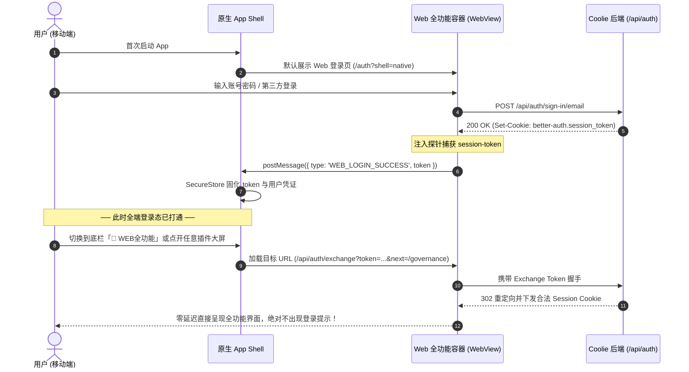

# Coolie 移动端原生应用 (Mobile Cockpit) 0-1 全量重构规格说明书
# (Mobile Native App 0-to-1 Ground-Up Rebuild Specification: Cockpit + Universal Web Engine)

- **文档编号**: SPEC-COOLIE-MOBILE-001
- **版本**: v2.0.0 (深度融合版)
- **创建日期**: 2026-09-26
- **主审架构师**: Principal Product Manager & Chief Architect (DS, FDA & Core SWE)
- **目标工程**: `clients/expo` (React Native / Expo · 包名 `cloud.coolie.app`)
- **关联工程**: `server/` (REST API & Auth), `packages/shared/`, `ui/` (Web 全功能控制台), `packages/plugins/plugin-governance/`

---

## 1. 顶级产品经理战略立论 (Executive Product Thesis)

### 1.1 痛点本质：彻底破除“原生复刻陷阱”
过去移动端迭代陷入了经典的**“原生复刻陷阱 (The Native Rewriting Trap)”**：
1. **功能永远滞后与严重缩水**：
   Web 全功能端作为主战场，演进极其迅速（近期新增了企业级 CMMI 质量门禁、5+2 黄金文档、RTM 需求穿透、SPC 3σ 过程控制、SkyWalking 三态活拓扑、DSH 多协议 API 契约中心、定时例程 Routines、精细化 Token 成本大盘）。
   而移动端试图用 React Native 纯手工重写每一个页面，导致移动端开发永远落后于 Web 端，用户在手机上**“新增的功能完全看不到”**。
2. **两套体系割裂，登录反复输入账号密码**：
   原生端搞了一套登录，内嵌 Web 容器与外部独立 Web App 又各搞一套，导致用户在 App 内一旦点击“Web 全功能”，立即跳出未登录页面要求重复输入账号密码，体验极度割裂。
3. **原生优势未充分发挥，劣势被放大**：
   在手机上纯手写长表单和复杂配置，既吃力又不讨好；而手机最不可替代的硬件特性——**随时随地长按语音派工、系统级锁屏推送、触感震动反馈、相机直接拍摄报错屏幕、毫秒级一键紧急熔断**，反而没有做到极致。

### 1.2 全新架构范式：原生高管指挥舱 + 泛在全功能 Web 引擎
借鉴 **Slack、Linear、Shopify Mobile、微信/飞书** 的成熟跨端架构，重新定义 App 的能力模型：

```
┌─────────────────────────────────────────────────────────────────────────────┐
│                    Coolie 移动端超级控制舱 (Mobile Super-App)               │
├─────────────────────────────────────────────────────────────────────────────┤
│                                                                             │
│  【第一层：原生高管控制舱 (Native Cockpit Layer)】                          │
│  • 语音秒级派工 (Hold-to-Talk) ➔ 腾讯云 ASR + 大模型语义提取                │
│  • 触感滑动快速审批 (Haptic Quick Approvals) ➔ 预算/发布一键批准            │
│  • 硬件级紧急熔断器 (Emergency Kill Switch) ➔ 毫秒级停机下电                │
│  • 多模态原生采集 (Native Camera/Haptics) ➔ 拍照涂鸦直接推工坊              │
│                                                                             │
│  【第二层：泛在 Web 全功能引擎 (Universal Web Engine)】                     │
│  • 100% 具备 Web 端全部功能：项目详情、治理插件 (CMMI/拓扑/API)、Routines   │
│  • Web 端新增任何功能、插件或大屏，移动端零开发秒级同步可见                 │
│  • 原生外壳 (Native Shell) 提供原生导航头、平滑进度条、手势返回与沉浸视口  │
│                                                                             │
│  【第三层：零感知会话互通底座 (Zero-Reauth Session Bridge)】                │
│  • 原生统一使用 Web 登录流 (/auth) ➔ Cookie Jar 与 LocalStorage 全端漫游    │
│  • 绝对杜绝二次输入密码，App 内进入任何 Web 功能页面 100% 免密秒开          │
│                                                                             │
└─────────────────────────────────────────────────────────────────────────────┘
```

---

## 2. 系统服务对象角色与双模体验设计 (Personas & Dual-Mode Experience)

| 服务角色 | 核心关注点 | 移动端交互模式 | 承载载体 |
| :--- | :--- | :--- | :--- |
| **老板 / 创始人 (Boss / Executive)** | 钱花在哪了、谁卡住了、随时语音下达、紧急防爆 | **驾驶舱模式 (Cockpit Mode)**<br>• 今日/本月资金燃尽卡<br>• 单手滑动批准卡<br>• 长按语音即刻建单<br>• 紧急熔断制动按键 | 原生原生组件 (RN Pure Native)，0.3s 极速冷启，触觉与动画拉满 |
| **业务方案 / DS (Deployment Strategist)** | 质量门禁是否达标、界面好不好用、原型走查 | **全功能工作台 (Workbench Mode)**<br>• CMMI G1~G5 会签评审<br>• 5+2 黄金文档与 RTM 穿透<br>• 原生真机沙箱运行前端页面 | 泛在 Web 引擎 (内嵌无缝 WebView，共享 Session，即时具备 Web 全功能) |
| **研发 / FDSE / SWE / SRE** | 代码变更 Diff、流水线日志、微服务拓扑与契约 | **工程与拓扑模式**<br>• 移动优化单列 Git Diff 高亮<br>• 三态活拓扑 (SkyWalking) 巡检<br>• API 契约中心与 Mock 调试 | 原生 Diff 查看器 + Web 全功能插件容器混合驱动 |
| **AI 员工 (Agent Workforce)** | 存活心跳、运行负载、工具库 | **数字员工档案**<br>• 员工实时心电图与心跳延迟<br>• 思考链 (CoT) 智能折叠展开 | 原生工坊 SSE 流 + 员工卡片下潜 |

---

## 3. 全局信息架构：5 栏底盘 + 全功能工作台透传

```
+-----------------------------------------------------------------------------------+
|  [🏢 XROA 智研科技 v]       [🟢 12 Agents 运行中]        [🔍 搜全部]    [🔔 收件箱 (3)] |
+-----------------------------------------------------------------------------------+
|                                                                                   |
|  Tab 1: 汇览驾驶舱 (Cockpit) [原生极速]                                           |
|  • 资金与 Token 实时燃尽大盘 (今日花销、本月预测、超额预警)                         |
|  • 阻断卡点快审浮条 (右滑同意 / 左滑驳回，带触感震动)                              |
|  • 紧急熔断制动器 (Emergency Kill Switch - 防死循环刷爆额度)                        |
|  • 效能指标速报 (交付周期、完成率、吞吐量、故障率)                                  |
|                                                                                   |
|  Tab 2: 工作台 / WEB全功能 (Workbench) [泛在 Web 引擎]                            |
|  • 具备 Web 端的全部菜单与功能，包含最新插件生态：                                 |
|    - 🚀 项目中心 (Projects - 全部项目详情、仓库、分支、工作区)                    |
|    - 🛡️ 质量治理 (Governance - CMMI G1~G5 门禁、5+2 文档、RTM 穿透、SPC 3σ)       |
|    - 🌐 三态活拓扑 (Living Topology - SkyWalking + Chaos 架构动态演练)            |
|    - 🔌 API 契约中心 (API Lifecycle - DSH/MCP 多协议契约沙箱)                     |
|    - ⏱️ 例行计划 (Routines - 自动化周期调度与执行记录)                            |
|    - 📊 成本核算 (Costs - 模型与 Token 消耗全景分析)                              |
|  • 顶部分段切换器 (Projects / Governance / Routines / Costs)，丝滑免密加载         |
|                                                                                   |
|  Tab 3: 调度中心 ([+] / 🎙️) [原生超级交互] —— 居中悬浮突出大按键                  |
|  • 长按按住说话 (Hold-to-Talk)：腾讯云 ASR + 豆包语义提取，3 秒智能建单            |
|  • 轻触快速建单：自包含轻量底抽屉，支持项目关联与 EARS 验收标准输入                |
|                                                                                   |
|  Tab 4: 协同工坊 (Workshop) [原生 + Web 混合]                                     |
|  • SSE 打字机流式输出，智能折叠 Agent 内部推理思考过程 (CoT)                       |
|  • 多模态原生采集：调起真机相机拍摄电脑屏幕报错，圈选涂鸦后发入工坊               |
|  • 交互式富卡片：构建进度、审批请求、交付物卡片                                   |
|                                                                                   |
|  Tab 5: 组织与资产 (Org & Assets) [原生与详情下潜]                                |
|  • 数字员工花名册 (Agent Roster)：点击直达真实员工详情，查看模型配置与技能        |
|  • 交付物中心 (Artifacts Stream)：HTML 原型一键拉起原生真机沙箱走查体验            |
|  • 系统与个人配置：切换公司、OTA 版本检查、清除缓存、退出登录                     |
|                                                                                   |
+-----------------------------------------------------------------------------------+
|  [ 汇览 Cockpit ]   [ 💼 WEB全功能 ]   [ 🎙️ 派工 ]   [ 工坊 Chat ]   [ 资产 Org ]  |
+-----------------------------------------------------------------------------------+
```

---

## 4. 深度技术规格与核心机制实现 (Technical Specifications)

### 4.1 零感知免密认证与 Cookie 共享桥 (Zero-Reauth Auth Bridge)
彻底拔除以前“打开 Web 全功能弹出登录框”的顽疾。



#### 关键实现代码：`clients/expo/src/components/CoolieWebFallback.tsx` 与所有 WebView 调用点修复
必须彻底消除以前 `source={{ uri: COOLIE_WEB_URL }}` 这种无凭证裸请求，统一包裹 Token Exchange：
```typescript
import { getWebExchangeToken, COOLIE_WEB_URL } from "../coolie";

export async function resolveAuthenticatedWebUrl(targetPath: string = "/dashboard"): Promise<string> {
  const token = await getWebExchangeToken();
  const baseUrl = `${COOLIE_WEB_URL.replace(/\/+$/, "")}${targetPath.startsWith("/") ? "" : "/"}${targetPath}`;
  if (!token) {
    return `${baseUrl}?shell=native`;
  }
  return `${COOLIE_WEB_URL.replace(/\/+$/, "")}/api/auth/exchange?token=${encodeURIComponent(token)}&next=${encodeURIComponent(baseUrl)}&shell=native`;
}
```

---

### 4.2 泛在 Web 全功能容器外壳增强 (Universal Workbench Shell)
在 `clients/expo/src/screens/WebContainerScreen.tsx` 与全新工作台 Tab 中引入：
1. **沉浸式原生导航条**：
   - 包含：返回按键、前进按键、页面标题自适应、刷新按键、在外部浏览器打开。
   - 顶部悬挂 2px 极细品牌紫色加载进度条 (`#5E6AD2`)。
2. **物理手势融合 (Gesture Interception)**：
   - Android 物理返回键与 iOS 屏幕左边缘侧滑返回：若 WebView 内部有历史记录（如在项目内点击了某个 Issue），优先在 WebView 内部后退，后退到顶时才退出容器，完全符合原生直觉。
3. **JSBridge 双向通信能力 (Bidirectional Bridge)**：
   - Web 页面可通过 `window.ReactNativeWebView.postMessage(JSON.stringify({ action, payload }))` 调用原生能力：
     - `TRIGGER_HAPTIC`：触发原生马达震动；
     - `TAKE_PHOTO`：调起原生相机并回传 base64 图片；
     - `SHOW_KILL_SWITCH`：弹出原生紧急熔断保护锁；
     - `UPDATE_UNREAD`：更新 App 桌面角标数字。

---

### 4.3 原生高管杀手级功能规格 (Native Executive Superpowers)

#### 1. 长按语音派工 (Hold-to-Talk Voice Dispatch)
- **交互规范**：
  - 手指按下中央 `[🎙️]` 键，设备发出微震 (`Haptics.impactAsync(Light)`)，屏幕弹出声波扩散水波纹动效；
  - 实时采集麦克风流，松手时发出成功震动，若录音时长 < 1 秒则提示“说话时间太短”并取消；
  - 自动向后端 `/api/plugins/paperclipai.plugin-multimodal/api/transcriptions` 提交 base64 录音；
  - 智能语义提取出：
    - `title`：任务主旨（如“修复移动端登录后仍然提示输密码的 Bug”）；
    - `priority`：优先级（语调或字眼包含“加急/严重”设为 `high`/`critical`，否则为 `medium`）；
    - `assignee`：根据上下文匹配最合适的 Agent。
  - 弹出 3 秒倒计时卡片，老板可微调或直接自动下发入库执行。

#### 2. 阻断卡点滑动审批 (Haptic Slide-to-Approve)
- **痛点解决**：彻底消除此前审批分散在 5 处不同界面的混乱问题。
- **组件规范**：
  - 统一为标准 `QuickApprovalCard`；
  - 卡片呈现：申请 Agent 头像、行为类型（预算提额 / 生产发布 / 高危操作）、关联项目、Diff 指纹；
  - 右滑通过滑块通过：滑动到位触发成功强震动；
  - 点击左侧小红键：弹出驳回原因输入框。

#### 3. 硬件级紧急熔断 (Emergency Kill Switch)
- **防爆机制**：
  - 点击大盘右上角红白闪烁的熔断图标，弹出全屏高危警示抽屉；
  - 要求指纹/面容或长按 2 秒确认，杜绝误触；
  - 确认后立即调用 `POST /api/companies/{companyId}/emergency-stop`，将后端所有活动的 Agent 心跳状态置为 `PAUSED`，并在本地断开所有任务调度，阻止任何进一步的 Token 与资金扣费。

---

## 5. EARS 验收标准与质量门禁 (Acceptance Criteria & Gates)

### 5.1 G1 需求覆盖门禁 (EARS 形式化验收)
- **UBIQUITOUS-01 (全功能透传与零落后)**：系统应当在移动端「工作台」Tab 中无缝挂载 Web 全功能（包含刚上线的 `@paperclipai/plugin-governance` CMMI 门禁、三态活拓扑与 API 契约中心），Web 端新增任何功能或插件，移动端无需发版必须 100% 实时可见且功能可用。
- **EVENT-01 (零二次登录)**：WHEN 用户在移动端完成一次登录后，访问任何 Web 容器页面（包括工作台、沙箱、项目详情），系统应当 100% 自动携带 Session Token 与 Cookie，**严禁**出现要求再次输入邮箱或密码的界面。
- **STATE-01 (按住说话派工)**：WHILE 用户按住中央语音键，系统应当保持原生录音并展示波行动画；WHEN 松开时，应当在 2.5 秒内完成识别并呈现任务派发确认。
- **EVENT-02 (一键熔断)**：WHEN 用户触发紧急熔断确认，系统应当在 500ms 内向后端广播停机指令，并将大盘指示灯置为全红告警状态。
- **UNWANTED-01 (断网优雅退化)**：IF 移动设备处于弱网或飞行模式，THEN 驾驶舱大盘应当优雅读取本地 AsyncStorage 缓存数据，展示离线标识，不得出现红屏闪退。

### 5.2 G2/G3 技术合规与代码门禁
- [ ] **TS 编译门禁**：`clients/expo` 目录下执行 `pnpm typecheck` 实现 **0 错误**。
- [ ] **Bundle 打包门禁**：`clients/expo` 目录下执行 `pnpm bundle` 离线打包通过。
- [ ] **视觉设计门禁**：严格遵循 `DESIGN.md` 暗黑层级（`#08090A` / `#0F1011` / `#191A1B`），主色严守 `#5E6AD2`，严禁纯白文字与刺眼强光。

---

## 6. 四步实施落地路线图 (Phased Implementation Roadmap)

```
┌─────────────────────────────────────────────────────────────────────────────┐
│ 第 1 步：底层打通与免密彻底修复 (Immediate)                                │
│ • 修复 CoolieWebFallback / WebContainerScreen 的裸请求漏洞，全量接入 exchange │
│ • 固化统一登录流，实现原生 SecureStore 与 WebView Cookie Jar 双向绝对同步   │
├─────────────────────────────────────────────────────────────────────────────┤
│ 第 2 步：全新 5 栏底盘与全功能工作台透传                                   │
│ • 重构 App.tsx 与 TabBar，落地 Tab 2 [💼 WEB全功能] 挂载容器               │
│ • 支持在移动端工作台直接畅玩 CMMI 质量治理、三态拓扑、API 契约、Routines   │
├─────────────────────────────────────────────────────────────────────────────┤
│ 第 3 步：原生三大杀手级体验做深做透                                         │
│ • Tab 1 驾驶舱大盘：资金燃尽图 + 六维效能 + 紧急熔断器                      │
│ • Tab 3 中央派工：长按语音 (Tencent ASR) + 智能意图建单                     │
│ • 收敛统一收件箱与审批卡片，移除分散在 5 处的重复入口                       │
├─────────────────────────────────────────────────────────────────────────────┤
│ 第 4 步：真机实测与双轨 OTA 发版                                            │
│ • 验证离线体验、弱网提示与手势返回拦截                                      │
│ • 跑通 scripts/publish-ota.sh 生成最新 bundle hash 并同步生产环境           │
└─────────────────────────────────────────────────────────────────────────────┘
```
