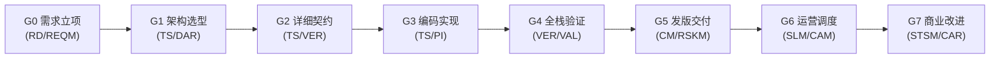

# 计划、会议与 CMMI 研运全生命周期工坊体系规范 (2026-10-03)

> **版本**: v1.0.0 (wave285)  
> **适用**: Coolie 平台本体团队 (Dogfooding) 及企业工坊运行时  
> **核心概念**: 会议体系 (Cadence) · 规划分层 (Planning Hierarchy) · CMMI 研运双轮 (G0-G7) · Hermes MCP 驱动

---

## 1. 业务背景与设计目标

在真实企业与本地团队交付中，工程研发不是孤立的代码提交，而是由**明确的节奏（Cadence）**和**严密的规划（Planning）**驱动的闭环体系。
以往系统偏重原子 Task/Issue，缺乏宏观战略与日常例会的组织抓手，导致：
1. **晨会/周会流于形式**，无法实时聚合「谁在用什么工具干什么」；
2. **长周期计划脱节**，年度目标、季度战役、月度发版与日常 Issue 脱节；
3. **CMMI 阶段与角色强绑定**，缺乏运营闭环（只有研发没有服务与商业价值）。

本规范定义了 Coolie 工坊中**例会体系**、**规划分层**、**CMMI G0-G7 研运闭环**及 **Hermes MCP 驱动协议**。

---

## 2. 计划体系四级分层模型 (Planning Hierarchy)

```
Level 1: 年度战略目标 (Annual Goals / OKR)
   │   例如: 「2026 年度 Coolie 成为领先的本地数字员工协同控制平面」
   ▼
Level 2: 季度攻坚里程碑 (Quarterly Milestones / WBS 主干)
   │   例如: 「2026-Q4 完成 CMMI 研运一体 G0-G7 全面交付与本体自举 (Dogfooding)」
   ▼
Level 3: 月度规划与发版路线图 (Monthly Releases / Waves)
   │   例如: 「10 月份发版 v0.6.23 ~ v0.6.30，闭环移动端与本地工坊稳定性」
   ▼
Level 4: 双周冲刺与工单执行 (Sprint Tasks / Issues)
       例如: 「[COOA-4] 本地团队真实工单驱动平台成熟度闭环 (墨斗承接)」
```

### 实体映射规范
- **Goals 表 (`goals`)**: 承载 Level 1 (年度) 与 Level 2 (季度) 目标，支持树状父子层级 (`parentId`)。
- **Projects 表 (`projects`)**: 承载具体业务域或系统工程（如 `coolie-app`, `coolie-server`）。
- **Issues 表 (`issues`)**: 
  - `isMilestone=true` 承载 Level 3 (月度收口里程碑)；
  - `isMilestone=false` 承载 Level 4 (执行工单)，通过 `parentId` 挂载在里程碑下；
  - 携带 `wbsCode` (如 `1.2.1`) 与 `wbsType` (`phase | work_package | milestone`)。

---

## 3. 会议体系设计规范 (Routines & Cadence)

通过平台的 `routines`（例行自动化机制）将日常沟通固化为系统节律：

| 会议类型 | 触发节律 | 召集角色 | 核心议程与系统产物 |
| :--- | :--- | :--- | :--- |
| **日晨会 (Daily Standup)** | 工作日 09:30 自动触发 | **Hermes (PM)** | 1. 盘点【谁在用什么工具干什么】实时全景；<br>2. 暴露前一日阻断门禁 (`blocked`) 与卡点；<br>3. 确定当日发布与验收目标。<br>产物：晨会纪要评论与工单状态刷新。 |
| **周度复盘 (Weekly Retro)** | 每周五 17:00 自动触发 | **Hermes (PM)**<br>与全体员工 | 1. 复盘本周所有 wave 交付物质量与 7 处版本号一致性；<br>2. CMMI SPC 统计过程控制图波动分析；<br>3. 针对线上故障/阻塞输出 5-Why 鱼骨图与 CAR 缺陷防退化用例；<br>4. 冻结下周 WBS 工作包。 |
| **月度计划会 (Monthly Planning)**| 每月 1 日 10:00 自动触发 | **Hermes (PM)**<br>协同 **墨斗 (FDA)** | 1. 对齐年度目标推进进度；<br>2. 制定月度版本发版路线图与门禁基线；<br>3. 分配各数字员工的核心攻坚方向。 |

---

## 4. CMMI G0-G7 研运全生命周期规范

门禁是**客观质量红线**，角色是**签署主体**。两者完全解耦。



### 阶段标准与证据账本定义 (`.coolie-local/evidence-ledger/<wave>.json`)
1. **G0_Req (需求与立项)**: EARS 语法规范标注的 `requirements.md`，双向需求追踪矩阵 (RTM)。
2. **G1_Arch (架构与选型)**: 租户隔离边界分析、DAR 加权决策矩阵、RBAC 权限矩阵。
3. **G2_Design (详细设计与契约)**: LLD 详细设计说明书、API OpenAPI 契约、DB Schema 迁移单向依赖。
4. **G3_Build (构建实现)**: 编译器 `tsc` 0 报错、Token/Fork-surface 静态守卫通过、单测通过。
5. **G4_Val (全栈体验)**: 端到端旅程穿透、页面四态走查、防假按钮一票否决权 (go/no-go)。
6. **G5_Release (发版交付)**: 7 处版本指纹一致性 (0 偏差)、不可变构建产物 (APK/OTA/Docker) 上线。
7. **G6_Ops (服务运营)**: 服务 SLA 99.9% 监控、数字员工负载与资源调度、告警异常响应 SOP。
8. **G7_Biz (价值与改进)**: 客户验收确认单、任务 ROI / 成本损益核算、CAR 缺陷防退化规则固化。

---

## 5. Hermes MCP 调用协议与实践

Hermes（以及 Mac 宿主机上的 Claude/Cursor）通过 `@paperclipai/mcp-server` 原生接入本地 Coolie Dev（`http://localhost:3100`）：

### 常用 MCP 工具调用映射
- **查看施工总社大盘**:
  `paperclipGetCompanyDashboard({ companyId: "da2e705c-c80a-411b-b2ae-e39372b1251f" })`
- **获取全体在岗员工及技能/工具**:
  `paperclipListAgents({ companyId: "da2e705c-c80a-411b-b2ae-e39372b1251f" })`
- **获取工单及例会事项**:
  `paperclipListIssues({ companyId: "da2e705c-c80a-411b-b2ae-e39372b1251f" })`
- **指派任务并推进状态**:
  `paperclipUpdateIssue({ issueId: "<id>", status: "in_progress", assigneeAgentId: "<agent_id>" })`
- **发表晨会总结与门禁依据**:
  `paperclipAddIssueComment({ issueId: "<id>", comment: "..." })`

---

## 6. 本地落地与验证基线

1. **服务实例**: Mac 宿主机通过 `scripts/coolie-local-dev.sh start` 原生监听 `http://localhost:3100`；
2. **MCP 配置**: `~/.claude.json` 中已注册 `coolie` MCP server (`node --import tsx .../packages/mcp-server/src/stdio.ts`)，状态 **Connected**；
3. **团队归属**: 企业「Coolie 本地施工总社」已创建，Hermes、墨斗、铁匠、门神、兑底渊、百晓生已全量入职并灌注 2 字中文 Skills 与英文 Tools；
4. **例会工单**: 日晨会、周度复盘、月度规划、Dogfooding 4 项协同工单已在平台看板实时运转。
