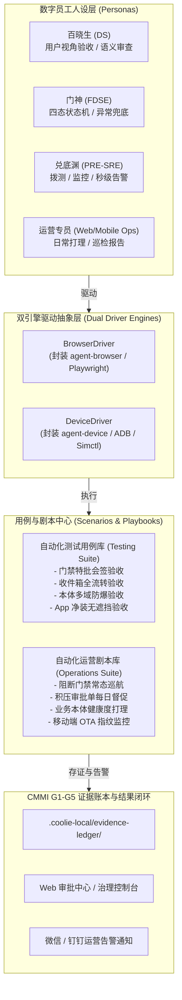
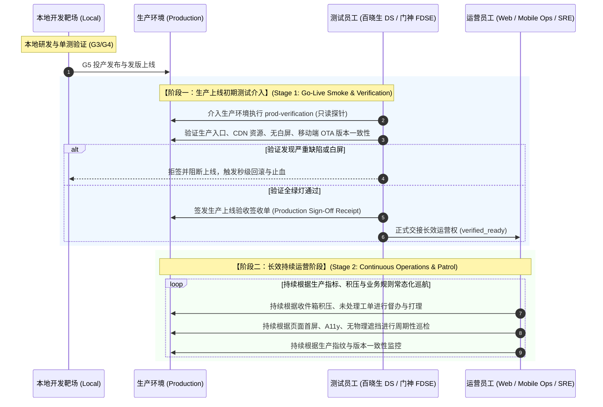

# 2026-10-04 基于 Personas 的 agent-device / agent-browser 自动化测试与自动化运营架构规范

> **状态**: PROPOSED & APPROVED  
> **责任角色**: FDA 墨斗 (架构设计) / FDSE 门神 (测试驱动) / DS 百晓生 (业务验收) / PRE-SRE 兑底渊 (运营巡检)  
> **对应阶段**: CMMI G1-G5 主线体系支撑

---

## 1. 业务背景与战略目标

老板核心指示：
> 「考虑到后续所有的测试，运营要用到 agent-device, agent-browser 来自动化测试，自动化运营，要在代码开发过程就同步写好对应的测试，运营框架代码，同时旧的已经写好的代码功能也要补充对应的用例代码，personas 就是为了这个主线任务做的，你认真架构设计交付。」

### 核心痛点与战略演进
1. **测试与运营脱节**：过去功能代码交付后，测试常依赖人工点按或一次性冒烟脚本，缺乏持续运营巡检能力。
2. **数字员工缺乏实体操作手眼**：数字员工（Personas）不能仅停留在对话框中打字，必须装备真实的操作手眼：
   - **`agent-browser`**：负责 Web 控制台端、管理端及 H5 视图的 DOM 嗅探、表单交互、截图存证与无障碍 A11y 审查；
   - **`agent-device`**：负责 Android / iOS 原生 App（`cloud.coolie.app`）的模拟器与真机操作、深链直达、无白屏验证与物理遮挡审查。
3. **开发左移（Shift-Left）**：任何功能代码在研发时，必须同步交付**自动化验收用例（Testing Spec）**与**自动化运营剧本（Operations Playbook）**，否则不予通过 CMMI G3/G4 门禁。
4. **历史资产补齐**：对已上线的核心功能（架构治理 G1-G5 门禁、审批中心与收件箱、业务本体多域与图谱防爆、移动原生端核心工作台），全量补齐自动化用例与运营剧本。

---

## 2. 总体架构设计



---

## 3. Personas 角色与操作能力映射矩阵

| Persona (员工) | 核心职责 | 绑定工具引擎 | 测试关注维度 (Testing Duty) | 运营巡检维度 (Operations Duty) |
|---|---|---|---|---|
| **百晓生 (DS)** | 业务主审官 / 最终用户 | `agent-browser` + `agent-device` | 业务旅程从头到底连贯性、文案语义一致性、零假按钮、零死链接 | 业务数据孤岛巡检、未关联实体的本体排查、业务阻塞工单走查 |
| **门神 (FDSE)** | 全栈工程交付 / 交互防御 | `agent-browser` + `agent-device` | UI 四态穷举（加载态、空态、成功态、错误态）、极端输入防御、按钮防抖 | 前端性能劣化巡检、客户端崩溃捕获、DOM 物理遮挡嗅探 |
| **兑底渊 (PRE-SRE)** | 产品可靠性 / 发版守卫 | `agent-browser` + `agent-device` | 环境版本指纹握手（7处版本号一致性）、不可变部署验证 | 端点可用性分钟级拨测、DB/PGlite 空间健康度、OTA 缓存失效监控 |
| **墨斗 (FDA)** | 架构设计 / 领域防线 | `agent-browser` | 多组织/企业物理隔离方案、RBAC 权限防线、本体模型守恒 | 数据模型漂移排查、图谱节点连通性巡检 |
| **Web Ops** | Web 端专属日常运营 | `agent-browser` | 浏览器跨内核渲染兼容性、暗黑/明亮主题切换 | 待办收件箱积压巡检、每日早 8 点控制台仪表盘健康巡航 |
| **Mobile Ops** | 移动端专属日常运营 | `agent-device` | Android/iOS 模拟器装机体验、深链回跳完整性 | 生产版本 OTA 生效校验、启动耗时与首屏帧率监测 |

### 3.1 生产环境双阶段接力生命周期模型 (Two-Stage Production Lifecycle)

真实工程落地中，**生产环境（Production）并非仅由运营独占，而是具有严密的双阶段接力机制**：



```
┌────────────────────────────────────────────────────────────────────────┐
│                        生产与本地双环境作业流转矩阵                        │
├────────────┬────────────────────┬──────────────────────────────────────┤
│ 维度       │ 本地测试 (Testing)  │ 生产环境 (Production) 双阶段接力      │
├────────────┼────────────────────┼──────────────────┬───────────────────┤
│ 阶段       │ 研发提测阶段       │ 阶段一：上线初期验真 │ 阶段二：长效常态运营  │
├────────────┼────────────────────┼──────────────────┼───────────────────┤
│ 驱动类别   │ testing            │ prod-verification│ operations        │
├────────────┼────────────────────┼──────────────────┼───────────────────┤
│ 运行环境   │ 本地 (localhost)   │ 生产 (xrobinai)  │ 生产 (xrobinai)   │
├────────────┼────────────────────┼──────────────────┼───────────────────┤
│ 责任角色   │ 门神 FDSE / 墨斗 FDA│ 百晓生 DS / 门神  │ Web/Mobile Ops/SRE│
├────────────┼────────────────────┼──────────────────┼───────────────────┤
│ 核心目的   │ 极端边界与状态机防抖│ 生产冒烟/无白屏签收│ 业务积压督办/常态巡航│
├────────────┼────────────────────┼──────────────────┼───────────────────┤
│ 核心产物   │ 本地 Vitest 测试绿灯 │ 生产 Sign-Off 凭单 │ 日常巡检告警与催办 │
└────────────┴────────────────────┴──────────────────┴───────────────────┘
```

1. **阶段一：生产上线初期测试员工介入（Production Verification）**：
   - **进入时机**：发版投产（G5 Release）成功后立即触发；
   - **核心职责**：由业务方案专家**百晓生 (DS)** 及全栈防线**门神 (FDSE)** 进入真实生产环境，以真实用户视角和真实设备进行**无损线上冒烟（Go-Live Smoke）**；
   - **验证重点**：生产域名与 CDN 解析、前端 SPA 入口无白屏、收件箱只读数据交互、原生移动端与生产 OTA manifest 版本一致性；
   - **准出铁律**：测试员工必须签发《生产上线签收凭证》（`ProductionSignOffReceipt`），将系统标记为 `verified_ready`，才正式移交控制权。若发现白屏或核心死穴，测试员工持有一票否决权，阻断上线并建议触发回滚。

2. **阶段二：长效持续运营阶段（Continuous Operations）**：
   - **进入时机**：测试员工生产 Sign-Off 签署完成并移交后；
   - **核心职责**：由 **Web Ops**、**Mobile Ops** 及**兑底渊 (PRE-SRE)** 接棒，持续根据：
     - a) **业务积压**：收件箱未审批项、超期待办工单，执行自动化督办与打理；
     - b) **生产指标**：移动端与 Web 端首屏渲染耗时、无白屏无遮挡巡查；
     - c) **业务规则**：每日定时巡航、异常主动上报飞书/微信。

---

## 4. 双引擎抽象层与平台能力划分 (Dual Driver Contract)

### 4.1 BrowserDriver (封装 agent-browser，专注 Web / PC / H5)
`agent-browser` 是面向所有 **基于网页与浏览器渲染形态（Web / PC / H5）** 的核心驱动手眼：
- **PC 端桌面页面**：专注 1440px+ 宽屏控制台、多列看板、侧边栏折叠展开、大屏本体力导向图谱、悬停 Tooltip 及复杂鼠标交互；
- **Web 响应式页面**：专注 1280px 标准视口自适应、SPA 路由流转、企业多租户数据大盘、收件箱批量操作；
- **H5 移动端网页**：专注 375px/390px 窄屏触控流、微信/企微内置浏览器 H5 容器、原生 App 嵌内 WebView 页面、移动触控手势仿真与软键盘弹起响应。

统一封装以下能力：
- `setProfile(profile: "pc" | "web" | "h5")`: 快速切换 PC 大屏、标准 Web 与 H5 视口预设；
- `navigate(url: string)`: 页面路由直达与网络静默就绪等待；
- `click(selector: string, options?: ClickOptions)`: 智能元素点击（支持防抖检测与 A11y 语义标记匹配）；
- `fill(selector: string, value: string)`: 输入框填充与变更事件触发；
- `assertVisible(selector: string, timeoutMs?: number)`: 元素可见性断言；
- `assertText(selector: string, expectedPattern: string | RegExp)`: 文本真值校验；
- `takeScreenshot(name: string)`: 屏幕快照存证并保存至产物目录；
- `getA11ySnapshot()`: 获取无障碍可达树（`snapshot -i`），提炼精简可交互语义树；
- `checkVisualOverlap()`: 几何坐标重叠计算，审查是否存在浮层遮挡。

### 4.2 DeviceDriver (封装 agent-device，专注原生 Android / iOS 移动端设备)
`agent-device` 则是面向所有 **原生操作系统与移动真机/模拟器设备** 的具身操作中枢：
- **原生 App 容器**：专门驱动 Expo / React Native 原生客户端（`cloud.coolie.app`）；
- **设备级特性**：原生返回键、Home 键、物理方向旋转、深链协议唤起（`coolie://`）、原生权限弹窗、系统通知栏；
- **原生与混合交互**：原生底栏与内嵌 WebView 的登录态穿透与生命周期管理。
统一封装以下能力：
- `launchApp(appId: string)`: 启动原生/Expo 客户端应用；
- `pressKey(key: "back" | "home" | "enter")`: 系统物理键事件注入；
- `tap(selectorOrCoordinates: string | { x: number, y: number })`: 触屏点击；
- `swipe(direction: "up" | "down" | "left" | "right")`: 手势滑动审查长列表；
- `assertScreen(screenName: string)`: 屏幕标题或核心锚点断言；
- `takeDeviceScreenshot(name: string)`: 原生设备截图存证；
- `openDeepLink(url: string)`: 验证深链协议回跳与 WebView 登录态穿透。

---

## 5. 代码开发同步左移规范 (Shift-Left Contract)

从本波次（wave296+）开始，凡在仓库内新增或重构业务功能，研发人员（Core SWE / FDSE）必须遵循 **「三位一体交付铁律」**：
1. **代码实体**：业务前端与后端代码（`ui/`、`server/`、`clients/expo/` 等）；
2. **自动化测试用例**：放置在 `packages/agent-automation/src/scenarios/testing/` 下，命名为 `<feature-domain>.test.ts`；
3. **自动化运营剧本**：放置在 `packages/agent-automation/src/scenarios/operations/` 下，命名为 `<feature-domain>.ops.ts`。

### 5.1 Agent-Native 前端组件强制规范

为了彻底消除 `agent-browser` 与 `agent-device` 在复杂多层级 UI 上的定位盲区与识别漂移，前端底座与业务组件必须严格遵循以下契约：

```
┌────────────────────────────────────────────────────────────────────────┐
│                    Agent-Native UI 前端标准属性契约                    │
├─────────────────┬─────────────────────┬────────────────────────────────┤
│ 属性/特征       │ 适用平台            │ 作用与语义说明                 │
├─────────────────┼─────────────────────┼────────────────────────────────┤
│ data-agent-target│ Web (agent-browser) │ 语义化交互目标，格式: 模块:动作 │
│ data-agent-scope │ Web (agent-browser) │ 作用域隔离，区分多层弹窗/Drawer│
│ data-agent-state │ Web (agent-browser) │ 状态信号: ready/loading/disabled│
│ data-agent-page-ready Web (agent-browser) │ 页面/路由异步加载完成信号灯    │
│ inert           │ Web (agent-browser) │ 多层弹窗打开时底层容器剪枝隔离  │
├─────────────────┼─────────────────────┼────────────────────────────────┤
│ testID          │ Mobile (agent-device) 结构化命名: [Screen]__[Comp]__[Action] │
│ accessibilityViewIsModal Mobile (device)│ 原生弹窗独占，屏蔽下层触控穿透│
│ KeyboardAvoidingView Mobile (device) │ 表单安全区防护，杜绝键盘物理遮挡│
└─────────────────┴─────────────────────┴────────────────────────────────┘
```

**CMMI 门禁强制阻断规则**：
- **G3 详细设计契约门禁**：运行 `bash scripts/check-agent-native-ui.sh` 扫描交互元素 Agent 属性合规性；
- **G4 全栈验收门禁**：必须由门神（FDSE）或百晓生（DS）以 Persona 身份调用 `agent-browser` / `agent-device` 跑通该用例，并将执行成功证据写进 `.coolie-local/evidence-ledger/`，否则禁止进入 G5 投产阶段。

---

## 6. 旧功能补齐用例清单 (Legacy Feature Coverage)

本波次首先完成以下 4 大核心旧功能的自动化测试与运营用例闭环：

| 业务域 | 自动化测试用例 (Testing) | 自动化运营剧本 (Operations) | 责任 Persona |
|---|---|---|---|
| **1. 架构治理与特批放行** | `test-governance-waiver.ts`<br/>验证 G1-G5 门禁列表、阻断申请特批弹窗、填写放行理由提交、审批通过后点亮紫色 Waived 徽章 | `ops-governance-patrol.ts`<br/>定期扫描全企业门禁健康分，统计超期未放行阻断项并向 PM 生成督查报表 | FDSE / PRE-SRE |
| **2. 审批中心与收件箱** | `test-inbox-approvals.ts`<br/>验证收件箱审批卡片专属渲染（门禁特批/雇佣/策略）、一键 Approve/Reject、状态即时流转 | `ops-inbox-triage.ts`<br/>定期扫描滞留 > 24h 的待办审批单，按优先级聚合提醒掌柜 | DS / Hermes |
| **3. 业务本体多域与图谱** | `test-ontology-domains.ts`<br/>验证默认域自生、新增多项目/多本体域、2000+ 关系图谱防爆采样与边聚合渲染 | `ops-ontology-patrol.ts`<br/>每周扫描本体库孤岛实体、冗余连线并给出拓扑优化建议 | FDA / DS |
| **4. 移动原生端工作台** | `test-mobile-app.ts`<br/>验证模拟器 App 冷启、登录态保持、工作空间与资产 Tab 浏览、零白屏零物理遮挡 | `ops-mobile-ota-check.ts`<br/>每次发布前自动核对原生 runtimeVersion 与生产 manifest 哈希一致性 | Mobile Ops / PRE-SRE |

---

## 7. EARS 验收标准 (Acceptance Criteria)

1. **[UBIQUITOUS]** 框架提供统一的 `packages/agent-automation` 独立模块，导出 `BrowserDriver`、`DeviceDriver`、`PersonaRegistry` 与 `PlaybookRunner`。
2. **[EVENT-DRIVEN]** WHEN 执行 `pnpm test:personas` 或 `bash scripts/run-persona-automation.sh` 时，系统 SHALL 能够装载指定 Persona，无缝调用 `agent-browser` 或 `agent-device` 驱动目标环境并生成结构化证据 JSON 与截图。
3. **[STATE-DRIVEN]** WHILE 处于脱机沙箱测试环境且未连接外部真机时，Driver SHALL 自动降级为 Mock/Headless 验证模式，确保 CI 与本地研发不会因外部依赖阻断构建。
4. **[UNWANTED-BEHAVIOR]** IF 任何用例执行失败或页面出现致命错误（白屏、遮挡、假按钮），THEN Runner SHALL 立即捕获失败现场截屏并生成带有 5-Why 根因追溯的 CMMI 缺陷卡片。
