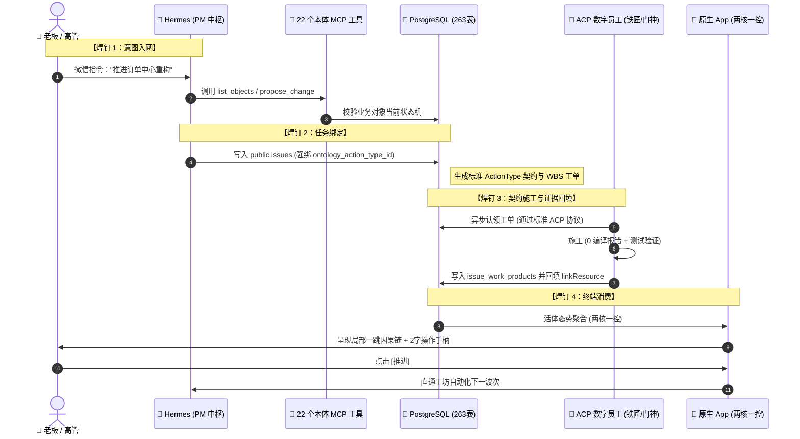

# Palantir 活体本体「两核一控」与全栈双总线协同系统架构规格说明书 (Wave357)

> **文档标识**：`SPEC-20261006-PALANTIR-LIVING-ONTOLOGY-WAVE357`  
> **所属波次**：`wave357`  
> **角色归属**：墨斗 (Inkstick / FDA 前线架构师)  
> **流转工序**：Hermes (PM 总指挥) ➔ 墨斗 (FDA 架构总师) ➔ 铁匠 (Core-SWE 开发) ➔ 门神 (FDSE 验收)  
> **关联决议**：`docs-coolie/specs/DAR-002-PALANTIR-LIVING-ONTOLOGY-VS-WEB-LEGACY-ARCHITECTURE.md`  
> **设计基准**：严格贯彻老板定调的「四大最高交付与使用主义总则」及「全局高阶反向思维协议」

---

## 1. 战略定位与第一性原理 (Strategic Intent & First Principles)

### 1.1 为什么必须在 wave357 进行系统级架构收敛？
在经历了 wave350~wave356 的多轮重构、全库 263 张物理表代码级硬核审计以及 ACP 标准调度协议栈的全面并轨后，平台工程进入了决定性阶段：
- **消灭两张皮空转**：杜绝将“业务本体”当作供人远观的抽象图谱；本体必须是**现实业务世界的活体软件孪生 (Digital Twin)**；
- **打通最后一公里**：将前端 6 寸手机原生端体验、后端 225 张真实活跃业务表、以及底层 6 大 ACP 数字员工施工总线，通过**四根钢质焊钉**彻底焊死；
- **践行老板最高使用主义**：系统零培训上手、傻瓜式操作、两字操作动词、黄金 5 槽位底栏、零重复入口。

```
 ┌─────────────────────────────────────────────────────────────────────────────┐
 │                           Coolie 全栈活体架构全景图                          │
 ├─────────────────────────────────────────────────────────────────────────────┤
 │                                                                             │
 │  【人机交互顶层】  移动原生端 (Expo React Native) · 极简「两核一控」         │
 │                  ├── 核一：业务对象 (Object Explorer · 局部一跳因果链)      │
 │                  ├── 核二：数据源流 (Dataset Freshness · 物理实时态势)       │
 │                  └── 一控：业务动词 (Action Pad · 严格 ≤2 汉字闭环操作)      │
 │                                    ▲                                        │
 │                        第 4 焊：终端消费 (一跳因果)                          │
 │                                    ▼                                        │
 │  【平台中枢大脑】  Hermes PM 微信执行总线 + Living Ontology (packages/db)    │
 │                  ├── 意图入网：自然语言 ➔ 22 个 MCP 本体工具 ➔ 结构化 Proposal │
 │                  └── 任务绑定：public.issues 表强类型绑定 ActionType 契约   │
 │                                    ▲                                        │
 │                        第 2 焊：任务绑定 / 第 3 焊：证据回填                 │
 │                                    ▼                                        │
 │  【底层调度总线】  标准 ACP (Agent Client Protocol) 本地施工队               │
 │                  ├── 6 大适配器：docker-agy / cmd / claude-mm / claude-glm │
 │                  │              / copilot / codex                           │
 │                  └── 6 大数字员工：墨斗(FDA) 铁匠(SWE) 门神(FDSE) 兑底渊(SRE)│
 │                                  百晓生(DS) 掌柜(Hermes)                    │
 │                                    ▲                                        │
 │                        第 1 焊：意图入网 (ACP 标准协议)                      │
 │                                    ▼                                        │
 │  【物理数据底座】  PostgreSQL 263 张物理表 (225 活跃表 100% 榨干，消灭死表) │
 │                                                                             │
 └─────────────────────────────────────────────────────────────────────────────┘
```

---

## 2. 墨斗四大架构防线定义 (FDA Four Architecture Boundaries)

按照 FDA (Forward Deployed Architect) 严苛准则，任何实施推进前必须锁死四层防线：

### 2.1 第一防线：企业物理多租户隔离防线 (Company Isolation Boundary)
- **隔离级别**：平台仅存在 `Company` 作为唯一物理隔离实体（严禁出现“租户/Tenant”等历史废弃概念）；
- **数据面约束**：所有业务对象（Project, Issue, Agent, Artifact, Document）、本体元数据表以及执行事件流，必须以 `company_id` 作为不可变主外键和查询索引首字段；
- **跨公司零串扰**：严禁跨企业共享任何运行时上下文、会话历史或代码产物。

### 2.2 第二防线：真实物理数据源流防线 (Physical Data Freshness Boundary)
- **225 张真实活跃表全面接管**：
  - `public.issues` ➔ 映射为 **Issue (任务工单)** 业务对象；
  - `public.projects` ➔ 映射为 **Project (项目域)** 业务对象；
  - `public.heartbeat_run_events` & `heartbeat_runs` ➔ 映射为 **Agent (数字员工)** 状态机与活动流；
  - `public.issue_work_products` & `workspace_operations` ➔ 映射为 **Artifact (交付产物)**；
  - `public.documents` ➔ 映射为 **Document (需求与规范)**；
- **37 张空转本体表收敛治理**：
  - 彻底停用 0 数据的 Mock 逻辑；
  - 将 `ontology_domains` 严格对齐为企业内激活的真实产品工程项目（17 个真实项目）；
  - 将 `ontology_action_types` 严格对齐为 7 类核心标准操作。

### 2.3 第三防线：RBAC 与人机协同执行权限防线 (RBAC & Execution Authority Boundary)
- **调度单一总指挥**：老板 ➔ Hermes (PM 唯一总掌柜)；
- **施工授权自主化**：
  - 本地数字员工接受 Hermes 派单，运行带 `--yolo` 或 `--dangerously-skip-permissions`，严禁终端交互弹窗挂死；
  - 所有执行指令必须重定向 `< /dev/null`，杜绝 stdin 悬空死锁；
  - 任务超时硬拦截：单次执行时间 `ETIME > 4h` 判定为卡死，自动触发熔断通知并释放锁。
- **高管终端动作权限**：移动端点击 Action 动词（`推进`、`派单`、`审批`）时，系统自动携带当前高管的 `whoami` 与签名凭证，直通 Hermes 微信总线，无需跳转二次确认。

### 2.4 第四防线：系统不变量防线 (System Invariant Boundaries)
1. **零 Mock 业务数据铁律**：严禁在生产或移动端呈现虚拟的 Fourth Coffee / 模拟医院等无关假数据，所有数字必须直接来源于物理表统计；
2. **两字操作动词铁律**：所有操作按钮必须且只能由 **≤ 2 个汉字**构成（如：`推进`、`派单`、`审批`、`查看`、`闭环`、`归档`），严禁出现“一键熔断”、“查看详情”等臃肿文本；
3. **黄金对称 5 槽位底栏铁律**：移动原生底栏固定且仅包含 5 个槽位：`[汇览] [任务] [ + ] [工坊] [资产●]`，严禁任何偏心、浮动或动态增删底栏图标；
4. **移动端零拓扑图谱铁律**：6 寸手机端严禁渲染网状图谱，仅允许渲染单向垂直卡片流与 360 度局部一跳因果链；
5. **CMMI 不可变证据闭环**：任何波次代码修改，必须伴随不可变工作产物（WorkProduct / Commit / 真机验证日志），杜绝口头交付。

---

## 3. 四根焊钉端到端贯通工程规范 (The Four Welds Engineering Pipeline)

为彻底消灭 263 张物理表的空转，系统必须严格执行以下四根焊钉流水线：



### 3.1 焊钉 1：意图入网 (Intent Ingestion)
- **技术实现**：在 `server/src/routes/board-chat.ts` 中，为 Hermes 掌柜注入标准的 22 个本体 MCP 工具（如 `get_ontology_schema`, `query_objects`, `propose_action`, `check_invariants`）；
- **执行逻辑**：当老板在微信群或工坊抛出需求时，Hermes 严禁用普通聊天大模型自由臆测，必须首先调用 MCP 工具查询现有业务实体（如查询当前是否存在 `order` 实体、当前有哪些关联微服务）；
- **输出产物**：自然语言转化为标准化的结构化变更提案（`OntologyProposal`），锁定涉及的实体 ID 与变更边界。

### 3.2 焊钉 2：任务绑定 (Task Contract Binding)
- **技术实现**：在 `packages/db/src/schema/issues.ts` 中，强约束 `issue` 表记录必须关联 `ontology_action_type_id`；
- **契约定义**：
  ```typescript
  export interface BoundActionContract {
    actionTypeId: string;          // 关联的标准动词 ID (如: ACT_REFACTOR)
    targetEntityId: string;        // 目标业务对象 (如: Project_OrderCenter)
    inputSchema: Record<string, any>; // 输入参数严格校验
    outputRequirements: {
      zeroCompileErrors: boolean;  // 必须 0 编译报错
      requiredEvidenceTypes: ("commit" | "test_log" | "screen_snap")[];
    };
  }
  ```
- **消灭幻觉**：派发给铁匠或门神的任务 Prompt 必须自动附加该 Action 契约，工匠无法脱离业务上下文盲目施工。

### 3.3 焊钉 3：契约施工与证据回填 (Contract Execution & Evidence Writeback)
- **技术实现**：在 `scripts/gate-evidence-ledger.sh` 中调用 `coolie.linkResource` API；
- **证据链锁死**：
  - 铁匠（Core-SWE）完成代码修改后，Git Commit Hash 自动写入 `public.issue_work_products`；
  - 门神（FDSE）完成真机模拟器测试后，生成的测试快照与日志自动写入 `public.workspace_operations`；
  - 该工单产物作为不可变边（Edge），直接挂接回本体节点的 `downstream_artifacts`，实现真正的“代码即本体，证据即资产”。

### 3.4 焊钉 4：终端消费 (Terminal Consumption)
- **技术实现**：移动端 `AssetOntologyScreen.tsx` 消费聚合端点；
- **人机呈现**：
  - 放弃全局图谱，点击任一业务对象，弹出 360 度局部一跳因果抽屉；
  - 左侧展示【上游来源】（前驱条件），中间展示【当前实体态势】，右侧展示【下游影响】（后继产物）；
  - 抽屉底部提供标准 2 字动词手柄，高管轻点即可直达工坊驱动闭环。

---

## 4. 全栈双总线协同体系 (Dual-Bus System Architecture)

为解决历史架构中“终端 PTY 挂死、会话串扰、跨机环境不一致”等深层次顽疾，系统确立标准双总线架构：

### 4.1 掌柜管理总线 (Hermes WeChat PM Management Bus)
- **定位**：面向老板与高管的轻量、异步、秒级响应指令网关；
- **通信通道**：企业微信 / 微信服务号 ➔ Clawbot Gateway ➔ Hermes Agent 守护进程；
- **核心规程**：
  - 严禁在管理总线中直接执行重型构建编译；
  - 接收指令后，5 秒内完成需求解析、意图入网与工单拆解；
  - 采用 5 字段紧凑格式进行微信异步心跳通知：`[波次] | [状态] | [负责员工] | [最新进展] | [下步行动]`。

### 4.2 本地施工执行总线 (Local Team ACP Execution Bus)
- **定位**：面向异构底层 LLM 引擎的标准化无状态执行协议；
- **通信协议**：基于标准 **Agent Client Protocol (ACP)** JSON-RPC 2.0 stdio；
- **适配器矩阵**：
  1. `docker-agy-acp.sh`：调度 Docker 容器内 `agy-gemini3.8`（墨斗 FDA 主力）；
  2. `cmd-acp.sh`：调度 Command Code CLI（门神 FDSE 主力）；
  3. `claude-mm-acp.sh`：调度 Claude Code + MiniMax-M3 SDK（铁匠贰号 / 百晓生）；
  4. `claude-glm-acp.sh`：调度 Claude Code + 智谱 GLM-5.3（铁匠主力）；
  5. `copilot-acp.sh`：调度 GitHub Copilot CLI（兑底渊 PRE-SRE）；
  6. `codex-acp.sh`：调度 OpenAI Codex CLI。
- **协议鲁棒性**：消灭 PTY 终端模拟依赖，统一由 `packages/adapter-utils/acpx-engine` 托管生命周期，支持进程优雅取消与上下文隔离。

---

## 5. 验收标准与质量门禁 (Acceptance Criteria & CMMI Gates)

按照 CMMI Level 3 TS/VER 规范，本架构规格说明书需满足以下严格验收准则：

### 5.1 EARS 结构化需求与验收标准
- **REQ-001 (极简交互)**：当用户打开原生 APP「资产 › 业务本体」屏时，系统**必须**在 1.5 秒内呈现「业务对象」与「数据源流」两个主 Tab 及顶栏健康度横幅，严禁加载网状拓扑图。
- **REQ-002 (两字按钮)**：在整个业务本体与资产模块内，所有主操作按钮**必须**为 2 汉字动词（如 `推进`、`派单`、`审批`、`查看`），任何超过 2 汉字的按钮一票否决。
- **REQ-003 (底栏守恒)**：原生 APP 底栏**必须**永久保持黄金对称 5 槽位：`[汇览] [任务] [ + ] [工坊] [资产●]`，且资产处于激活态时有高亮锚点。
- **REQ-004 (数据对齐)**：系统呈现在核二中的数据表、行数与延迟，**必须** 100% 对应 PostgreSQL 中真实活跃的业务表，严禁任何假 Mock 字段。
- **REQ-005 (端到端闭环)**：当用户在局部一跳抽屉中点击 `[推进]` 时，系统**必须**无死锁地向 Hermes 或执行队列派发对应 Action 契约工单。

### 5.2 门禁映射矩阵
- **G0_Req (需求与架构选型)**：DAR-002 与本架构规格说明书落盘评审通过（✅ 本波次达成）；
- **G1_Design (原型与详细设计)**：配套 ASCII 原型说明书落盘规范目录（✅ 本波次达成）；
- **G2_Code (实现代码)**：严格遵守 0 编译报错与类型检查；
- **G3_Test (自动化测试)**：E2E 与单元测试通过；
- **G4_Audit (安全与合规审计)**：通过 `pnpm check:governance` 守卫链；
- **G5_Release (投产发布)**：不可变产物固化与微信发版确认。

---
*规格编制：墨斗 (modou-fda / Forward Deployed Architect) · wave357*
