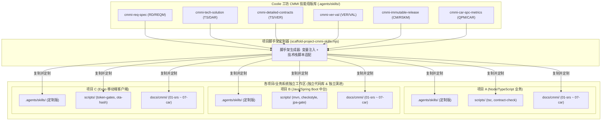
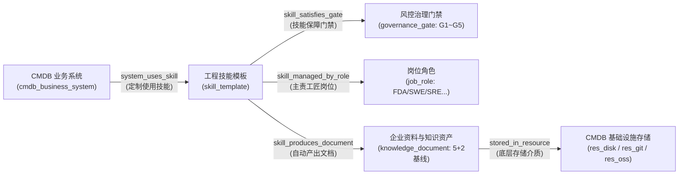

# CMMI 过程规范固化为可执行 Skill 模板与业务系统独立定制工程规约

> **规约编号**: SPEC-CMMI-SKILLS-001  
> **所属版本**: v1.0.0  
> **归属业务域**: 企业资产底座与 CMMI 过程治理 (`enterprise-core`)  
> **关联实体**: `cmdb_business_system`, `skill_template`, `governance_gate`, `job_role`, `knowledge_document`

---

## 1. 体系背景与设计范式跃迁

在软件工程质量认证体系（如 CMMI Level 3 已定义级与 Level 5 持续优化级）中，企业面临的最严峻挑战并非缺乏规范，而是**“规范沦为纸面形式主义”**：
- **传统痛点 1（死文档）**: 需求规格 (SRS)、设计文档 (HLD/LLD)、测试报告往往在项目交付后由人工突击补写（“造材料”），与真实运行代码脱节。
- **传统痛点 2（复制即僵死）**: 新项目启动时机械拷贝上一项目的 Word 模版，未能结合自身技术栈（Java / Python / Node / Go / 移动端）形成具备实际约束力的自动化流水线。
- **传统痛点 3（不可执行无门禁）**: 文档缺乏自动化验证探针，无法在日常任务流中作为卡点阻断错误外溢。

### Coolie 工坊创新范式：**CMMI 即 Agent 可执行 Skills**
将 CMMI 3 与 CMMI 5 的全部过程域规范、门禁卡点与交付物要求，全面解构并**固化为 Coolie 工坊的标准可执行 Agent Skill 模版集**。



每个业务系统或项目在关联到企业本体域后，都会复制并定制专属的技能库与脚本体系，使得每个系统在独立进行日常升级、重构、特性迭代和缺陷修复时，**AI 智能体直接调用该项目本地的定制 skills 和 scripts**，真正实现“开发即合规、执行即交付、过程留痕即认证”。

---

## 2. 六大 CMMI 核心技能模板体系

| 技能名称 (Skill Name) | 对应 CMMI 关键过程域 | 关联合规门禁 | 主责工匠角色 | 自动化执行产物 (5+2 黄金文档基线) |
| :--- | :--- | :--- | :--- | :--- |
| **`cmmi-req-spec`** | **RD** (需求开发)<br>**REQM** (需求管理) | `gate_g1_spec`<br>(G1 需求门禁) | DS 业务方案专家<br>(`emp_ds`) | `01-srs.md` (用户需求 URD + 需求规格 SRS + EARS 语法需求清单 + 双向跟踪矩阵 RTM) |
| **`cmmi-tech-solution`** | **TS** (技术方案)<br>**DAR** (决策分析)<br>**RSKM** (技术风险) | `gate_g2_arch`<br>(G2 架构隔离门禁) | FDA 前线架构师<br>(`emp_fda`) | `02-hld.md` (概要设计 HLD + 多企业数据隔离方案 + DAR 加权技术选型评估表) |
| **`cmmi-detailed-contracts`** | **TS** (详细设计)<br>**VER** (代码验证) | `gate_g3_compile`<br>(G3 静态编译门禁) | Core-SWE 核心研发<br>(`emp_swe`) | `03-lld-api.md` (详细设计 LLD + 统一 API 契约协议规范 + 0 逆向依赖与单测计划) |
| **`cmmi-ver-val`** | **VER** (端验证)<br>**VAL** (端确认) | `gate_g4_eval`<br>(G4 全栈验收门禁) | FDSE 前线全栈工程师<br>(`emp_fdse`) | `04-test-report.md` (页面四态状态机规格 + 防抖异常防御 + 真实业务旅程集成验收报告) |
| **`cmmi-immutable-release`** | **CM** (配置管理)<br>**RSKM** (投产风控)<br>**PMC** (过程监控) | `gate_g5_release`<br>(G5 生产不可变门禁) | PRE-SRE 可靠性工程师<br>(`emp_sre`) | `05-deploy-sop.md` (CMDB 部署拓扑 + 不可变制品校验和 + 生产发版与秒级回滚 SOP) |
| **`cmmi-car-spc-metrics`** | **QPM** (量化管理)<br>**CAR** (因果预防)<br>**OPM** (组织创新) | 全流程闭环优化<br>(CMMI 5 高成熟度) | Hermes 调度风控助理<br>(`emp_hermes`) | `06-spc-metrics.md` (SPC 统计过程控制图表)<br>`07-car-prevention.md` (5-Why 鱼骨图因果分析与自动化防退化用例) |

---

## 3. 脚手架与定制化工程落地

为了让新项目或纳管的业务系统快速获得 CMMI 全套能力，系统提供了自动化脚手架工具：
[`scripts/scaffold-project-cmmi-skills.mjs`](file:///host-workspace/xaicd/coolie/scripts/scaffold-project-cmmi-skills.mjs)。

### 3.1 脚手架执行命令
```bash
node scripts/scaffold-project-cmmi-skills.mjs \
  --project-name "电商订单与交易结算中台" \
  --project-code "SYS_ORDER_CENTER" \
  --domain-key "fintech-domain" \
  --tech-stack java \
  --target-dir projects/order-center \
  --author "emp_fda" \
  --storage-backend git_repo
```

### 3.2 项目生成目录与职责结构
```
<project-root>/
├── .agents/skills/                   # 1. 项目专属定制的 Agent Skills
│   ├── cmmi-req-spec/SKILL.md        #    - 注入了本项目特定的业务领域语境与 EARS 验收规则
│   ├── cmmi-tech-solution/SKILL.md   #    - 注入了本项目的架构隔离分界与 DAR 选型打分模型
│   ├── cmmi-detailed-contracts/SKILL.md # - 注入了本项目的 API 契约协议要求
│   ├── cmmi-ver-val/SKILL.md         #    - 注入了本项目的四态状态机与防抖防御标准
│   ├── cmmi-immutable-release/SKILL.md #  - 注入了本项目的不可变构建与回滚预案要求
│   └── cmmi-car-spc-metrics/SKILL.md #    - 注入了本项目的 SPC 量化监控与防退化闭环
├── scripts/                          # 2. 项目专属本地执行门禁脚本
│   ├── verify-reqs.mjs               #    - G1 需求规范与 RTM 覆盖率校验脚本
│   ├── check-contracts.mjs           #    - G3 静态编译与 API 契约一致性校验脚本
│   ├── run-tests.mjs                 #    - G4 全栈测试与端旅程验证运行脚本
│   └── check-release-baseline.mjs    #    - G5 不可变指纹与秒级回滚预案检查脚本
├── docs/cmmi/                        # 3. CMMI 5+2 黄金文档基线 (版本化留痕)
│   ├── 01-srs.md                     #    - 需求说明书与双向跟踪矩阵
│   ├── 02-hld.md                     #    - 概要设计与 DAR 决策分析
│   ├── 03-lld-api.md                 #    - 详细设计与统一 API 契约
│   ├── 04-test-report.md             #    - 集成测试与四态覆盖验收报告
│   ├── 05-deploy-sop.md              #    - 生产部署手册与回滚 SOP
│   ├── 06-spc-metrics.md             #    - CMMI 5 SPC 统计过程控制度量表
│   └── 07-car-prevention.md          #    - CMMI 5 CAR 缺陷根因追溯与预防表
└── cmmi-profile.json                 # 4. 项目 CMMI 合规档案与本体挂载清单
```

### 3.3 多技术栈差异化适配矩阵
脚本生成器根据 `--tech-stack` 参数自动为项目生成差异化脚本实现：
- **Node / TypeScript**:
  - G3: `npx tsc --noEmit`（零类型报错）、`node scripts/check-module-boundaries.mjs`
  - G4: `npm test`（Vitest / Jest 覆盖率保证）
- **Java / Spring Boot**:
  - G3: `mvn compile`、`mvn checkstyle:check`（契约防腐与包依赖单向检查）
  - G4: `mvn test`（JUnit 5 + Testcontainers 集成验收）
- **Python / AI Agent**:
  - G3: `mypy`、`flake8`、`ruff check`（强类型注解与静态语法检查）
  - G4: `pytest --cov`（全旅程用例执行）
- **Go Microservices**:
  - G3: `go vet ./...`、`golangci-lint run`
  - G4: `go test -v -race ./...`
- **Mobile / Expo**:
  - G3: `tsc --noEmit`、`node scripts/check-token-gates.mjs`（严格遵守色彩/UI令牌）
  - G4: `node scripts/check-no-git-push.mjs`、`verify-ota-bundle.sh`（OTA 双轨哈希校验）

---

## 4. 企业核心本体域 (`enterprise-domain.ts`) 闭环建模

在企业本体域元模型中，将技能、业务系统、门禁卡点与合规文档进行图谱化连接，形成严密的数字化映射拓扑：



### 实体与关系元模型
1. **`skill_template` (工程技能模板节点)**:
   - `skillId`: 技能代号 (如 `SKILL_CMMI_REQ`, `SKILL_CMMI_ARCH`)
   - `skillName`: 技能全称
   - `cmmiProcessArea`: 对应 CMMI 过程域 (RD, TS, VER, CM, QPM, CAR)
   - `category`: 过程分类 (requirements, architecture, development, verification, release, metrics)
   - `templatePath`: 技能母版相对路径
   - `version`: 技能修订版本
2. **四大关联网状关系**:
   - `system_uses_skill`: 业务系统 -> 技能（代表项目复制并定制了该技能）
   - `skill_satisfies_gate`: 技能 -> 门禁（代表技能执行保障了对应的 G1~G5 门禁卡点）
   - `skill_managed_by_role`: 技能 -> 岗位（代表技能主责维护的工匠角色）
   - `skill_produces_document`: 技能 -> 知识文档（代表技能自动沉淀的交付物文档）

---

## 5. 项目独立开发、升级更新与日常维护闭环 SOP

当工坊的数字工匠或人类开发者接手具体业务系统的 issue 时，执行标准流水线闭环：

### 5.1 特性升级与需求变更流 (Feature Lifecycle)
1. **阶段 G1 (需求捕获)**:
   - 调度工匠调用项目的 `.agents/skills/cmmi-req-spec`。
   - 解析老板原话并以 EARS 语法更新 `docs/cmmi/01-srs.md`，同步更新需求追踪矩阵 (RTM)。
   - 本地运行 `node scripts/verify-reqs.mjs` 确保 G1 门禁通过。
2. **阶段 G2 (架构决策)**:
   - 架构师调用 `.agents/skills/cmmi-tech-solution`。
   - 评估技术选型并补齐 DAR 决策矩阵，写入 `docs/cmmi/02-hld.md`。
   - 验证跨企业数据隔离与租户无逃逸。
3. **阶段 G3 (研发与静态守卫)**:
   - 核心开发工匠调用 `.agents/skills/cmmi-detailed-contracts`。
   - 实现业务代码，定义统一 API Spec，写入 `docs/cmmi/03-lld-api.md`。
   - 本地运行 `node scripts/check-contracts.mjs` 确保 0 编译错误。
4. **阶段 G4 (全栈验收与防御)**:
   - 全栈工匠调用 `.agents/skills/cmmi-ver-val`。
   - 实现界面四态、防抖与异常防御，运行自动化集成测试。
   - 产出 `docs/cmmi/04-test-report.md`，执行 `node scripts/run-tests.mjs` 验证准出。
5. **阶段 G5 (不可变投产)**:
   - SRE 工匠调用 `.agents/skills/cmmi-immutable-release`。
   - 打 Release Tag，计算制品 SHA-256 校验和，生成回滚 SOP `docs/cmmi/05-deploy-sop.md`。
   - 执行 `node scripts/check-release-baseline.mjs` 准出，归档至 OSS 或 Git 存储。

### 5.2 缺陷修复与防退化闭环 (Bugfix & CAR Lifecycle)
1. **缺陷捕获**: 线上告警或测试缺陷上报。
2. **5-Why CAR 根因分析**: 调用 `.agents/skills/cmmi-car-spc-metrics`，执行 5-Why 追问追溯制度、流程与工具根因，记录入 `docs/cmmi/07-car-prevention.md`。
3. **用例与脚本固化**: **将防御措施转化为项目本地 `scripts/` 的永久性自动化断言**。下一次代码提交时由门禁脚本自动守卫，杜绝同类故障二次发生。

---

## 6. CMMI 外审与合规评估证据提取

当企业进行 CMMI 3 或 CMMI 5 评估审查（SCAMPI 评估）时，传统企业需要花费数周整理文档，而在 Coolie 工坊体系下：
1. **即时性 (Instant Evidence)**: 运行 `node scripts/scaffold-project-cmmi-skills.mjs --verify-audit` 可一键提取各系统全量 `docs/cmmi/` 基线及 Git 变更历史，文档由 Commit Hash 强绑定，天然不可篡改。
2. **真实性 (Executable Proof)**: 审核员不仅能查验静态文档，更能随时运行各项目 `scripts/` 检验门禁与测试结果，证明所有过程均由可执行 Agent Skills 真实保障执行。
3. **量化闭环 (CMMI 5 Maturity)**: 直接展示 `06-spc-metrics.md` 与 `07-car-prevention.md`，提供任务周期吞吐控制图及因果改进度量证据，展现最高等级的组织级自演进能力。
