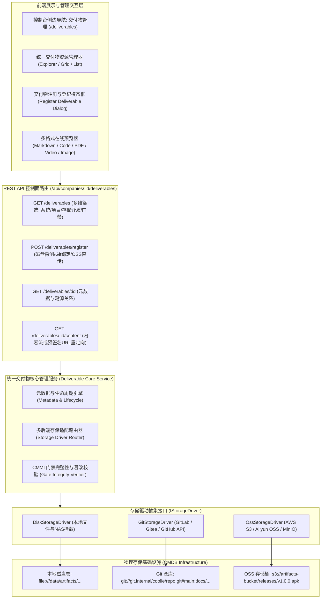

# 交付物多后端存储与统一管理模块架构设计规范

> **版本**: 1.0.0  
> **更新时间**: 2026-09-25  
> **所属业务域**: 企业资产底座与 CMMI 过程治理 (`enterprise-core`)  
> **核心目标**: 规范工程交付物在**文件磁盘 (Local Disk)**、**Git 仓库 (Git Repo)** 与 **OSS 对象存储 (S3/MinIO/OSS)** 三类存储介质的生命周期管理，建立统一交付物管理模块。

---

## 1. 业务背景与设计动因

在企业数字化工坊与 CMMI 3/5 研发体系中，AI 数字工匠与人类团队产出的“交付物/工作产物”类型极其丰富，单一的存储模式无法同时满足速度、版本溯源与云端分发的需求：

| 存储后端介质 | 核心应用场景与交付物类型 | 核心优势 | 关键技术考量与治理规则 |
| :--- | :--- | :--- | :--- |
| **文件磁盘存储**<br>(`local_disk`) | 1. 本地沙箱运行生成物<br>2. E2E 录屏与音视频文件 (`.mp4`, `.webm`)<br>3. 大体积测试日志与中间调试产物 | 极高速率、零网络开销、支持大文件秒级落盘 | 需挂载至统一 NAS/共享卷路径 (`/data/artifacts`)；定期清理未归档的临时沙箱工件。 |
| **Git 仓库存储**<br>(`git_repo`) | 1. 需求说明书与 RTM (`.md`)<br>2. 架构设计与分层规范 (`.md`, `.puml`)<br>3. 数据库模型与 API 契约 (`.sql`, `.json`, `.ts`)<br>4. 统一代码规范与核心配置文件 | 完整保留版本历史、支持 Commit SHA 精准锁定、原生 Diff 对比、代码与文档同源 | 必须记录 `repoUrl`、`branch`、`commitSha` 和相对路径；生产发版需打 Git Tag 基线。 |
| **OSS 对象存储**<br>(`oss_object`) | 1. 移动端编译产物 (`.apk`, `.ipa`)<br>2. 生产 Docker 镜像包与不可变归档 Zip<br>3. CMMI 双人会签盖章确认 PDF<br>4. 长期保存的投产度量与 SPC 控制图数据 | 99.999999999% 高持久性、无限扩展、支持安全预签名下载 (Presigned URL) | 必须生成不可变 ObjectKey 与 SHA-256 校验和；配置生命周期转换（热存储 $\rightarrow$ 冷归档）。 |

因此，平台必须提供一个**统一的交付物管理模块（Deliverable Management Module）**，屏蔽底层存储介质差异，为工匠、审批人与外部审计提供统一的目录、预览、下载与门禁校验能力。

---

## 2. 总体架构设计



---

## 3. 存储驱动抽象标准 (IStorageDriver)

系统定义统一的驱动抽象接口，以解耦上层业务与底层存储：

```typescript
export interface StorageLocation {
  backend: "local_disk" | "git_repo" | "oss_object";
  uri: string; // file://..., git://..., oss://...
}

export interface DeliverableMetadata {
  id: string;
  title: string;
  docType: string;
  backend: "local_disk" | "git_repo" | "oss_object";
  uri: string;
  byteSize: number;
  checksumSha256: string;
  contentType: string;
  gitDetails?: {
    repoUrl: string;
    branch: string;
    commitSha: string;
    filePath: string;
  };
  ossDetails?: {
    bucket: string;
    objectKey: string;
    region?: string;
  };
}

export interface IStorageDriver {
  /** 探测介质中目标交付物是否存在并提取元数据（大小、哈希、修改时间） */
  probe(location: StorageLocation): Promise<{ exists: boolean; size: number; sha256: string; contentType: string }>;
  
  /** 读取交付物文件二进制流（用于在线预览或本地下载） */
  readStream(location: StorageLocation, range?: { start: number; end: number }): Promise<NodeJS.ReadableStream>;
  
  /** 生成安全临时授权下载链接（针对 OSS/云端大文件，避免占用控制台网关带宽） */
  getDownloadUrl(location: StorageLocation, expiresInSeconds?: number): Promise<string>;
  
  /** 写入/注册新交付物 */
  write(location: StorageLocation, data: Buffer | NodeJS.ReadableStream, options?: { contentType?: string }): Promise<DeliverableMetadata>;
}
```

---

## 4. 交付物管理模块核心功能设计

### 4.1 统一交付物工作台 (Deliverable Explorer)
1. **多维筛选与检索**：
   - **按业务系统**：Paperclip 控制面主系统、RuoYi 业务中台、Expo 移动端客户端；
   - **按存储后端**：全部、本地磁盘（Disk）、Git 仓库（Git）、OSS 存储桶（OSS）；
   - **按 CMMI 阶段与门禁**：G1 需求门禁交付物、G2 架构门禁、G3 静态守卫、G4 全栈验收、G5 发版上线；
   - **按资料类型**：规格说明书、架构设计图、详细设计、接口契约、测试报告、投产 SOP、SPC 控制图、CAR 报告。
2. **多态呈现**：
   - **卡片网格视图**：突出展示封面缩略图（图片、架构图、首屏截图）、存储介质徽标、版本号、文件体积与责任工匠；
   - **明细列表视图**：清晰展示系统归属、存储定位 URI、SHA-256 校验和、关联门禁通过状态与最后更新时间。

### 4.2 交付物登记与录入 (Registration Dialog)
用户或工匠通过标准界面/API 登记交付物：
1. **磁盘文件登记**：
   - 输入或选择工作空间路径，系统自动计算文件大小与 SHA-256 哈希，校验无误后生成资产卡片；
2. **Git 文档关联**：
   - 选择系统关联的 Git 仓库，选择目标分支与具体 Commit，指定仓库内相对路径，系统自动拉取该 Commit 对应的文件内容与树状结构；
3. **OSS 产物绑定 / 直传**：
   - 支持拖拽上传至默认 OSS 桶，或填入第三方 OSS Bucket 和 ObjectKey，自动通过 HeadObject 校验对象的存在性。

### 4.3 在线多格式预览引擎 (Multi-format Preview Engine)
1. **Markdown / 文本 / 代码**：内置代码高亮渲染器与 Mermaid 图表解析器（可直接在界面上查看 HLD 架构图与状态机流程图）；
2. **OpenAPI / Swagger 接口契约**：内嵌交互式 API 文档查看器；
3. **音视频播放器**：支持 `.mp4`, `.webm` 格式的 E2E 验收录屏直接内嵌流畅播放；
4. **PDF 阅读器**：用于查阅带签字盖章的 CMMI 过程确认书与报告；
5. **下载与外链**：提供一键复制存储 URI、校验和哈希，或获取 15 分钟有效的预签名安全下载链接。

### 4.4 CMMI 门禁联动与篡改防御 (Integrity & Tamper Protection)
在 G1-G5 门禁推进过程中，流程引擎调用交付物管理服务执行自动校验：
- **一致性校验**：自动比对磁盘文件 / OSS 对象的实时 SHA-256 与登记时的指纹是否一致；
- **Git 提交锁定**：校验 Git 仓库的 Commit SHA 是否真实存在于受控分支，防止使用已被回退或重写的游离 Commit。

---

## 5. 企业核心本体域 (`enterprise-core`) 建模对齐

在企业本体域中，交付物已全面融入拓扑结构：
1. **实体扩展**：
   - [`knowledge_document`](file:///host-workspace/xaicd/coolie/packages/plugins/plugin-ontology/src/samples/enterprise-domain.ts#L105) 扩展了 `storageBackend`、`storageUri`、`fileSize` 与 `checksum` 属性；
   - [`cmdb_infrastructure_resource`](file:///host-workspace/xaicd/coolie/packages/plugins/plugin-ontology/src/samples/enterprise-domain.ts#L170) 扩充了 `git_repository` 资源类型支持。
2. **拓扑关系**：
   - `stored_in_resource`（交付物 $\rightarrow$ 物理存储介质：`res_local_disk` / `res_git_repo` / `res_oss_bucket`）；
   - `documents_system`（交付物 $\rightarrow$ 业务系统）；
   - `authored_by`（交付物 $\rightarrow$ 责任工匠）；
   - `satisfies_gate`（交付物 $\rightarrow$ CMMI 治理门禁）。
