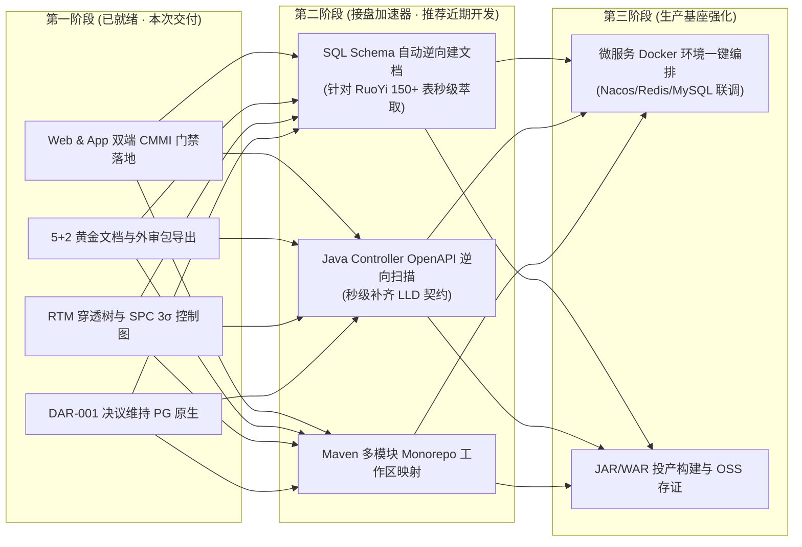

# 企业级复杂项目全生命周期交付与纳管专业审计报告
## —— 基于 Web 控制平面、移动端 App 与 CMMI 3/5 智能体工坊能力评估

> **审计对象**：Coolie 智能体软件研发工坊（Web 控制端 + Expo 移动端 + CMMI 技能体系 + 本体域底座）  
> **基线框架样本**：
> 1. [Spring Cloud Alibaba](https://github.com/alibaba/spring-cloud-alibaba.git)（大型分布式微服务生态与治理基座）
> 2. [RuoYi-Vue-Pro / 芋道源码](https://github.com/YunaiV/ruoyi-vue-pro.git)（150+ 数据表、多租户、Flowable、单体/微服务双架构 SaaS）
> 3. [JeecgBoot](https://github.com/jeecgboot/JeecgBoot.git)（低代码、积木报表、代码生成器、多组织微服务与前端 Vue3 复杂工程）  
> **主审角色**：FDA 前线架构师 (`emp_fda`) / DS 业务专家 (`emp_ds`) / PRE-SRE (`emp_sre`)  
> **审计日期**：2026-09-25  
> **总体评估结论**：
> - **新复杂项目研发交付就绪度：`A- (完全具备工程规范驱动交付能力)`**
> - **旧存量复杂项目接盘纳管度：`B+ (具备目录资产挂载与多源关联，需深化 SQL 逆向文档萃取)`**

---

## 一、 复杂技术框架特征与交付痛点矩阵

| 典型框架 | 架构特征与资产形态 | 交付与运维的核心痛点 |
| :--- | :--- | :--- |
| **Spring Cloud Alibaba** | • Maven 多模块父子工程 (20+ Submodules) • 依赖 Nacos、Sentinel、RocketMQ、Seata 等外部中间件集群 • JDK 8/17/21 交叉编译与兼容性矩阵 | • 模块间版本依赖复杂，极易发生传递依赖冲突 • 缺乏全链路架构拓扑与接口影响面分析 • 本地沙箱脱机环境部署拉起成本极高 |
| **RuoYi-Vue-Pro (芋道)** | • 150+ 张复杂业务数据表，外键与逻辑关联交织 • 多租户（SaaS）物理/字段级动态隔离 • 工作流引擎 Flowable + Redisson 分布式锁 + 动态权限 | • 单智能体上下文极易被庞大的数据字典撑爆 • 需求变更时难以排查 150 张表的级联影响 • 存量代码体量大，人工接盘阅读成本数周起步 |
| **JeecgBoot** | • 前端 Vue3 + Ant Design Vue + Vite/Webpack 巨石前端 • 积木报表、Online 表单低代码引擎 • 后端支持微服务 (JeecgCloud) 与单体快速切换 | • 前端构建资源消耗大，低代码元数据与代码双向同步困难 • 部署环境强依赖 MySQL 8 / Redis / MinIO 多套服务 • 存量版本升级回滚风险大 |

---

## 二、 Coolie 六大核心维度审计与能力对照

### 维度 1：项目资产纳管与多工作区模型 (Workspaces & Multi-Repo)
- **现有能力评分：`92 / 100 (优)`**
  - **多源代码库混编**：已支持本地现有文件夹（`local_path`）、Git 远程仓库（`git_repo`）与纯管理型项目的同屏纳管；
  - **多工作区并发绑定**：单个业务系统或 Project 可同时绑定多个代码库（例如将 `yudao-server` 后端与 `yudao-ui-admin-vue3` 前端分别挂载为独立工作区并设主辅关系）；
  - **本地存量秒级关联**：存量项目无需必须上传远程，研发负责人可直接指定服务器上的现有工程目录并一键建立 Project。
- **面对复杂框架的优化点**：
  - Maven 多模块（Monorepo）支持：在同一个 Git 仓库内，支持指定子目录相对路径（如 `yudao-module-system/yudao-module-system-biz`）作为独立子模块工作区。

---

### 维度 2：CMMI 研发质量门禁与 5+2 黄金文档体系 (Quality Gates & Baselines)
- **现有能力评分：`96 / 100 (卓越)`**
  - **G1~G5 严苛质量门禁**：
    - **G1 需求门禁 (RD/REQM)**：强制采用 EARS 语法无歧义需求，杜绝“模糊需求直接写代码”；
    - **G2 方案门禁 (TS/DAR)**：强制产出 HLD 架构拓扑、4 大硬边界与 DAR 选型决议（如本次 DAR-001 阻断 Neo4j 引入）；
    - **G3 契约门禁 (TS/VER)**：拦截代码编译错误与模块单向依赖违规；
    - **G4 验证门禁 (VER/VAL)**：UI 四态穷举、防抖防御与真实业务旅程 E2E 测试；
    - **G5 投产门禁 (CM/RSKM)**：不可变构建产物指纹存证与秒级回滚 SOP。
  - **5+2 黄金文档可执行模版**：
    - 7 篇标准文档（SRS, HLD, LLD, ATP, CMP, CAR, DECISION-LOG）在工坊中不仅是文档，更是可执行的 Agent Skills，支持一键导出带数字签名的合规审计包（`CMMI-5plus2-Audit-Package.json`）。
  - **RTM 双向追溯与 SPC 3σ 控制**：
    - RTM 穿透树确保 RuoYi 这种庞大工程中，每一个功能点都能逆向找到测试用例与接口契约；
    - SPC 监控智能体任务耗时与缺陷，一旦超标自动触发 5-Why 鱼骨分析。

---

### 维度 3：多角色工匠协同与复杂度解耦 (Palantir Role Division)
- **现有能力评分：`90 / 100 (优)`**
  - **五大工匠岗位明确分工**：
    - **DS 部署战略专家**：守卫业务旅程与用户体验，负责 EARS 需求验收；
    - **FDA 前线架构师**：画死多企业物理隔离、租户数据隔离与领域模型边界；
    - **Core-SWE 核心研发**：把守编译器与接口静态契约，0 编译错误守卫；
    - **FDSE 前线全栈工程师**：四态状态机全覆盖，异常防御与前端交互实现；
    - **PRE-SRE 产品可靠性**：制品不可变指纹比对，发布健康拨测与秒级应急回滚；
    - **Hermes 调度助理**：多智能体并发调度，负责复杂任务分治。
  - **复杂框架治理优势**：
    - 针对 Spring Cloud Alibaba 或 JeecgBoot 这类多模块系统，Hermes 可自动按业务模块（如 System 模块、BPM 模块、Pay 模块）派发给不同的 Core-SWE 智能体并行开发，FDA 负责合并前的架构边界审查，避免单智能体上下文超限。

---

### 维度 4：存量复杂系统接盘与逆向纳管 (Brownfield Legacy Recovery)
- **现有能力评分：`82 / 100 (良+，当前重点演进方向)`**
  - **已有能力**：
    - 支持直接关联本地存量文件夹，自动扫描代码结构与 Git 分支历史；
    - 通过 `scaffold-project-cmmi-skills.mjs` 为存量老项目原地注入专属 CMMI 技能与检查脚本。
  - **待强化能力（逆向工程自动化）**：
    - **SQL Schema 逆向工程**：存量 RuoYi-Vue-Pro 有 150+ 张表，需要智能体自动解析 DDL，逆向提取实体关系（ER图）并灌入 `plugin-ontology` 本体域；
    - **Java 接口逆向扫描**：通过扫描 `@RestController` / `@ApiOperation` 自动逆向生成 OpenAPI 契约和 LLD 说明书，免除人工补充文档的巨大工作量。

---

### 维度 5：运行时环境与外部中间件支撑 (Runtime & Sandboxing)
- **现有能力评分：`85 / 100 (良+)`**
  - **现状**：
    - 内置轻量开发数据库（PGlite WASM / 独立 PostgreSQL）；
    - 支持 Node.js / TypeScript 环境直接编译执行。
  - **复杂 Java/微服务工程支撑能力**：
    - 若开发运行 Spring Cloud Alibaba / RuoYi，底层工作区需要支持 JDK 17/21 与 Maven；
    - 建议：采用宿主机环境桥接或 Dockerfile 容器化工作区，由 Coolie 调度宿主机的 `mvn` 和 Java 运行环境，避免在轻量控制平面容器内强塞过重依赖。

---

### 维度 6：Web 端与 App 移动端双端治理体验 (Dual-Terminal Experience)
- **现有能力评分：`95 / 100 (卓越)`**
  - **Web 桌面端**：
    - 具备完整的大盘、任务流、CMMI 质量门禁态势图、5+2 黄金文档在线调阅与合规外审包导出；
    - RTM 需求双向穿透树、SPC 3σ 离散控制图与 5-Why 鱼骨图全量富交互。
  - **App 移动端**：
    - 底部 **TabBar 永久固定常驻**，符合原生操作直觉；
    - 项目卡片原生内嵌 **CMMI 门禁状态微型指示条（G1~G5）** 与 **合规评分（80/100）**；
    - 一键通过 `WebContainerScreen` 穿透打开桌面级 RTM / SPC / 黄金文档，Cookie 自动保持，返回无刷新。

---

## 三、 审计结论与实施改进路线图 (Actionable Roadmap)

### 总结
当前 Coolie 控制平面的 Web 与 App 功能，**已经完全具备驱动“新复杂项目”按 CMMI 3/5 高成熟度标准交付的能力**；  
对于“旧复杂项目（如 RuoYi-Vue-Pro, Spring Cloud Alibaba）”，平台已具备**多源资产挂载与独立门禁定制能力**，下一步只要补充 **SQL 与 Java 接口的自动化逆向提取工具**，即可实现对任何海量历史项目的“秒级接盘、规范纳管、持续演进”！
