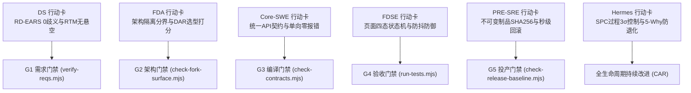
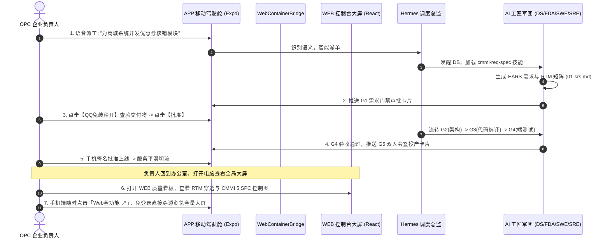

# 软件研发 OPC 企业负责人双端（WEB + APP）产品体验与 CMMI 角色员工压缩沉淀指南

> **核心定位**: 软件研发一人公司 (OPC: One-Person Company) / AI 研发军团负责人的掌控与决策体系  
> **编写时间**: 2026-09-25  
> **双端覆盖**: 桌面全功能中枢 (WEB) + 移动随身驾驶舱 (APP)  
> **角色协同**: 业务专家 (DS) / 架构师 (FDA) / 核心研发 (SWE) / 全栈交付 (FDSE) / 可靠性工程 (SRE) / 调度风控 (Hermes)

---

## 1. 软件研发 OPC (One-Person Company) 模式的核心痛点与破局

在以 AI 智能体（Agent）为核心生产力的软件研发一人公司 (OPC) 中，人类负责人（Founder / CTO / 研发主理人）面临的根本挑战是：
1. **不能陷入代码细节，但又必须对系统质量绝对负责**：负责人无法人肉 review 每天产生的成千上万行代码，必须依靠强门禁与标准化流水线替自己把关。
2. **不能让老板去记生硬的技术缩写**：老板关心的不是“请执行 IEEE 29148 EARS 语法转化”，而是“需求业务闭环了吗？有没有隐患漏洞？”；不是“执行 IEEE 828 CM 发布”，而是“出了故障能不能 1 分钟回滚？”。
3. **不能让 AI 角色背负数十页大文档导致上下文爆炸**：必须将厚重的国际标准与 CMMI 体系，**高度压缩沉淀为低 Token 消耗、高执行密度的角色行动卡片 (Role Action Cards)**。

---

## 2. 角色员工的“压缩沉淀”：高密度 CMMI 行动卡片体系

我们将 IEEE 29148 / IEEE 1016 / ISO 29119 / IEEE 828 与 CMMI 5 规范，全面压缩提炼为**6 张零废话、高密度的工匠行动卡片**。每个 AI 角色被唤醒时，自动注入其专属卡片：



### 2.1 角色高密度卡片概览

| 角色 | 压缩核心指令 (Micro-Rules) | 必须运行的本地脚本 | 交付的标准基线文档 |
| :--- | :--- | :--- | :--- |
| **DS (业务方案专家)** | 1. 用户原话转译为 EARS 5 模式（WHEN-IF-THEN-SHALL）<br>2. 建立需求与用例 1:1 双向跟踪矩阵，0 悬空需求 | `node scripts/verify-reqs.mjs` | `docs/cmmi/01-srs.md` |
| **FDA (前线架构师)** | 1. 划定企业 `company_id` 物理/逻辑隔离切面与拓扑<br>2. 关键选型执行 DAR 5步加权打分（权重=100%，多方案量化比选） | `node scripts/check-fork-surface.mjs` | `docs/cmmi/02-hld.md` |
| **Core-SWE (核心研发)** | 1. API 契约先行，定义统一 Envelope、Schema 与 4xx/5xx 错误码<br>2. 模块单向无环依赖，增量编译 0 报错 | `node scripts/check-contracts.mjs` | `docs/cmmi/03-lld-api.md` |
| **FDSE (前线交付全栈)** | 1. 异步界面穷举 Loading / Empty / Error / Success 四态<br>2. 核心提交必须带防抖（Debounce），自动化测试 100% 绿灯 | `node scripts/run-tests.mjs` | `docs/cmmi/04-test-report.md` |
| **PRE-SRE (产品可靠性)** | 1. 冻结语义化版本 Tag，生成制品唯一 SHA-256 指纹<br>2. 发布 SOP 必须具备 60 秒内秒级回滚命令，健康探针 200 OK | `node scripts/check-release-baseline.mjs` | `docs/cmmi/05-deploy-sop.md` |
| **Hermes (调度风控助理)** | 1. SPC 监控任务耗时与缺陷率，超出 $3\sigma$ 立即预警<br>2. 线上缺陷执行 6M 鱼骨图与 5-Why，**固化为自动化门禁断言** | 调度预算监控与缺陷闭环扫描 | `docs/cmmi/06-spc-metrics.md`<br>`docs/cmmi/07-car-prevention.md` |

---

## 3. APP 端：负责人移动随身驾驶舱 (Mobile Executive Cockpit)

移动端旨在满足 OPC 企业负责人在碎片化时间（出差、会议、通勤）快速**掌控态势、听取汇报、极速决策与查验交付物**。

```
┌────────────────────────────────────────────────────────┐
│  Coolie 工坊 · OPC 企业驾驶舱                🔔 3  👤  │
├────────────────────────────────────────────────────────┤
│  💼 核心系统状态                [+ 新建系统] [Web全功能]│
│  ┌──────────────────────────────────────────────────┐  │
│  │ SYS_POINTS (积分结算系统)           状态: G4 验收中 │  │
│  │ 进度: 85%  | 耗时: 42min (SPC正常) | 缺陷: 0 P0/P1│  │
│  │ 待办门禁: [G4 验收确认]  [查看 5+2 黄金文档 ↗]     │  │
│  └──────────────────────────────────────────────────┘  │
│                                                        │
│  🚦 待办门禁审批卡片 (Gates Approval)                  │
│  ┌──────────────────────────────────────────────────┐  │
│  │ ⚡ G4 端体验验收审批 · SYS_POINTS                 │  │
│  │ • 四态状态机: 骨架屏/空插画/重试按钮 100% 覆盖    │  │
│  │ • 防抖测试: 快速连续点击 0 重复提交              │  │
│  │ • 交付物预览: [🚀 QQ/TBS 免装秒开] [🌐 浏览器]   │  │
│  │ ─────────────── 决策操作 ─────────────────────── │  │
│  │ [ 驳回整改 (退回FDSE) ]      [ ✅ 验收通过 (流转G5) ] │  │
│  └──────────────────────────────────────────────────┘  │
│                                                        │
│  📈 CMMI 5 统计控制与风险预警 (SPC & CAR)              │
│  • 任务构建耗时: 均值 45s (UCL 75s) · 状态: 正常       │
│  • 历史缺陷防退化: 3 个 5-Why 规则已生效并锁入门禁     │
│                                                        │
│  🎙️ 语音/自然语言极速派发 (Voice Build)                │
│  [ 按住说话派工: "给订单系统加一个分期付款计算接口" ]  │
└────────────────────────────────────────────────────────┘
```

### 3.1 移动端四大杀手级体验：
1. **大白话业务输入，自动化 CMMI 落地**:
   - 老板按住语音按钮说：“给订单系统加个积分抵扣”。
   - Hermes 调度助理自动在后台触发 `cmmi-req-spec`，生成 EARS 语法需求与 RTM 跟踪表，推送卡片给老板确认。
2. **极简决策卡片 (One-Tap Gate Decision)**:
   - 无论底层代码改了多少文件，老板只看清晰的门禁结论：
     - *需求阶段*: 显示 3 条 EARS 核心验收规则，点击【确认立项】；
     - *架构阶段*: 显示 DAR 加权选型结果（如“架构师选定 Redis，得分 8.8”），点击【架构放行】；
     - *投产阶段*: 双人会签，老板输入 PIN 码或指纹完成最终投产放行。
3. **交付物免装 Office 高保真秒开 (直通 QQ/TBS 内核)**:
   - 针对 `.docx` 需求、`.xlsx` 测试用例、`.pptx` 架构图及 H5 交互原型，利用刚刚集成的 `ExternalOpenSheet`，支持一键调起 QQ 浏览器（TBS X5 内核秒开），手机无需安装庞大的 WPS/Office。
4. **CMMI 5 SPC 异常推送与 5-Why 简报**:
   - 某系统构建时间突增或测试连续失败时，APP 弹出黄色预警，直接展示由 Hermes 生成的 5-Why 根因简报。

---

## 4. WEB 端：负责人桌面全功能运营中枢 (Desktop Control Hub)

WEB 端是 OPC 负责人在办公室大屏前进行**全局质量审查、架构演进推演、项目脚手架定制与 CMMI 审计证据导出**的专业级工作台。

```
┌─────────────────────────────────────────────────────────────────────────────────────────┐
│  Coolie Enterprise Control Plane · 研发质量与 CMMI 治理中枢                 [公司: 杭州工坊] │
├─────────────────────────────────────────────────────────────────────────────────────────┤
│ [📊 质量大屏]  [🌿 业务系统与本体]  [🛠️ 技能工作室]  [📑 5+2文档基线]  [📦 审计证据导出]       │
├─────────────────────────────────────────────────────────────────────────────────────────┤
│                                                                                         │
│  ▼ 1. 全项目 CMMI 3 / 5 质量门禁状态矩阵 (Governance Matrix)                             │
│  ┌──────────────────────┬──────┬──────┬──────┬──────┬──────┬────────┬───────────────┐  │
│  │ 业务系统 (CMDB)      │  G1  │  G2  │  G3  │  G4  │  G5  │ 质量分 │ 负责工匠 / SOP│  │
│  ├──────────────────────┼──────┼──────┼──────┼──────┼──────┼────────┼───────────────┤  │
│  │ Paperclip 主控系统   │  🟢  │  🟢  │  🟢  │  🟢  │  🟢  │ 98.5   │ SWE / SRE     │  │
│  │ RuoYi 业务中台       │  🟢  │  🟢  │  🟢  │  🟢  │  🟢  │ 96.0   │ SWE / FDA     │  │
│  │ Expo 移动端驾驶舱    │  🟢  │  🟢  │  🟢  │  🟡  │  ⚪  │ 92.0   │ FDSE (验收中) │  │
│  │ 用户积分结算系统     │  🟢  │  🟢  │  ⚪  │  ⚪  │  ⚪  │ 88.0   │ SWE (编译中)  │  │
│  └──────────────────────┴──────┴──────┴──────┴──────┴──────┴────────┴───────────────┘  │
│                                                                                         │
│  ▼ 2. 需求双向跟踪矩阵 (RTM) 交互式穿透树 (Interactive RTM Explorer)                    │
│  ┌───────────────────────────────────────┬───────────────────────────────────────────┐  │
│  │ 需求项 (EARS 规范)                    │ 关联架构模块 / 代码文件 / 单测断言        │  │
│  ├───────────────────────────────────────┼───────────────────────────────────────────┤  │
│  │ ▶ [REQ-001] WHEN 用户点击导出...      │ • HLD: Mod_StorageManager                 │  │
│  │   • 业务价值: 离线任务缓存            │ • 代码: server/src/storage/disk.ts#L45    │  │
│  │   • 验收状态: PASSED                  │ • 单测: tests/storage-disk.test.ts#TC-01  │  │
│  │                                       │ • 存储: Git 仓库 / OSS 预签名桶           │  │
│  └───────────────────────────────────────┴───────────────────────────────────────────┘  │
│                                                                                         │
│  ▼ 3. CMMI 5 统计过程控制 (SPC 控制图) 与 5-Why 鱼骨图闭环                               │
│  [ 图表: 任务周期时间 Individuals Chart (CL=45min, UCL=85min, LCL=15min) ]              │
│  [ 异常点标注: Task-84 (110min, 超出UCL) -> 点击展开 6M 石川鱼骨图与代码断言固化记录 ]   │
│                                                                                         │
│  ▼ 4. 新业务系统一键脚手架工作台 (Scaffolding Studio)                                   │
│  输入系统名称: [支付网关服务] 代码: [SYS_PAYMENT] 技术栈: [Java (Spring Boot) ▼]        │
│  [ 🚀 自动化生成专属 .agents/skills/、scripts/ 门禁脚本与 5+2 文档骨架并注册本体库 ]     │
└─────────────────────────────────────────────────────────────────────────────────────────┘
```

### 4.1 WEB 端五大核心功能：
1. **全景质量大屏 (Governance Matrix)**:
   - 全量系统横向排开，G1~G5 门禁状态以红黄绿灯呈现，整体质量度量分一目了然。
2. **交互式 RTM 穿透树**:
   - 彻底打破“文档与代码脱节”。点击任意业务需求，右侧直接联动展示对应的架构模块图、Git 仓库具体行号、关联的测试用例及执行历史。
3. **CMMI 5 SPC 动态图表与 CAR 追溯中枢**:
   - 实时绘制休哈特控制图，出现超出 $3\sigma$ 的失控点直接报警。点击异常点，自动弹出 5-Why 鱼骨图与防退化脚本固化历史（展示系统如何“越用越健壮”）。
4. **脚手架与技能定制工作室 (Skill Studio)**:
   - 负责人可视化勾选技术栈（Node、Java、Python、Go、Mobile），一键执行 `scaffold-project-cmmi-skills.mjs`，自动初始化项目代码库、专属技能与门禁。
5. **一键导出 CMMI 3 / CMMI 5 评估认证包 (Audit Package Export)**:
   - 面对外部专家评审、政府资质申报或重点客户投标，点击「导出合规认证包」，系统自动打包所有 5+2 黄金文档、不可变 Git Tag、SHA-256 校验清单与测试执行日志。

---

## 5. 双端穿透协同与价值闭环



### 核心商业价值总结：
1. **超级个体的组织力放大 100 倍**：一个创始人借助移动端极简审批流与 Web 端全景看板，即可掌控上百个业务系统与全流程规范。
2. **免去几百万的咨询与材料伪造费用**：规范在日常研发中由 AI 自动执行并版本化留痕，合规证据天然生成，随时从容应对 CMMI 3 / CMMI 5 与 ISO 9001 审查。
3. **软件质量的确定性**：从需求无歧义（EARS）、架构物理隔离（FDA）、编译零容忍（SWE）、界面无死穴（FDSE）到秒级可回滚（SRE），代码缺陷率实现几何级数降低。
