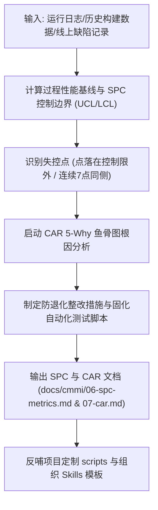

# CMMI 5 统计过程控制与因果缺陷预防 (QPM / CAR)

> **CMMI 过程域**: Quantitative Project Management (QPM), Causal Analysis and Resolution (CAR), Organizational Performance Management (OPM)  
> **监管层级**: CMMI 5 高成熟度持续优化级  
> **主责工匠角色**: Hermes 调度与风控助理 (`emp_hermes`)  
> **核心产出**: 《统计过程控制分析表 (SPC 控制图)》、《5-Why 因果分析与缺陷预防表 (CAR)》

---

## 1. 技能定位与核心原则

CMMI 5 与低等级的本质区别在于**量化驱动**与**系统性预防**：
1. **统计过程控制 (SPC)**: 不只看任务成功与否，而是利用统计学方法（平均值 $\mu$、标准差 $\sigma$、控制上限 UCL = $\mu + 3\sigma$、控制下限 LCL = $\mu - 3\sigma$）监控开发吞吐、构建耗时、缺陷密度，提早发现“异常波动”，避免故障爆发。
2. **缺陷根因预防 (CAR - 治病求本)**: 发现缺陷绝不允许“就地打补丁了事”，必须执行 5-Why 追问或鱼骨图（人、机、料、法、环）深入根因，并将修补手段固化为永久自动化断言或平台级规则，杜绝同类故障在任何项目二次发生。
3. **闭环持续改进 (OPM)**: 将各项目的优秀实践、高频缺陷预防规则反哺至全组织公共 Skills 库中。

---

## 2. 自动化执行步骤 (Workflow)



1. **量化采样**: 收集任务生命周期数据（任务执行用时、Token 消耗、门禁一次通过率、静态检查缺陷数）。
2. **绘制 SPC 控制图**: 标记异常波动任务（超出 $3\sigma$ 警戒线），自动发出预警。
3. **CAR 根因深挖**: 对严重缺陷或异常任务，执行 5-Why 分析，追问到制度、流程、工具设计根源。
4. **防退化固化**: 在项目的 `scripts/` 中新增一条特定的守卫断言（如新增 Token Gate、新增 API 字段检查）。
5. **归档文档**: 写入 `docs/cmmi/06-spc-metrics.md` 与 `docs/cmmi/07-car-prevention.md`。

---

## 3. 产物模板基线 (`docs/cmmi/07-car-prevention.md`)

```markdown
# [系统名称] 因果分析与系统性缺陷预防表 (CMMI 5 CAR)

- **系统代码**: SYS_CHANRONG_AGENT
- **负责分析员**: emp_fda
- **闭环状态**: 改进措施已固化并上线

## 1. 缺陷现象与影响
- **缺陷现象**: 移动端进入预览页面时偶发空指针白屏崩溃。
- **影响范围**: 约 2% 的弱网离线用户。

## 2. 5-Why 根因追溯
1. **Why 1**: 为什么会白屏？ -> 因为取 `response.data.items` 时 `data` 为 null。
2. **Why 2**: 为什么会是 null？ -> 后端接口在空数据时返回了 `{ code: 200 }` 缺少了 `data` 节点。
3. **Why 3**: 为什么前端没做空安全防御？ -> 前端依赖了 TypeScript 类型定义，但实际接口未遵守严格契约。
4. **Why 4**: 为什么前后端联调测试没测出？ -> 联调测试只用了全量测试集，未构造空数据边界用例。
5. **Why 5 (根本原因)**: 缺少自动化四态状态机覆盖断言与统一 DTO 结构校验。

## 3. 系统性防退化措施与改进固化
- **代码层修复**: 前端增加可选链与空态防御组件，后端补齐统一 Response 包裹。
- **守卫层固化**: 在 `scripts/check-contracts.mjs` 中增加返回结构断言，自动化拦截缺少 data 的响应。
```

---

## 4. 实施闭环准则 (Definition of Done)
- [ ] 关键质量指标纳入 SPC 过程监控，有明确均值与控制限。
- [ ] 线上及重测缺陷 100% 完成 5-Why CAR 分析。
- [ ] 改进措施全部转化为项目本地 scripts 自动化测试用例或平台级规则，完成永久固化。

---

## 5. 权威开源标准与参考文献
- **CMMI 5 高成熟度指南**、休哈特 SPC 统计控制限计算公式、6M 鱼骨图与防退化断言清单：
  - 请参阅 [`references/cmmi-spc-car-methodology.md`](references/cmmi-spc-car-methodology.md)

