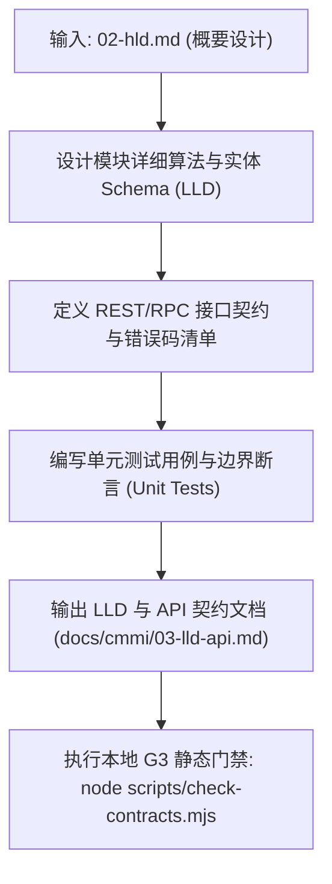

# CMMI 详细设计与静态契约守卫规范 (TS / VER)

> **CMMI 过程域**: Technical Solution (TS Detailed Design), Verification (VER Unit Verification)  
> **门禁对应**: G3 静态守卫编译门禁 (`gate_g3_compile`)  
> **主责工匠角色**: Core-SWE 平台核心研发工程师 (`emp_swe`)  
> **核心产出**: 《系统详细设计说明书 (LLD)》、《统一 API 契约协议规范》、《模块边界与单测覆盖报告》

---

## 1. 技能定位与核心原则

在 CMMI 3 研发标准中，研发实现必须严格依据契约先行（Contract-First）：
1. **统一契约防漂移**: 数据传输对象 (DTO)、REST API 路径、状态机枚举、数据库 Schema 必须跨层强类型同步，严禁前后端/跨服务自行定义私有协议。
2. **模块依赖单向干净**: 遵循分层架构原则，禁止循环依赖（Circular Dependencies）与反向越级调用。
3. **编译器零容忍**: 增量编译 `tsc` / `mvn compile` 必须保持 **0 报错、0 警告逃逸**。

---

## 2. 自动化执行步骤 (Workflow)



1. **详细设计细化**: 确定类图、核心算法流程图、数据库 DDL 及索引策略。
2. **API 契约声明**: 严格声明 HTTP Method、URI、入参 JSON Schema、响应 Payload 及标准错误码（400/401/403/404/409/422/500）。
3. **单元验证用例编写**: 针对核心纯函数、数据转换逻辑、安全校验点编写覆盖全面的自动化单测。
4. **编译与类型审查**: 运行技术栈原生静态检查命令，确保 0 语法与类型缺陷。
5. **归档文档**: 写入 `docs/cmmi/03-lld-api.md`。

---

## 3. 产物模板基线 (`docs/cmmi/03-lld-api.md`)

```markdown
# [系统名称] 系统详细设计与统一 API 契约规范 (LLD & API Spec)

- **系统代码**: SYS_CHANRONG_AGENT
- **责任研发**: emp_fda
- **生效门禁**: G3 静态编译门禁 (PASSED)

## 1. 核心数据模型与 Schema 详细设计
- 表结构定义、主键策略、索引定义及外键关联。

## 2. 统一 API 契约列表
### 2.1 创建/更新业务实体
- **接口路径**: `POST /api/v1/entities`
- **认证要求**: Bearer Token (Company-scoped)
- **请求参数 (JSON Schema)**:
  ```json
  {
    "type": "object",
    "required": ["code", "name"],
    "properties": {
      "code": { "type": "string" },
      "name": { "type": "string" }
    }
  }
  ```
- **成功响应 (200 OK)**:
  ```json
  { "id": "ent_123", "code": "ABC", "status": "active" }
  ```
- **业务错误码矩阵**:
  - `400 BadRequest`: 参数校验不合法
  - `409 Conflict`: 实体 code 已存在
  - `403 Forbidden`: 越权访问其他企业数据

## 3. 单元测试与静态分析覆盖
- 单测文件清单与核心断言点
- 静态分析扫描结果：0 类型报错、0 逆向依赖。
```

---

## 4. G3 门禁通过准则 (Definition of Done)
- [ ] 详细设计与代码实现完全一致，无死接口与未实现契约。
- [ ] 编译器与类型检查 0 Error（如 `pnpm -r typecheck`）。
- [ ] 核心业务算法单元测试全部绿色通过。
- [ ] G3 静态检查脚本（如 `check-contracts.mjs`）校验 100% 成功。

---

## 5. 权威开源标准与参考文献
- **IEEE 1016 详细设计 (LLD)** 算法时序规范、OpenAPI 3.1 统一契约设计与 G3 评审清单：
  - 请参阅 [`references/ieee-1016-lld-api-contracts.md`](references/ieee-1016-lld-api-contracts.md)

