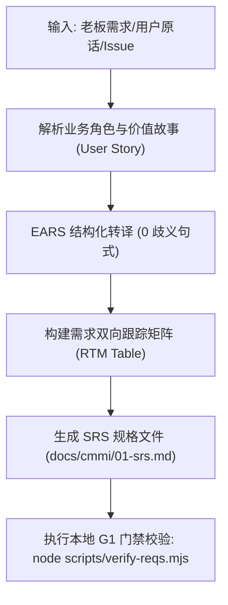

# CMMI 需求工程与双向跟踪矩阵规范 (RD / REQM)

> **CMMI 过程域**: Requirements Development (RD) & Requirements Management (REQM)  
> **门禁对应**: G1 需求与业务旅程门禁 (`gate_g1_spec`)  
> **主责工匠角色**: DS 业务方案专家 (`emp_ds`)  
> **核心产出**: 《用户需求说明书 (URD)》、《软件需求规格说明书 (SRS)》、《需求双向跟踪矩阵 (RTM)》

---

## 1. 技能定位与核心原则

传统 CMMI 需求文档最大的痛点是“需求脱节、文字模糊、验收无据”。本技能通过 **EARS (Easy Approach to Requirements Syntax)** 句式，将自然语言需求固化为无歧义的逻辑断言，并强制建立**从业务需求 -> 系统功能 -> 架构设计 -> 测试用例 -> 交付物**的全链路双向追踪矩阵 (RTM)。

### EARS 核心语法模式
所有功能需求必须归纳为以下 5 类 EARS 模式之一：
1. **普遍需求 (Ubiquitous)**: `The <system> shall <system response>.`
2. **事件驱动需求 (Event-driven)**: `WHEN <trigger>, the <system> shall <system response>.`
3. **状态驱动需求 (State-driven)**: `WHILE <in state>, the <system> shall <system response>.`
4. **异常情况需求 (Unwanted behavior)**: `IF <condition/error>, THEN the <system> shall <system response>.`
5. **可选特性需求 (Optional feature)**: `WHERE <feature is included>, the <system> shall <system response>.`

---

## 2. 自动化执行步骤 (Workflow)



1. **需求捕获**: 提取原始诉求，不擅自修改用户意图，保留原话。
2. **拆解用户故事**: 遵循 `作为 <角色>, 我想要 <功能>, 以便 <达成商业价值>`。
3. **EARS 格式化**: 将每个验收条目转换为 EARS 语法，分配全局唯一标识符（例如 `REQ-SYS-001`）。
4. **生成双向追踪矩阵 (RTM)**:
   - 需求编号 (`REQ-ID`)
   - 需求描述
   - 对应架构模块 (`HLD-Module`)
   - 对应验证用例 (`TEST-Case`)
   - 满足门禁 (`Gate`)
5. **本地门禁校验**: 运行项目本地 `scripts/verify-reqs.mjs`，确保所有需求均有双向映射且 0 悬空。

---

## 3. 产物模板基线 (`docs/cmmi/01-srs.md`)

```markdown
# [系统名称] 软件需求规格说明书 (SRS & RTM)

- **系统代码**: SYS_CHANRONG_AGENT
- **责任工匠**: emp_fda
- **修订版本**: v{{VERSION}}
- **生效门禁**: G1 需求门禁 (PASSED)

## 1. 业务目标与背景
...

## 2. EARS 结构化需求清单
- [REQ-001] WHEN 用户点击导出按钮, AND 处于离线状态, THEN 系统 SHALL 提示“网络已断开”并缓存本地任务。
- [REQ-002] ...

## 3. 需求双向跟踪矩阵 (RTM)
| 需求编号 (REQ-ID) | 需求描述 | 架构模块 (HLD) | 验收用例 (TEST-ID) | 责任人 | 状态 |
| :--- | :--- | :--- | :--- | :--- | :--- |
| REQ-001 | 离线任务导出与本地缓存 | Mod_CacheManager | TC-OFFLINE-01 | DS / FDSE | ACTIVE |
```

---

## 4. G1 门禁通过准则 (Definition of Done)
- [ ] 所有需求项均符合 EARS 语法规则，无“尽量”、“大致”等歧义副词。
- [ ] 需求双向跟踪矩阵覆盖率 100%（每个需求必有对应测试项和模块负责人）。
- [ ] `node scripts/verify-reqs.mjs` 退出码为 0。

---

## 5. 权威开源标准与参考文献
- **ISO/IEC/IEEE 29148:2018** (取代 IEEE 830) 需求工程标准、EARS 句式正反例与 G1 评审清单：
  - 请参阅 [`references/ieee-29148-srs-standard.md`](references/ieee-29148-srs-standard.md)

