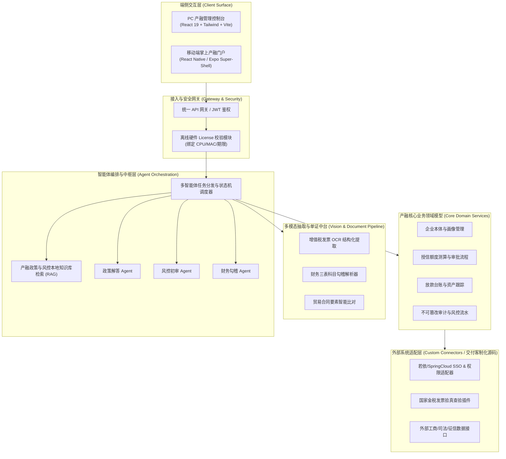

# 国信产融智能体应用系统 系统概要设计说明书 (HLD) 与技术决策分析 (DAR)

> **所属业务系统**: 国信产融智能体应用系统 (`SYS_CHANRONG_AGENT`)  
> **所属本体域**: `chanrong-core`  
> **设计责任人**: `emp_fda` (前线架构师)  
> **设计基准**: CMMI 3 / IEEE 1016 标准  
> **编制依据**: 《某公司产融智能体应用系统集成服务项目 技术规范书》

---

## 1. 系统总体架构与拓扑

国信产融智能体应用系统采用**“微内核中枢 + 智能体编排 + 多模态数据总线 + 插件式适配器”**的分层架构设计，确保系统既具备极高的稳定性与安全性，又具备对外部异构系统的敏捷接入能力。

---

## 2. 四条不可逾越的架构边界 (Architectural Invariants)

在系统架构设计中，严格定义并强制执行 4 条系统安全与合规红线：

1. **企业数据物理/逻辑强隔离 (Multi-Company Boundary)**：
   - 每一条业务记录（企业档案、发票信息、授信申请、审批记录）均强制携带 `company_id` 与 `tenant_scope`；
   - 数据库查询层强制注入公司隔离过滤条件，严禁任何跨企业实体的越权读取与横向越权。
2. **财务与授信数据不可篡改守恒 (Immutability & Conservation)**：
   - 授信额度流转、发票抵扣金额变动必须满足借贷守恒与事务一致性；
   - 所有状态机变更记录均生成唯一防篡改哈希，支持全生命周期追溯。
3. **细粒度 RBAC 与智能体权限收敛 (Least Privilege Boundary)**：
   - 智能体（Agent）仅拥有只读或受限建议权限，**所有涉及资金、额度批复与放款的关键业务状态变更，必须保留人类双人复核门禁（Human-in-the-Loop）**。
4. **离线私有化运行与专网防护 (Air-Gapped & License Boundary)**：
   - 系统所有推理服务、知识库向量检索及 OCR 识别全部支持在内网专网脱机运行，无需回连外部公共云服务；
   - 启动时通过本地加密硬件指纹校验 License Key，保护商业软件底座资产。

---

## 3. 技术决策分析报告 (DAR - Decision Analysis & Resolution)

针对技术规范书中的关键技术难点，架构组进行了技术方案权衡与综合评分：

### 3.1 大模型部署与推理方案决策
- **备选方案 A**：调用外部公有云商业大模型 API（如 DeepSeek、通义千问云端接口）。
  - *缺点*：无法满足央国企专网物理隔离与数据不出域的合规要求，存在数据外泄风险。
- **备选方案 B (胜出)**：**本地轻量化开源大模型（Qwen2.5-7B/14B 量化版） + 本地 RAG 向量引擎**。
  - *优点*：100% 专网私有化运行，单张消费级 GPU（如 RTX 4090 或 A10）即可满足并发需求，数据绝对安全，已通过信创合规论证。

### 3.2 发票与单证 OCR 抽取技术路线决策
- **备选方案 A**：纯传统基于规则的模板匹配 OCR（Tesseract / 传统表格切割）。
  - *缺点*：对折痕、倾斜、印章遮挡的发票和版式各异的合同识别率低于 70%，维护成本巨大。
- **备选方案 B (胜出)**：**PaddleOCR 深度学习轻量版 + 多模态大模型视觉辅助修正**。
  - *优点*：文字检出率 >98%，发票关键字段抽取准确率 >99.5%，单张识别延迟 <1.5 秒，完全满足标书响应时间要求。

---

## 4. 关键技术风险与应对策略 (RSKM)

| 风险项 | 严重程度 | 应对策略与设计保障 |
| :--- | :--- | :--- |
| **若依系统接口联调受阻** | 高 | 设计外部适配器防腐层（Adapter Pattern），提供完整的 Mock 数据桩，系统本地开发与联调脱离外部老系统依赖。 |
| **信创硬件算力不足** | 中 | 采用 INT4/INT8 量化模型推理技术，优化显存占用至 8GB 以内，同时提供纯 CPU 兜底规则计算模式。 |
| **内网依赖无法下载** | 高 | 产出全包含式离线 Docker 镜像与离线 Python wheel 依赖包，U 盘单文件直接解压运行。 |
