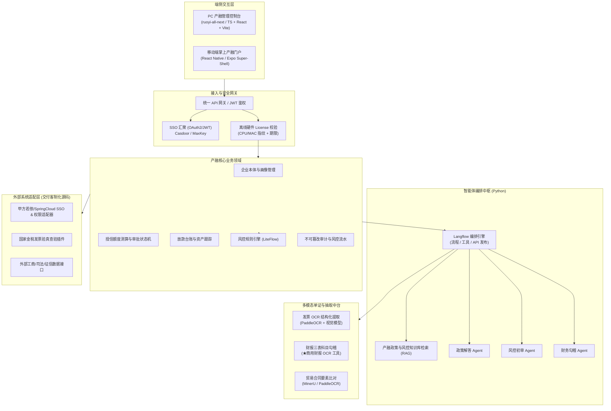

# 国信产融智能体应用系统 系统概要设计说明书 (HLD) 与技术决策分析 (DAR)

> **所属业务系统**: 国信产融智能体应用系统 (`SYS_CHANRONG_AGENT`)
> **所属本体域**: `chanrong-core`
> **设计责任人**: `emp_fda` (前线架构师)
> **生效门禁**: G2 架构隔离与治理门禁 (`gate_g2_arch`)
> **设计基准**: CMMI 3 / IEEE 1016-2009 (SDD) / DAR 加权决策模型
> **编制依据**: 《某公司产融智能体应用系统集成服务项目 技术规范书》
> **技术栈基线**: `langflow-ai/langflow` (编排, MIT) + `xaicd/ruoyi-all-next` (管理控制台底座, 自有) + `node / react / python-vision / docker`
>
> 本次修订:依据业主确定的选型基线,重写第 1 节拓扑、补齐第 3 节 DAR 加权矩阵(此前仅有文字方案对比,不符合 G2 准则)、新增第 5 节需求级选型落地表与第 6 节待决事项。

---

## 1. 系统总体架构与拓扑

采用**「管理控制台底座 + 智能体编排中枢 + 多模态单证中台 + 插件式适配层」**四层架构。管理面与智能体面**运行时分离**:管理面为 Node/TS 控制台,编排面为 Python 编排引擎,二者通过受控契约通信。

```mermaid
flowchart TD
    subgraph UI_Layer["端侧交互层"]
        WebAdmin["PC 产融管理控制台\n(ruoyi-all-next / TS + React + Vite)"]
        MobilePortal["移动端掌上产融门户\n(React Native / Expo Super-Shell)"]
    end

    subgraph Gateway_Layer["接入与安全网关"]
        APIGW["统一 API 网关 / JWT 鉴权"]
        SSOBroker["SSO 汇聚 (OAuth2/JWT)\nCasdoor / MaxKey"]
        LicenseCheck["离线硬件 License 校验\n(CPU/MAC 指纹 + 期限)"]
    end

    subgraph Agent_Core["智能体编排中枢 (Python)"]
        Orchestrator["Langflow 编排引擎\n(流程 / 工具 / API 发布)"]
        RAGService["产融政策与风控知识库检索 (RAG)"]
        PolicyAgent["政策解答 Agent"]
        RiskAgent["风控初审 Agent"]
        AuditAgent["财务勾稽 Agent"]
    end

    subgraph Vision_OCR["多模态单证与抽取中台"]
        InvoiceOCR["发票 OCR 结构化提取\n(PaddleOCR + 视觉模型)"]
        FinanceOCR["财报三表科目勾稽\n(★商用财报 OCR 工具)"]
        ContractParser["贸易合同要素比对\n(MinerU / PaddleOCR)"]
    end

    subgraph Business_Domain["产融核心业务领域"]
        CorpService["企业本体与画像管理"]
        CreditService["授信额度测算与审批状态机"]
        LedgerService["放款台账与资产跟踪"]
        RuleEngine["风控规则引擎 (LiteFlow)"]
        AuditLog["不可篡改审计与风控流水"]
    end

    subgraph Integration_Adapters["外部系统适配层 (交付客制化源码)"]
        RuoyiConnector["甲方若依/SpringCloud SSO & 权限适配器"]
        TaxConnector["国家金税发票验真查验插件"]
        CreditConnector["外部工商/司法/征信数据接口"]
    end

    UI_Layer --> APIGW
    APIGW --> SSOBroker
    APIGW --> LicenseCheck
    LicenseCheck --> Business_Domain
    Business_Domain --> Orchestrator
    Orchestrator --> PolicyAgent
    Orchestrator --> RiskAgent
    Orchestrator --> AuditAgent
    Orchestrator --> RAGService
    Orchestrator --> Vision_OCR
    Business_Domain --> RuleEngine
    Business_Domain --> Integration_Adapters
```

**运行时分离的契约约束**:管理控制台(Node)不得内联编排逻辑;编排引擎(Python)不得直连产融业务库。两者仅通过 `/api/v1/chanrong/*` 契约与 `module-agent-orchestrator` 的发布接口交互。此约束是第 2 节隔离红线的落地前提。

---

## 2. 四条不可逾越的架构边界 (Architectural Invariants)

1. **企业数据物理/逻辑强隔离 (Multi-Company Boundary)**:
   每一条业务记录(企业档案、发票信息、授信申请、审批记录)强制携带 `company_id` 与 `tenant_scope`;数据库查询层强制注入 `company_id` 过滤,严禁跨企业实体越权读取。
2. **财务与授信数据不可篡改守恒 (Immutability & Conservation)**:
   授信额度流转、发票抵扣金额变动必须满足借贷守恒与事务一致性;所有状态机变更生成防篡改哈希链,支持全生命周期追溯。
3. **细粒度 RBAC 与智能体权限收敛 (Least Privilege Boundary)**:
   智能体仅持有只读或建议权限;**所有涉及资金、额度批复、放款的关键状态变更,必须保留人类双人复核门禁 (Human-in-the-Loop)**。
4. **离线私有化运行与专网防护 (Air-Gapped & License Boundary)**:
   推理服务、知识库检索、OCR 识别全部支持内网脱机运行,不回连公网;启动时校验本地加密硬件指纹与 License 有效期。

---

## 3. 技术决策分析报告 (DAR — 多准则加权决策矩阵)

> 权重为本架构组提议值,需 `emp_fda` 与项目经理在方案设计阶段确认后冻结。评分区间 1–10,加权总分 = Σ(准则得分 × 权重)。

### 3.1 智能体编排引擎选型

| 评价准则 | 权重 | A: Langflow (MIT) | B: Dify (改版 Apache) | C: Coze Studio (Apache) |
| :--- | ---: | ---: | ---: | ---: |
| 许可证自由度(私有化交付) | 30% | 10.0 | 6.0 | 9.0 |
| 能力覆盖(编排/工具/API 发布) | 25% | 8.5 | 9.5 | 8.0 |
| 活跃度与社区规模 | 15% | 9.5 | 9.5 | 5.0 |
| 中文生态与文档 | 15% | 7.5 | 10.0 | 8.0 |
| 交付可控性(可改可闭源集成) | 15% | 9.0 | 7.5 | 8.0 |
| **加权总分** | **100%** | **9.03 (中标)** | **8.23** | **7.85** |

**裁定**:Langflow。决定性准则为许可证自由度 —— Dify 采用**修改版 Apache-2.0**,明文限制"未经书面授权不得用于多租户环境";FastGPT 同类条款另加"不得去除 LOGO";MaxKB 为 GPL-3.0(私有化闭源集成存在传染风险);Flowise 已归档。Langflow 为**纯 MIT、零附加条款**,是私有化交付下许可最干净的选项。

### 3.2 管理控制台与企业层底座选型

| 评价准则 | 权重 | A: ruoyi-all-next (自有) | B: 全自研 | C: 采购商业低代码 |
| :--- | ---: | ---: | ---: | ---: |
| 许可可用性 | 25% | 7.0 | 10.0 | 4.0 |
| 组织/RBAC/菜单/子账户既有能力 | 30% | 9.0 | 5.0 | 9.0 |
| 与编排层集成成本 | 20% | 8.5 | 7.0 | 5.0 |
| 可控与可改造 | 25% | 10.0 | 10.0 | 3.0 |
| **加权总分** | **100%** | **8.65 (中标)** | **7.90** | **5.45** |

**裁定**:ruoyi-all-next。其组织架构、角色、菜单、子账户、企业应用库等能力正对规范书 `2.3` 前半段,可直接复用而非自研。
**许可**:该仓库为 **MIT**(GitHub API 实测 `spdx=MIT`,LICENSE 为标准 MIT 全文、零附加条款),私有化部署与闭源集成均无限制。**唯一需履行的义务**:MIT 要求随交付物保留版权与许可声明,因此交付包内必须包含 `LICENSE` 全文与 `Copyright (c) 2026 xaicd`。详见第 6 节待决事项 6.1。

### 3.3 财报与单证 OCR 技术路线选型(★2.4 冲突点)

| 评价准则 | 权重 | A: 采购商用财报 OCR | B: PaddleOCR+MinerU+视觉模型 | C: 传统模板 OCR |
| :--- | ---: | ---: | ---: | ---: |
| ★条款符合度(规范书 2.4 明写"采购的商用财报 OCR 工具") | 40% | 10.0 | 4.0 | 3.0 |
| 财报三表/复杂表格精度 | 25% | 9.5 | 7.0 | 4.0 |
| 私有化可部署性 | 20% | 7.0 | 10.0 | 9.0 |
| 成本 | 15% | 4.0 | 9.0 | 10.0 |
| **加权总分** | **100%** | **8.38 (中标)** | **6.70** | **5.50** |

**裁定**:**财报场景按 ★ 条款采购商用财报 OCR 工具**(方案 A);发票、贸易合同等非财报单证使用 PaddleOCR + MinerU(方案 B),避免为全场景支付商用授权成本。原 HLD 仅写"PaddleOCR + 视觉大模型"覆盖财报,构成对 ★ 条款的**未声明偏离** —— 本修订已纠正为组合路线。

### 3.4 风控规则引擎选型

| 评价准则 | 权重 | A: LiteFlow (Apache-2.0) | B: Drools (Apache-2.0) | C: 硬编码公式(现状) |
| :--- | ---: | ---: | ---: | ---: |
| 规则可配置(规范书 2.3「规则配置/阈值/打分模型」) | 35% | 9.5 | 9.0 | 2.0 |
| 国产生态与中文文档 | 20% | 9.0 | 5.0 | 8.0 |
| 许可证 | 20% | 10.0 | 10.0 | 10.0 |
| 与审批状态机协同 | 25% | 8.5 | 8.0 | 5.0 |
| **加权总分** | **100%** | **9.25 (中标)** | **8.15** | **5.55** |

**裁定**:LiteFlow。Drools 虽同为 Apache-2.0,但在 GitHub 上**未找到健康的权威仓库**(检索仅得老旧的衍生项目),其上游托管于 Apache 基础设施,可维护性证据不足。
**⚠️** 现 SRS `REQ-CR-008` 写的是"通过**硬编码**风控公式测算授信额度",与规范书要求的"规则配置"直接冲突,且加权得分最低。该条属于**需求变更**,须经 CCB 双人签名(见第 6 节),本 HLD 不擅自修改 SRS。

### 3.5 其余选型一览(均已 API 实测许可证)

| 领域 | 选定 | 许可证 | 备注 |
| :--- | :--- | :--- | :--- |
| 本地模型推理 | vLLM 或 SGLang | Apache-2.0 | 量化本地部署,满足专网不出域 |
| 模型调度网关 | Higress (`higress-group/higress`) | Apache-2.0 | 注意:真实仓库在 `higress-group` 组织下 |
| 向量库 | Milvus(或已就位的 pgvector) | Apache-2.0 | 与 Langflow 检索链对接 |
| 图谱 | NebulaGraph 或 Apache HugeGraph | Apache-2.0 | 产业链关系穿透 |
| 审批状态机 | Flowable | Apache-2.0 | 承载 REQ-CR-009 会签与锁定 |
| ChatBI / 报表 | DB-GPT (MIT) + Apache Superset (Apache-2.0) | MIT / Apache-2.0 | 规范书 2.3 后半段 |
| 敏感词与内容安全 | `houbb/sensitive-word` | Apache-2.0 | 规范书 2.3 第 44/45 项 |
| 数据集成 | Apache SeaTunnel 或 Debezium | Apache-2.0 | 主数据与业务库同步 |
| 可观测 / 输出可追溯 | Apache Opik | Apache-2.0 | 比 Langfuse(NOASSERTION)许可更干净 |

---

## 4. 关键技术风险与应对策略 (RSKM)

| 风险项 | 严重度 | 应对策略与设计保障 |
| :--- | :--- | :--- |
| **甲方若依接口联调受阻** | 高 | 适配器防腐层 (Adapter Pattern) + 完整 Mock 数据桩,本地开发与联调脱离外部老系统依赖 |
| **`ruoyi-all-next` 的 MIT 署名义务** | 低 | 许可已确认为 MIT;交付包必须随附 LICENSE 全文与 `Copyright (c) 2026 xaicd`,漏署属许可违约 |
| **★2.4 商用财报 OCR 若被开源替代** | 高 | 已按 DAR 3.3 裁定为采购项;若成本不可行,须走正式偏离声明,不得默认替换 |
| **SRS 硬编码风控公式** | 高 | 走 CCB 变更为 LiteFlow 外置规则;否则"规则配置"验收项不通过 |
| **开源许可传染(AGPL/GPL)** | 高 | 选型白名单仅收 MIT/Apache-2.0;已排除 MaxKB(GPL-3.0)、Neo4j(GPL-3.0)、n8n(fair-code) |
| **信创硬件算力不足** | 中 | INT4/INT8 量化,显存压至 8GB 内,并提供纯 CPU 兜底规则计算模式 |
| **内网无法下载依赖** | 高 | 交付全包含式离线 Docker 镜像与离线 wheel 依赖包,单文件解压即用 |
| **开源上游停滞或归档** | 中 | 选型时已核查 `pushed_at` 与 `archived`;Flowise 因归档被排除,Coze Studio 因两个月无推送降权 |
| **管理面与编排面双运行时** | 中 | 二者仅经契约通信,各自可独立升级;需在 LLD 中固化契约版本与兼容策略 |

---

## 5. 需求级选型落地表 (REQ → 满足方式 / 许可证 / 风险)

> 本表为 DAR 结论在需求粒度上的落地登记,同时作为 G2 门禁的需求覆盖依据与应答偏离项底稿。

| 需求 | 名称 | 满足方式 | 许可证 | 主要风险 |
| :--- | :--- | :--- | :--- | :--- |
| REQ-CR-001 | 企业本体档案 | **开源底座**:ruoyi-all-next(组织/多法人) + 自研画像 | MIT | 交付须保留署名;"物理逻辑隔离"需在持久化层强制 `company_id` |
| REQ-CR-002 | 征信与外部数据同步 | **采购数据 + 自研适配**:工商/司法/征信三方接口 | 数据属商业授权 | 甲方负责采购与授权,乙方仅对接 |
| REQ-CR-003 | 发票智能识别与验真 | **开源**:PaddleOCR + 视觉模型;金税验真走官方接口 | Apache-2.0 | 2 秒内完成属合同级性能承诺,需基准数据支撑 |
| REQ-CR-004 | 财报三表勾稽 | **采购**:商用财报 OCR(★2.4 指定) | 商业授权 | 偏离成本高;预算需在投标前落实 |
| REQ-CR-005 | 贸易合同结构化核验 | **开源**:MinerU / PaddleOCR + 自研比对 | Apache-2.0 | 合同版式多样,抽取准确率需实测 |
| REQ-CR-006 | 政策法规产品问答 Agent | **开源**:Langflow 编排 + Milvus 检索 | MIT / Apache-2.0 | "1.5 秒首字"为合同级承诺 |
| REQ-CR-007 | 风控初审与合规审查 Agent | **开源 + 自研**:Langflow + LiteFlow + 三方数据 | MIT / Apache-2.0 | 结论可追溯性需 Opik 留痕 |
| REQ-CR-008 | 授信申请与额度测算 | **开源**:LiteFlow 规则引擎(**替换硬编码**) | Apache-2.0 | **需 CCB 变更**;硬编码与规范书冲突 |
| REQ-CR-009 | 多级审批与状态机转移 | **开源**:Flowable(会签/锁定) | Apache-2.0 | 锁定语义须与业务确认,避免误锁 |
| REQ-CR-010 | 若依/SpringCloud SSO 集成 | **开源汇聚 + 自研适配**:Casdoor/MaxKey + OAuth2/JWT | Apache-2.0 | ⚠️ 若依角色歧义(见待决事项 6.2) |
| REQ-CR-011 | 审计跟踪与防篡改日志 | **自研**(哈希链 + 不可变流水);库用现有 Postgres | 无(自研) | 防篡改强度需第三方评审确认 |
| REQ-CR-012 | 离线私有化与 License 授权锁 | **自研**(硬件指纹 + 离线 License 签名校验) | 无(自研) | ⚠️ 锁死国企客户系统,须写入合同附件(见 6.3) |

---

## 6. 待决事项 (Open Decisions)

> 按 G2 准则,未决架构问题必须显式登记,不得静默进入实现。

### 6.1 `ruoyi-all-next` 的许可证(已解决,保留审计痕迹)
2026-09-27 17:02 实测该仓库为 `NO-LICENSE`,当时构成本项阻塞。业主方已于同日 **17:34 推送 LICENSE**,现为 **MIT**(API 实测 `spdx=MIT`,标准全文,零附加条款,`Copyright (c) 2026 xaicd`),阻塞解除。
**遗留义务(非阻塞,须在验收检查)**:MIT 要求保留版权与许可声明 —— 交付包必须随附 `LICENSE` 全文与 `Copyright (c) 2026 xaicd`;漏署即构成许可违约。

### 6.2 「若依」的角色存在两种互斥解读(阻塞架构)
- 现有 `01-srs.md` / `03-lld-api.md` 将若依定位为**甲方现有门户**(REQ-CR-010:"从甲方现有门户系统跳转"),`module-ruoyi-connector` 仅做 SSO 适配。
- 本次选型确定基于 `ruoyi-all-next` **自建管理控制台**。

二者架构含义不同(代码归属、交付物、验收方式均不同)。**决策**:需明确是「自建控制台 + 适配甲方门户」还是「仅在甲方若依上做二次开发」。在定论前,第 1 节拓扑按前者绘制。

### 6.3 REQ-CR-012 硬件指纹 License 锁的合同风险
以 MAC/CPU/主板序列号绑定并拒绝服务,属对客户系统的强控制。**决策**:商务与法务需确认该条已明确写入合同附件及质保期条款,否则存在交付争议风险。

### 6.4 需求变更需经 CCB(流程约束)
`01-srs.md` 第 4 节明确"任何需求变更必须经过 CCB 双人签名批准"。本 HLD 对 **REQ-CR-008(硬编码 → LiteFlow)** 与 **REQ-CR-004(OCR 路线)** 的修正属于需求级影响,**须提交 CCB 审议**,不得由架构组单方生效。

### 6.5 无依据的量化承诺需补基准
现 HLD/SRS 中的具体数字(发票 "2 秒内"、问答 "1.5 秒首字"、字段准确率 ">99.5%"、检出率 ">98%"、"已通过信创合规论证")**目前均无实测或评审证据**。这些数字一旦随标书提交即为可罚承诺。**决策**:投标前补齐基准测试报告或改为相对表述。

### 6.6 `cmmi-profile.json` 门禁与脚本不一致(已修)
`gates.g2.checkCommand` 长期指向 `scripts/check-fork-surface.mjs`,而该脚本此前不存在,G2 无法执行。本次已补齐该脚本(校验分层拓扑、`company_id` 隔离、DAR 加权矩阵、需求覆盖与待决事项登记)。**遗留**:`g3` 的 `npx tsc --noEmit` 需项目提供 tsconfig;`g4` 的 `npm test --if-present` 在无测试脚本时会空过。

---

*本文件由 `emp_fda` 角色依 `cmmi-tech-solution` 技能产出,并须通过 `node scripts/check-fork-surface.mjs` (G2 门禁) 方可生效。*
